# CSS Property - continued

### [position](https://www.w3schools.com/css/css_positioning.asp)

([exercise](https://www.w3schools.com/css/exercise.asp?filename=exercise_positioning1))

* specify the **type of positioning method** used for an element
* elements are **then positioned using the top, bottom, left, and right properties (POSITION PROPERTY MUST BE SET FIRST)**

``` css
position: static; (default)
position: relative;
position: absolute;
position: fixed;
position: sticky; (IE or Edge 15 이전 버전 지원 x)

```


### position: static

* default value

* **NOT AFFECTED** by top, bottom, left, and right properties

* html 문서에 나온 순서 그대로 표시 (normal flow)

  ```html
  <!DOCTYPE html>
  <html>
  <head>
  <style>
  div.static {
    position: static;
    border: 3px solid #73AD21;
  }
  </style>
  </head>
  <body>
  <div class="static">
    This div element has position: static;
  </div>
  
  </body>
  </html>
  ```

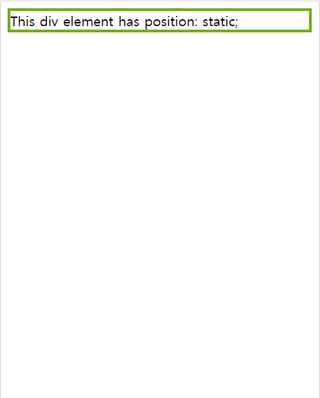


### position: relative

* positioned **relative to its normal position**
* setting **top, right, bottom, and left** properties of relatively-positioned element will cause it to be **adjusted away from its normal position**
* 이로 인해 생기는 여백은 다른 요소들로 **채워지지 않는다**

``` html
<!DOCTYPE html>
<html>
<head>
<style>
    div.relative {
      position: relative;
      left: 30px;
      border: 3px solid #73AD21;
    }
</style>
</head>
<body>
    <div class="relative">
    This div element has position: relative;
    </div>
</body>
</html>

```

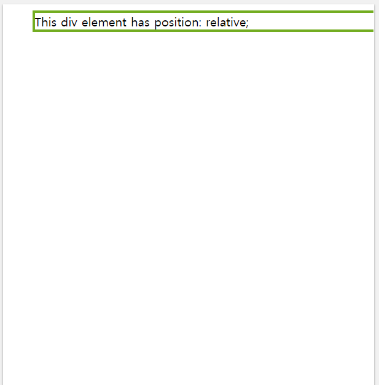


### position: fixed

* positioned relative to the **viewport**
* always stays in the same place even if the page is **scrolled**
* **top, right, bottom, left** properties are used to position the element

``` html
<!DOCTYPE html>
<html>
<head>
<style>
    div.fixed {
      position: fixed;
      bottom: 0;
      right: 0;
      width: 300px;
      border: 3px solid #73AD21;
    }
</style>
</head>
<body>
    <div class="fixed">
    	This div element has position: fixed;
    </div>
</body>
</html>

```

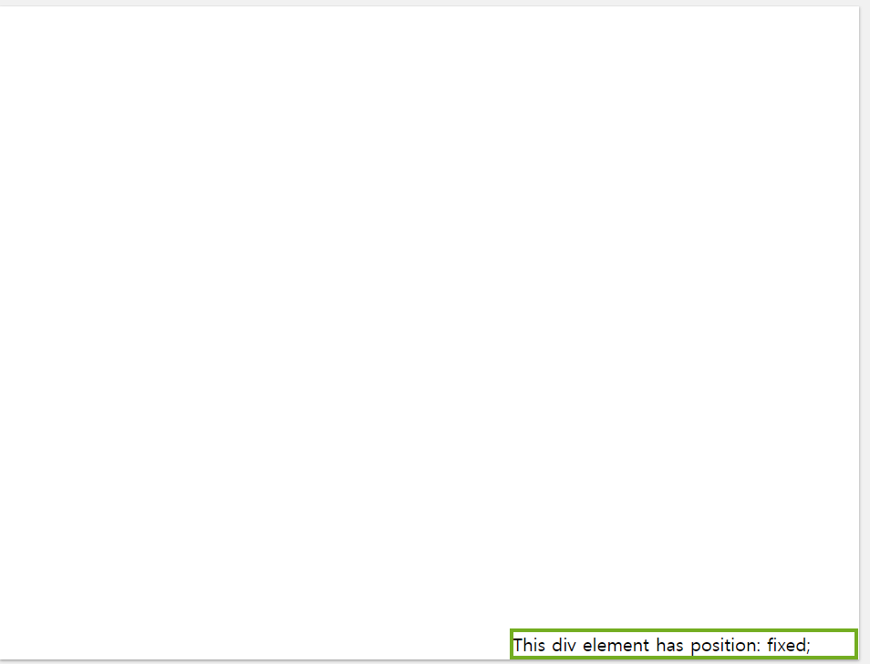


### position: absolute

* positioned **relative to the nearest positioned ancestor** (anything except **static**)
* if there's no positioned ancestors, it uses **the document body** (ex. `<body>`)
* allow you to **place your element precisely where you want it**
* 부모 노드가 `position: relative`면 부모 노드 영역 안에서 움직임
* 부모 노드가 `position: absolute`면 부모 노드 영역 0,0을 기준으로 시작

```css
HTML
<div id=”parent”>
  <div id=”child”></div>
</div>

CSS
#parent { 
  position: relative; 
  width: 500px; 
  height: 400px; 
  background-color: #fafafa; 
  border: solid 3px #9e70ba; 
  font-size: 24px; 
  text-align: center; 
} 
#child { 
  position: absolute; 
  right: 40px; 
  top: 100px; 
  width: 200px; 
  height: 200px; 
  background-color: #fafafa; 
  border: solid 3px #78e382; 
  font-size: 24px; 
  text-align: center; 
}
```

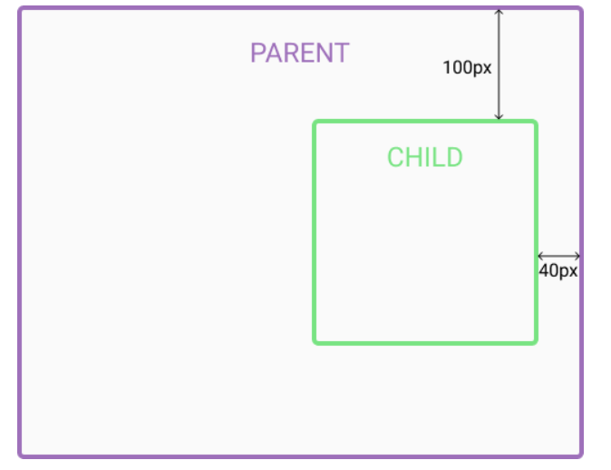


### Overlapping Elements

* Elements can overlap other elements
* `z-index` property specify the **stack order of an element** (앞으로 가져오기, 뒤로 가져오기)
* can have positive/negative stack order

``` css
img {
  position: absolute;
  left: 0px;
  top: 0px;
  z-index: -1;
}
```

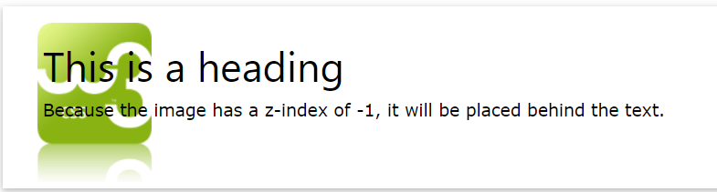

---


## [float](https://www.w3schools.com/css/css_float.asp)

* `float` property specifies **how an element should float**
* element with `position: absolute` **ignores** `float` property
* To avoid elements flowing around `float` element, use `clear` property

```css
float: none; (default, element does not float)
float: left; (the element floats to the left of its container)
float: right; (the element floats to the right of its container)
float: initial (back to default value)
```

* `float` takes elements **away from normal document flow**, so they **no longer occupies any HEIGHT in normal document flow**
* `float` 되는 요소는 기존의 박스 크기를 잃고, 컨텐츠의 높이/넓이만큼의 크기를 가짐. 따라서, 필요에 따라 **높이/넓이를 재설정 해줘야함**

([see more examples with `float`](https://www.w3schools.com/css/css_float.asp))


## [clear](https://www.w3schools.com/css/css_float.asp)

* `clear` property specifies **what elements can float beside the cleared element and on which side**

``` css
clear: none; (allow floating elements on both sides)
clear: left; (No floating elements allowed on the left side)
clear: right; (No floating elements allowed on the right side)
clear: both; (No floating elements allowed on either the left or the right side)

/* example */
.blue {
   float: left; /* it sitll wants to float, */
   clear: left; /* but not something (float element) on the left */
}
```

* non-floating element 안에 floating element를 올려놓을 수 있음 (using clearfix)

---

### [clearfix Hack](https://www.w3schools.com/howto/howto_css_clearfix.asp)

* If an element is **taller** than the element containing it, and it is floated, it will **overflow** outside of its container
* 아래와 같은 코드에서 menu-item 클래스를 float 시키면 부모 요소인 menu의 높이가 사라짐

``` html
<style>
    .menu {
        background: skyblue;
    }
    .menu-item {
        width: 100px;
        height: 100px;
        border: 1px solid black;
        background: orange;
        float: left;
    }
</style>

<div class="menu">
    <div class="menu-item">HTML</div>
    <div class="menu-item">CSS</div>
    <div class="menu-item">웹표준</div>
</div>
```

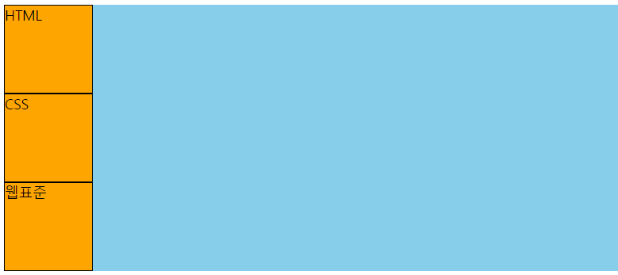

(before float: left)

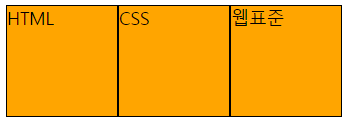

(after float: left)

* 위와 같은 문제를 해결하기 위해 부모 요소인 menu 클래스에 clearfix를 추가

``` html
<style>
	.menu {
        background: skyblue;
    }
    .clearfix::after {
		content: "";
        clear: both;
        display: table;
    }
    /*
    or
    .clearfix {
    	overflow: auto;
    }
    */
    .menu-item {
        width: 100px;
        height: 100px;
        border: 1px solid black;
        background: orange;
        float: left;
    }
</style>

<div class="menu clearfix">
    <div class="menu-item">HTML</div>
    <div class="menu-item">CSS</div>
    <div class="menu-item">웹표준</div>
</div>
```

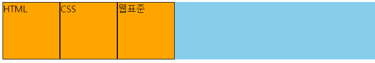

(after clearfix)

---

### [overflow](https://www.w3schools.com/css/css_overflow.asp)

* `overflow` property controls **what happens to content that is too big to fit into an area**
* specify whether **to clip** the content or **to add scrollbars** when the content of an element is too big to fit in the specified area
* **ONLY WORKS for block elements with a specified height**
* OS X Lion에서는 `overflow: scroll`을 부여해도, 컨텐트가 모두 표시될 경우 스크롤바가 보이지않음

``` css
overflow: visible (default value, the overflow is not clipped, renders outside the box)
overflow: fidden (overflow is clipped, the rest of the content will be INVISIBLE)
overflow: scroll (overflow is clipped, and a scrollbar is added to see the rest)
overflow: auto (add scrolbars ONLY WHEN NECESSARY)
```


### overflow: visible

* 넘치는 내용물을 자르지 않고 그대로 출력, 요소의 박스 밖으로 렌더링 됨

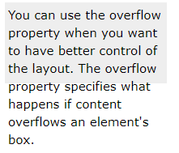


### overflow: hidden

* 넘치는 내용물이 잘려나감

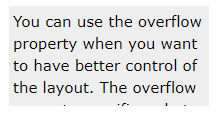


### overflow: scroll

* 넘치는 내용물이 잘린 뒤, 스크롤바가 박스 안에 생성됨 (가로, 세로 방향으로 모두 생성)

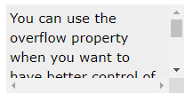


### overflow: auto

* 내용물이 넘칠때만 스크롤바 생성

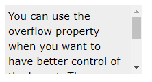

### overflow-x & overflow-y

* `overflow-x`: 내용물의 좌우 끝 부분을 어떻게 처리할건지 지정
* `overflow-y`: 내용물의 상하 끝 부분을 어떻게 처리할건지 지정

```css
div {
  overflow-x: hidden; /* Hide horizontal scrollbar */
  overflow-y: scroll; /* Add vertical scrollbar */
}
```


---

### white-space

* 요소 안의 공백을 어떻게 처리할 것인지 결정하는 속성

``` css
white-space: normal (기본값, 연속되는 공백을 하나의 공백으로 처리. 필요한 경우 문자는 자동으로 wrap)
white-space: nowrap (연속되는 공백을 하나의 공백으로 처리. 문자는 <br>을 만나기 전까지 절대 다음 줄로 넘어가지 않음)
white-space: pre (브라우저에 의해 모든 공백이 보존됨. <br>에 의해 다음 줄로 넘어감)
white-space: pre-line (연속되는 공백을 하나의 공백으로 처리. 문자는 <br> 혹은 필요할 때에 다음 줄로 넘어감)
white-sapce: pre-wrap (브라우저에 의해 모든 공백이 보존됨. 문자는 <br> 혹은 필요할 때에 다음 줄로 넘어감)
```


---

### text-overflow

* specify how overflowed content (text) should be signaled to the user
* MUST INCLUDE `white-space` and `overflow` properties when using `text-overflow`

``` css
.example {
    white-space: nowrap;
    overflow: hidden;
    text-overflow: clip; /* default value, the text is clipped and not accessible */
    text-overflow: ellipsis; /* represent the clipped text as "..." */
}
```

---

### -shadow effects

* `text-shadow`: 문자에 그림자 속성을 부여

``` css 
h1 {
    text-shadow: 2px 2px 5px red;/* horizontal shadow, vertical shadow, blur, color */
    text-shadow: 0 0 3px #FF0000, 0 0 5px #0000FF /* multiple shadows */
}
```


* `box-shadow`: 요소에 그림자 속성을 부여

``` css
div {
    box-shadow: 10px 10px 5px grey; /* horizontal shadow, vertical shadow, blur, color */
}

/* 가상 요소에 box-shadow 속성 부여 가능 */
div::after {
    box-shadow: 0 15px 20px rgba(0, 0, 0, 0.3);
}
```

**(box-shadow는 마진에 영향을 주지 않음)**

---

### border-radius

* 요소의 모서리를 둥글게 만드는 CSS 속성

``` css
#example1 {
  border: 2px solid red;
  /* 모든 모서리를 둥글게 설정 */
  border-radius: 25px;
  
  /* (왼쪽 위, 오른쪽 위)를 50px, (왼쪽 밑, 오른쪽 밑)를 20px 둥글게 설정 */
  border-radius: 50px 20px;
  
  /* 왼쪽 위, 오른쪽 위, 오른쪽 밑, 왼쪽 밑을 해당 값만큼 둥글게 설정 */
  border-radius: 15px 50px 30px 15px;
}
```


---

### Organizing CSS - Programming paradigm

- OOCSS (Object Oriented CSS)

- BEM (Block Element Modifier)

- SMACSS (Scalable and Modular Architecture for CSS)

  ([see more](https://mattstauffer.com/blog/organizing-css-oocss-smacss-and-bem/))


---

### NORMALIZE.CSS

* a CSS file that provides better **cross-browser** consistency in the default styling of HTML elements

* an alternative to [CSS resets](https://meyerweb.com/eric/tools/css/reset/)

* **preserve useful browser defaults** rather than erasing them

* **Normalize styles** for a wide range of HTML elements

* **Correct bugs** and common browser inconsistencies.

  [(see more)](http://necolas.github.io/normalize.css/latest/normalize.css)

  

---

### CSS INHERIT vs. Override

```html
<!DOCTYPE html>
<html lang="en">
<head>
    <meta charset="UTF-8">
    <meta name="viewport" content="width=device-width, initial-scale=1.0">
    <meta http-equiv="X-UA-Compatible" content="ie=edge">
    <title>Document</title>
    <style>
        div {
            margin: 10px;
            padding: 10px;
            background-color: green;
        }
        .box1 {
            background-color: blue;
        }
    </style>
</head>
<body>
    <!-- INHERITS the properties from div selector  -->
    <div>this is div 1</div>
    
    <!-- INHERITS the properties from div selector and OVERRRIDE background-color -->
    <div class="box1">this is div2</div>
</body>
</html>
```


---

### Markup GNB (Global Navigation Bar)


- Logo
  - text, link
  - image vs. IR (image replacement - **see a11y.hidden below**)
- Markup GNB

```html
<h1> (not visible)
	<nav>
		<h2>메인 메뉴</h2> -> a11y.hidden (include for web accessibility)
        <ul class="menu">
            <li>
                (<a> vs. <span>)
                <a class="btn-menu" href="#" role="button">HTML에 대해</a>
                <ul class="sub-menu">
                    <li><a href="page1">예제 1</a></li>
                    <li><a href="page2">예제 2</a></li>
                    <li><a href="page3">예제 3</a></li>
                </ul>
            </li>
        </ul>
	</nav>
</h1> (not visible)
```


------

### Emmet - Wrap individual line with abbrev

```html
1. 각 메뉴 이름 작성

홈
로그인
회원가입
사이트맵
English

2. 위의 메뉴를 마우스로 모두 선택하여 ctrl + shift + p

3. "emmet wrap individual line with abbrev" 입력

4. 입력란에 emmet 문법 작성
(ex. ul.member>li*>a[href="#"])

<ul class="member">
        <li>
            <a href="#">홈</a>
        </li>
        <li>
            <a href="#">로그인</a>
        </li>
        <li>
            <a href="#">회원가입</a>
        </li>
        <li>
            <a href="#">사이트맵</a>
        </li>
        <li>
            <a href="#">English</a>
        </li>
    </ul>
```


---

### WEB FONT

* 웹 브라우저는 사용자의 컴퓨터에 설치된 폰트만 사용할 수 있음
* 웹 폰트는 사용자가 웹 페이지에 접속하는 순간 폰트를 자동으로 내려받고 해당 웹 페이지에서 사용할 수 있게 만들어주는 기능
* [구글 무료 폰트 서비스](https://fonts.google.com/) : 원하는 폰트를 선택한 후 폰트 링크를 `<head>` 부분에 삽입


---

### Image Replacement

* CSS image replacement: technique of replacing a text element (ex. h1) with **image (logo)**

```css
.a11y-hidden {
    background-color: red;
    position: absolute;
    width: 1px;
    height: 1px;
    overflow: hidden;
    margin: -1px;
    clip: rect(0,0,0,0);
    white-space: nowrap;
}
```


---

### Icon Font

* Instead of containing letters or numbers, they contain symbols and glyphs.
* can be styled with CSS in the same way you style regular text

* https://fontawesome.com/
* http://fontello.com/

---

([prev - CSS Selector& Flex Box](./css-selector-flex.md))

([next - CSS Animation](./css-float-animation.md))

([Back to List](../../README.md))

