# CSS3

### Selector - 선택자

* 특정한 HTML 태그를 선택할 때 사용하는 기능

* 선택된 태그에 원하는 스타일 또는 기능을 적용

* 선택자 {스타일 속성: 스타일 값}

  (태그 선택자 예제)
  
  ```html
  스타일시트
  <style>
      h1 {
          color: red;
          background-color: orange;
      }
      /* h1 태그를 선택하여 해당 속성을 부여하라 */
  </style>
  ```


---

### 전체 선택자

```css
* {
    color: red;
}
```

* `<html>`, `<head>`, `<title>`, `<style>`, `<body>` 태그 모두 선택

---

### 아이디 선택자

```html
#아이디 {
	color: red;
}
```

* **"id 속성은 웹 페이지 내부에서 중복되면 안된다"** -> CSS에선 문제 없지만 JS에서 선택시 문제

---

### 클래스 선택자

```html
<head>
    <style>
        .item {
            color: red
        }
        .heaer {
            background-color: blue;
        }
	</style>
</head>
<body>
    <h1 class="item header">Head 1</h1>
</body>
```

* 위와 같이 공백을 사이에 두고 여러 클래스를 사용할 수 있음

* 클래스 이름 중복 시, 태그 이름까지 더하여 정교하게 선택

  `li.select {color: red;}`

---

### 후손 선택자와 자손 선택자

```html
<body>
    <div>
        <h1>CSS3 Selector Basic</h1>   <!-- child / descendant-->
        <h2>Lorem ipsum</h2>		   <!-- child / descendant-->
        <ul>                           <!-- child / descendant-->
            <li>item1</li>             <!-- descendant -->
            <li>item2</li>			   <!-- descendant -->
            <li>item3</li>			   <!-- descendant -->
        </ul>
    </div>
</body>
```

* 위와 같은 코드에서 `<div>` 태그 **한 단계** 아래 있는 태그들을 **자손 / 후손**이라 명함
* `<div>` 태그에서 **두 단계 이상** 떨어져 있는 태그들을 **후손**이라 명함

``` css
/* 후손 선택자 */
tag1 tag2 {
    /* tag1의 후손에 위치하는 tag2를 선택 */
}
```

``` css
/* 자손 선택자 */
tag1 > tag2 {
    /* tag1의 자손에 위치하는 tag2를 선택 */
}
```

---

### 동위 선택자

* 동위 관계에서 뒤에 위치한 태그를 선택할 때 사용하는 선택자

  ```html
  <!DOCTYPE html>
  <html lang="en">
  <head>
      <meta charset="UTF-8">
      <meta name="viewport" content="width=device-width, initial-scale=1.0">
      <meta http-equiv="X-UA-Compatible" content="ie=edge">
      <title>Document</title>
      <style>
          h1 ~ h2 {
              color: red;
          }
      </style>
  </head>
  <body>
      <h1>Header - 1</h1>
      <h2>Header - 2</h2>
      <h2>Header - 2</h2>
      <h2>Header - 2</h2>
      <h2>Header - 2</h2>
      <h2>Header - 2</h2>
  </body>
  </html>
  ```

* 위의 코드에서 `<h1>` 태그 뒤의 ***첫 번째*** `<h2>` 태그를 선택

  ```css
  h1 + h2 {
  	color: red;
  }
  ```

* `<h1>` 태그 뒤에 ***모든*** `<h2>` 태그를 선택

  ``` css
  h1 ~ h2 {
      color: red;
  }
  ```

---

### 구조 선택자

* CSS3부터 지원하는 선택자

* 자손 선택자와 병행하여 많이 사용

  #### 일반 구조 선택자

  * 특정한 위치에 있는 태그를 선택

  ``` css
  :first-child 형제 관계 중에서 첫 번째에 위치하는 태그
  :last-child 형제 관계 중에서 마지막에 위치하는 태그
  :nth-child(n) 형제 관계 중에서 앞에서 n번째 위치하는 태그
  :nth-child(n + 3) 형제 관계 중에서 앞에서 3번째 위치하는 태그부터 이후 모든 형제 태그
  :nth-last-child(n) 형제 관계 중에서 뒤에서 n번째 태그
  ```

  ```html
  <!DOCTYPE html>
  <html lang="en">
  <head>
      <meta charset="UTF-8">
      <meta name="viewport" content="width=device-width, initial-scale=1.0">
      <meta http-equiv="X-UA-Compatible" content="ie=edge">
      <title>Document</title>
      <style>
          ul > li:nth-child(n+3) {
              color: red;
          }
      </style>
  </head>
  <body>
      <ul>
          <li>item 1</li>
          <li>item 2</li>
          <li>item 3</li>	<!-- colored with RED -->
          <li>item 4</li>	<!-- colored with RED -->
          <li>item 5</li>	<!-- colored with RED -->
          <li>item 6</li>	<!-- colored with RED -->
          <li>item 7</li>	<!-- colored with RED -->
      </ul>
  </body>
  </html>
  ```

---

### 가상 요소 선택자 (문자 선택자)

* 태그 내부 특정 조건의 문자를 선택하는 선택자

  #### 시작 문자 선택자

  * 태그 내부의 첫 번째 글자와 첫 번째 줄을 선택할 때 사용함

  ``` css
  ::first-letter 첫 번째 글자를 선택
  ::first-line 첫 번째 줄을 선택
  
  <!DOCTYPE html>
  <html lang="en">
  <head>
      <meta charset="UTF-8">
      <title>Document</title>
      <style>
          p::first-letter {
              font-size: 3em;
          }
          p::first-line {
              color: red;
          }
      </style>
  </head>
  <body>
      <h1>제목</h1>
      <p>첫 번째 문장입니다</p>
      <p>두 번째 문장입니다</p>
  </body>
  </html>
  ```

  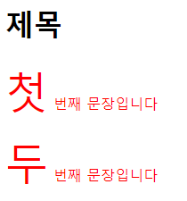

  #### 전후 문자 선택자

  * 특정 태그의 전후에 위치하는 ***공간***을 선택하는 선택자

  ``` css
  ::after 태그 뒤에 위치하는 공간을 선택
  ::before 태그 앞에 위치하는 공간을 선택
  
  <h1 class="logo"><a href="#"></a></h1>
  <ul class="member">
      <li><a href="#">홈</a></li>
      <li><a href="#">로그인</a></li>
      <li><a href="#">회원가입</a></li>
      <li><a href="#">사이트맵</a></li>
      <li><a href="#">English</a></li>
  </ul>
  
  .member li:nth-child(n+2)::before {
      display: inline-block;
      background-color: orange;
      content: '\f142'; /* 메뉴 이모티콘 삽입 */
  }
  ```

  

  * 가상 요소를 선택하여 content를 부여할 수 있음

  * Inline Element

  * 단점: Screen Reader에 가상요소까지 같이 읽힘

    ([see more](https://www.youtube.com/watch?v=hvEfSbHJAfU&list=PLtaz5vK7MbK3EAPhmB2gFnCU9qU72YMq3&index=4))

---

### 링크 선택자 

* `href` 속성을 가지고 있는 `<a>` 태그에 적용되는 선택자

``` css
:link     href 속성을 가지고 있는 <a> 태그를 선택
:visited  방문했던 링크를 가지고 있는 <a> 태그를 선택
```

---


# 페이지 레이아웃

### inline vs. block element

* `inline` element **does not start on a new line** and **only takes up as much width as necessary**

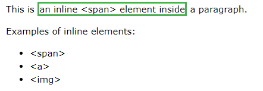

* `block-level` element **always starts on a new line** and **takes up the full width available**

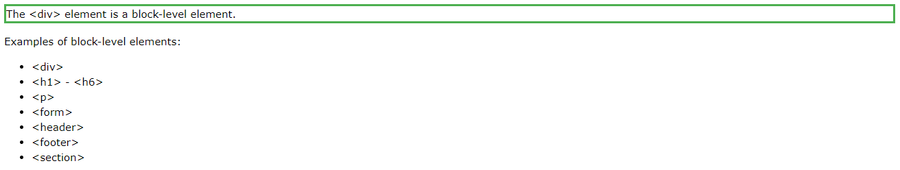

* 모든 요소들은 inline 혹은 block의 기본 값을 가지고 있지만, CSS로 display 설정 값을 변경할 수 있음

``` css
li {
  display: inline; /* horizontal list */
}

span {
  display: block;
}
```

* inline 요소는 좌우로는 늘어나지만 (padding, margin), **위로는 line-height**의 영향을 받음

---

### CSS 단위

* `%` - 백분율 단위

* `em` - 배수 단위, 가장 가까운 부모 노드의 font-size에 대한 배수

* `rem` - <html> 태그(root)의 font-size에 대한 배수 (하위 버전 브라우저에선 인식 x)

* `px` - 픽셀

* 색상단위
  * `red, orange, blue, green` 
  * `#000000` - (HEX 코드 단위, #(red)(green)(blue))
  * `rgb(red, green, blue)`  (RGB 색상 단위)
  * `rgba(red, green, blue, alpha)` RGBA 단위
  * `hsl(hue, saturation, lightness)` HSL 색상 단위
  * `hsla(hue, saturation, lightness, alpha)` HSLA 색상 단위

* `url` - url 단위

  ```css
  body {
  	background-image: url('image.png')
  }
  ```

* linear-gradient(red, green)

---

### Box Model

* 페이지 레이아웃을 구성할 때 가장 중요한 스타일 속성


* width & height - 글자를 감싸는 영역의 크기를 지정하는 스타일 속성

* padding (안쪽 여백) - 상하좌우 패딩 각각 별도로 설정 가능

* border - 테두리 속성

* margin (바깥쪽 여백) - 상하좌우 마진 각각 별도로 설정 가능

  #### Box-Sizing 속성

  * width와 height 속성이 차지하는 **범위를 지정**
  * **content-box** : 기본 값, width와 height 속성이 **글자가 들어가는 영역**의 크기를 지정
  * **border-box** : width와 height 속성이 **테두리를 포함한 영역**의 크기를 지정

  

---

### Display 속성

* 태그가 화면에 보이는 방식을 지정하는 속성

```css
display: none (태그를 화면에서 완전히 삭제)
display: inline (태그를 inline 형식으로 지정, 너비와 높이를 갖지 않음)
display: block (태그를 block 형식으로 지정, 새로운 줄에 표시되며 화면 전체 너비를 차지)
display: inline-block (태그를 inline-block 형식으로 지정, inline 설정에 너비/높이 설정 가능)
display: flex (block-level flex 컨테이너로 지정)
display: float 
```

([see more](https://www.w3schools.com/cssref/playit.asp?filename=playcss_display&preval=inline))

---

### Display: none vs. Visibility: hidden

* `display: none` : **The element will be hidden, and the page will be displayed as if the element is not there**

* `visibility: hidden`: **Also hides an element, but the element will still take up the same space as before.**

  (both not recommended)

---

### Display: flex (parent)

([see W3C tutorial for more info](https://www.w3schools.com/css/css3_flexbox.asp))

```css
display: flex
```

* CSS Flexbox Layout Module
* **Flexible responsive layout structure** without using `float` or `position`
* IE 11 or higher
* `flex` 레이아웃 사용 시, **부모 노드의 `display` 값이 무조건 `flex`로 설정되어 있어야함**

``` css
<div class="flex-container">
  <div>1</div>
  <div>2</div>
  <div>3</div>  
</div>

<style>
    .flex-container {
      display: flex;
      background-color: DodgerBlue;
    }

    .flex-container > div {
      background-color: #f1f1f1;
      margin: 10px;
      padding: 20px;
      font-size: 30px;
    }
</style>
```

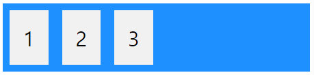


### flex-direction

* define in which **direction** the container wants to **stack** the flex items
* `column-reverse`, `row`, `row-reverse`

``` css
<div class="flex-container">
  <div>1</div>
  <div>2</div>
  <div>3</div>  
</div>

<style>
.flex-container {
    display: flex;        /* set parent node as flex */
    flex-direction: column; /* set stacking direction of flex items (childs) */
    background-color: DodgerBlue;
}

.flex-container > div {
    background-color: #f1f1f1;
    width: 100px;
    margin: 10px;
    text-align: center;
    line-height: 75px;
    font-size: 30px;
}
</style>
```

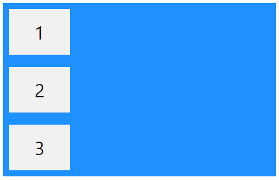


### flex-flow

* `flex-direction`과 `flex-wrap` 값을 둘 다 부여해주는 속성

``` css
.flex-container {
  display: flex;
  flex-flow: row wrap; /* flex-direction, flex-wrap */
}
```

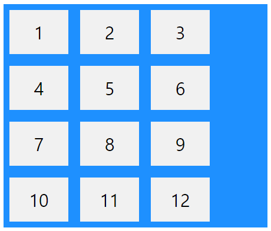


### justify-content

* flex item 정렬을 위한 속성
* `center`, `flex-start`, `flex-end`, `space-around`, `space-between`

``` css
.flex-container {
  display: flex;
  justify-content: center;
}
```

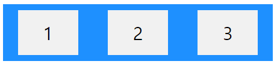


[(flexbox froggy](https://flexboxfroggy.com/#ko) - flexbox 연습 게임)

---

### Display: flex (child)

* flex 컨테이너의 자손 태그들은 자동으로 flex 아이템으로 지정


### Order

* specify the order of the flex items

``` css
<div class="flex-container">
  <div style="order: 3">1</div>
  <div style="order: 2">2</div>
  <div style="order: 4">3</div>
  <div style="order: 1">4</div>
</div>
```

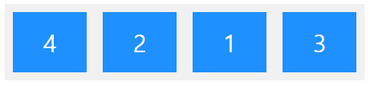


### flex-grow

* specify how much a flex item will grow **relative to the rest of the flex item**

``` css
<div class="flex-container">
  <div style="flex-grow: 1">1</div>
  <div style="flex-grow: 1">2</div>
  <div style="flex-grow: 8">3</div>
</div>
```

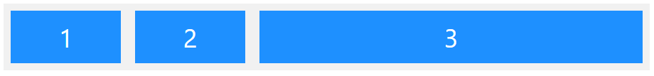


### flex-shrink

* specify how much a flex item will chrink **relative to the rest of the flex items**

``` css
<div class="flex-container">
  <div>1</div> /* default value = 1 */
  <div>2</div>
  <div style="flex-shrink: 0">3</div>
  <div>4</div>
  <div>5</div>
  <div>6</div>
  <div>7</div>
  <div>8</div>
  <div>9</div>
  <div>10</div>
</div>
```

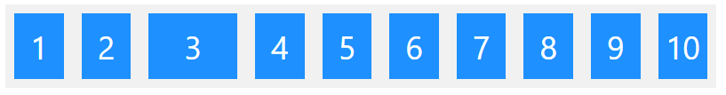


### flex-basis

* specify the initial length (**width**) of a flex item

```html
<!DOCTYPE html>
<html>
<head>
<style>
.flex-container {
  display: flex;
  align-items: stretch;
  background-color: #f1f1f1;
}

.flex-container > div {
  background-color: DodgerBlue;
  color: white;
  width: 100px; /* initial value of width */
  margin: 10px;
  text-align: center;
  line-height: 75px;
  font-size: 30px;
}
</style>
</head>
<body>
<h1>The flex-basis Property</h1>

<p>Set the initial length of the third flex item to 200 pixels:</p>

<div class="flex-container">
  <div>1</div>
  <div>2</div>
  <div style="flex-basis:200px">3</div> <!-- override initial value of 100px above -->
  <div>4</div>
</div>

</body>
</html>

```

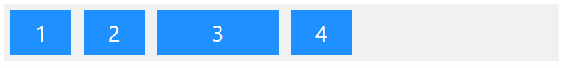


### flex

* a shorthand property for `flex-grow`, `flex-shrink`, and `flex-basis`

``` html
<div class="flex-container">
  <div>1</div>
  <div>2</div>
  <!--not growable (0), not shrinkable (0), and with an initial length of 200 pixels -->
  <div style="flex: 0 0 200px">3</div>
  <div>4</div>
</div>
```


---

### Visibility 속성

* 대상을 보이거나 보이지 않게 지정하는 스타일 속성

```css
visibility: visible
visibility: hidden
visibility: collapse (table 태그를 보이지 않게 설정, only available in IE & Firefox)
```

---

### Opacity 속성

* 태그의 투명도를 조절하는 스타일 속성
* 0.0 ~ 1.0 사이의 숫자를 입력할 수 있으며 0.0은 투명, 1.0은 불투명
* Example: `opacity: 0.2`

---

([Back to List](../../README.md))

