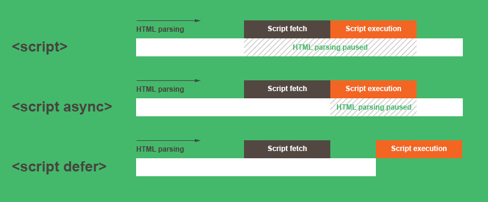

# Markup HTML - continued

### `<form>`, `<fieldset>`, `<label>`, `<input>`

* `<form>`: define a form to collect **user input**

``` html
<form action="이 양식이 제출될 때 일어나는 행동을 정의 (ex. /action_page.php)"
      target="제출된 결과가 어디서 열릴 것인지 명시 (ex. _self, _blank)"
      method="입력된 데이터를 서버에 어떤 방법으로 보낼 것인지 명시 (ex. GET, POST)">
    
</form>
```

* `fieldset` : `<form>` 양식 안에 관련된 요소들을 그룹화 시키는 태그

* `<label>`

  * `<button>`, `<input>`, `<textarea>` 등의 태그를 가르키는 표
  * `<label for="element_id">` for 속성에 해당 레이블이 가르키는 요소의 아이디를 입력하면, 마우스로 레이블을 클릭할 때 cursor가 자동으로 이동함

* `<input>`

  * `type` - 입력 받을 데이터의 형태를 명시 (ex. submit, email, text, password, and [MORE](https://www.w3schools.com/html/html_form_input_types.asp))

  * `value` - 입력 필드의 최초 값을 지정

    ([SEE MORE ATTRIBUTES](https://www.w3schools.com/html/html_form_attributes.asp))

``` html
<form action="이 양식이 제출될 때 일어나는 행동을 정의 (ex. /action_page.php)"
      target="제출된 결과가 어디서 열릴 것인지 명시 (ex. _self, _blank)"
      method="입력된 데이터를 서버에 어떤 방법으로 보낼 것인지 명시 (ex. GET, POST)">
    <fieldset>
        <legend>로그인 입력 양식</legend>
        <label for="가르키는 요소의 id를 입력 (ex.user-email)">아이디</label>
        <input type="email" id="user-email"/>
    </fieldset>
</form>
```


---

### `<section>` vs. `<article>`

* `<section>`: 1장, 1절 (need title, heading)
* `<article>`: 완결, RSS (Really Simple Syndication)


---

### `<embed>`

* embed external content at the specified point in the document

  ``` html
  <!-- example -->
  <embed type="video/webm"
         src="/media/examples/flower.mp4"
         width="250"
         height="200">
  ```

* most modern browsers have deprecated and removed support for browser plug-ins, so relying upon `<embed>` is generally not wise if you want your site to be operable on the average user's browser

#### Resources

* [w3c `<embed>` specification](https://www.w3.org/TR/2010/WD-html5-20100624/the-iframe-element.html#the-embed-element)
* [MDN Web Docs](https://developer.mozilla.org/en-US/docs/Web/HTML/Element/embed)

---

### Markup Log-In

1. 로그인 header
2. 아이디 - 입력란
3. 비밀번호 - 입력란
4. 로그인 버튼
5. 회원가입 버튼
6. 아이디/비밀번호 찾기 버튼

``` html
<section class="login">
	<h2 class="login-heading">로그인</h2>
    <!-- form, fieldset, legend, label, and input -->
    <form action="url" class="login-form" method="post">
        <fieldset>
            <legend>입력 양식</legend>
            <div class="user-email">
                <label for="user-email">아이디</label>
                <input type="email" id="user-email" name="ID"
                       						required placeholder="이메일"/>
            </div>
            <div class="user-pw">
                <label for="user-pw">비밀번호</label>
                <input type="password" id="user-pw" name="PW"
                       						required placeholder="비밀번호"/>
            </div>    
        </fieldset>
    </form>
    <ul class="sign">
        <li><a>회원가입</a></li>
        <li><a>아이디/비밀번호 찾기</a></li>
    </ul>
</section>
```


---

### Common Attributes 

* Attributes that are common to **ALL ELEMENTS** in HTML

* `title` - Advisory information associated with the element.

* `class` - A name of a classification, or list of names of classifications, to which the element belongs.

* `id` - A unique identifier for the element.

* `lang` - Specifies the primary language for the contents of the element and for any of the element’s attributes that contain text.

  ([see more](https://www.w3.org/TR/2010/WD-html-markup-20100624/common-attributes.html))

  

---

### `<a target="_blank">` vs. `window.open()`

* (add note)


---

### `<a role="button">` vs. `<button>`

* `<a>` : 현재 페이지에서 다른 페이지로 넘어갈때 사용
* `<button>` : 현재 페이지 내에서 작업이 수행될 때 사용
* `<a role="button">` vs. `<button>`
  * `<a>` 에 `role` 속성을 추가하여 버튼으로 활용
  * `<button>`은 브라우저마다 스타일이 다름 (different agent style, box-sizing)


---

### [Rendering JavaScript in `<head>`](https://blog.asamaru.net/2017/05/04/script-async-defer/)

``` html
<script src="js/jquery.min.js" defer></script>
<script src="js/jquery.min.js" async></script>
```

* `defer` - script will **not run until after the page has loaded**
* `async` - script will be run **asynchronously** as soon as it is available



---

### WAI ARIA

* Web Accessibility Initiative - Accessible Rich Internet Applications

* RIA를 위한 접근성 권고안

* 탄생 배경

  * 스크린 리더 및 보조 기기 등에서 접근성 및 상호 운용성을 향상 시키기 위해 등장
  * 마크업에 **역할, 속성, 상태** 정보를 추가할 수 있도록 지원
  * 보다 향상된 UX를 제공

* 역할 (Role)

  * 특정 요소에 기능을 정의하는 것

  * 역할을 부여하여 사용자에게 정보를 제공

  * 부여된 역할은 동적으로 변경할 수 없음

    (examples)

    ``` html
    <!-- 메뉴 정의 -->
    <div class="user-menu" role="menu"></div>
    
    <!-- 경고 대화상자 정의 -->
    <div id="auth-error" role="alertdialog"></div>
    
    <!-- 버튼 정의 -->
    <div class="btn-01" role="button"></div>
    ```

* 속성 (Properties) & 상태 (State)

  * 요소가 기본적으로 갖고 있는 특징이나 상황

  * 속성과 상태는 `aria-` 접두어를 가진다

    (examples)

    ``` html
    <!-- 속성 예제 -->
        <!-- 필수 항목 속성 -->
        <input type="checkbox" aria-required="true" />
    	<!-- 추가 설명 속성 -->
    	<input type="text" aria-describedby="reference (추가 설명 요소의 id 값)" />
    	<div id="reference">추가설명</div>
    	<!-- 그룹 제목 속성 -->
    	<div role="group" aria-label="그룹제목"></div>
    
    <!-- 상태 예제 -->
    	<!-- 확장되어 있는 상태의 탭패널 -->
    	<div role="tabpanel" aria-expanded="true"></div>
    	<!-- 오류가 발생한 상태의 입력상자 -->
    	<input type="text" aria-invalid="true" />
    	<!-- 선택된 상태의 토글버튼 -->
    	<button aria-pressed="true"></button>
    ```


### Resources

* [WAI-ARIA 개요 및 인증 심사 방안.pdf](https://github.com/seulbinim/PDF)
* [웹접근성과 웹표준](https://seulbinim.github.io/WSA/accessibility.html)
* [항공사 ARIA 적용 사례](https://aoa.gitbook.io/skymimo/)
* [웹 접근성 연구소](https://www.wah.or.kr:444/index.asp)
* [WSconf](https://www.slideshare.net/wsconf)


---

([prev - CSS Animation](./css-float-animation.md))

([Back to List](../../README.md))