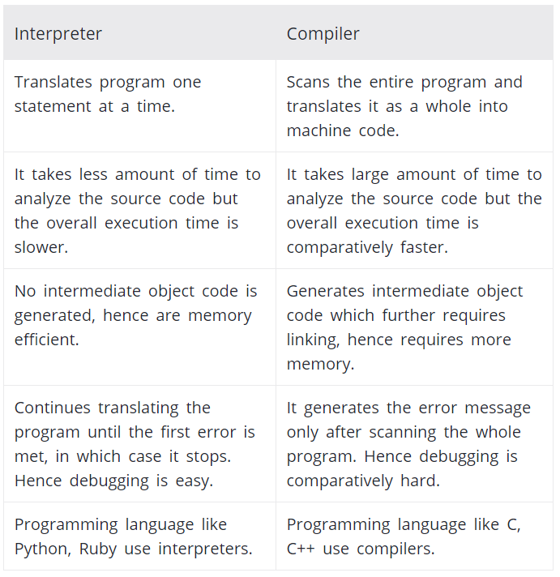

# 기본 개념과 동작 원리 이해의 중요성

## 1. 프론트엔드 개발자가 하는 일

애플리케이션을 사용하는 사람 (user)이 애플리케이션과 소통하기 위한 창구 (UI)를 사용하기 좋게 구현한다. UI는 상태 정보를 서버로 전송하기도 하고 서버의 데이터를 가져와서 UI에 표시하기도 한다. 

* HTML : tags, attributes, semantic web
* CSS: Layout, preprocessor
* 크로스 브라우징
* Javascript: ES5, ES6, ES Next, DOM/Event, Ajax, node.js
* HTTP
* tools: git, webpack, babel, ESLint, npm...
* Library / Framework: SPA (Angular, React, Vue.js), TypeScript, jQuery, Lodash, Axios...
* TDD (test driven development): karma / jasmine, mocha, chai
* 알고리즘 / 자료구조

## 2. 용어 및 개념 정리

- **websites** vs. **web application**

  웹사이트는 정적인 (static) 정보를 제공하고 (ex. blog), 웹 앱은 엔드 유저와의 상호작용 (interaction)을 위해 사용됨 (ex. google maps)

  ([Difference between Website and Web App](https://www.guru99.com/difference-web-application-website.html#2))

- **standalone application** - 운영 체제로부터 독립하여 그것만으로 실행 가능한 프로그램

- **platform** - 응용 프로그램이 실행될 수 있는 기초를 이루는 컴퓨터 시스템을 의미 (pc, mobile 등)

- **browser** - 인터넷에서 웹서버의 모든 정보를 볼 수 있게 해주며, 하이퍼텍스트 문서 검색을 도와주는 응용 프로그램

- **state** - 시스템이나 프로그램에 어떤 작업을 수행시키기 위해 설정되는 조건이나 방법 (ex. checked radio button)

* **ASCII** vs. **UNI CODE**

  ASCII (American Standard Code for Information Interchange)는 각 문자를 (알파벳, 숫자, 특수문자) 7비트로 표현하므로 총 128 (2^7)개의 문자를 표현할 수 있다. ASCII로 표현할 수 있는 문자들 외에 추가적인 문자를 지원해야 할 필요성이 있어 기존 7비트에 1비트를 추가하여 8비트 (1byte)를 사용한 코드가 정의되었다. 이에 따라 256 (2^8)개의 문자를 표현할 수 있다.

  각 나라별 언어를 모두 표현하기 위해 나온 코드 체계가 유니코드 (unicode)이다. 운영체제, 프로그램, 언어에 관계없이 문자마다 고유한 코드 값을 제공하며, 언어와 상관없이 모든 문자를 16비트 (2byte)로 표현하므로 최대 65,536자 (2^16)를 표현할 수 있다.

* **compiler** vs. **interpreter**

  

  컴파일러는 소스 코드 전체를 기계어로 번역하므로, 번역하는 데 시간이 비교적 오래 걸리는 편이다. 하지만, 번역 후 프로그램을 실행하는 속도는 빠르다. 또한, 소스 코드 전체를 번역한 후에 에러 메시지를 생성하므로, 디버깅하기 비교적 까다롭다 (complie & execute).

  인터프리터는 소스 코드를 한 줄씩 번역하며, 소스 코드 전체를 번역하는 데 비교적 빠른 편이다. 하지만, 프로그램 실행 속도는 비교적 느린 편이다. 소스코드는 첫 에러가 발생하기 직전까지만 번역되며, 에러 발생 시 번역이 즉시 중단되므로, 디버깅하기 비교적 수월하다 (scan line by line). 하지만 소스코드를 실행(execute) 해보기 전까지는 에러가 생성되는지 모른다.

  **컴파일러 특징**

  * ready to run
  * not cross-platform
  * often faster
  * inflexible
  * source code is private
  * exttra step

  **인터프리터 특징**

  * cross-platform
  * interpreter required
  * simpler to test
  * often slower
  * easier to debug
  * source code is public

  ([see more](https://www.programiz.com/article/difference-compiler-interpreter))

* **ECMA** - European Computer Manufacturers Association

* **Ajax** - Asynchronous JavaScript and XML. 웹 페이지가 로드된 후에 웹 서버로부터 데이터를 읽어들이는 방법. 웹 페이지를 리로드 하지 않고 페이지를 업데이트할 수 있다. 1999년, 자바스크립트를 이용해서 서버와 브라우저가 **비동기적 (Asynchronous)**으로 데이터를 교환할 수 있는 통신 기능.

* **CBD** - Component Based Development. 시스템을 하나의 일체형으로 구축하지 않고 마치 레고 블록처럼 하나씩 요소별로 부품화하여 구축하는 것으로, 소프트웨어 산업의 새로운 패러다임을 제시하고 있다.

* **SPA** - Single Page Application. 일반적인 웹 앱에서는 사용자가 요청할 때마다 페이지를 새로고침하여, 페이지를 로딩할 때 서버에서 리소스를 전달받아 해석한 후 브라우저에 렌더링하지만, SPA는 하나의 페이지를 dynamically rewrite. CBD 방법론을 기반으로 하며 다양한 SPA 프레임워크 (ex. React, Angular)가 탄생.

* **JavaScript** vs. **ECMAScript**

  ECMAScript (맞춤법, 규칙, specification)는 ECMA International (국립국어원)에 의해 제정된 ECMA-262 (표준어) 기술 규격에 의해 정의된 범용 스크립트 언어이다. 동의어로는 ECMAScript specification이 있다. ECMAScript는 스크립트 언어가 준수해야 하는 규칙, 세부 사항 및 지침을 제공한다.

  JavaScript는 ECMAScript specification을 준수하는 범용 스크립팅 언어이다. ECMAScript 문서를 읽으면 **어떻게 스크립트 언어를 만들 수 있는지** 알 수 있고, JavaScript 문서를 읽으면 **어떻게 스크립트 언어를 쓸 수 있는지**를 알 수 있다. ([see more](https://wormwlrm.github.io/2018/10/03/What-is-the-difference-between-javascript-and-ecmascript.html))

* **Algorithm** - 문제 해결을 위한 절차

* **API** - Application Programming Interface. 응용 프로그램 개발자들이 애플리케이션을 만들 때 운영체제에서 동작하는 프로그램을 쉽게 만들 수 있도록 화면 구성이나 프로그램 동작에 필요한 각종 함수를 모아놓은 것을 말한다. 

* **DOM** - Document Object Model. 프로그램이나 스크립트가 웹 페이지 내의 구성 요소들에 접근하여 내용이나 스타일 등을 변경할 수 있게 해주는 인터페이스. 브라우저에서 HTML, XML 등의 웹 페이지가 로딩되면 문서 객체 모델 (DOM)은 브라우저 내 트리 형태로 문서 내 요소 (node)들을 구성한다. 이후 자바스크립트, 파이썬 등 언어로 해당 트리 구조 내의 노드에 접근하여 노드의 속성 값을 변경하거나 추가, 삭제 등을 실행할 수 있다.

## 3. 기본 개념과 동작 원리 이해의 중요성

#### 프로그래밍이란?

* 기계가 실행할 수 있는 정확하고 상세한 요구사항을 설명하는 작업

* 이를 위해 무엇을 실행하기 원하는지에 대한 정의가 필요 (문제 해결 능력)

* 컴퓨터와 사람은 사고, 인지의 방식이 다름으로 프로그래밍에 앞서 해결 과제를 컴퓨터의 관점으로 사고 **(computational thinking)**해야한다

  

#### 프로그래밍 언어

* 기계어 (machine language)만을 이해하는 컴퓨터와 자연어 (natural language)를 구사하는 인간 사이의 **의사소통 수단**
* **Syntax (문법)**와 **Semantics (의미)**의 조합으로 표현됨
* 작성한 프로그래밍 언어 (high-level programming language - ex. Java)를 컴퓨터 혹은 기계가 이해할 수 있는 기계어 (low-level code ex. Assembly)로 변환하여 (**compile**) 주는 것을 **컴파일러 (compiler) 혹은 인터프리터 (interpreter)**라고 한다.