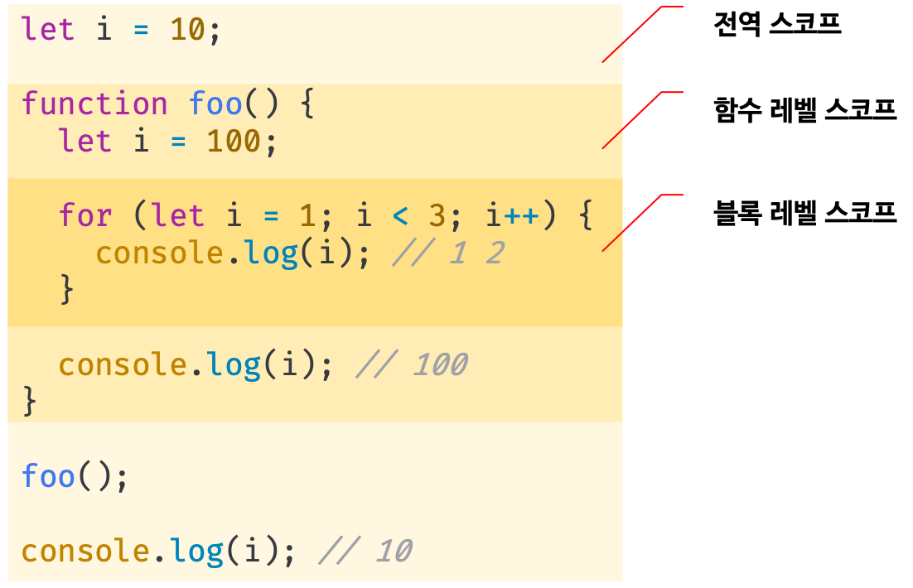

# let, const와 블록 레벨 스코프

## 1. `var` 키워드로 선언한 변수의 문제점

### 1.1 변수 중복 선언 허용

```javascript
var x = 1;

var x = 100;
console.log(x); // 100
```

같은 스코프 내에서 변수를 중복 선언하면 **나중에 작성된 변수 선언문은 자바스크립트 엔진에 의해 `var` 키워다가 없는 것처럼 동작한다. 이때 에러는 발생하지 않는다.**


### 1.2 함수 레벨 스코프

`var` 키워드로 선언한 변수는 **오로지 함수의 코드 블록만을 지역 스코프로 인정한다.** 따라서 함수 외부에서 선언한 변수는 모두 전역 변수이다.

```javascript
var x = 1;

if (true) {
  var x = 10;
}

console.log(x); // 10
```


`for` 문의 변수 선언문에서 var 키워드로 선언한 변수도 전역 변수가 된다.

```javascript
var i = 10;

// for문에서 선언한 i는 전역 변수이다.
for(var i = 0; i < 5; i++) {
  console.log(i); // 0 1 2 3 4
}

// 의도치 않게 변수의 값이 변경되었다.
console.log(i); // 5
```


### 1.3 변수 호이스팅

`var` 키워드로 변수를 선언하면 **변수 호이스팅**에 의해 변수 선언문이 스코프의 **선두로 끌어 올려진 것 처럼 동작한다.** 따라서, 변수 호이스팅에 의해 `var` 키워드로 선언한 변수는 변수 선언문 이전에 참조할 수 있다 (undefined).

```javascript
// 이 시점에는 변수 호이스팅에 의해 이미 변수 foo가 선언되었다. (1. 선언 단계)
// 변수 foo는 undefined로 초기화된다. (2. 초기화 단계)
console.log(foo); // undefined

// 변수에 값을 할당 (3. 할당 단계)
foo = 123;

console.log(foo); // 123

// 변수 선언은 런타임 이전에 자바스크립트 엔진에 의해 암묵적으로 실행된다.
var foo;
```

변수 선언문 이전에 변수를 참조하는 것은 프로그램의 흐름 상 맞지 않을 뿐더러 가독성을 떨어트리며 오류를 발생시킬 여지를 남긴다.


## 2. `let` 키워드

### 2.1 변수 중복 선언 금지

```javascript
var foo = 123;
// var 키워드로 선언된 변수는 같은 스코프 내에서 중복 선언을 허용한다.
// 아래 변수 선언문은 자바스크립트 엔진에 의해 var 키워드가 없는 것처럼 동작한다.
var foo = 456;

let bar = 123;
// let이나 const 키워드로 선언된 변수는 같은 스코프 내에서 중복 선언을 허용하지 않는다.
let bar = 456; // SyntaxError: Identifier 'bar' has already been declared
```


### 2.2 블록 레벨 스코프

`var` 키워드로 선언한 변수는 오로지 함수의 코드 블록만을 지역 스코프로 인정하는 **함수 레벨 스코프**를 따른다. 하지만 `let` 키워드로 선언한 변수는 **모든 코드 블록**을 지역 스코프로 인정하는 **블록 레벨 스코프**를 따른다.

```javascript
let foo = 123; // 전역 변수

{
  let foo = 456; // 지역 변수
  let bar = 456; // 지역 변수
}

console.log(foo); // 123
console.log(bar); // ReferenceError: bar is not defined
```




### 2.3 변수 호이스팅

`let` 키워드로 선언한 변수는 **변수 호이스팅이 발생하지 않는 것 처럼 동작한다.**

```javascript
console.log(foo); // ReferenceErroe: foo is not defined
let foo;
```

`let` 키워드로 선언한 변수를 변수 선언문 이전에 참조하면 참조 에러(ReferenceError)가 발생한다. **`let` 키워드로 선언한 변수는 "선언 단계"와 "초기화 단계"가 분리되어 진행된다.** 즉, 런타임 이전에 **자바스크립트 엔진에 의해 암묵적으로 선언 단계가 먼저 실행되지만, 초기화 단계는 변수 선언문에 도달했을 때 실행된다.**

만약 초기화 단계가 실행되기 이전에 변수에 접근하려고 하면 참조 에러(ReferenceError)가 발생한다. 따라서 **스코프의 시작 지점부터 초기화 단계 시작 지점(변수 선언문)까지는 변수를 참조할 수 없다. ** 이 구간을 **일시적 사각지대(Temporal Dead Zone; TDZ)라고 부른다.** 

```javascript
// 런타임 이전에 선언 단계가 실행된다.
// 아직 변수가 초기화되지 않았다. 따라서 변수 선언문 이전에 변수를 참조할 수 없다.
console.log(foo); // ReferecneError: foo is not defined

let foo; // 변수 선언문에서 초기화 단계가 실행된다.
console.log(foo); // undefined

foo = 1; // 할당문에서 할당 단계가 실행된다.
console.log(foo); // 1
```


이처럼 `let` 키워드로 선언한 변수는 변수 호이스팅이 발생하지 않는 것처럼 보이지만, 변수 선언문을 만나기 전까지만 참조할 수 없을 뿐 호이스팅된다.

```javascript
let foo = 1; // 전역 변수
{
  console.log(foo); // ReferenceError: foo is not defined
  let foo = 2; // 지역 변수
}
```

`let` 키워드로 선언한 변수의 경우, 변수 호이스팅이 발생하지 않는다면 위 예제는 전역 변수 `foo`를 출력해야 한다. 하지만 `let` 키워드로 선언한 변수도 여전히 호이스팅이 발생하기 때문에 참조 에러(ReferenceError)가 발생한다.


### 2.4 전역 객체와 `let`

`var` 키워드로 선언한 변수는 `window`라는 전역 객체의 프로퍼티로 저장된다. 반면, `let` 키워드로 선언한 전역 변수는 전역 객체 `window`의 프로퍼티가 아니다. `let` 전역 변수는 보이지 않는 **개념적인 블록** 내에 존재하게 된다.

```javascript
let x = 1;

// let, const 키워드로 선언한 전역 변수는 전역 객체의 프로퍼티가 아니다.
console.log(window.x); // undefined
console.log(x); // 1
```


## 3. `const` 키워드

### 3.1 선언과 초기화

`let` 키워드로 선언한 변수는 재할당이 자유로우나 **const 키워드로 선언한 변수는 재할당이 금지된다.**

```javascript
// 0.1은 변해서는 않되는 상수로서 사용될 값이다.
// 변수 이름을 대문자로 선언하여 상수를 저장하고 있음을 명확히 나타낸다.
const TAX_RATE = 0.1;

// const 키워드로 선언한 변수는 재할당이 금지된다.
// 상수는 재할당이 금지된 변수이다.
TAX_RATE = 0.2; // TypeError: Assignment to constant variable.
```


**`const` 키워드로 선언한 변수는 반드시 선언과 동시에 할당이 이루어져야 한다.**

```javascript
const FOO; // SyntaxError: Missing initializer in const declarationㅜ
```


`const` 키워드로 선언한 변수는 `let` 키워드로 선언한 변수와 마찬가지로 블록 레벨 스코프를 갖는다.

```javascript
{
  const TAX_RATE = 0.1;
  console.log(TAX_RATE); // 0.1
}
console.log(TAX_RATE); // ReferenceError: TAX_RATE is not defined
```


### 3.2 상수

상수는 **가독성과 유지보수의 편의를 위해 적극적으로 사용해야한다.**

```javascript
// tax rate
const TAX_RATE = 0.1;

// 세전 가격
let preTaxPrice = 100;

// 세후 가격
let afterTaxPrice = preTaxPrice + (preTaxPrice * TAX_RATE);

console.log(afterTaxPrice); // 110
```


### 3.3 `const` 키워드와 객체

`const` 키워드로 선언된 변수에 원시 값을 할당한 경우, 원시 값은 변경할 수 없는 값이다. 마찬가지로  `const` 키워드로 선언한 변수에 객체를 할당한 경우 재할당이 금지되지만, **객체는 변경 가능한 값이므로 객체를 변경하는 것은 가능하다.**

```javascript
const person = {
  name: 'Kim'
};

// 객체는 변경 가능한 값이다
person.name = 'Lee';

console.log(person); // { name: "Kim" }
```

`const` 키워드는 재할당을 금지할 뿐, "불변(immutable)"을 의미하지는 않는다. 객체의 내용이 변경되더라도 변수에 할당된 주소값은 변경되지 않는다.


## 4.  `var` vs. `let` vs. `const`

- ES6를 사용한다면 `var` 키워드는 사용하지 않는다.
- 재할당이 필요한 경우에 한정해 `let` 키워드를 사용한다. 이때 변수의 스코프는 최대한 좁게 만든다.
- 변경이 발생하지 않는(재할당이 필요 없는 상수) 원시 값과 객체에는 `const` 키워드를 사용한다. `const` 키워드는 재할당을 금지하므로 `var`, `let` 보다 안전하다.

