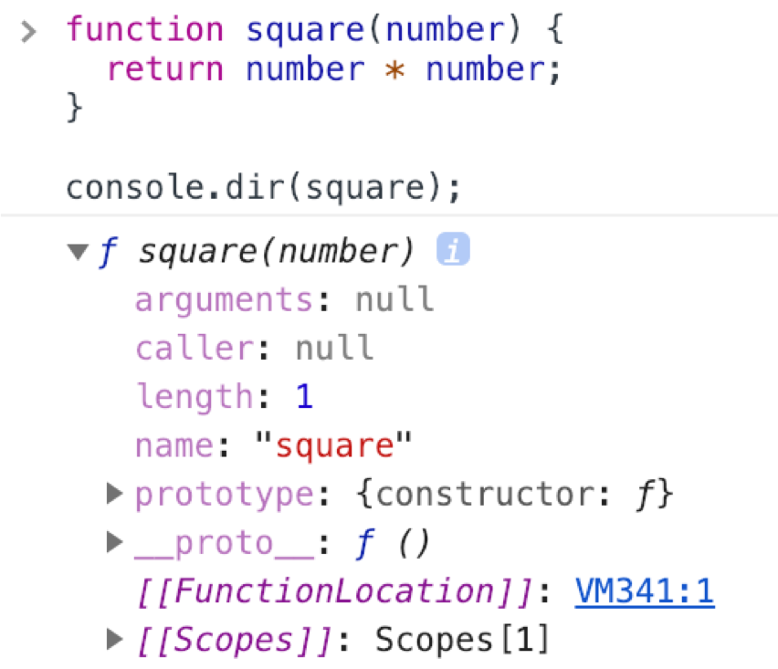

# 함수와 일급 객체

## 1. 일급 객체

아래와 같은 조건을 만족하는 객체를 **일급 객체(first-class object)**라 한다.

1. 무명의 리터럴로 생성할 수 있다. 즉, 런타임에 생성이 가능하다 (함수 표현식).
2. 변수나 자료 구조(객체, 배열 등)에 저장할 수 있다.
3. 함수의 매개 변수에게 전달할 수 있다.
4. 함수의 결과값으로 반환할 수 있다.

자바스크립트의 함수는 아래 예제와 같이 위의 조건을 모두 만족하므로 일급 객체이다.

```javascript
// 1. 함수는 무명의 리터럴로 생성할 수 있다.
// 2. 함수는 변수에 저장할 수 있다.
// 런타임(할당 단계)에 함수 리터럴이 평가되어 함수 객체가 생성되고 변수에 할당된다.
const increase = function (num) {
  return ++num;
};

const decrease = function (num) {
  return --num;
};

// 2. 함수는 객체에 저장할 수 있다.
const predicates = { increase, decrease };

// 3. 함수의 매개 변수에게 전달할 수 있다.
// 4. 함수의 반환값으로 사용할 수 있다.
function makeCounter(predicate) {
  let num = 0;
  
  return function () {
    num = predicate(num);
    return num;
  };
}

// 3. 함수는 매개 변수에게 함수를 전달할 수 있다.
const increaser = makeCounter(predicates.increase);
```


**일급 객체(함수) >= 객체 = 값**. 따라서 값을 사용할 수 있는 곳(변수 할당문, 객체의 프로퍼티, 배열의 요소, 함수 호출의 인수, 함수 반환문)이라면 어디서든지 리터럴로 정의할 수 있으며 런타임에 함수 객체로 평가된다.

이러한 함수(일급 객체)의 특징은 **함수형 프로그래밍**을 가능케하는 자바스크립트의 장점 중 하나이다.

> **함수형 프로그래밍**
>
> 순수 함수와 보조 함수의 조합을 통해 외부 상태를 변경하는 부수 효과(side-effect)를 최소화하여 불변성(Immutability)을 지향하는 프로그래밍 패러다임

**일반 객체는 호출할 수 없지만 함수 객체는 호출할 수 있다.** 또한 함수 객체는 일반 객체에는 없는 함수 고유의 프로퍼티를 소유한다.


## 2. 함수 객체의 프로퍼티



함수 객체에는 일반 객체에 없는 `arguments`, `caller`, `length`, `name`, `prototype` 프로퍼티가 있다. 단, `__proto__` 는 접근자 프로퍼티이며 함수 객체의 프로퍼티가 아닌 `Object.prototype` 객체의 프로퍼티를 상속받은 것이다 (more on ch. 18).


### 2.1 `arguments` 프로퍼티

함수 객체의 `arguments` 프로퍼티 값은 `arguments` 객체이다. `arguments` 객체는 함수 호출 시 전달된 인수들의 정보를 담고 있는 **순회 가능한(iterable) 유사 배열 객체(array-like object)이며** 함수 내부에서 지역변수처럼 사용된다.

> **arguments 프로퍼티**
>
> 함수 객체의 arguments 프로퍼티는 ES3부터 표준에서 폐지되었다. `Function.arguments`와 같은 사용 방법은 권장되지 않으며 함수 내부에서 지역 변수처럼 사용할 수 있는 `arguments` 객체를 참조하도록 한다.


자바스크립트에서는 함수에게 전달된 모든 임수가 **암묵적으로 `arguments` 객체의 프로퍼티로 보관된다.** `arguments` 객체는 인수를 프로퍼티 값으로 소유하며 **프로퍼티 키는 인수의 순서를 나타낸다.**  `arguments`는 프로퍼티로 `callee`(호출된 함수)와 `length`(인수 카운트)를 갖는다.

> **arguments 객체의 Symbol(Symbol.iterator) 프로퍼티**
>
> arguments 객체의 Symbol(Symbol.iterator) 프로퍼티는 arguments 객체를 **순회 가능한 자료 구조인 이터러블(iterable)로 만들기 위한 프로퍼티다.** 


`arguments` 객체는 매개변수 개수를 확정할 수 없는 **가변 인자 함수**를 구현할 때 유용하게 사용된다.

```javascript
function sum() {
  let res = 0;
  // arguments 객체는 length 프로퍼티가 있는 유사 배열 객체이므로 for 문으로 순회할 수 있다.
  for (let i = 0; i < arguments.length; i++) {
    res +- arguments[i];
  }
  return res;
}

console.log(sum()); // 0
console.log(sum(1, 2)); // 3
console.log(sum(1, 2, 3)); // 6
```

`arguments` 객체는 배열의 형태로 인자 정보를 담고 있지만 실제 배열이 아닌 유사배열객체(array-like object)이다. 유사배열객체는 `length` 프로퍼티를 가진 객체로 `for`문으로 순회할 수 있다.


### 2.2 `length` 프로퍼티

함수 객체의 `length` 프로퍼티는 함수 정의 시 선언한 **매개변수(parameters)의 개수를 가리킨다.** `arguments` 객체의 `length` 프로퍼티와(arguments 개수) 함수 객체의 `length`프로퍼티의 값은 다를 수 있으므로 주의해야한다.


### 2.3 `name` 프로퍼티

함수 객체의 `name` 프로퍼티는 함수 이름을 나타낸다. ES6에서 정식 표준이 되었다. `name` 프로퍼티는 ES5와 ES6에서 **다르게 동작하므로 주의해야한다.** 익명 함수 표현식의 경우, ES5에서 `name` 프로퍼티는 **빈 문자열**을 값으로 갖는다. 하지만 ES6에서는 **함수 객체를 가리키는 변수 이름**을 값으로 갖는다.

```javascript
// 기명 함수 표현식
var namedFunc = function foo() {};
console.log(namedFunc.name); // foo

// 익명 함수 표현식
var anonymousFunc = function() {};
// ES5: name 프로퍼티는 빈 문자열을 값으로 갖는다.
// ES6: name 프로퍼티는 함수 객체를 가리키는 변수 이름을 값으로 갖는다.
console.log(anonymousFunc.name); // anonymousFunc

/// 함수 선언문
function bar() {}
console.log(bar.name); // bar
```


### 2.4 `__proto__` 접근자 프로퍼티

모든 객체는 `[[Prototype]]`이라는 내부 슬롯을 갖는다. `[[Prototype]]` 내부 슬롯은 객체 지향 프로그래밍의 상속을 구현하는 프로토타입 객체를 가리킨다. 

`__proto__` 프로퍼티는 `[[Prototype]]` 내부 슬롯이 가리키는 **프로토타입 객체에 접근**하기 위해 사용하는 **접근자 프로퍼티**이다. 

```javascript
const obj = {a: 1};

// 객체 리터럴 방식으로 생성한 객체의 프로토타입 객체는 Object.prototype이다.
console.log(obj.__proto__ === Object.prototype); // true

// 객체 리터럴 방식으로 생성한 객체는 프로토타입 객체인 Object.prototype의 프로퍼티를 상속받는다.
// hasOwnProperty 메소드는 Obejct.prototype의 메소드이다.
console.log(obj.hasOwnProperty('a')); // true
console.log(obj.hasOwnProperty('__proto__')); // false
```


### 2.6 `prototype` 프로퍼티

`prototype` 프로퍼티는 **함수 객체만이 소유**하는 프로퍼티이다. 일반 객체에는 없다.

```javascript
// 함수 객체는 prototype 프로퍼티를 소유한다.
console.log((function() {}).hasOwnProperty('prototype')); // true

// 일반 객체는 prototype 프로퍼티를 소유하지 않는다.
console.log(({}).hasOwnProperty('prototype')); // false
```

`prototype` 프로퍼티는 함수가 객체를 생성하는 **생성자 함수**로 사용될 때, 사용자 함수가 생성할 인스턴스의 프로토타입 객체를 가리킨다.

