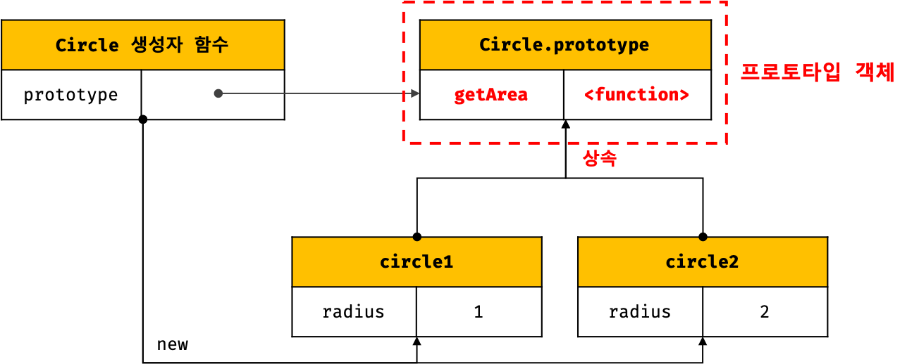
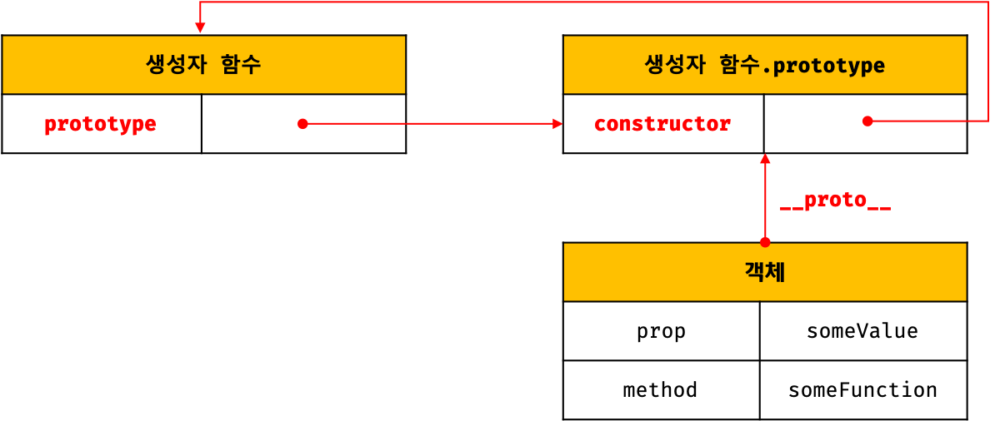

# 프로토타입

자바스크립트는 명령형(Imperative), 함수형(Functional), 프로토타입 기반(Prototype-based) 객체지향 프로그래밍을 지원하는 **멀티 패러다임 프로그래밍 언어다.**

자바스크립트는 객체 기반의 프로그래밍 언어이며 자바스크립트를 이루고 있는 **"거의" 모든 것이 객체이다 (원시 타입 제외).**


## 1. 객체지향 프로그래밍

객체들의 집합으로 표현하려는 프로그래밍 패러다임

구현하려는 객체에 필요한 속성만을 간추려 내어 표현하는 것을 **추상화(abstraction)**라 한다.

```javascript
// 이름과 주소라는 속성을 갖는 객체
const person = {
  name: 'Lee',
  address: 'Seoul',
  sayHi() {
    console.log("hello");
  }
};

```

객체지향 프로그래밍은 객체의 **상태(state)**를 나타내는 데이터와 상태 데이터를 조작할 수 있는 **동작(behavior)**을 하나의 논리적인 단위(객체)로 묶어 생각한다. 객체의 상태 데이터를 프로퍼티(Property), 동작을 메소드(Method)라 부른다. **상태 데이터와 동작을 하나의 논리적인 단위로 묶은 복합적인 자료구조를 객체(Object)라 한다.**


## 2. 상속과 프로토타입

**상속(Inheritance)**은 객체지향 프로그래밍의 핵심 개념으로 어떤 객체의 프로퍼티 또는 메소드를 다른 객체가 상속 받아 그대로 사용할 수 있는 것을 말한다. 이를 통해 기존의 코드를 적극적으로 재사용하여 불필요한 중복을 제거한다. **자바스크립트는 프로토타입을 기반으로 상속을 구현한다.**

```javascript
// 객체 리터럴 - 여러 객체를 만들 때 불편하다
const circle = {
  radius = 5,
  getArea() {
    return radius * radius * 3.14;
  }
};

// 생성자 함수 - 여러 객체를 만들 때 효율적이나,
// 생성되는 모든 인스턴스가 getArea()를 가지고 있음 (중복)
function Circle(radius) {
  this.radius = radius;
  this.getArea = function () {
    return Math.PI * Math.pow(this.radius, 2);
  };
}

// 생성자 함수 + 프로토타입으로부터 상속
// 생성자 함수 - 각 인스턴스의 고유한 값을 할당할 때 사용
function Circle(radius) {
  this.radius = radius;
}
// 모든 인스턴스가 공유할 수 있도록 getArea() 메소드를 프로토타입에 추가
Circle.prototype.getArea = function () {
  return Math.PI * Math.pow(this.radius, 2);
};

// 상속 받은 프로퍼티를 그대로 사용할 수 있다.
const circle1 = new Circle(1);

console.log(circle1.getArea()); // 3.14

```





`Circle` 생성자 함수가 생성한 모든 인스턴스는 자신의 **프로토타입 객체** 열학을 하는 `Circle.prototype`의 모든 프로퍼티와 메소드를 상속 받는다. 각 인스턴스의 프로퍼티(상태)는 해당 인스턴스가 가지고 있는 것이 논리적이나, **중복되는 메소드는 프로토타입에 추가하여 모든 인스턴스에게 공유하는 것이 효율적이다.**


## 3. 프로토타입 객체

**프로토타입 객체(프로토타입)은 객체간 상속을 구현하기 위해 사용된다.** 프로토타입은 어떤 객체의 상위(**부모**) 객체의 역할을 하며 하위 객체(**자식**)에 공유 프로퍼티(메소드 포함)를 제공한다.

모든 객체는 `[[Prototype]]`([[부모]])라는 내부 슬롯을 가지며, 자신이 생성될 때 `[[Prototype]]` 내부 슬롯의 값으로 **프로토타입의 참조**(부모의 주소)를 저장한다. 모든 객체는 **하나의 프로토타입(부모)을 가지며**, 프로토타입(부모)은 객체의 **생성 방식에 의해 결정된다.**

프로토타입(부모)은 `null`이거나 객체이다. 그리고 모든 프로토타입(부모)은 **생성자 함수**와 연결되어 있다. 또한, 모든 객체는 프로토타입을 가지고 있다.



* 모든 객체는 `__proto__` 접근자 프로퍼티를 통해 자신의 `[[Prototype]]` 내부 슬롯이 가리키는 객체에 접근할 수 있다 (자식은 어머님이 누구냐는 질문을 통해 어머니의 위치를 가리키는 객체에 접근할 수 있다).
* 프로토타입은 `constructor` 프로퍼티를 통해 생성자 함수에 접근할 수 있다.
* 생성자 함수는 `prototype` 프로퍼티를 통해 프로토타입에 접근할 수 있다.
* 생성자 함수는 본인이 생성한 인스턴스를 찾아갈 수 없다(참조할 수 없다).


### 3.1 `__proto__` 접근자 프로퍼티

모든 객체는 `__proto__` **접근자 프로퍼티**를 통해 자신의 `[[Prototype]]` 내부 슬롯이 가리키는 객체에 접근할 수 있다. `__proto__` 접근자 프로퍼티도 객체(인스턴스)가 직접 소유하는 프로퍼티가 아니며, 상속을 통해 사용할 수 있다.


#### **모든 객체는 `Object.prototype`의 프로퍼티인 `__proto__` 접근자 프로퍼티를 상속 받을 수 있다.** 


분홍색 영역이 `person` 객체의 프로토타입(부모)인 `Object.prototype`의 정보이다. 

```javascript
// 상속 받은 __proto__ 접근자 프로퍼티는 부모 객체의 참조 값을 반환한다.
console.log({}.__proto__ === Obejct.prototype); // true
```


#### **`__proto__`** 접근자 프로퍼티를 통해 프로토타입에 접근하는 이유는 **상호 참조에 의해 프로토타입 체인이 생성되는 것을 방지하기 위함이다.**


```javascript
const parent = {};
const child = {};

// child의 부모를 parent로 지정
child.__proto__ = parent;

// parent의 부모를 child로 설정
parent.__proto__ = child; // TypeError: Cyclic __proto__ value (순환 참조)
```

프로토타입 체인은 **단방향**링크드 리스트로 구현되어야 한다.

> **프로토타입 체인**
>
> 모든 객체는 프로토타입의 계층 구조인 프로토타입 체인에 묶여 있다. 자바스크립트 엔진은 객체의 프러퍼티에 접근하려고 할 때 해당 객체에 접근하려는 프로퍼티가 없다면 `__proto__` 접근자 프로퍼티가 가리키는 링크를 따라 상위 객체를 순차적으로 검색한다.


#### `__proto__` 접근자 프로퍼티를 코드 내에서 직접 사용하는 것은 비추천이다.

모든 객체가 `__proto__` 접근자 프로퍼티를 사용할 수 있는 것은 아니기 때문이다. **직접 상속**을 통해 `Object.prototype`을 상속 받지 않는 객체를 생성할 수도 있다.

```javascript
// obj는 Object.prototype의 프로퍼티를 상속 받지 않는다.
const obj = Object.create(null);

// 따라서 obj에는 __proto__ 프로퍼티가 상속되지 않는다.
console.log(obj.__proto__); // undefined

// 부모가 Object.prototype이 아닌 객체가 있을 수 있기 때문에
// Object.getPrototypeOf 메소드를 사용하는 편이 좋다.
console.log(Object.getPrototypeOf(obj)); // null

// 부모를 바꾸고 싶을 경우 Obejct.setPrototypeOf 메소드를 사용한다.
// 단 IE11 이상부터 사용할 수 있다.
Object.setPrototypeOf(obj, Object.prototype);

console.log(obj.__proto__); // Obejct.prototype
```


### 3.2 함수 객체의 `prototype` 프로퍼티

**일반 함수 객체는 `__proto__` 접근자 프로퍼티 이외에 `prototype` 프로퍼티도 소유한다.** 함수 객체의 prototype 프로퍼티는 **생성자 함수가 생성할 인스턴스의 프로토타입을 가리킨다.** 따라서 Arrow, Method인 non-constructor는 `prototype` 프로퍼티를 가지지 않는다. 또한, 생성자 함수가 아닌 일반 함수의 `prototype` 프로퍼티는 아무런 의미가 없다.

모든 객체가 가지고 있는 (`Object.prototype`에게 상속 받은) `__proto__` 접근자 프로퍼티와 일반 함수 객체만이 가지고 있는 `prototype` 프로퍼티는 결국 **동일한 프로토타입을 가리킨다.** 하지만 각 프로퍼티를 사용하는 주체가 다르다.

```javascript
function Person(name) {
  this.name = name;
}

const person1 = new Person('Jin');

console.log(person1.__proto__ === Person.prototype); // true

```


| 구분                        | 소유      | 값                                                           | 사용 주체   | 사용 목적                                                    |
| --------------------------- | --------- | ------------------------------------------------------------ | ----------- | ------------------------------------------------------------ |
| _ _proto_ _ 접근자 프로퍼티 | 모든 객체 | 프로토타입의 참조 (해당 인스턴스의 부모 주소)                | 모든 객체   | 모든 객체가 상속을 위해 자신의 프로토타입에 접근하기 위해 사용 |
| prototype 프로퍼티          | 함수 객체 | 프로토타입의 참조 (생성자 함수가 생성하는 인스턴스의 부모 주소) | 생성자 함수 | 생성자 함수가 자신이 생성할 인스턴스의 프로토타입(부모)를 할당하기 위해 사용 |


### 3.3 프로토타입의 constructor 프로퍼티와 생성자 함수

모든 부모(프로토타입)는 `constructor` 프로퍼티를 갖는다. 

```javascript
console.log(Object.prototype.hasOwnProperty('constructor')); // true
```


이 `constructor` 프로퍼티는 `prototype` 프로퍼티로 자신을 참조하고 있는 **생성자 함수를 가리킨다.** 이 연결은 함수 객체 (생성자 함수)가 생성될 때 이루어진다. **프로토타입과 생성자 함수는 언제나 쌍(pair)으로 존재한다.**

```javascript
// 생성자 함수
function Person(name) {
  this.name = name;
}

const me = new Person('Kim');

// me 객체의 생성자 함수는 Person이다.
// me 객체는 constructor 프로퍼티가 없지만 me 객체의 프로토타입인
// Person.prototype에 constructor 프로퍼티를 상속 받아 쓸 수 있다.
console.log(me.constructor === Person); // true
```


```javascript
// 생성자 함수 Person
function Person(name) {
  this.name = name;
}
// 생성자 함수 Person이 생성한 인스턴스 me
const me = new Person('Jin');

// me의 실질적 부모는 Person 생성자 함수지만,
// 생성자 함수(실질적 부모)는 인스턴스(자식)를 생성하는 동시에
// 양육권을 Person 생성자 함수의 prototype 프로퍼티가 가리키는
// Person.prototype 객체에게 양도한다.
// Person.prototype 객체는 constructor라는 프로퍼티만 가지고 있으며
// (Object.prototype에게 상속 받은 프로퍼티 제외),
// 그 안에 me 인스턴스의 실질적 부모인 Person 생성자 함수의 참조(주소) 값을 갖고 있다.
// Person.prototype 객체에 constructor 프로퍼티 밖에 없는 이유는
// 개발자가 직접 필요한 프로퍼티를 추가할 수 있도록 디자인한 것이다.
// 따라서, me 객체는 생성됨과 동시에 부모가 Person.prototype으로 정의되며
// Person.prototype의 상위 객체인 Object.prototype를 조상으로 가진다.
// 따라서 me 객체는 Object.prototype의 프로퍼티를 모두 상속 받는다.
console.log(me.__proto__ === Object.prototype); // true

// me 객체를 생성한 함수는 Person 생성자 함수
console.log(me.constructor === Person); // true

// 생성자 함수 Person은 생성할 인스턴스의 부모를 Person.prototype으로 설정
console.log(Person.prototype === me.__proto__); // true

// Person 생성자 함수도 객체인데 부모가 있지 않을까?
console.log(Person.__proto__); // Function.prototype

// me를 생성한 생성자 함수 Person은, me의 부모인 Person.prototype의 constructor 프로퍼티가 가리키고 있다.
console.log(me.constructor === Person); // true

```


## 4. 리터럴 표기법에 의해 생성된 객체의 생성자 함수와 프로토타입

```javascript
// obj 객체를 생성한 생성자 함수는 Object이다.
let obj = new Object();
console.log(obj.constructor === Object); // true

// 객체 리터럴로 생성한 객체의 생성자 함수는?
obj = {};
console.log(obj.constructor === Object); // true
```

위 예제의 객체 `obj`는 `Object` 생성자 함수로 생성한 객체가 아니라 객체 리터럴에 의해 생성된 객체이다. 하지만 객체 `obj`는 `Object` 생성자 함수와 `constructor`프로퍼티로 연결되어 있다.


* `Object` 생성자 함수는 인수가 전달되지 않았을 때 추상 연산 `ObjectCreate`을 호출하여 **빈 객체를 생성한다.** 이후 `new.target` 확인이나 프로퍼티를 추가하는 처리 등 생성자 함수 내부의 세부 동작이 실행된다.

* 객체 리터럴이 평가될 때도 `ObjectCreate`을 호출하여 **빈 객체를 생성한다.** 이후 중괄호 안의 프로퍼티 정의 리스트(PropertyDefinitionList)를 평가하여 객체를 반환한다.


따라서 리터럴 표기법에 의해 생성된 객체는 생성자 함수에 의해 생성된 객체는 아니다. 하지만 리터럴 표기법에 의해 생성된 객체도 상속을 위해 프로토타입이 필요하며, 프로토타입은 생성자 함수와 더불어 생성되기 때문에 리터럴 표기법에 의해 생성된 객체는 가상적인 생성자 함수를 갖는다. 


#### **결론**

**리터럴 표기법에 의해 생성된 객체의 경우, 프로토타입의 `constructor` 프로퍼티가 가리키는 생성자 함수가 반드시 객체를 생성한 생성자 함수라고 단정할 수 없다.** 객체 리터럴에 의해 생성된 객체와 Object 생성자 함수에 의해 생성된 객체는 생성되는 과정에서 차이가 있지만, **객체로서 동일한 특성을 갖는다.**  따라서 프로토타입의 `constructor` 프로퍼티로 연결되어 있는 생성자 함수를 리터럴 표기법으로 생성한 객체를 생성한 생성자 함수로 생각해도 크게 무리는 없다. **결국 모든 객체는 생성자 함수와 연결되어 있다.**

| 리터럴 표기법      | 생성자 함수 | 프로토타입         |
| ------------------ | ----------- | ------------------ |
| 객체 리터럴        | Object      | Object.prototype   |
| 함수 리터럴        | Function    | Function.prototype |
| 배열 리터럴        | Array       | Array.prototype    |
| 정규 표현식 리터럴 | RegExp      | RegExp.prototype   |


## 5. 프로토타입의 생성 시점

생성자 함수는 크게 두 가지로 나뉜다.

* User-Defined Constructor (사용자 정의 생성자 함수)
* Built-in Constructor (빌트인 생성자 함수)

**프로토타입은 생성자 함수가 생성되는 시점에 더불어 생성된다.**


### 5.1 사용자 정의 생성자 함수와 프로토타입 생성 시점

일반 함수(함수 선언문, 함수 표현식)로 정의한 함수 객체는 `[[Construct]]` 내부 메소드를 가지고 있으며,  `new` 연산자와 함께 생성자 함수로서 호출할 수 있다. **프로토타입은 함수 정의가 평가되어 함수 객체를 생성하는 시점에 함께 생성된다.** 생성된 프로토타입의 프로토타입은 언제나 `Object.prototype`이다.

```javascript
// 생성자 함수
function Person(name) {
  this.name = name;
}

// 함수 정의(constructor)가 평가되어 함수 객체를 생성하는 시점에 프로토타입도 더불어 생성된다.
console.log(Person.prototype.constructor === Person); // true
console.log(Person.prototype.__proto__ === Object.prototype); // true

```


### 5.2 빌트인 생성자 함수와 프로토타입 생성 시점

Object, String, Number, Function, Array, RegExp, Date, Promise 등과 같은 빌트인 생성자 함수도 일반 함수와 마찬가지로 빌트인 생성자 함수가 생성되는 시점에 프로토타입이 생성된다. **모든 빌트인 생성자 함수는 전역 객체가 생성되는 시점에 생성되며, 빌트인 생성자 함수와 더불어 프로토타입이 생성된다.**


이러한 빌트인 생성자 함수는 모두 **전역 객체**의 프로퍼티이다.

```javascript
// 브라우저 환경 전역 객체 window
window.Object === Object // true

// Node.js 환경 전역 객체 global
global.Object === Object // true
```


## 6. 객체 생성 방식과 프로토타입의 결정

객체 생성 방법

- 객체 리터럴
- Object 생성자 함수
- 생성자 함수
- Object.create 메소드
- 클래스 (ES6)

각 방식마다 세부적인 객체 생성 방식의 차이는 있으나 모두 추상 연산 `ObjectCreate`에 의해 생성된다는 공통점을 갖는다.

#### **`ObjectCreate` 추상 연산 동작 순서**

1. 필수적으로 자신이 생성할 객체의 프로토타입(proto)을 전달 받는다.

   1.1 자신이 생성할 객체에 추가할 프로퍼티 목록은 옵션으로 전달할 수 있다.

2. 빈 객체를 생성한다.

   2.1 1.1에서 프로퍼티 목록이 인수로 전달되었으면, 프로퍼티를 객체에 추가한다.

3. 1에서 전달받은 프로토타입을 자신이 생성한 객체의 `[[Prototype]]` 내부 슬롯에 할당한다.

4. 생성한 객체를 반환한다.


`ObjectCreate`의 인수 proto는 객체가 생성되는 시점에 객체 생성 방식에 의해 결정된다.


### 6.1 객체 리터럴에 의해 생성된 객체의 프로토타입

**빈 객체일 경우**

1. `return ObjectCreate(Object.prototype)`

**객체 리터럴 내에 프로퍼티가 정의되어 있을 경우**

1. `ObjectCreate(Object.prototype)`으로 빈 객체 생성
2. PropertyDefinitionList를 평가 (PropertyDefinitionEvaluation)
3. 1에서 생성한 빈 객체에 프로퍼티를 추가하여 return

객체 리터럴이 평가되면 추상 연산 `ObjectCreate`에 의해 `Object`생성자 함수와 `Object.prototype`과 생성된 객체 사이에 연결이 만들어진다.


### 6.2 Object 생성자 함수에 의해 생성된 객체의 프로토타입

객체 리터럴로 객체를 생성하는 방법과 마찬가지로 `ObjectCreate` 추상 연산을 호출하며, 이때 전달되는 proto 인수는 `Object.prototype`이다.

### 6.3 생성자 함수에 의해 생성된 객체의 프로토타입

객체 리터럴, 생성자 함수로 객체를 생성하는 방법과 마찬가지로 `ObjectCreate`추상 연상을 호출하며, 이때 전달되는 proto 인수는 **생성자 함수의 prototype 프로퍼티에 바인딩되어 있는 객체이다.** 생성자 함수에 의해 생성된 객체의 프로토타입은 `constructor` 프로퍼티만 가지고 있으며, 이는 개발자가 직접 필요한 프로토타입 프로퍼티/메소드를 정의하여 추가할 수 있게끔 디자인되어있기 때문이다.

```javascript
function Person(name) {
  this.name = name;
}

Person.prototype.sayHi = function () {
  console.log(`Hi! My name is ${this.name}`);
};

// 질문 -------------------- 프로토타입 메소드를 축약형으로 정의할 수 있는지??
// 그럴리는 없겠지만, 프로토타입 메소드를 축약형으로 정의 안하면 생성자 함수로 쓰을 수도 있을 것 같은데
// const temp = new Person.prototype.sayHi(); // 빈 객체 생성
// 애초에 메소드 축약형은 객체 리터럴로 객체를 생성할때만 쓸 수 있는지?

const me = new Person('Lee');
me.sayHi(); // Hi! My name is Lee
```


## 7. 프로토타입 체인


자바스크립트는 객체의 프로퍼티(메소드 포함)에 접근하려고 할 때 해당 객체에 접근하려는 프로퍼티가 없다면 `__proto__` 접근자 프로퍼티가 가리키는 링크를 따라 상위 객체(프로토타입)의 프로퍼티를 순차적으로 검색한다. 이것을 **프로토타입 체인**이라 한다. **프로토타입 체인은 자바스크립트가 객체 지향 프로그래밍의 상속과 프로퍼티 검색을 구현하는 메커니즘이다.**

```javascript
// hasOwnProperty는 Object.prototype의 메소드이다.
// me 객체는 프로토타입 체인을 따라 hasOwnProperty 메소드를 검색하여 사용한다.
console.log(me.hasOwnProperty('name')); // true
```

1. `hasOwnProperty` 메소드를 호출한 `me` 객체에서 `hasOwnProperty` 메소드를 검색한다. 검색 결과가 없으므로, `__proto__` 접근자 프로퍼티에 바인딩되어 있는 프로토타입(Person.prototype)으로 이동해여 `hasOwnProperty` 메소드를 검색한다.
2. Person.prototype에도 `hasOwnProperty` 메소드가 없으므로 `__proto__` 접근자 프로퍼티에 바인딩되어 있는 프로토타입(Object.prototype)으로 이동하여 `hasOwnproperty`메소드를 검색한다.
3. Object.prototype에는 `hasOwnProperty` 메소드가 존재한다. 이때 자바스크립트는 `Object.prototype.hasOwnProperty` 메소드의 `this`에 `me` 객체를 **바인딩하여 호출한다.**


**프로토타입 체인의 종점인 `Object.prototype`에서도 프로퍼티를 검색할 수 없는 경우, `undefined`를 반환한다. 이때 에러는 발생하지 않는다.**


## 8. 캡슐화

**캡슐화(encapsulation)**는 정보의 일부를 외부에 감추어 은닉(정보 은닉(information hiding))하는 것을 말한다. 외부에 공개할 필요가 없는 구현의 일부를 외부에 노출되지 않도록 감추어 적절치 못한 접근으로부터 정보를 보호하고 객체간의 상호 의존성을 낮추는 효과가 있다.

```javascript
const Person = (function () {
  // 자유 변수이며 private 하다
  let _name = '';
  
  // 생성자 함수
  function Person(name) {
    _name = name;
  }
  
  // 프로토타입 메소드 (클로저)
  Person.prototype.sayHello = function () {
    console.log(`Hi! My name is ${_name}`);
  };
  
  // 생성자 함수를 반환
  return Person;
}());

const me = new Person('Lee');

// _name은 지역 변수이므로 외부에서 접근하여 변경할 수 없다.
// 따라서 me 객체 안에 _name이라는 프로퍼티를 새롭게 정의
me._name = 'Kim';

// 하지만 프로퍼티 메소드 sayHello가 보는 _name은 me 객체의 _name이 아닌
// 프로퍼티 메소드 sayHello가 정의될 때 상위 스코프에 존재했던 _name이다. (렉시컬 스코프)
me.sayHello();
```

* 자바스크립트는 클로저를 통해 정보를 은닉한다.
* 생성자 함수 내에서 `this`에 묶지 않고 상위 스코프의 변수를 활용한다.


## 9. 오버라이딩과 프로퍼티 쉐도잉

상위 객체(프로토타입)의 프로퍼티(메소드 포함) 똑같은 이름의 인스턴스 프로퍼티를 정의하면 오바라이드된다. 프로토타입 프로퍼티를 덮어 쓰는 것이 아니라, 인스턴스 프로퍼티로 추가한다.

```javascript
const Person = (function () {
  // 생성자 함수
  function Person(name) {
    this.name = name;
  }
  // 프로토타입 메소드
  Person.prototype.sayHello = function () {
    console.log(`Hi! My name is ${this.name}`);
  };
  // 생성자 함수를 반환
  return Person;
}());

const me = new Person('Lee');

// 인스턴스 메소드
me.sayHello = function () {
  console.log(`Hey! My name is ${this.name}`);
};

// 인스턴스 메소드가 호출된다. 프로토타입 메소드는 인스턴스 메소드에 의해 가려진다.
me.sayHello(); // Hey! My name is Lee
```


**하위 객체(인스턴스)를 통해 프로토타입의 프로퍼티를 변경 또는 삭제하는 것은 불가능하다.** 하위 객체를 통해 프로토타입에 `get` 액세스는 허용되나, `set` 액세스는 허용하지 않는다. 프로토타입 프로퍼티를 변경 또는 삭제하려면 프로토타입에 직접 접근하여야 한다.

```javascript
// 프로토타입 메소드 변경
Person.prototype.sayHello = function () {
  // do something
};

// 프로토타입 메소드 삭제
delete Person.prototype.sayHello;
```


## 10. 프로토타입의 교체

프로토타입은 다른 임의의 객체로 변경할 수 있다. 따라서, 객체 간의 상속 관계를 동적으로 변경할 수 있다. 생성자 함수의 `prototype` 프로퍼티와 인스턴스의 `__proto__` 접근자 프로퍼티를 이용해 프로토타입을 교체할 수 있다.


### 10.1 생성자 함수에 의한 프로토타입의 교체 (생성자함수.`prototype`)

생성자 함수 안에서 프로토타입을 동적으로 교체. 생성자 함수의 prototype 프로퍼티에 다른 임의의 객체를 바인딩하는 것은 미래에 생성할 인스턴스의 프로토타입을 교체하는 것이다.


```javascript
const Person = (function () {
  function Person(name) {
    this.name = name;
  }
  // 생성자 함수의 prototype 프로퍼티를 통해 프로토타입을 교체
  Person.prototype = {
    // constructor 프로퍼티가 누락되어 생성자 함수와의 링크가 파괴된다.
    sayHello() {
      console.log(`Hi! My name is ${this.name}`);
    }
  }

  return Person;
}());
```

위의 예제처럼 prototype을 동적으로 교체하면, 해당 프로토타입의 `constructor` 프로퍼티가 누락된다. 이는 프로토타입과 생성자 함수 간의 링크를 파괴한다. 따라서, `constructor` 프로퍼티를 명시적으로 기술하여 링크를 복구해야한다.

```javascript
const Person = (function () {
  function Person(name) {
    this.name = name;
  }
  // 생성자 함수의 prototype 프로퍼티를 통해 프로토타입을 교체
  Person.prototype = {
    // 생성자 함수와의 링크를 복구
    constructor: Person,
    sayHello() {
      console.log(`Hi! My name is ${this.name}`);
    }
  }

  return Person;
}());
```


### 10.2 인스턴스에 의한 프로토타입의 교체 (인스턴스.`__proto__`)

인스턴스의 프로퍼티인 `__proto__` 로 프로토타입을 교체, 이미 생성된 인스턴스의 프로토타입을 교체하는 방법이다.

```javascript
function Person(name) {
  this.name = name;
}

const me = new Person('Lee');

// 프로토타입으로 교체할 객체
const parent = {
  sayHello() {
    console.log(`Hi! My name is ${this.name}`);
  }
};

// me 객체의 프로토타입을 parent로 변경
Object.setPrototypeOf(me, parent); // me.__proto__ = parent;
me.sayHello(); // Hi! My name is Lee
```

**10.1** 생성자 함수에 의한 프로토타입에 나온대로 인스턴스에 의한 프로토타입의 교체 역시 `constructor` 프로퍼티가 누락됨으로 생성자 함수와의 링크가 파괴된다. **또한, 인스턴스에 의한 프로토타입의 교체는 생성자 함수의 prototype 프로퍼티가 교체된 프로토타입을 가리키고 있지 않는다.** 


인스턴스에 의한 프로토타입의 교체는 교체된 프로토타입과 생성자 함수 간의 링크를 파괴시키며, 생성자 함수가 교체된 프로토타입을 보고 있지 않는다. 이 두가지 문제를 해결하면 아래와 같은 코드가 나온다.

```javascript
function Person(name) {
  this.name = name;
}

const me = new Person('Lee');

// 프로토타입으로 교체할 객체
const parent = {
  // 생성자 함수와의 링크 복구
  constructor: Person,
  sayHello() {
    console.log(`Hi! My name is ${this.name}`);
  }
};

// 생성자 함수의 prototype 프로퍼티에 새 프로토타입을 정의
Person.prototype = parent;

// me 객체의 프로토타입을 parent로 변경
Object.setPrototypeOf(me, parent); // me.__proto__ = parent;
me.sayHello(); // Hi! My name is Lee
```


**두 방법 다 권장하지 않는다. 나중에 배울 클래스를 사용하면 간편하고 직관적으로 상속 관계를 구현할 수 있다.**


## 11. `instanceof` 연산자

`instanceof` 연산자는 이항 연산자로서 **좌변에 객체를 가리키는 식별자, 우변에 생성자 함수를 가리키는 식별자**를 피연산자로 받는다. 만약 **우변의 피연산자가 함수가 아닌 경우 TypeError가 발생한다.**

좌변의 객체가 우변의 생성자 함수와 연결된 인스턴스라면 `true`로 평가되며, 그렇지 않을 경우 `false`로 평가된다. `instanceof` 연산자는 **상속 관계를 고려한다**.

```javascript
// 생성자 함수
function Person(name) {
  this.name = name;
}

const me = new Person('Lee');

// me 객체는 Person 생성자 함수에 의해 생성된 인스턴스이다.
console.log(me instanceof Person); // true

// instanceof 연산자는 상속 관계를 고려한다.
// me 객체는 Object.prototype도 상속 받는다.
console.log(me instanceof Object.prototype); // true
```

`instanceof` 연산자는 프토토타입의 `constructor` 프로퍼티가 가리키는 생성자 함수를 찾는 것이 아니라, 프로토타입 체인 상에 존재하는 프로토타입에 영향을 받는다. **즉, `instanceof` 연산자는 `생성자 함수.prototype`이 가리키는 객체가 프로토타입 체인 상에 존재하는지 확인한다.**


## 12. 직접 상속

### 12.1 Object.create에 의한 직접 상속

`Object.create` 메소드는 명시적으로 프로토타입을 지정하여 새로운 객체를 생성한다. 

**Object.create(O, Properties)**

**첫번째 매개변수에는 생성할 객체의 프로토타입(필수)을 전달하고** 두번째 매개변수에는 생성할 객체의 프로퍼티를 갖는 객체(옵션)를 전달.

```javascript
// 프로토타입이 null인 객체 생성
let obj = Object.create(null);
console.log(Object.getPrototypeOf(obj) === null); // true

// 프로토타입이 Object.prototype인 객체 생성
obj = Object.create(Object.prototype); // obj = {};
console.log(Object.getPrototypeOf(obj) === Object.prototype); // true

// 프로토타입이 Object.prototype인 객체에 프로퍼티 x를 1로 정의
obj = Object.create(Object.prototype, {
  x : {
    value: 1
  }
});
console.log(obj.x); // 1
console.log(Object.getPrototypeOf(obj) === Object.prototype); // true

// 객체를 직접 상속
const myProto = { x: 10 };
obj = Object.create(myProto);

console.log(obj.x); // 10
// obj -> myProto -> Object.prototype -> null
console.log(Object.getPrototypeOf(obj) === myProto); // true

// 생성자 함수
function Person(name) {
  this.name = name;
}

// obj = new Person('Lee');
// obj -> Person.prototype -> Object.prototype -> null
obj = Object.create(Person.prototype);
obj.name = 'Lee';
console.log(obj.name); // Lee
console.log(Object.getPrototypeOf(obj) === Person.prototype); // true

```

`Object.create`의 장점

* new 연산자 없이 객체를 생성할 수 있다
* 프로토타입을 지정하면서 객체를 생성할 수 있다. 생성자 함수와 프로토타입 간의 링크가 파괴되지 않는다.
* 객체 리터럴에 의해 생성된 객체도 특정 객체를 상속받을 수 있다.

```javascript
const parent = { a: 1 };
const child = Object.create(parent);

console.log(parent.hasOwnProperty('a')); // true
console.log(parent.isPrototypeOf(child)); // true
console.log(parent.propertyIsEnumerable('a')); // true
```

ESLint에서는 위 예제와 같이 `Object.create`의 빌트인 메소드를 객체가 직접 호출하는 것을 비추천하고 있다. 그 이유는 **`Object.create` 메소드를 통해 프로토타입 체인을 생성하지 않는 객체(종점에 위치하는) 객체를 생성할 수 있기 때문이다. 이러한 객체는 `Object.prototype`의 빌트인 메소드를 사용할 수 없다 (사용하려면 `this` 바인딩을 해줘야한다).**


### 12.2 객체 리터럴 내부에서 `__proto__`에 의한 직접 상속

ES6에서는 객체 리터럴 내부에서 `__proto__` 접근자 프로퍼티를 사용하여 직접 상속을 구현할 수 있다.

```javascript
const parent = { x: 10 };

// 객체 리터럴에 의해 객체를 생성하면서 프로토타입을 지정하여 직접 상속받을 수 있다.
const child = {
  y: 20,
  // 객체를 직접 상속 받는다.
  // const child = Object.create(parent, { y: { value: 20} });
  __proto__: parent
};

console.log(obj.x, obj.y); // 10 20
console.log(Object.getPrototypeOf(child) === parent); // true
```


## 13. 정적 프로퍼티/메소드

정적(static) 프로퍼티(메소드 포함)는 생성자 함수로 인스턴스를 생성하지 않아도 참조/호출할 수 있는 프로퍼티를 말한다.

```javascript
function Person(name) {
  this.name = name;
}

// Person 생성자 함수는 객체이므로 자신의 프로퍼티를 소유할 수 있다.
Person.staticProp = 'static prop';
Person.staticMethod = function () {
  console.log('static method');
};

const me = new Person('Jin');

// 생상자 함수에 추가한 정적 프로퍼티는 생성자 함수로 참조/호출한다.
console.log(Person.staticProp); // static prop
Person.staticMethod(); // static method

// 정적 프로퍼티는 생성자 함수가 생성한 인스턴스로 참조/호출할 수 없다.
console.log(me.staticProp); // undefined
me.staticMethod(); // TypeError: me.staticMethod is not a function
```


**정적 프로퍼티는 생성자 함수에 의해 생성된 인스턴스의 프로토타입 체인에 속한 객체의 프로퍼티가 아니므로 인스턴스로 접근할 수 없다.**

만약 인스턴스/프로토타입 메소드 내에서 `this`를 참조하지 않는다면, 그 메소드는 정적 메소드로 변경할 수 있다. 정적 메소드는 인스턴스를 생성하지 않아도 호출할 수 있다.

```javascript
function Person(name) {
  this.name = name;
}

// 함수도 객체로서 프로퍼티(메소드 포함)을 가질 수 있다.
Person.sayHi = function () {
  console.log('Hi');
};

Person.sayHi(); // Hi
```


## 14. 프로퍼티 존재 확인

`in` 연산자는 객체 내에 프로퍼티가 존재하는지 여부를 확인한다.

```javascript
// prop: 프로퍼티 키를 나타내는 문자열
// object: 객체로 평가되는 표현식
prop in object

const person = {
  name: 'Lee',
  address: 'Seoul'
};

console.log('name' in person); // true
console.log('address' in person); // true
console.log('age' in person); // false
```

`in` 연산자는 확인 대상 객체의 프로퍼티 뿐만 아니라 확인 대상 객체가 **상속 받는 모든 프로토타입의 프로퍼티를 확인하므로 주의해야한다.**

```javascript
// person 객체는 Object.prototype의 프로퍼티 또한 상속 받는다.
console.log('toString' in person); // true

// 반면 Object.prototype.hasOwnProperty()는 자신을 호출한
// 객체(인스턴스)를 this에 바인딩하여 해당 객체가 명시된 프로퍼티를
// 가지고 있는지에 대해 참거짓을 반환한다.
console.log(person.hasOwnProperty('name')); // true
console.log(person.hasOwnProperty('toString')); // false
```


## 15. 프로퍼티 열거

### 15.1 `for...in` 문

`for...in` 문은 객체의 **프로토타입 체인 상에 존재하는 모든 프로토타입의 프로퍼티 중에서 프로퍼티 어트리뷰트 `[[Enumerable]]`의 값이 `true`인 프로퍼티**를 순회하며 열거한다. (단, 순서는 보장되지 않는다.) 또한, 프로퍼티 키가 **심볼**인 프로퍼티는 열거하지 않는다. 

```javascript
const person = {
  name: 'Lee',
  address: 'Seoul',
  [sym]: 10
};

// for...in 문의 변수 prop에 person 객체의 프로퍼티 키가 할당된다.
// 단, 순서는 보장되지 않는다.
for (const prop in person) {
  // 프로토타입에 존재하는 프로퍼티 중 [[Enumerable]]이 true인 프로퍼티만 출력
  // 프로퍼티 키가 심볼인 프로퍼티는 열거하지 않는다.
  console.log(prop + ': ' + person[prop]);
}

// name: Lee
// address: Seoul
```

상속받은 프로퍼티는 제외하고 객체 자신의 프로퍼티 만을 열거하려면 `Object.prototype.hasOwnProperty`메소드를 사용하여 객체 자신의 프로퍼티인지 확인해야 한다.

```javascript
for (const prop in person) {
  // 객체 자신의 프로퍼티인지 확인한다.
  if (person.hasOwnProperty(prop)) {
    console.log(prop + ': ' + person[prop]);
  }
}
```


### 15.2 `Object.keys/values/entries` 메소드

객체 자신의 프로퍼티만을 열거할 때는 `Object.keys/values/entries` 메소드를 사용하는 것을 권장한다.

`Object.keys` 메소드는 객체 자신의 열거 가능한 프로퍼티 키를 배열로 반환한다.

```javascript
const person = {
  name: 'Lee',
  address: 'Seoul',
  __proto__: { age: 20 }
};

console.log(Object.keys(person)); // ["name", "address"]
```


`Object.values` 메소드는 객체 자신의 열거 가능한 프로퍼티 값을 배열로 반환한다.

```javascript
console.log(Object.values(person)); // ["Lee", "Seoul"]
```


`Object.entries` 메소드는 객체 자신의 열거 가능한 프로퍼티 키와 값의 쌍을 배열에 담아 반환한다.

```javascript
console.log(Object.entries(person)); // [["name", "Lee"], ["address", "Seoul"]]
```

