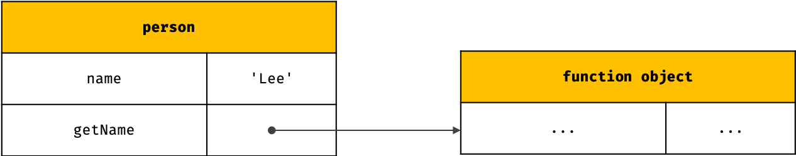
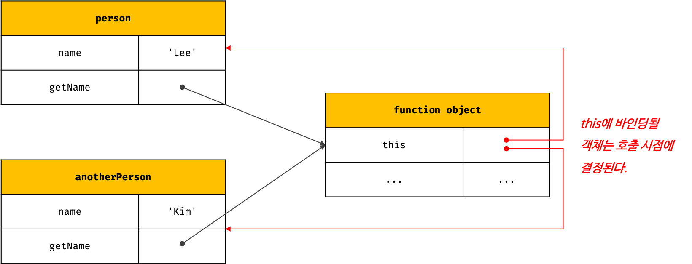

# `this`

## 1. `this` 키워드

객체는 프로퍼티로 표현되는 상태 데이터와 메소드로 표현되는 동작을 하나의 논리적인 단위로 묶은 복합적인 자료구조이다.

메소드는 자신이 속한 객체의 프로퍼티를 **참조하고 상태를 변경할 수 있어야한다.** 이때 메소드가 자신이 속한 객체의 프로퍼티를 참조하려면 먼저 **자신이 속한 객체를 가리키는 식별자를 참조할 수 있어야 한다.** 

**`this`는 객체 자신의 프로퍼티나 메소드를 참조하기 위한 자기 참조 변수(self-referencing variable)이다.** 함수를 호출하면 `arguments` 객체와 `this`가 암묵적으로 함수 내부에 전달된다. 함수 내부에서 `arguments` 객체를 지역 변수처럼 사용할 수 있는 것 처럼 `this`도 지역 변수처럼 사용할 수 있다. **단, 자바스크립트에서 `this`가 가리키는 값은 함수 호출 방식에 의해 동적으로 결정된다.**

> **바인딩(binding)**
>
> 식별자와 값을 연결하는 과정을 의미한다.


**전역에서 `this`를 참조할 경우 / 일반 함수로서 호출**

```javascript
console.log(this); // window (global variable)

function foo() {
  console.log(this); // window (global variable)
}

foo();
```


**객체 리터럴로 객체를 생성할 경우**

```javascript
const circle = {
  radius: 5,
  getDiameter() {
    // this는 메소드를 호출한 객체를 가리킨다.
    console.log(this); // { radius: 5, getDiameter: f }
    return 2 * this.radius;
  }
};

console.log(circle.getDiameter()); // 10
```


**생성자 함수로 인스턴스를 생성하는 경우**

```javascript
function Circle(radius) {
  // this는 생성자 함수가 미래에 생성할 인스턴스를 가리킨다.
  console.log(this); // Circle { radius: 5 }
  this.radius = radius;
}

Circle.prototype.getDiameter = function () {
  // this는 생성자 함수가 생성할 인스턴스를 가리킨다.
  return 2 * this.radius;
}

// 인스턴스 생성
const circle = new Cirlce(5);
```


## 2. 함수 호출 방식과 `this` 바인딩

**`this`가 가리키는 값, 즉 `this` 바인딩은 함수가 어떻게 호출되었는지에 따라 동적으로 결정된다.**


> **렉시컬 스코프와 this 바인딩은 결정 시기가 다르다.**
>
> 함수의 상위 스코프를 결정하는 방식인 렉시컬 스코프는 함수 정의가 평가되어 함수 객체가 생성되는 시점에 상위 스코프를 결정한다. 반면 `this`에 바인딩될 객체는 **함수 호출 시점에 결정된다.**


| 함수 호출 방식                                      | this가 가리키는 값                        |
| --------------------------------------------------- | ----------------------------------------- |
| 일반 함수로서 호출                                  | 전역 객체 (window, global)                |
| 메소드로서 호출                                     | 메소드를 호출한 객체 (**person**.sayHi()) |
| 생성자 함수로서 호출                                | 생성자 함수가 생성할 인스턴스             |
| Function.prototype.apply/call/bind에 의한 간접 호출 | 인수로 넘기는 객체                        |

```javascript
// this에 바인딩될 객체는 함수 호출 방식에 따라 동적으로 결정된다.
const foo = function () {
  console.dir(this);
};

// 1. 일반 함수 호출
foo(); // window

// 2. 메소드 호출
// foo 함수를 프로퍼티의 값으로 할당하여 호출
const obj = { foo };
obj.foo(); // obj

// 3. 생성자 함수 호출
// foo 함수를 new 연산자와 함께 생성자 함수로 호출
// this는 생성자 함수가 생성할 인스턴스를 가리킨다.
new foo(); // foo {}

// 4. Function.prototype.apply / call / bind 메소드에 의한 간접 호출
// this는 인수에 의해 결정된다.
const bar = { name: 'bar' };

foo.call(bar); // bar
foo.apply(bar); // bar
foo.bind(bar)(); // bar
```


### 2.1 일반 함수 호출

```javascript
function foo() {
  console.log(this); // window
  
  function bar() {
    console.log(this); // window
  }
  bar();
}

foo();
// window
// window
```

**어떠한 함수라도 일반 함수로 호출되면 `this`에는 전역 객체(Global object)가 바인딩된다.** 다만, `this`는 객체의 프로퍼티나 메소드를 참조하기 위한 자기 참조 변수이므로 **객체를 생성하지 않는 일반 함수에서 `this`는 의미가 없다.** 따라서 strict mode(엄격모드)가 적용된 일반 함수 내부의 `this`에는 `undefined`가 바인딩된다.

```javascript
function foo() {
  'use strict';
  
  console.log("foo's this: ", this); // undefined
  function bar() {
    console.log("bar's this: ", this); // undefined
  }
  bar();
}
foo();
// undefined
// undefined
```


메소드 내에서 정의한 **중첩 함수도 일반 함수로 호출되면 중첩 함수 내부의 `this`에는 전역 객체가 바인딩된다.**

```javascript
const obj = {
  value: 100,
  // 메소드
  foo() {
    console.log("foo's this: ", this); // { value: 100, foo: f }
    // 메소드 내에서 정의한 중첩 함수
    function bar() {
      console.log("bar's this: ", this); // window
    }
    bar(); // window
  }
}
obj.foo();
// { value: 100, foo: f }
// window
```

콜백 함수 내부의 `this`에도 전역 객체가 바인딩된다.

```javascript
const obj = {
  value: 100,
  foo() {
    console.log(this); // obj
    
    // 콜백 함수 내부의 this에는 전역 객체가 바인딩된다.
    setTimeout(function () {
      console.log(this); // window
    }, 100);
  }
};

obj.foo();
```

**메소드 내에서 정의한 중첩 함수 또는 메소드에게 전달한 콜백 함수의 `this`가 전역 객체를 바인딩하는 것은 문제가 있다.** 중첩 함수 또는 콜백 함수는 외부 함수를 돕는 헬퍼 함수로서 외부 함수의 일부 로직을 대신하는 경우가 대부분이다. 하지만 외부 함수인 메소드와 중첩 함수의 `this`가 일치하지 않는다는 것은 문맥상 맞지 않는다.


아래의 코드로 메소드와 콜백 함수의 `this`를 맞춰준다.

```javascript
var value = 1;

const obj = {
  value: 100,
  foo() {
    setTimeout(function () {
      console.log(this.value); // 100
    }.bind(this), 100);
  // 메소드 foo가 정의될 때 기억하는 this(foo를 호출한 객체)를 콜백 함수에 바인딩한다.
  }
};

obj.foo();
```


### 2.2 메소드 호출

메소드 내부의 `this`는 메소드를 호출한 객체, 즉 **메소드 이름 앞의 마침표(.) 연산자 앞에 기술한 객체에 바인딩된다.**

```javascript
const person = {
  name: 'Lee',
  getName() {
    // 메소드의 this는 메소드를 호출한 객체에 바인딩된다.
    return this.name;
  }
}

// 메소드 getName을 호출한 객체는 person이다.
console.log(person.getName());
```


**주의할 것은 메소드 내부의 `this`는 메소드를 소유한 객체가 아닌 메소드를 호출한 객체에 바인딩된다는 것이다.** 위 예제의 `getName` 메소드는 `person` 객체의 메소드로 정의되었다. **메소드는 프로퍼티에 바인딩된 함수이다.** 즉, `person` 객체와 `getName` 프로퍼티가 가리키는 함수 객체는 **별도의 객체이다.**





따라서 `getName` 프로퍼티가 가리키는 함수 객체를, 다른 객체의 메소드로 할당하는 것도 가능하며, 일반 변수에 할당하여 일반 함수로 호출될 수도 있다.

```javascript
const anotherPerson = {
  name: 'Kim'
};
// 메소드 getName을 anotherPerson 객체의 메소드로 할당
anotherPerson.getName = person.getName;

// 메소드 getName을 호출한 객체는 anotherPerson이다.
console.log(anotherPerson.getName()); // Kim

// 메소드 getName을 변수에 할당
const getName = person.getName;

// 메소드 getName을 일반 함수로 호출
console.log(getName()); // ''
// getName()을 일반함수로 호출하면, getnName() 내부의 this는 전역 객체를 나타낸다.
// 따라서, 브라우저 환경에서는 this가 window를 가리키며, window에는
// 브라우저 창의 이름을 나타내는 name이라는 빌트인 프로퍼티가 존재한다.
// window.name의 값은 ''이다.
```



따라서 메소드 내부의 `this`는 메소드를 소유한 객체와는 관계가 없고, 메소드를 호출한 객체에 바인딩된다.


프로토타입 메소드 내부에서 사용된 `this`도 일반 메소드와 마찬가지로 해당 메소드를 **호출한 객체에 바인딩된다.**

```javascript
function Person(name) {
  this.name = name;
}

Person.prototype.getName = function () {
  return this.name;
};

const me = new Person('Lee');
// getName 메소드를 호출한 객체는 me이다.
console.log(me.getName()); // Lee

Person.prototype.name = 'Kim';
// getName 메소드를 호출한 객체는 Person.prototype이다
console.log(Person.prototype.getName()); // Kim
```


### 2.3 생성자 함수 호출

생성자 함수 내부의 `this`에는 생성자 함수가 (미래에) 생성할 인스턴스가 바인딩된다.

```javascript
// 생성자 함수
function Circle(radius) {
  this.radius = radius;
  this.getDiameter = function () {
    return 2 * this.radius;
  };
}

// 인스턴스의 생성
const circle1 = new Circle(5);
const circle2 = new Circle(10);

console.log(circle1.getDiameter()); // 10
console.log(circle2.getDiameter()); // 20
```


### 2.4 `Function.prototype.apply / call / bind` 메소드에 의한 간접 호출

```javascript
Function.prototype.apply(this, 함수에게 전달할 인수 리스트의 배열 혹은 유사 배열 객체)
Function.prototype.call(this, 함수에게 전달할 인수 리스트 - separated by comma)
Function.prototype.bind(this)
```

세 가지 모두 `Function.prototype`의 메소드이다. 즉, `apply`, `call`, `bind` 메소드는 Function 생성자 함수를 `constructor` 프로퍼티로 가리키는 **모든 함수가 상속받아 사용할 수 있다.**


```javascript
function printList() {
  let result = '';
  console.log(arguments);
  for (let i = 0; i < arguments.length; i++) {
    result += `${arguments[i]} `;
  }
  console.log(this);
  console.log(result);
}

printList();
// case 1 - 일반 함수로서 호출
// {}
// window
// ''
// 인수를 전달하지 않았으므로 arguments의 길이가 0으로 잡힘.

// case 2 - apply로 호출
// this로 사용할 객체
const this1 = {name: 'apply'};
printList.apply(this1, [2, 3, 4]);
// { '0': 2, '1': 3, '2': 4 }
// { name: 'apply' };
// 2 3 4

// case 3 - call로 호출
// this 로 사용할 객체
const this2 = {name: 'call'};
printList.call(this2, 3, 4, 5);
// {'0': 3, '1': 4, '2': 5}
// {name: 'call'};
// 3 4 5

```

**`apply`와 `call` 메소드의 본질적인 기능은 함수를 호출하는 것이다.** `apply`와 `call` 메소드는 호출할 함수에 인수를 전달하는 방식만 다를 뿐 동일하게 동작한다. 

`apply`와 `call` 메소드의 대표적인 용도는 `arguments` 객체와 같은 유사 배열 객체에 **배열 메소드를 사용하는 경우이다.** `arguments` 객체는 배열이 아니기 때문에 `Arrays.prototype.slice`와 같은 배열의 메소드를 사용할 수 없으나 `apply`와 `call` 메소드를 이용하면 가능하다.

```javascript
function convertArgstoArray() {
  console.log(arguments); // Array로 바꾸기 전
  // arguments 객체를 배열로 변환
  // slice: 배열의 특정 부분에 대한 복사본을 생성
  // apply는 Function.prototype의 메소드이고 함수 객체만 사용할 수 있다.
  // 즉, Array.prototype.slice까지를 함수로 취급한다
  const arr = Array.prototype.slice.apply(arguments);
  // const arr = Array.prototype.slice.apply(arguments);
  console.lg(arr);
  return arr;
}

convertArgstoArray(1, 2, 3); // [1, 2, 3]
```


`Function.prototype.bind` 메소드는 `apply`와 `call` 메소드와 달리 함수를 **호출하지 않고 `this`로 사용할 객체만을 전달한다.** 

```javascript
function getThisBinding() {
  return this;
}

// this로 사용할 객체
const thisArg = { a: 1 };

// bind 메소드는 함수에 this로 사용할 객체를 전달할 뿐, 호출하지 않는다.
console.log(getThisBinding.bind(thisArg)); // getThisBinding

// bind 메소드로 호출하려면 명시적으로 호출해야 한다.
console.log(getThisBinding.bind(thisArg)()); // { a: 1 }
```


중첩 함수 또는 콜백 함수의 `this`가 외부 함수의 `this`와 불일치하는 문제를 해결하기 위해 유용하게 사용된다.

```javascript
function Person(name) {
  this.name = name;
}

Person.prototype.doSomething = function (callback) {
  callback.bind(this)();
};

// callback 함수
function foo() {
  console.log(this.name);
}

const person = new Person('Lee');

// callback 함수로 foo를 전달
person.doSomething(foo); // Lee
```

