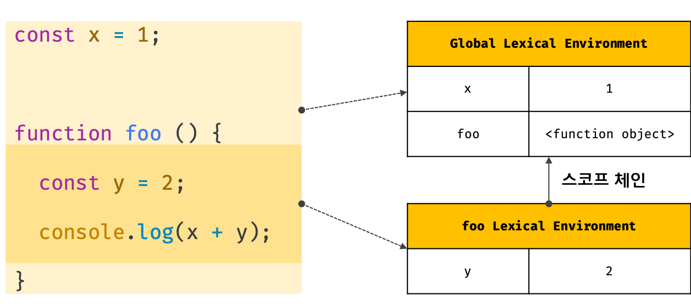
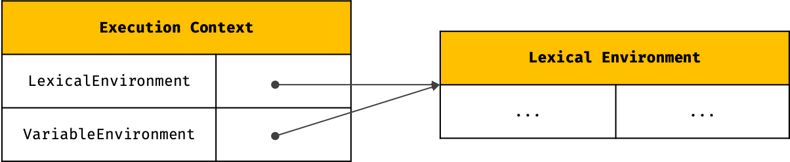

# 실행 컨텍스트 (Execution Context)

식별자, 스코프, 호이스팅, 클로저 등의 동작 원리를 담고 있는 자바스크립트의 핵심 개념이다. 실행 컨텍스트를 바르게 이해하면 자바스크립트가 스코프를 기반으로 식별자와 식별자에 바인딩된 값을 관리하는 방식과 호이스팅이 발생하는 이유, 그리고 클로저의 동작 방식에 대해 이해할 수 있다.


## 1. 실행 가능한 코드

ECMAScript 사양은 실행 가능한 코드(Executable Code)를 4가지로 구분한다.

| 실행 가능한 코드          | 설명                                                         |
| ------------------------- | ------------------------------------------------------------ |
| 전역 코드(Global Code)    | 전역에 존재하는 텍스트 코드를 말한다. 전역에 정의된 함수, 클래스 등의 **내부 코드는 포함되지 않는다.** |
| 함수 코드 (Function Code) | **함수 내부**에 존재하는 텍스트 코드를 말한다. 함수 내부에 중첩된 함수, 클래스 등의 **내부 코드는 포함되지 않는다.** |
| eval 코드 (Eval Code)     | 빌트인 전역 함수인 eval 함수에 인수로 전달된 텍스트 코드를 말한다. |
| 모듈 코드 (Module Code)   | 모듈 내부에 존재하는 텍스트 코드를 말한다. 모듈 내부의 함수, 클래스 등의 내부 코드는 포함되지 않는다. |

**각 유형마다 실행 컨텍스트를 생성하는 과정과 관리 내용이 다르다.**

1. **전역 코드**: 전역 코드는 **전역 스코프**를 생성해야 하며 **전역 객체**와 연결되어야 한다. 이를 위해 전역 코드가 평가되면 전역 실행 컨텍스트가 생성된다.
2. **함수 코드**: 함수 코드는 **지역 스코프**를 생성해야 하며 생성된 지역 스코프는 스코프 체인의 최상위인 **전역 스코프에서 시작하는 스코프 체인의 일원으로 연결되어야 한다.**
3. eval 코드: eval 코드는 엄격모드(strict mode)에서 자신만의 독자적인 스코프를 생성한다. 이를 위해 eval 코드가 평가되면 eval 실행 컨텍스트가 생성된다.
4. 모듈 코드: 모듈 코드는 모듈 별로 독립적인 스코프를 생성한다. 이를 위해 모듈 코드가 평가되면 모듈 실행 컨텍스트가 생성된다.


## 2. 실행 가능한 코드의 평가와 실행

모든 실행 가능한 코드는 런타임 이전에 평가 과정(구문 분석)을 거치며 코드 실행을 위한 준비를 한다.

1. 평가 과정에서 실행 컨텍스트 생성
2. 변수, 함수, 클래스 등 선언문 평가
3. 평가 결과를 실행 컨텍스트에 등록

평가 과정이 끝나면 선언문을 제외한 코드가 순차적으로 실행된다(런타임). 이때 코드 실행에 필요한 정보를 실행 컨텍스트에서 취든한다. 그리고 코드의 실행 결과는 실행 컨텍스트에서 관리된다.


## 3. 실행 컨텍스트의 역할

아래의 코드를 네 단계로 구분하여 실행 컨텍스트가 어떻게 동작하는지 알아보자.

```javascript
// 전역 변수 선언
const x = 1;
const y = 2;

// 함수 정의
function foo(a) {
  const x = 10;
  const y = 20;
    
  // 메소드 호출
  console.log(a + x + y); // 130
}

// 함수 호출
foo(100);

// 메소드 호출
console.log(x + y); // 3
```

#### 1. 전역 코드 평가

1. 전역의 변수 선언문과 함수 선언문이 평가된다.
2. 전역 변수와 전역 함수를 전역 스코프에 등록한다.
   * `var` 키워드로 선언된 전역 변수와 함수 선언문으로 정의된 전역 함수는 전역 객체의 프로퍼티가 된다.

#### 2. 전역 코드 실행

1. 전역 변수에 값이 할당된다.
2. `foo` 함수가 호출된다.
   * 함수가 호출되면 순차적으로 실행되던 전역 코드의 실행이 중지되고 코드 실행 순서를 변경하여 함수 내부로 진입한다.

#### 3. 함수 코드 평가

1. 매개 변수와 지역 변수 선언문을 평가한다.
2. 매개 변수와 지역 변수, `arguments`  객체를 지역 스코프에 등록한다.

#### 4. 함수 코드 실행

1. 매개 변수와 지역 변수에 값을 할당한다.
2. `console.log` 메소드를 호출한다.
   1. `console.log` 메소드를 호출하기 위해 식별자 `console`을 스코프 체인을 통해 검색한다.
   2. 식별자 `console`은 전역 객체에 프로퍼티이기 때문에 **전역 스코프에서 검색할 수 있도록 해야한다.**
   3. `log` 프로퍼티를 `console` 객체의 프로토타입 체인을 통해 검색한다.
   4. `console.log` 메소드의 인수로 전달된 표현식 `a + x + y`를 평가한다.
   5. 각 식별자 `a`, `x`, `y`를 스코프 체인을 통해 검색한다.
3. `foo` 함수 코드의 실행이 종료되고 `foo` 함수 호출 이전으로 되돌아가 전역 코드 실행을 계속한다.


**실행 컨텍스트(Execution Context)는 실행 가능한 코드를 평가하고 실행하기 위해 필요한 환경을 제공하고 코드의 실행 결과를 실제로 관리하는 영역이다.**

실행 컨텍스트는 식별자(변수, 함수, 클래스 등의 이름)를 등록하고 관리하는 스코프와 실행 순서 관리를 구현한 내부 매커니즘으로 **모든 코드는 실행 컨텍스트를 통해 실행되고 관리된다.**

* 선언에 의해 생성된 모든 식별자(변수, 함수, 클래스 등)를 스코프를 구분하여 등록하고 상태 변화(식별자에 바인딩된 값의 변화)를 지속적으로 관리할 수 있어야 한다.
* 스코프는 중첩 관계에 의해 스코프 체인을 형성해야 한다. 즉, 스코프 체인을 통해 상위 스코프로 이동하며 실별자를 검색할 수 있어야 한다.
* 현재 실행 중인 코드의 실행 순서를 변경(ex. 함수 호출)할 수 있어야 하며 다시 되돌아갈 수도 있어야 한다.


## 4. 실행 컨텍스트 스택

자바스크립트 엔진은 먼저 전역 코드를 평가하여 전역 실행 컨텍스트를 생성한다. 그리고 함수가 호출되면 함수 코드를 평가하여 함수 실행 컨텍스트를 생성한다. 이때 생성된 실행 컨텍스트는 스택 자료 구조로 관리된다. 이를 **실행 컨텍스트 스택(Execution context stack)**이라고 부른다.

> 실행 컨텍스트 스택을 콜 스택(Call Stack)이라고 부르기도 한다.


아래 예제를 통해 실행 컨텍스트 스택이 어떻게 실행 컨텍스트를 관리하는지 살펴보자.

```javascript
const x = 1;

function foo () {
  const y = 2;
  
  function bar () {
    const z = 3;
    console.log(x + y + z);
  }
  bar();
}

foo(); // 6
```

1. 전역 코드 평가 및 **전역 실행 컨텍스트** 생성, 콜 스택에 push
   * `x`, `foo`를 전역 실행 컨텍스트에 등록
2. 전역 코드 실행
   * `x`에 1 할당
   * `foo` 함수 호출
3. `foo` 함수 평가 및 **`foo` 함수 실행 컨텍스트** 생성, 콜 스택에 push
   * `y`, `bar`를 `foo` 함수 실행 컨텍스트에 등록
4. `foo` 함수 내부 코드 실행
   * `y`에 2 할당
   * `bar` 호출
5. `bar` 함수 평가 및 **`bar` 함수 실행 컨텍스트** 생성, 콜 스택에 push
   * `z`를  `bar` 함수 실행 컨텍스트에 등록
6. `bar` 함수 내부 코드 실행
   * `z`에 3 할당
   * `console.log` 메소드를 호출하기 위해 식별자 `console`을 스코프 체인을 통해 검색한다.
   * 식별자 `console`은 전역 객체에 프로퍼티이기 때문에 **전역 스코프에서 검색할 수 있도록 해야한다.**
   * `log` 프로퍼티를 `console` 객체의 프로토타입 체인을 통해 검색한다.
   * `console.log` 메소드의 인수로 전달된 표현식 `x + y + z`를 평가한다.
   * 각 식별자 `x`, `y`, `z`를 스코프 체인을 통해 검색한다.
7. `bar` 함수 호출이 종료되고, `foo` 함수 호출 단계로 복귀, 콜 스택에서 pop
8. `foo` 함수 호출이 종료되고 전역으로 복귀, 콜 스택에서 pop
9. 전역 코드 실행 종료, 콜 스택에서 pop


이처럼 **실행 컨텍스트 스택은 코드의 실행 순서를 관리한다.** 실행 가능한 코드가 평가되면 실행 컨텍스트가 생성되고, 실행 컨텍스트 스택의 **최상위에 쌓인다.** 실행 컨텍스트 스택의 **최상위에 존재하는 실행 컨텍스트는 언제나 현재 실행 중인 코드의 실행 컨텍스트이다.** 이 실행 컨텍스트를 **실행 중인 실행 컨텍스트(running execution context)**라 부른다. 


## 5. 동기식 처리 모델과 비동기식 처리 모델

자바스크립트 엔진은 단 하나의 실행 컨텍스트 스택을 갖는다. 따라서 자바스크립트 애플리케이션은 여러 개의 실행 컨텍스트 스택에서 실행할 수 없으며, 이는 동시에 두 가지 이상의 태스크를 실행할 수 없다는 것을 의미한다. Running execution context만이 실행 중이며 나머지 실행 컨텍스트는 모두 대기 중인 실행 컨텍스트이기 때문이다. 이는 자바스크립트가 **싱글 스레드(single thread)**로 동작한다는 것을 의미한다.

이처럼 하나의 처리가 종료되어 다음 처리를 실행할 수 있는 것을 **동기식 처리 모델(Synchronous processing model)**이라고 한다. 동기식 처리 모델은 **직렬적**으로 태스크를 수행한다. 예를 들어, 서버에서 데이터를 가져와서 화면에 표시하는 작업을 수행할 때, 서버에 데이터를 요청하고 데이터가 응답될 때까지 이후 태스크들은 **블로킹(blocking, 작업 중단)**된다.


다행히도 자바스크립트는 비동기식 처리 모델을 **지원**한다. 비동기식 처리 모델(Asynchronous processing model)은 **병렬적**으로 태스크를 수행한다. 따라서 태스크가 종료되지 않은 상태여도 다음 태스크를 실행한다. 예를 들어, 서버에서 데이터를 가져와서 화면에 표시하는 태스크를 수행할 때, 서버에 데이터를 요청한 이후 서버로부터 데이터가 응답될 때까지 대기하지 않고(Non-blocking) 즉시 다음 태스크를 수행한다. 이후 서버로부터 데이터가 응답되면 **이벤트**가 발생하고 이벤트 핸들러가 응답된 데이터를 가지고 수행할 태스크를 계속해 수행한다.


## 6. 렉시컬 환경

**렉시컬 환경(Lexical Environment)**

* 식별자가 선언되는 환경
* 렉시컬 스코프

| 실행 컨텍스트 스택      | 렉시컬 환경            |
| ----------------------- | ---------------------- |
| 코드의 실행 순서를 관리 | 스코프와 식별자를 관리 |

**렉시컬 환경은 스코프를 구분하여 식별자를 등록하고 관리하는 저장소 역할을 한다.**

* 객체 형태의 스코프(전역, 함수, 블록 스코프)를 생성
* 식별자를 해당하는 스코프에 등록
* 등록된 식별자에 바인딩된 값을 관리




**실행 컨텍스트**는

* Lexical Environment
* Variable Envrionment

두 가지 컴포넌트로 구성된다. 생성 초기에 각 컴포넌트는 하나의 동일한 렉시컬 환경(상위 스코프의 참조)을 참조한다.




**렉시컬 환경**은

* Environment Record
  * Object Envrionment Record (객체 환경 레코드)
  * Declarative Envrionment Record (선언적 환경 레코드)
* Outer Lexical Environment Ref.
* ThisBinding

세 가지 컴포넌트로 구성된다.


## 7. 실행 컨텍스트의 생성과 식별자 검색 과정

아래 예제를 통해 어떻게 실행 컨텍스트가 생성되고 코드 실행 결과가 관리되는지, 그리고 어떻게 실행 컨텍스트를 통해 식별자를 검색하는지 살펴보자.

```javascript
var x = 1;
const y = 2;

function foo (a) {
  var x = 3;
  const y = 4;
    
  function bar (b) {
    const z = 5;
    console.log(a + b + x + y + z);
  }
  bar(10);
}
foo(20); // 42
```


### 7.1 전역 객체 생성

전역 객체는 전역 코드가 평가되기 이전에 생성된다. 이때 전역 객체에는 전역 프로퍼티와 전역 함수, 표준 빌트인 객체가 추가되며 동작 환경(Client or Server)에 따라 클라이언트 사이드 Web API 또는 특정 환경을 위한 호스트 객체를 포함한다.

전역 객체도 `Object.prototype`을 상속 받는다. 즉, 전역 객체도 프로토타입 체인의 일원이다.

```javascript
window.__proto__.__proto__.__proto__.__proto__ === Object.prototype; // true
```


### 7.2 전역 코드 평가

```javascript
1. 전역 실행 컨텍스트 생성
2. 전역 렉시컬 환경 생성
   1. 전역 환경 레코드 생성
      1. 객체 환경 레코드 생성
      2. 선언적 환경 레코드 생성
   2. 외부 렉시컬 환경에 대한 참조 할당
   3. this 바인딩
```


#### 1. 전역 실행 컨텍스트 생성

1. 전역 실행 컨텍스트 생성
2. 실행 컨텍스트 스택에 push


#### 2. 전역 렉시컬 환경 생성

1. 전역 렉시컬 환경(Global Lexical Environment) 생성
2. 전역 실행 컨텍스트의 컴포넌트에 전역 렉시컬 환경을 바인딩


##### 2.1 전역 환경 레코드 생성

* 객체 환경 레코드 (Object Envrionment Record)
* 선언적 환경 레코드 (Declarative Environment Record)


##### 2.1.1. 객체 환경 레코드 생성 (Object Envrionment Record)


아래 두 가지를 등록하고 관리한다.

* `var` 키워드로 선언된 전역 변수
* 함수 선언문으로 정의된 전역 함수


전역 환경 레코드의 객체 환경 레코드(OER)는 `bindingObject` 프로퍼티에 전역 객체의 참조 값을 가지고 있다.

전역 환경 레코드의 객체 환경 레코드에 등록한 식별자는 `bindingObject`가 가리키는 전역 객체의 프로퍼티가 된다.

전역 환경 레코드의 객체 환경 레코드에서 식별자를 검색하면 `bindingObject`의 프로퍼티, 즉 전역 객체의 프로퍼티를 검색하여 반환한다.

이것이 `var` 키워드로 선언된 전역 변수와 함수 선언문으로 정의된 전역 함수가 전역 객체의 프로퍼티와 메소드가 되고 전역 객체의 식별자(window) 없이 전역 객체의 프로퍼티를 참조할 수 있는 메커니즘이다.

위 예제의 전역 변수 `x`와 전역 함수 `foo`는 객체 환경 레코드에 등록되고 객체 환경 레코드의 bindingObject에 바인딩되어 있는 전역 객체의 프로퍼티와 메소드가 된다.

```javascript
var x = 1;
const y = 2;

function foo (a) {
...
```


(전역 변수 호이스팅과 다르게 전역 함수 호이스팅은 평가 단계에서 즉시 할당되기 때문에 선언문 이전에 호출할 수 있다.)


##### 2.1.2 선언적 환경 레코드 (Declarative Environment Record)

아래 두 가지를 등록하고 관리한다.

* `let` 키워드로 선언된 전역 변수
* `const` 키워드로 선언된 전역 변수


변수 `y`는 `const` 키워드로 선언한 변수이다. 따라서 **선언 단계**와 **초기화 단계**가 분리되어 진행한다 (변수 호이스팅이 **안되는 것 처럼 동작한다)**. 즉, 변수 할당문이 실행되기 이전까지 값을 참조할 수 없으며, 일시적 사각지대(Temporal Dead Zone; TDZ)에 빠지게  된다.

> 위 그림의 `<uninitialized>`는 초기화가 실행되지 않아 접근할 수 없을을 나타내기 위해 사용한 표현이다. 실제로 `<uninitialized>`라는 값이 바인딩된 것이 아니다.


`let`, `const` 키워드로 선언한 전역 변수는 전역 객체의 프로퍼티가 되지 않고 전역 렉시컬 환경의 선언적 환경 레코드(Declarative Envir. Record)에 별도 관리된다.


##### 2.2 외부 렉시컬 환경에 대한 참조 할당

외부 렉시컬 환경(Outer Lexical Environment Reference)에는 **현재 평가 중인 코드를 포함하는 외부 코드(상위 스코프)의 렉시컬 환경을 가리킨다.** 이를 통해 스코프 체인을 구현한다.

현재 평가 중인 코드는 전역 코드이다. 전역 코드를 포함하는 코드는 없으므로 전역 렉시컬 환경의 상위 스코프에 대한 참조에는 `null`을 할당한다.


##### 2.3 외부 렉시컬 환경에 대한 참조 할당

전역 렉시컬 환경의 ThisBinding에는 전역 스코프가 가리키는 `this`, 즉 전역 객체가 바인딩된다.


### 7.3 전역 코드 실행

```javascript
var x = 1;
const y = 2;

function foo (a) {
  var x = 3;
  const y = 4;
    
  function bar (b) {
    const z = 5;
    console.log(a + b + x + y + z);
  }
  bar(10);
}
foo(20); // 42
```

전역 코드 평가가 종료되어 전역 코드를 실행한다.

1. 전역 변수 `x`, `y`에 값이 할당된다.
2. `foo` 함수가 호출된다.

이 때 변수 할당문과 함수 호출이 실행되려면 **식별자를 검색해야 한다.** 식별자를 검색할 때는 **Running Execution Context의 렉시컬 환경에서 식별자를 검색한다.** 현재 Running Execution Context는 전역 실행 컨텍스트이므로 전역 렉시컬 환경에서 식별자 `x`, `y`, `foo`를 검색한다.

만약 Running Execution Context의 렉시컬 환경에서 식별자를 검색할 수 없으면 **외부 렉시컬 환경에 대한 참조가 가리키는 렉시컬 환경으로 이동하여 식별자를 검색한다.** 이것이 바로 스코프 체인의 동작 원리이다. 전역 렉시컬 환경까지 올라와서도 식별자를 찾을 수 없으면 참조 에러(ReferenceError)를 발생시킨다.

**변수 할당문**은 렉시컬 환경에 등록한 식별자를 검색하여 **바인딩 값을 변경**하는 것이다. **함수 호출**은 렉시컬 환경에 등록한 식별자를 검색하여 **바인딩된 함수 객체를 호출하는 것**이다.


### 7.4 foo 함수 코드 평가

현재 전역 코드 평가를 통해 전역 실행 컨텍스트가 생성되었고, 전역 코드를 실행하고 있다. 현재 진행 상황은 `foo` 함수를 호출하기 직전이다.

```javascript
var x = 1;
const y = 2;

function foo (a) {
  var x = 3;
  const y = 4;

  function bar (b) {
    const z = 5;
    console.log(a + b + x + y + z);
}
  bar(10);
}

foo(20); // 42
```

 `foo` 함수가 호출되면 전역 코드의 실행을 일시 중단하고 `foo` 함수 내부로 코드의 제어권이 이동한다. 그리고 함수 코드를 평가하기 시작한다. 함수 코드 평가는 아래 순서로 진행된다.

```javascript
1. 함수 실행 컨텍스트
2. 함수 렉시컬 환경 생성
   1. 함수 환경 레코드 생성
   2. 외부 렉시컬 환경에 대한 참조 할당
   3. this 바인딩
```


#### 1. 함수 실행 컨텍스트 생성

1. `foo` 함수 실행 컨텍스트 생성
2. 콜 스택에 push

#### 2. 함수 렉시컬 환경 생성

1. `foo` 함수 렉시컬 환경(Global Lexical Environment) 생성
2. `foo` 함수 실행 컨텍스트의 컴포넌트에 바인딩에 렉시컬 환경을 바인딩


#### 2.1 함수 환경 레코드 생성

함수 렉시컬 환경을 구성하는 컴포넌트 중 하나인 **함수 환경 레코드(Function Environment Record)**는 매개 변수, `arguments` 객체, 함수 내에서 선언한 변수와 중첩 함수 정의를 등록하고 관리한다.

(질문. 함수 환경 레코드는 `var` 키워드로 선언된 변수나 `let`, `const` 키워드로 선언된 변수 구분 없이 한꺼번에 관리 하는지?)


#### 2.2 외부 렉시컬 환경에 대한 참조 할당

외부 렉시컬 환경에 대한 참조에는 `foo` 함수 정의가 평가된 시점의 Running execution context의 렉시컬 환경(상위 스코프)의 참조가 저장된다.

`foo` 함수는 전역 코드에 정의된 전역 함수이다. 따라서 `foo` 함수 정의가 평가된 시점의 Running execution context는 전역 렉시컬 환경이므로, `foo` 렉시컬 환경의 외부 렉시컬 환경 컴포넌트에는 전역 렉시컬 환경의 참조가 저장된다.


> **함수 객체의 내부 슬롯 [[Environment]]**
>
> 자바스크립트의 모든 함수는 함수 정의가 평가되어 함수 객체를 생성할 때, **함수를 정의한 실행 컨텍스트의 렉시컬 환경을 함수 객체의 내부 슬롯 [[Environment]]에 저장한다.** 이 것은 클로저를 이해할 수 있는 중요한 단서이다.


#### 2.3 this 바인딩

`foo` 렉시컬 환경의 ThisBinding 컴포넌트에는 `foo` 함수가 가리키는 `this`에 바인딩 되어있는 객체 (위 예제에서는 `foo`가 전역에서 정의되었고, 일반 함수로 호출되었으므로 `this`는 전역객체를 가리킨다)의 참조를 저장한다.


(질문: `new` 연산자로 호출되었으면 ThisBinding에는 생성될 객체가 잡히는가?)

`foo` 함수 렉시컬 환경이 완성되었으므로, 전역 코드의 실행을 일시 중단하고 콜 스택에 함수 실행 컨텍스트를 push 한다. 이때 `foo` 함수 실행 컨텍스트는 Running execution context가 된다.


### 7.5 foo 함수 코드 실행

`foo` 함수 코드가 순차적으로 실행된다. 매개 변수에 인수가 할당되고, 변수 할당문이 실행되어 지역 변수 `x`, `y`에 값이 할당된다. 그리고 `bar` 함수가 호출된다.

1. 필요한 식별자를 running execution context의 렉시컬 환경에서 검색한다.
   * 만약 running execution context의 렉시컬 환경에서 식별자를 검색할 수 없으면 외부 렉시컬 환경에 대한 참조가 기리키는 렉시컬 환경(상위 스코프)으로 이동하여 식별자를 검색한다.
2. 검색된 식별자에 값을 바인딩한다.


### 7.6 bar 함수 코드 평가

`bar` 함수가 호출되면 함수 내부로 코드의 제어권이 이동한다. 그리고 함수 코드를 평가하기 시작한다. 실행 컨텍스트와 생성 과정은 `foo` 함수 코드 평가와 동일하다.


### 7.7 bar 함수 코드 실행

`bar` 함수 코드가 순차적으로 실행되기 시작한다. 매개 변수에 인수가 할당되고, 변수 할당문이 실행되어 지역 변수 `z`에 값이 할당된다.


그리고 `console.log(a + b + x + y + z);` 가 실행된다.

#### 1. 식별자 console 검색

Running execution context의 렉시컬 환경에서 시작하여 스코프 체인을 타고 올라가, 전역 렉시컬 환경의 객체 환경 레코드의 bindingObject, 전역 객체에서 `console` 식별자를 찾는다.

#### 2. log 메소드 검색

`console` 식별자에 바인딩된 객체 `console`에서 `log` 메소드를 검색한다. 이때 `console` 객체의 프로토타입 체인을 통해 메소드를 검색한다.

#### 3. 표현식 a + b + x + y + z의 평가

`console.log` 메소드에 전달할 표현식 `a + b + x + y + z`를 평가하기 위해 식별자 `a`, `b`, `x`, `y`, `z`를 검색한다. Running execution context의 렉시컬 환경에서 시작하여 외부 렉시컬 환경에 대한 참조로 이어지는 스코프 체인에서 검색한다.

`a` 는 `foo` 함수 렉시컬 환경에서,

`b` 는 `bar` 함수 렉시컬 환경에서,

`x`와 `y`는 `foo` 함수 렉시컬 환경에서,

`z`는 `bar` 함수 렉시컬 환경에서 검색된다.


#### 4. console.log 메소드 호출

표현식 `a + b + x + y + z`가 평가되어 생성한 값 42를 console.log 메소드에 전달하여 호출한다.


### 7.8 bar 함수 코드 실행 종료

`console.log` 메소드가 호출되고 종료하면 더 이상 실행할 코드가 없으므로 `bar` 함수 코드의 실행이 종료된다. 콜 스택에서 `bar` 함수 실행 컨텍스트가 pop된다.


> 실행 컨텍스트 스택(콜 스택)에서 `bar` 함수 실행 컨텍스트가 pop되었다고 해서 `bar` 함수 렉시컬 환경까지 즉시 소멸하는 것은 아니다. 렉시컬 환경은 실행 컨텍스트에 의해 참조되기는 하지만 **독립적인 객체이다.** 즉, `bar` 함수 렉시컬 환경을 누군가 참조하고 있다면 `bar` 함수 렉시컬 환경은 소멸하지 않는다.


### 7.9 foo 함수 코드 실행 종료

`bar` 함수가 종료되면 더 이상 실행할 코드가 없으므로 `foo` 함수 코드의 실행이 종료된다. 콜 스택에서 `foo` 함수 실행 컨텍스트가 pop된다.


### 7.10 전역 코드 실행 종료

`foo` 함수가 종료되면 더 이상 실행할 전역 코드가 없으므로 전역 코드의 실행이 종료되고 전역 실행 컨텍스트도 콜 스택에서 pop된다.


## 8. 실행 컨텍스트와 블록 레벨 스코프

`let` 키워드로 선언한 변수는 모든 코드 블록(함수, if.., for.., while.., try/catch 문 등)을 지역 스코프로 인정하는 블록 레벨 스코프를 따른다.

```javascript
let x = 1;

if (true) {
  let x = 10;
  console.log(x); // 10
}

console.log(x); // 1
```

`if` 문이 실행되면 `if` 문의 블록 레벨 스코프를 생성해야 한다. 이를 위해 `if` 문을 위한 **선언적 환경 레코드를 갖는 렉시컬 환경을 새롭게 생성하여 기존의 전역 렉시컬 환경을 교체한다.** 이때 새롭게 생성된 `if` 문을 위한 렉시컬 환경의 외부 렉시컬 환경(상위 스코프)에 대한 참조는 교체된 이전의 전역 렉시컬 환경을 가리킨다.

(질문. 블록 렉시컬 환경에서 `var` 키워드로 변수를 선언하면, 환경 레코드에 OER-객체환경 레코드가 생성되는지?)


if 문 실행이 종료되면 if 문이 실행되기 이전의 렉시컬 환경으로 되돌린다.


이는 if 문 뿐만이 아니라 모든 블록문에 적용된다.


실행 컨텍스트라는 자료구조가 렉시컬 환경으로 이루어져있다.