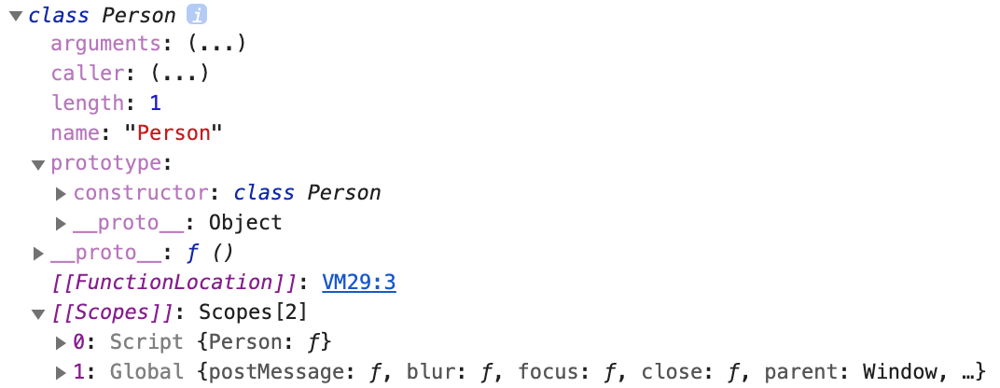
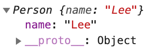
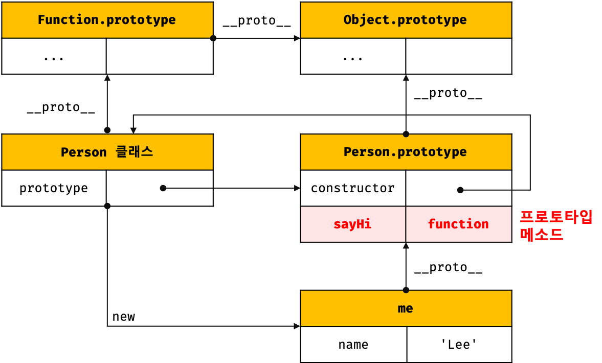
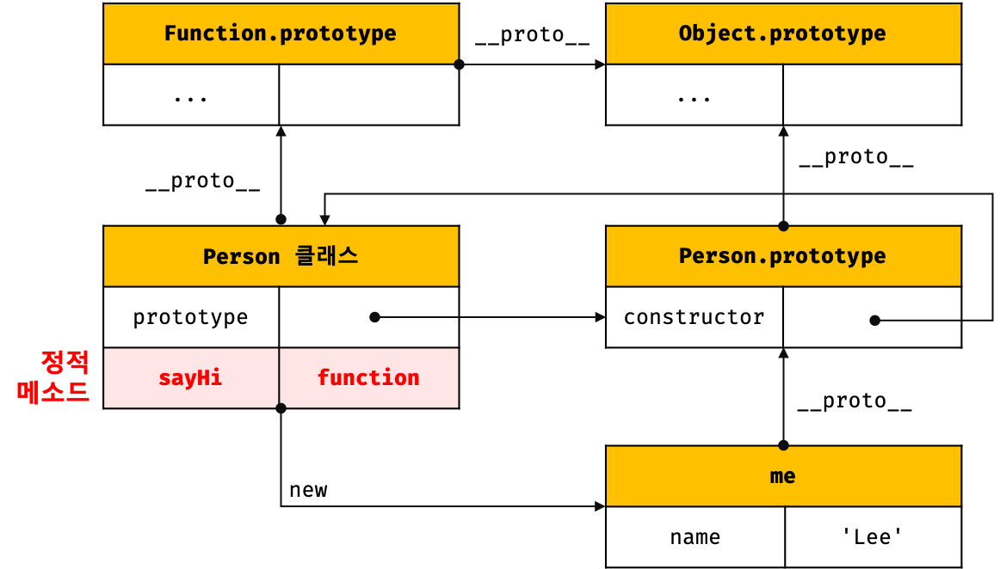
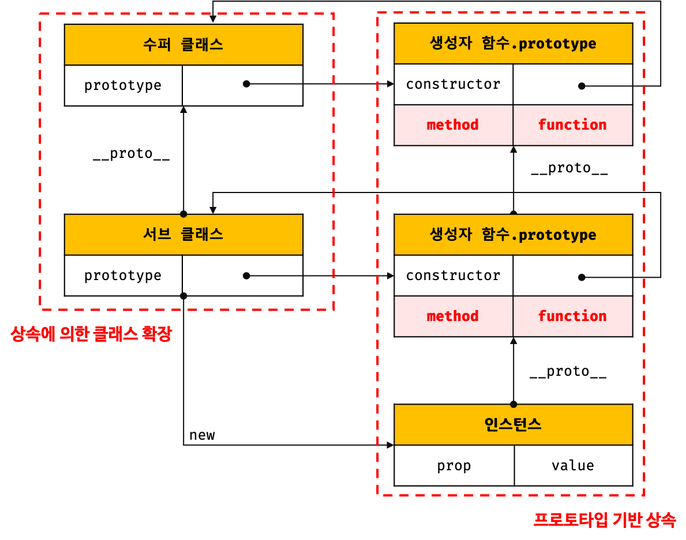
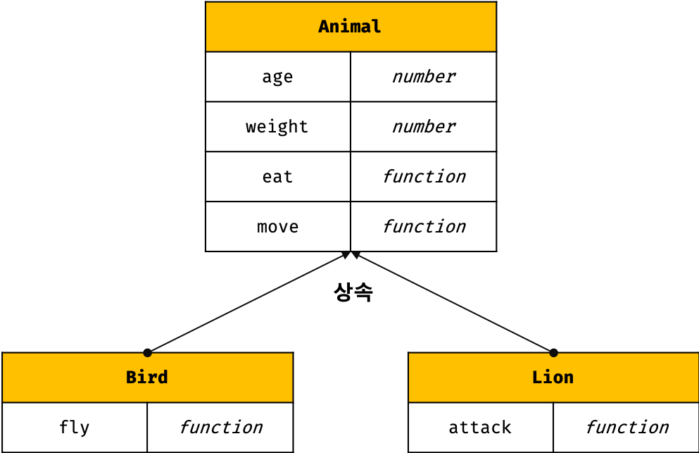
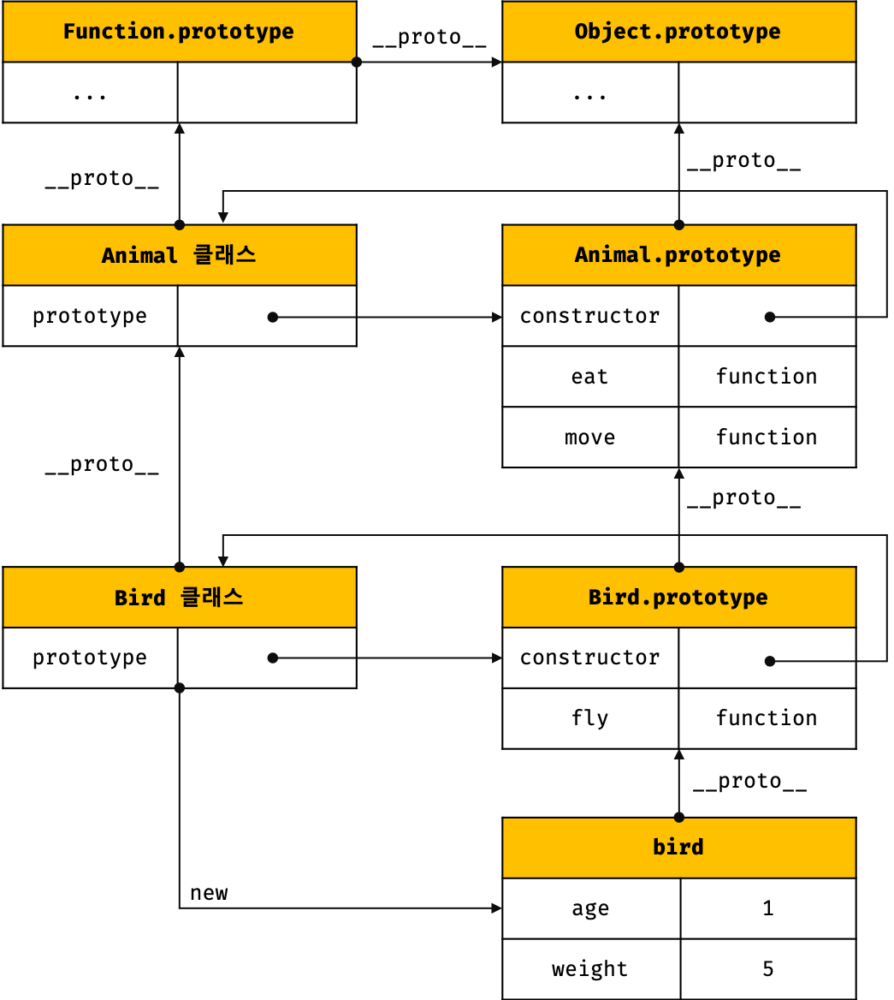
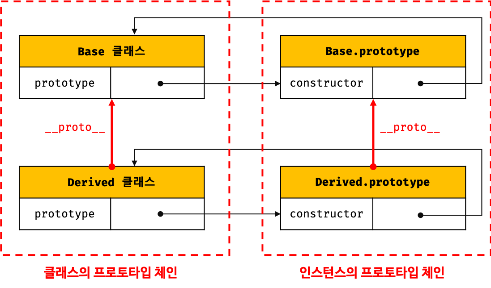

# 클래스 (Class)

## 1. 클래스는 프로토타입의 문법적 설탕인가?

자바스크립트는 프로토타입 기반 객체 지향 언어이며, 클래스가 필요 없는(class-free) 객체지향 프로그래밍 언어이다. ES5에서는 클래스 없이도 생성자 함수와 프로토타입 체인, 클로저를 사용하여 객체 지향 언어의 상속, 캡슐화 등의 개념을 구현할 수 있다.

```javascript
// ES5 생성자 함수
var Person = (function () {
  // 자유 변수이며 private하다
  var _name = '';
    
  // 생성자 함수 - 클로저
  function Person(name) {
    _name = name;
  }
  
  // 프로토타입 메소드 - 클로저
  Person.prototype.sayHi = function () {
    console.log('Hi! My name is ' + _name);
  };
    
  // 생성자 함수 반환
  return Person;
}());

// 인스턴스 생성
var me = new Person('Kim');

// _name은 지역 변수이므로 외부에서 접근하여 변경할 수 없다. 즉, private하다.
// me 객체에는 _name 프로퍼티가 존재하지 않기 때문에 me._name 프로퍼티를 동적 추가할 뿐이다.
me._name = 'Lee';
me.sayHi(); // Hi! My name is Lee
```


ES6에서 새롭게 도입된 클래스는 기존 프로토타입 기반 객체지향 프로그래밍보다 Java나 C#과 같은 클래스 기반 객체지향 프로그래밍에 익숙한 프로그래머가 보다 빠르게 학습할 수 있도록 클래스 기반 객체지향 프로그래밍 언어와 매우 흡사한 새로운 객체 생성 메커니즘을 제시하고 있다.

하지만, 자바스크립트의 클래스는 함수이며 기존 프로토타입 기반 패턴을 클래스 기반 패턴처럼 사용할 수 있도록 하는 **문법적 설탕(Syntatic sugar)**이라고 볼 수도 있다.

단, 클래스와 생성자 함수는 모두 프로토타입 기반의 인스턴스를 생성하지만 정확히 동일하게 동작하지는 않는다. 클래스는 생성자 함수보다 엄격하며 생성자 함수에서는 제공하지 않는 기능도 제공한다.

| 클래스                                                       | 생성자 함수                                                  |
| ------------------------------------------------------------ | ------------------------------------------------------------ |
| `new` 연산자 없이 호출하면 에러가 발생한다.                  | `new` 연산자 없이 호출하면 일반 함수로서 호출된다.           |
| 상속을 지원하는 `extends`와 `super` 키워드를 제공한다.       | `extends`와 `super` 키워드를 지원하지 않는다.                |
| 호이스팅이 발생하지 않는 것처럼 동작한다.                    | 함수 선언문으로 정의된 생성자 함수는 함수 호이스팅이 발생한다. |
| 암묵적으로 strict mode가 지정되어 실행되며 strict mode를 해지할 수 없다. | 암묵적으로 strict 모드가 지정되지 않는다.                    |
| `counstructor`, 프로토타입 메소드, 정적 메소드 모두 프로퍼티 어트리뷰트 [[Enumerable]]의 값이 false이다. 열거되지 않는다. | 사용자 정의에 따라 열거 가능하다.                            |

따라서 클래스를 프로토타입 기반 객체 생성 패턴의 단순한 문법적 설탕이라고 보기 보다는 **새로운 객체 생성 메커니즘**으로 보는 것이 보다 합당하다고 할 수 있다.


## 2. 클래스 정의

클래스는 `class` 키워드를 사용하여 정의한다. 클래스 이름은 생성자 함수와 마찬가지로 **파스칼 케이스**를 사용하는 것이 일반적이다. 파스칼 케이스를 사용하지 않아도 에러가 발생하지는 않는다.

```javascript
// 클래스 선언문
class Person {
  ...
}
```

일반적이지는 않지만, 함수와 마찬가지로 **표현식**으로 클래스를 정의할 수도 있다.

```javascript
// 익명 클래스 표현식
const Person = class {
  ...
};

// 기명 클래스 표현식
const Person = class MyClass {
  ...
};
```

클래스를 표현식으로 정의할 수 있다는 것은 클래스가 값으로 사용할 수 있는 **일급 객체**라는 것을 의미한다. 즉, 클래스는 일급 객체로서 아래와 같은 특징을 갖는다.

* 무명의 리터럴로 생성할 수 있다 (런타임에 생성이 가능하다).
* 변수나 자료 구조(객체, 배열 등)에 저장할 수 있다.
* 함수의 매개 변수에게 전달할 수 있다.
* 함수의 반환값으로 사용할 수 있다.

클래스는 함수이다. 함수는 객체이고 객체는 값이므로 클래스는 값처럼 사용할 수 있는 일급 객체이다.


클래스 몸체에는 0개 이상의 **메소드만을 선언할 수 있다.** 클래스 몸체에서 정의할 수 있는 메소드는 **constructor(생성자)**, **프로토타입 메소드**, **정적 메소드** 세 가지가 있다.

```javascript
class Person {
  // 생성자
  constructor(name) {
    // 인스턴스 생성 및 초기화
    this.name = name; // name 프로퍼티는 public하다.
  }
  
  // 프로토타입 메소드
  sayHi() {
    console.log(`Hi! My name is ${this.name}`);
  }
  
  // 정적 메소드
  static sayHello() {
    console.log('Hello!');
  }
}

// 인스턴스 생성
const me = new Person('Kim');

// 인스턴스의 프로퍼티 참조
console.log(me.name); // Kim
// 프로토타입 메소드 호출
me.sayHi(); // Hi My name is Kim
// 정적 메소드 호출
Person.sayHello(); // Hello!
```

클래스 정의와 생성자 함수에 의해 인스턴스 생성 방식을 비교해 보면 아래와 같다.


## 3. 클래스 호이스팅

클래스는 클래스 정의 이전에 참조할 수 없다.

```javascript
console.log(Person); // ReferenceError

// 클래스 선언문
class Person {}
```

클래스 선언문은 마치 호이스팅이 발생하지 않는 것처럼 보이나 그렇지 않다.

```javascript
const Person = '';

{
  // 호이스팅이 발행하지 않는다면 ''가 출력되어야 한다.
  console.log(Person);
  // ReferenceError
  
  // 클래스 선언문
  class Person {}
}
```

클래스 선언문도 변수 선언, 함수 정의와 마찬가지로 호이스팅이 발생한다. 단, 클래스는 `let`, `const` 키워드로 선언한 변수처럼 호이스팅된다. 따라서 클래스 선언문 이전에 클래스를 참조하면 일시적 사각지대(Temporal Dead Zone; TDZ)에 빠지기 때문에 호이스팅이 발생하지 않는 것처럼 동작한다.


## 4. 인스턴스 생성

클래스는 함수로 평가된다.

```javascript
class Person {}

console.log(typeof Person); // function
```

즉, 클래스는 **인스턴스를 생성하는 생성자 함수이며 `new` 연산자와 함께 호출되어 인스턴스를 생성한다.**

```javascript
class Person {}

// 인스턴스 생성
const me = new Person();

console.log(me); // Person {}
```


## 5. 메소드

클래스 몸체에는 0개 이상의 메소드 만을 선언할 수 있다. 클래스 몸체에서 정의할 수 있는 메소드는 constructor(생성자), 프로토타입 메소드, 정적 메소드 세 가지가 있다.

> **클래스 정의에 대한 새로운 제안 사양**
>
> 2019년 11월, 클래스 몸체에 메소드 뿐만이 아니라 프로퍼티를 직접 정의할 수 있는 새로운 표준 사양이 제안되어 있다. 제안된 새로운 표준 사양에 의해 머지않아 클래스 몸체에 프로퍼티도 정의할 수 있게 될 것으로 보인다 (현재 크롬과 같은 모던 브라우저는 사용 가능하다).


### 5.1 constructor

constructor는 **인스턴스를 생성하고 초기화**하기 위한 특수한 **메소드**이다. constructor는 이름을 변경할 수 없다.

```javascript
class Person {
  // 생성자
  constructor(name) {
    // 인스턴스 생성 및 초기화
    this.name = name;
  }
}
```

앞서 말했듯이 클래스는 인스턴스를 생상하기 위한 **생성자 함수이다.**

```javascript
// 클래스는 함수이다
console.log(typeof Person); // function
console.dir(Person);
```



이처럼 클래스는 평가되어 함수 객체가 된다. 따라서 함수 고유의 프로퍼티인 prototype과 prototype 프로퍼티가 가리키는 객체의 constructor 프로퍼티는 클래스 자신을 가리키고 있다. 이는 클래스가 인스턴스를 생성하는 생성자 함수라는 것을 의미한다. 즉 `new` 연산자와 함께 클래스를 호출하면 클래스는 인스턴스를 생성한다.

```javascript
// 인스턴스 생성
const me = new Person('Lee');
console.log(me);
```



class 내부의 constructor 메소드에서 `this`에 추가한 `name` 프로퍼티가 생성된 인스턴스의 프로퍼티로 추가된 것을 알 수 있다. 즉, 생성자 함수와 마찬가지로 constructor 내부에서 `this`에 추가한 프로퍼티는 인스턴스 프로퍼티가 된다. constructor 내부의 `this`는 생성자 함수와 마찬가지로 클래스가 생성한 인스턴스를 가리킨다.

```javascript
class Person {
  // 생성자
  constructor(name) {
    // 인스턴스 생성 및 초기화
    // 빈 객체 생성 {}
    // this에 빈 객체를 바인딩
    this.name = name;
    // 암묵적으로 this를 return
  }
}
```

클래스가 평가되어 생성된 함수 객체나 클래스가 생성한 인스턴스 어디에도 constructor 메소드가 보이지 않는다. 이는 클래스 몸체에 정의한 constructor가 단순한 메소드가 아니라는 것을 의미한다.

> **클래스의 constructor 메소드와 Person.prototype.constructor**
>
> 이름이 같아 혼동할 수 있으나 클래스 몸체에 정의한 constructor와 Person.prototype.constructor는 직접적인 관련이 없다. 프로토타입의 constructor 프로퍼티는 모든 프로토타입이 가지고 있는 프로퍼티이며 생성자 함수를 가리킨다.

constructor 메소드는 메소드로 해석되는 것이 아니라 **클래스가 평가되어 생성한 함수 객체 코드의 일부가 된다.** 클래스 정의가 평가되면 constructor 메소드에 기술된 동작을 하는 함수 객체가 생성된다.

* constructor는 클래스 내에 **한 개만 존재할 수 있다.**

```javascript
class Person {
  constructor() {}
  constructor() {}
}
// SyntaxError: A class may only have one constructor
```


* constructor는 생략할 수 있다.

```javascript
class Person {}

// class Person {
//  constructor를 생략하면 암묵적으로 디폴트 consturctor가 정의된다.
//  constructor() {}
// }

// 빈 객체가 생성된다.
const me = new Person();
console.log(me); // Person {}
```


* 생성할 인스턴스의 프로퍼티를 추가하려면 constructor 내부에서 `this`에 인스턴스 프로퍼티를 추가한다.

```javascript
class Person {
  constructor() {
    this.name = 'Kim';
    this.address = 'Seoul';
  }
}
// 인스턴스 프로퍼티가 추가된다.
const me = new Person();
console.log(me); // Person {name: 'Kim', address: 'Seoul'}
```


* 클래스 외부에서 인스턴스 프로퍼티의 초기값을 전달하려면 constructor 메소드에 매개변수를 선언하고 인스턴스를 생성할 때 초기값을 전달한다. 이때 초기값은 **constructor 메소드의 매개변수로 전달된다.**

```javascript
class Person {
  constructor(name, address) {
    // 인스턴스 초기화
    this.name = name;
    this.address = address;
  }
}
// 초기값을 전달한다. 초기값은 constructor에 전달된다.
const me = new Person('Kim', 'Seoul');
console.log(me); // Person {name: 'Kim', address: 'Seoul'}
```


* constructor는 별도의 반환문을 갖지 않아야 한다. `new` 연산자와 함께 클래스가 호출되면 암묵적으로 `this` (인스턴스)를 반환하기 때문이다. **단, 원시 값을 반환할 경우 무시된다.**

```javascript
class Person {
  constructor(name) {
    this.name = name;
    // 명시적으로 객체를 반환하면 암묵적인 this 반환이 무시된다.
    return {};
  }
}
const me = new Person('Kim');

// constructor에서 명시적으로 반환한 빈 객체가 생성된다.
console.log(me); // {}
```


### 5.2 프로토타입 메소드

생성자 함수를 사용하여 인스턴스를 생성하는 경우, 프로토타입 메소드를 생성하기 위해서는 명시적으로 프로토타입에 메소드를 추가해야 한다.

```javascript
// 생성자 함수
function Person(name) {
  this.name = name;
}

// 프로토타입 메소드
Person.prototype.sayHi = function () {
  console.log(`Hi! My name is ${this.name}`);
};

const me = new Person('Kim');
me.sayHi(); // Hi! My name is Kim
```


**클래스 몸체에서 정의한 메소드는 기본적으로 프로토타입 메소드가 된다.**

```javascript
class Person {
  // 생성자
  constructor(name) {
    // 인스턴스 생성 및 초기화
    this.name = name;
  }
  // 프로토타입 메소드
  sayHi() {
    console.log(`Hi! My name is ${this.name}`);
  }
}
const me = new Person('Kim');
me.sayHi(); // Hi! My name is Kim
```


생성자 함수와 마찬가지로 클래스가 생성한 인스턴스는 프로토타입 체인의 일원이 된다.

```javascript
// me 객체의 프로토타입은 Person.prototype이다.
console.log(Object.getPrototypeOf(me) === Person.prototype); // true
console.log(me instanceof Person); // true

// Person.prototype의 프로토타입은 Object.prototype이다.
console.log(Object.getPrototypeOf(person.prototype) === Object.prototype); // true
console.log(me instanceof Object);
```



**프로토타입 체인은 기존의 모든 객체 생성 방식 뿐만 아니라 클래스에 의해 생성된 인스턴스에도 똑같이 적용된다. 생성자 함수의 역할을 클래스가 할 뿐이다.**


### 5.3 정적 메소드

정적 메소드는 인스턴스를 생성하지 않아도 호출할 수 있는 메소드를 말한다. 생성자 함수의 경우, 정적 메소드를 생성하기 위해서는 명시적으로 생성자 함수에 메소드를 추가해야 한다.

```javascript
// 생성자 함수
function Person(name) {
  this.name = name;
}

// 정적 메소드
Person.sayHi = function () {
  console.log('Hi!');
};

// 정적 메소드 호출
Person.sayHi(); // Hi!
```


클래스 몸체에서 정의한 메소드에 `static` 키워드를 붙이면 정적 메소드(클래스 메소드)가 된다.

```javascript
class Person {
  // 생성자
  constructor(name) {
    // 인스턴스 생성 및 초기화
    this.name = name;
  }
  // 정적 메소드
  static sayHi() {
    console.log('Hi!');
  }
}
```



클래스는 함수 객체로 평가되므로 자신의 프로퍼티/메소드를 소유할 수 있다. 클래스는 코드가 평가되는 시점에 함수 객체가 되므로 별다른 인스턴스 생성 과정이 필요 없다. 따라서 정적 메소드는 클래스 정의 이후 인스턴스를 생성하지 않아도 호출할 수 있다. **정적 메소드는 프로토타입 메소드처럼 인스턴스로 호출하지 않고 클래스로 호출한다.** 

```javascript
// 정적 메소드는 인스턴스 없이도 호출할 수 있다.
Person.sayHi(); // Hi!
```


정적 메소드를 소유하는 클래스는 인스턴스의 프로토타입 체인상에 존재하지 않으므로 **인스턴스로 클래스의 메소드를 상속 받을 수 없다.**

```javascript
// 인스턴스 생성
const me = new Person('Lee');
me.sayHi(); // TypeError: me.sayHi is not a function
```


### 5.4 정적 메소드와 프로토타입 메소드의 차이

1. 정적 메소드와 프로토타입 메소드가 속해 있는 **프로토타입 체인이 다르다.**
2. 정적 메소드는 **클래스로 호출**하고 프로토타입 메소드는 **인스턴스로 호출**한다.
3. 정적 메소드는 **인스턴스 프로퍼티를 참조할 수 없지만** 프로토타입 메소드는 인스턴스 프로퍼티를 **참조할 수 있다.**

프로토타입 메소드는 인스턴스로 호출해야 하므로 **프로토타입 메소드 내부의 `this`는 프로토타입 메소드를 호출한 인스턴스를 가리킨다** (ex. **me**.sayHi()). 따라서 메소드 내부에서 인스턴스 프로퍼티를 참조해야 할 필요가 있다면 `this`를 사용해야 하며 이러한 경우, 프로토타입 메소드로 정의해야 한다.

```javascript
class Square {
  constructor(width, height) {
    this.width = widht;
    this.height = height;
  }
  
  // 프로토타입 메소드 - 인스턴스마다 프로퍼티가 다르므로 this를 사용해야한다.
  area() {
    return this.width * this.height;
  }
}

// 각 인스턴스마다 프로퍼티가 다르다.
const square = new Square(10, 10);
console.log(square.area()); // 100

const square2 = new Square(8, 8);
console.log(square.area()); // 64
```


정적 메소드는 클래스로 호출해야 하므로 **정적 메소드 내부의 `this`는 인스턴스가 아닌 클래스를 가리킨다** (ex. **Array.**isArray()). 메소드 내부에서 인스턴스 프로퍼티를 참조해야 할 필요가 없는 경우 (`this`를 사용하지 않는 경우), 정적 메소드로 정의하는 것이 좋다.

```javascript
Math.max(1, 2, 3); // 3
Number.isNan(NaN); // true
JSON.stringify({ a: 1 }); // "{"a":1}"
.
.
.
```

이처럼 클래스 또는 생성자 함수를 **하나의 네임 스페이스**로 사용하여 정적 메소드를 모아 놓으면 이름 충돌 가능성을 줄여주고 함수들을 구조화 할 수 있는 효과가 있다. 이와 같은 이유로 정적 메소드는 애플리케이션 전역에서 사용할 유틸리티 함수를 전역 함수로 정의하지 않고 메소드로 구조화할 때 유용하다.


### 5.5 클래스에서 정의한 메소드의 특징

* `function` 키워드를 생략한 **메소드 축약 표현을 사용한다.**
* 객체 리터럴과 다르게 클래스에 메소드를 정의할 때는 콤마가 필요 없다.
* 암묵적으로 strict mode로 실행된다.
* 클래스에서 정의한 메소드는 **열거할 수 없다** (프로퍼티 어트리뷰트 [[Enumerable]]의 값이 false이다).
* 내부 메소드 [[Construct]]를 갖지 않는 **non-constructor**이다 (`new` 연산자와 함께 호출할 수 없다).


## 6. 클래스의 인스턴스 생성 과정

`new` 연산자와 함께 클래스를 호출하면 생성자 함수와 마찬가지로 클래스의 내부 메소드 [[Construct]]가 호출된다. 클래스는 `new` 연산자 없이 호출할 수 없다.

```javascript
class Person {
  // 생성자
  constructor(name) {
    // 1. 암묵적으로 빈 객체 생성 {}
    // 2. this에 바인딩
    console.log(this); // Person {}
    console.log(Object.getPrototypeOf(this) === Person.prototype) // true
    // 3. this에 바인딩되어 있는 인스턴스를 초기화한다.
    this.name = name;
    // 5. 암묵적으로 this를 return한다.
  }
    
  // 4. 프로토타입 메소드는 클래스의 prototype에 메소드로 추가된다.
  sayHi() {
    console.log(`Hi! My name is ${this.name}`);
  }
    
  // 4. 정적 메소드는 클래스에 메소드로 추가된다.
  static sayHello() {
    console.log('Hello!');
  }
}
```


## 7. 프로퍼티

### 7.1 인스턴스 프로퍼티

인스턴스 프로퍼티(메소드 포함)는 constructor 메소드 내부에서 정의해야 한다.

```javascript
class Person {
  constructor(name) {
    // 인스턴스 프로퍼티
    this.name = name; // public하다.
    // 인스턴스 메소드
    this.sayHi = function () { // public하다.
      console.log(`Hi! My name is ${this.name}`);
    };
  }
}

const me = new Person('Lee');
console.log(me); // Person {name: 'Kim', sayHi: f}
me.sayHi(); // Hi! My name is Kim
```


### 7.2 접근자 프로퍼티

접근자 프로퍼티(Accessor property)는 자체적으로는 값을 갖지 않고 다른 데이터 프로퍼티의 값을 읽거나 저장할 때 사용하는 접근자 함수(Accessor function)로 구성된 프로퍼티이다. 접근자 프로퍼티는 클래스에서도 사용할 수 있다. **클래스 내에서 정의한 접근자 프로퍼티는 인스턴스 프로퍼티가 아닌 프로토타입의 프로퍼티가 된다.**

```javascript
class Person {
  constructor(firstName, lastName) {
    this.firstName = firstName;
    this.lastName = lastName;
  }
    
  // fullName은 접근자 함수로 구성된 접근자 프로퍼티이다.
  // getter 함수
  get fullName() {
    return this.firstName + ' ' + this.lastName;
  }
    
  // setter 함수
  set fullName(name) {
    [this.firstName, this.lastName] = name.split(' ');
  }
}

const me = new Person('Jinhyun', 'Kim');

// 데이터 프로퍼티를 통한 프로퍼티 값의 참조
console.log(`${me.firstName} ${me.lastName}`); // Jinhyun Kim

// 접근자 프로퍼티를 통한 프로퍼티 값의 저장
// 접근자 프로퍼티 fullName에 값을 저장하면 setter 함수가 호출된다.
me.fullName = 'Jin Kim';
console.log(me); // {firstName: "Jin", lastName: "Kim"}

// 접근자 프로퍼티를 통한 프로퍼티 값의 참조
// 접근자 프로퍼티 fullName에 접근하면 getter 함수가 호출된다.
console.log(me.fullName); // Jin Kim

// fullName은 접근자 프로퍼티이다.
// 접근자 프로퍼티는 get, set, enumerable, configurable 프로퍼티 어트리뷰트를 갖는다.
console.log(Object.getOwnPropertyDescriptor(Person.prototype. 'fullName'));
// {get: f, set: f, enumerable: false, configurable: true}
```

**접근자 프로퍼티**는 자체적으로 값을 갖지 않고 다른 **데이터 프로퍼티의 값을 읽거나 저장할 때 사용하는 접근자 함수**(Accessor function) getter와 setter 함수로 구성되어 있다. 

접근자 프로퍼티는 말 그대로 프로퍼티이다. 접근자 함수로 이루어져있지만 getter와 setter를 호출하는 것이 아니라 프로퍼티처럼 참조하는 형식으로 사용하며 **참조 시에 내부적으로 getter가 호출된다. 할당 시에 내부적으로 setter가 호출된다.** getter는 반드시 무언가를 반환해야하고, setter는 무언가를 프로퍼티에 할당해야하므로 반드시 매개 변수가 있어야 한다. **setter는 단 하나의 데이터 프로퍼티에 값을 할당하므로 단 하나의 매개 변수만을 선언할 수 있다.**


### 7.3 클래스 필드 정의 제안

클래스 필드는 클래스 기반 객체지향 언어에서 클래스가 생성할 인스턴스의 프로퍼티를 가리키는 용어이다. 아래 예제는 Java의 클래스 정의 방법이다.

```java
// Java
public class Person {
  // 1. 클래스 필드 정의
  private String firstName = "";
  private String lastNmae = "";
    
  // 생성자
  Person(String firstName, String lastName) {
    // 3. this는 언제나 인스턴스 자신을 의미한다.
    this.firstName = firstName;
    this.lastName = lastName;
  }
    
  // 인스턴스 메소드
  public String getFullName() {
    // 2. 클래스 필드 참조
    return firstName + " " + lastName;
  }
}
```

클래스 기반 객체지향 언어에서는 위 예제의 1과 같이 클래스가 생성할 인스턴스의 프로퍼티를 마치 변수처럼 클래스 몸체에 `this` 없이 선언할 수 있다. 또한 위 예제의 2와 같이 인스턴스 프로퍼티를 참조할 때 `this`를 생략해도 인스턴스 프로퍼티를 참조할 수 있다.

하지만 **자바스크립트의 경우**, 인스턴스 프로퍼티를 선언하고 초기화하려면 **반드시 생성자 함수 몸체 또는 클래스의 constructor 메소드 안에 `this` 프로퍼티를 추가해야 한다.** 또한 인스턴스 프로퍼티를 참조할 때 반드시 `this`를 사용하여 프로퍼티를 참조해야한다.

클래스 기반 객체지향 언어의 `this`는 언제나 인스턴스 자신을 의미한다. 위 예제의 3과 같이 `this`는 주로 클래스 필드가 생성자 또는 메소드의 매개변수 이름과 동일할 때 클래스 필드임을 명확히 하기 위해 사용한다.


자바스크립트의 경우, 클래스 몸체(class body)에는 메소드만을 선언할 수 있다. 클래스 필드를 선언하면 문법 에러(SyntaxError)가 발생한다.

```javascript
class Person {
  // 클래스 필드 정의
  name = 'Kim';
}

const me = new Person();
console.log(me); // Person { name: 'Kim' }

```

하지만 위 예제를 최신 브라우저(Chrome 72 이상) 또는 최신 Node.js(버전 12 이상)에서 실행하면 정상 동작한다. 그 이유는, 자바스크립트에서도 인스턴스 프로퍼티를 마치 클래스 기반 객체지향 언어의 클래스 필드처럼 정의할 수 있는 새로운 표준 사양인 "Class field delarations"가 2019년 11월 TC39 프로세스의 stage 3(candidate)에 제안되어 있기 때문이다.

> **Technical Committee 39(TC39)**
>
> ECMA 인터내셔널은 ECMAScript 이외에도 다양한 기술의 사양을 관리하고 있고 이들 사양을 관리하는 주체인 기술 위원회(Technical Committee)도 여럿 존재한다. 여러 사양 중에서 ECMA-262 사양(ECMAScript)의 관리를 담당하는 위원회가 바로 TC39이다. TC39는 Google, Apple, Microsoft, Mozilla 등 브라우저 벤더와 Facebook, Twitter와 같이 ECMA-262 사양(ECMAScript)를 제대로 준수해야 하는 기업으로 구성되어 있다.

> **TC39 프로세스**
>
> TC39 프로세스는 ECMA-262 사양(ECMAScript)에 새로운 표준 사양(제안. Proposal)을 추가하기 위해 공식적으로 명문화해 놓은 과정을 말한다. TC39 프로세스는 0 단계부터 4 단계까지 총 5개의 단계로 구성되어 있고 상위 단계로 승급하기 위한 명시적인 조건들이 존재한다. 승급 조건을 충족시킨 제안(Proposal)은 TC39의 동의를 통해 다음 단계(Stage)로 승급된다.
>
> TC39 프로세스는 아래의 단계를 거쳐 최종적으로 ECMA-262 사양(ECMAScript)의 새로운 표준 사양이 된다.
>
> stage 0: strawman
>
> stage 1: proposal
>
> stage 2: draft
>
> stage 3: candidate
>
> stage 4: finished
>
> stage 3(candidate)까지 승급한 제안은 심각한 문제가 없는 한 변경되지 않고 대부분 stage 4로 승급된다. stage 4(finished)까지 승급한 제안은 큰 이변이 없는 이상, 새로운 ECMAScript 버전에 포함된다. 현재 TC39 프로세스에 올라와 있는 제안을 확인하려면 [ECMAScript proposals](https://github.com/tc39/proposals)을 참고하기 바란다. 

최신 브라우저와 최신 Node.js는 표준 사양으로 승급이 확실시되는 이 제안을 미리 구현해 놓았다. 따라서 최신 브라우저와 최신 Node.js에서는 아래 예제와 같이 클래스 필드를 클래스 몸체에 정의할 수 있다.

```javascript
class Person {
  // 클래스 필드 정의
  name = 'Kim';
}

const me = new Person();
console.log(me); // Person {name: "Kim"}
```

---

클래스 몸체에서 클래스 필드를 정의하는 경우, `this`에 클래스 필드를 바인딩해서는 안된다. **`this`는 클래스의 constructor와 메소드 내에서만 유효하다.**

```javascript
class Person {
  // this에 클래스 필드를 바인딩해서는 안된다.
  this.name = ''; // SyntaxError: Unexpected token .
}
```

---

**클래스 필드를 참조하는 경우**, Java와 같은 클래스 기반 객체지향 언어에서는 `this`를 생략할 수 있으나 **자바스크립트에서는 `this`를 반드시 사용해야 한다.**

```javascript
class Person {
  // 클래스 필드
  name = 'Kim';

  counstructor() {
    console.log(name); // ReferenceError: name is not defined
  }
}
```

---

클래스 필드에 초기값을 할당하지 않으면 `undefined`를 갖는다.

```javascript
class Person {
  // 클래스 필드를 초기화하지 않으면 undefined를 갖는다.
  name;
}

const me = new Person();
console.log(me); // Person {name: undefined}
```

---

인스턴스를 생성할 때, 외부의 초기값으로 클래스 필드를 초기화해야 할 필요가 있다면 constructor에서 클래스 필드를 초기화해야한다.

```javascript
class Person {
  name;
    
  counstructor(name) {
    // 클래스 필드 초기화
    this.name = name;
  }
}
const me = new Person('Kim');
console.log(me); // Person {name: 'Kim'}
```

이처럼 인스턴스를 생성할 때, 클래스 필드를 초기화할 필요가 있다면 constructor 밖에서 클래스 필드를 정의할 필요가 없다. 클래스 필드를 초기화할 필요가 있다면 어차피 constructor 내부에서 클래스 필드를 참조하여 초기값을 할당해야 한다. 클래스가 생성한 인스턴스에 클래스 필드에 해당하는 프로퍼티가 없다면 자동 추가되기 때문이다.

```javascript
class Person {
  firstName;
  constructor(lastName) {
    this.lastName = lastName;
  }
}

const me = new Person('Kim');

console.log(me); // Person { firstName: undefined, lastName: 'Kim }

```

---

함수는 일급 객체이므로 **함수를 클래스 필드에 할당할 수 있다.** 따라서 클래스 필드를 통해 메소드를 정의할 수도 있다.

```javascript
class Person {
  // 클래스 필드에 문자열을 할당.
  name = 'Kim';

  // 클래스 필드에 함수를 할당
  getName = function () {
    return this.name;
  };
  // getName = () => this.name;
}

const me = new Person();
console.log(me); // Person {name: 'Kim', getName: f}
console.log(me.getName()); // Kim
```

클래스 필드에 함수를 할당하는 경우, 이 함수는 **인스턴스의 메소드가 된다. 모든 클래스 필드는 인스턴스 프로퍼티가 되기 때문이다.**

---

클래스 필드 정의 제안으로 인해 인스턴스 프로퍼티를 정의하는 방식은 2가지가 되었다.

* 인스턴스를 생성할 때 외부 초기값으로 **클래스 필드를 초기화할 필요가 있다면** 기존의 constructor에서 인스턴스 프로퍼티를 정의하는 방식을 사용
*  인스턴스를 생성할 때 외부 초기값으로 **클래스 필드를 초기화할 필요가 없다면** 기존의 constructor에서 인스턴스 프로퍼티를 정의하는 방식과 클래스 필드 정의 제안 모두 사용할 수 있다. 


### 7.4 private 필드 정의 제안

constructor 메소드 내부에서 `this`를 통해 정의한 인스턴스 프로퍼티는 인스턴스를 통해 클래스 외부에서 언제나 참조할 수 있다 (public 하다).

ES6의 클래스는 다른 객체지향 언어처럼 `private`, `public`, `protected` 키워드와 같은 접근 제한자(access modifier)를 지원하지 않는다.

생성자 함수에서는 클로저를 사용하여 private한 프로퍼티를 흉내낼 수 있었다. 단, private한 프로퍼티를 흉내낸 자유 변수에 접근하면 에러가 발생하지 않고 `undefined`를 반환하므로 아쉬움이 남는다.

```javascript
// ES5
var Person = (function () {
  // 자유 변수이며 private하다
  var _name = '';
    
  // 생성자 함수
  function Person(name) {
    _name = name;
  }
  
  // 프로토타입 메소드. 이 메소드는 클로저이다.
  Person.prototype.sayHi = function () {
    console.log('Hi! My name is ' + _name);
  }
    
  // 생성자 함수를 반환
  return Person;
}());

// 인스턴스 생성
var me = new Person('Kim');

// _name에 접근할 수 없다.
console.log(me); // Person {}

// private한 프로퍼티를 흉내낸 자유 변수에 접근하면
// 에러가 발생하지 않고 undefined를 반환한다.
// 질문. me._name 참조하면 undefined가 나오는게 me 객체에 _name 프로퍼티를
// 동적으로 추가하여 undefined로 초기화 하는게 아니었는지?
console.log(me); // Person { _name: undefined }

console.log(me._name); // undefined

// 클로저인 Person.prototype.sayHi만 private한 자유 변수 _name을 기억한다.
me.sayHi(); // Hi! My name is Kim

```

하지만 클래스는 클래스 몸체에 변수를 선언할 수 없으므로 위 예제와 같은 방식으로 private한 프로퍼티를 흉내낼 수 없다.

```javascript
class Person {
  // 클래스 몸체에 변수를 선언할 수 없다.
  let name = ''; // SyntaxError: Unexpected identifier
}
```

클래스 필드 정의 제안을 사용해도 클래스 필드는 기본적으로 public하기 때문에 외부에 그대로 노출된다.

```java
class Person {
  // 클래스 필드는 기본적으로 public하다.
  name = 'Kim';
}

// 인스턴스 생성
const me = new Person();
console.log(me.name); // Kim
```


2019년 11월 TC39 프로세스의 stage 3(candidate)에는 **private 필드를 정의할 수 있는 새로운 표준 사양이 제안되어 있다.** 표준 사양으로 승급이 확실시 되는 이 제안도 최신 브라우저(Chrome 74 이상)와 최신 Node.js(버전 12 이상)에 이미 구현되어 있다.

private 필드의 선두에는 `#`을 붙여준다. private 필드를 참조할 때도 `#`을 붙여주어야 한다.

```javascript
class Person {
  // private 필드 정의
  #name = '';
  
  constructor(name) {
    // private 필드 참조
    this.#name = name;
  }
}

const me = new Person('Kim');

// private 필드 #name은 클래스 외부에서 참조할 수 없다.
console.log(me.#name);
// SyntaxError: Private field '#name' must be declared in an enclosing class
```

자바스크립트에서는 클래스 객체지향 언어처럼 `private`, `public`, `protected` 키워드와 같은 접근 제한자(access modifier)가 지원되지는 않는다.

> **TypeScript**
>
> 자바스크립트의 Superset(상위 확장)인 TypeScript는 클래스 기반 객체 지향 언어가 지원하는 접근 제한자를 모두 지원하며 의미 또한 기본적으로 동일하다.

public 필드는 어디서든지 참조할 수 있지만 **private 필드는 클래스 내부에서만 참조할 수 있다.**

| 접근 가능성                 | public | private |
| --------------------------- | ------ | ------- |
| 클래스 내부                 | O      | O       |
| 자식 클래스 내부            | O      | X       |
| 클래스 인스턴스를 통한 접근 | O      | X       |

부모 클래스를 포함한 클래스 외부에서 private 필드에 직접 접근할 수 있는 방법은 없다. 다만 **접근자 프로퍼티를 통해 간접적으로 접근하는 방법은 유효하다.**

```javascript
class Person {
  // private 필드 정의
  #_name; // undefined
  
  constructor(name) {
    this.#_name = name;
  }

  // name은 접근자 프로퍼티이며, Person.prototype의 프로퍼티가 된다.
  get name() {
    return this.#_name;
  }
}

const me = new Person('Kim');
console.log(me.name); // Kim
console.log(me.hasOwnProperty('name')); // false
console.log(Person.prototype.hasOwnProperty('name')); // true
```


**private 필드는 반드시 클래스 몸체에 정의해야 한다.** private 필드를 직접 constructor에 정의하면 에러가 발생한다.

```javascript
class Person {
  constructor(name) {
    // private 필드는 클래스 몸체에서 정의해야 한다.
    this.#name = name;
    // SyntaxError: Private field '#name' must be declared in an enclosing class
  }
}
```


### 7.5 static 필드 정의 제안

클래스에는 static **메소드**를 정의할 수 있지만, static **필드**를 정의할 수는 없다. 하지만 static public 필드, static private 필드, static private 메소드를 정의할 수 있는 새로운 표준 사양인 **Static class features**가 2019년 11월 TC39 프로세스의 stage 3(candidate)에 제안되어 있다. 이 제안 중에 static public/private 필드는 2019년 11월 최신 브라우저(Chrome 72 이상)와 최신 Node.js(버전 12 이상)에 이미 구현되어 있다.

```javascript
class MyMath {
  // static public 필드 정의
  static PI = 22 / 7;

  // static private 필드 정의
  static #num = 10;
  
  // static 메소드
  static increment() {
    return ++MyMath.#num;
  }
}
```


## 8. 상속에 의한 클래스 확장

### 8.1 클래스 상속과 생성자 함수 상속

프로토타입 기반 상속은 프로토타입 체인에 의해 객체의 리소스를 상속 받는다. **상속에 의한 클래스 확장은 기존의 클래스를 상속 받아 새로운 클래스를 확장하여 정의하는 것이다.**



클래스와 생성자 함수는 둘 다 인스턴스를 생성하는 함수라는 점에서 매우 유사하다. 하지만 클래스는 상속을 통해 기존의 클래스를 확장할 수 있는 문법이 제공되지만 생성자 함수는 그렇지 않다.

예를 들어 동물을 나타내는 Animal 클래스와 새와 사자를 나타내는 Bird, Lion 클래스를 정의한다고 했을때, 새와 사자는 모두 동물의 속성을 갖는다. 하지만 새와 사자는 자신만의 고유한 속성도 갖는다. 이때 Animal 클래스는 동물의 속성을 표현하고 Bird, Lion 클래스는 Animal 클래스의 속성을 상속 받으며 자신만의 고유한 속성만을 추가하여 확장할 수 있다.




이처럼 상속에 의한 클래스 확장은 **코드 재사용 관점에서 매우 유용하다.** 상속을 통해 Animal 클래스를 확장한 Bird 클래스를 구현하면 아래와 같다.

```javascript
class Animal {
  constructor(age, weight) {
    this.age = age;
    this.weight = weight;
  }
    
  eat() {
    return 'eat';
  }
    
  move() {
    return 'move';
  }
}

class Bird extends Animal {
  fly () {
    return 'fly';
  }
}

const bird = new Bird(1, 5);

console.log(bird); // Bird { age: 1, weight: 5 }
console.log(bird instanceof Bird); // true
console.log(bird instanceof Animal); // true

console.log(bird.ear()); // eat
console.log(bird.move()); // move
console.log(bird.fly()); // fly
```

확장된 클래스 Bird에 의해 생성된 인스턴스의 프로토타입 체인은 아래와 같다.




클래스는 상속을 통해 다른 클래스를 확장할 수 있는 문법인 `extends` 키워드가 기본적으로 제공된다.


### 8.2 `extends` 키워드

상속을 통해 클래스를 확장하려면 `extends` 키워드를 사용하여 상속 받을 클래스를 정의한다.

```javascript
// 수퍼(부모) 클래스
class Parent {}

// 서브(자식) 클래스
class Child extends Parent {}
```

`extends` 키워드의 역할은 부모 클래스와 자식 클래스 간의 상속 관계를 설정한다. 클래스도 프로토타입을 통해 상속 관계를 구현한다.



부모 클래스와 자식 클래스는 인스턴스의 프로토타입 체인과 클래스 간의 프로토타입 체인도 생성한다. 이를 통해 **프로토타입 메소드, 정적 메소드 모두 상속이 가능하다.**


### 8.3 동적 상속

`extends` 키워드는 **생성자 함수를 상속받아 클래스를 확장할 수도 있다. 단, `extends` 키워드 앞에는 반드시 클래스가 위치해야 한다.**

```javascript
// 생성자 함수 
function Parent(a) {
  this.a = a;
}

// 생성자 함수를 상속받는 자식 클래스
class Child extends Parent {}

const child = new Child(1);
console.log(child); // Child { a: 1 }
```


`extends` 키워드 다음에는 클래스뿐만이 아니라 [[Construct]] 내부 메소드를 갖는 모든 함수 객체를 사용할 수 있다. 이를 통해 동적으로 상속 받을 대상을 결정할 수 있다.

```javascript
function Parent1() {}

class Parent2() {}

const Parent3() = function () {};

let condition = true;

// 조건에 따라 동적으로 상속 대상을 결정하는 자식 클래스
class Child extends (condition ? Parent1 : Parent2) {}

const child = new Child();
console.log(child); // Child {}

console.log(child instanceof Parent1); // true
console.log(child instanceof Parent2); // false
```


### 8.4 서브 클래스의 constructor

클래스에 constructor 메소드를 생략하면 디폴트 constructor 메소드가 **암묵적으로 정의된다.**

```javascript
class Foo {
  // constructor() {
  //   1. 빈 객체 생성
  //   2. this에 빈 객체 바인딩
  //   3. return this;
  // }
}

const foo = new Foo();
console.log(foo); // Foo {}
```


부모 클래스를 상속 받아 확장시킨 자식 클래스에 constructor 메소드를 생략하면 아래와 같이 디폴트 constructor 메소드가 암묵적으로 정의된다. args는 `new` 연상자와 함께 클래스를 호출할 때 전달한 인수의 리스트이다.

```javascript
constructor(...args) {
  super(...args);
}
```


아래의 예제는 부모 클래스와 자식 클래스 모드 constructor를 생략한 경우이다.

```javascript
class Parent {
  // 암묵적으로 constructor 메소드를 정의
  constructor() {}
}

class Child extends Parent {
  // 암묵적으로 constructor 메소드를 정의, 부모 클래스의 constructor 메소드를 호출
  constructor() {
    super();
  }
}

const child = new Child();
console.log(child); // Child {}
```

위 예제와 같이 수퍼 클래스와 서브 클래스 모두 constructor 메소드를 생략하면 빈 객체가 생성된다. 프로퍼티를 소유하는 인스턴스를 생성하려면 construcotor 메소드 내부에서 인스턴스에 프로퍼티를 추가해야 한다.


### 8.5 `super` 키워드

`super` 키워드는 함수처럼 **호출할 수도 있고** `this`와 같이 식별자처럼 **참조할 수 있는** 특수한 키워드이다. `super`는 아래와 같이 동작한다.

* super를 호출하면 부모 클래스의 constructor 메소드를 호출한다.
* super를 참조하면 부모 클래스의 메소드를 호출할 수 있다.


#### super 호출

`super`를 호출하면 부모 클래스의 constructor 메소드를 호출한다.

아래 예제와 같이 부모 클래스의 constructor 메소드 내부에서 추가한 프로퍼티를 그대로 갖는 인스턴스를 생성한다면 자식 클래스의 constructor 메소드를 생략할수 있다. 이때 `new` 연산자와 함께 자식 클래스를 호출하면서 전달한 인수는 **모두 자식 클래스에 암묵적으로 정의된 디폴트 constructor 메소드의 super 호출을 통해 부모 클래스의 constructor 메소드로 전달된다. **

```javascript
class Parent {
  constructor(a, b) {
    this.a = a;
    this.b = b;
  }
}

class Child extends Parent {
  // 아래와 같이 암묵적으로 디폴트 constructor가 정의된다.
  constructor(...args) {
    super(...args); 
  }
}

const child = new Child(1, 2);
console.log(child); // Child { a: 1, b: 2 }
```


아래 예제와 같이 부모 클래스에서 추가한 프로퍼티와 자식 클래스에 추가한 프로퍼티를 **모두 갖는 인스턴스를 생성한다면 자식 클래스의 constructor 메소드를 생략할 수 없다.** 이때 `new` 연산자와 함께 자식 클래스를 호출하며 전달한 인수 중에서 부모 클래스의 constructor에게 전달할 필요가 있는 인수는 자식 클래스의 constructor 메소드에서 호출한 super를 통해 전달된다.

```javascript
class Parent {
  constructor(a, b) { // 4
    this.a = a;
    this.b = b;
  }
}

class Child extends Parent {
  constructor(a, b, c) { // 2
    super(a, b); // 3
    this.c = c;
  }
}

const child = new Child(1, 2, 3); // 1
console.log(child); // Child { a: 1, b: 2, c: 3 }
```

1. `new` 연산와 함께 `Child` 클래스를 호출하며 전달한 인수는
2. `Child` 클래스의 constructor 메소드의 인수로 전달되고,
3. `super` 호출을 통해
4. `Parent` 클래스의 constructor 메소드에게 전달된다.

이처럼 인스턴스 초기화를 전달한 인수는 부모 클래스와 자식 클래스에 배분되고 상속 관계의 두 클래스는 서로 협력하여 인스턴스를 생성한다.


#### Super 호출 시 주의사항

1. **자식 클래스에서 constructor를 생략하지 않는 경우**, 자식 클래스의 constructor 메소드에서는 **반드시 super를 호출해야 한다.**

```javascript
class Parent {}

class Child extends Parent {
  constructor() {
    // super();
    // ReferenceError: Must call super constructor in derived class before accessing 'this' or returning from derived constructor
    console.log('constructor call');
  }
}

const child = new Child();
```


2. **자식 클래스의 constructor에서 super를 호출하기 전에는 this를 참조할 수 없다.**

```javascript
class Parent {}

class Child extends Parent {
  constructor() {
    // ReferenceError: Must call super constructor in derived class before accessing 'this' or returning from derived constructor
    this.a = 1;
    super();
  }
}

const child = new Child(1);
```


3. super는 반드시 자식 클래스의 constructor 메소드에서만 호출한다. 자식 클래스가 아닌 클래스 또는 함수에서 호출하면 에러를 발생시킨다.

```javascript
class Parent {
  constructor() {
    super(); // SyntaxError: 'super' keyword unexpected here
  }
}

function Foo() {
  super(); // SyntaxError: 'super' keyword unexpected here
}
```


```javascript
function Person() {
  this.name = 'Kim';
}
// 프로토타입 메소드
Person.prototype.sayHi = function () {
  console.log(`Hi ${this.name}`);
};
// static method (정적 메소드)
Person.foo = function () {
  console.log("foo");
};

const person1 = new Person();

// ---------------------------------------------------

// 클래스 내부에서 프로토타입 메소드를 정의할때는 메소드 단축표기법만 쓸 수 있다.
class Person {
  // field (ECMAScript 검토중인 기능)
  // name = 'Lee';
  // 인스턴스 메소드
  // hi = function () {
  //   do something;
  // };
  // hi = () => console.log('hi');
    
  // 생성자 함수 역할 constructor
  constructor() {
    // 암묵적으로 객체를 생성하여 this에 바인딩
    this.name = 'Kim';
    
    // 인스턴스 메소드
    this.hi = function () {
      // do something
    }
    // return this;
  }
  // 프로토타입 메소드
  sayHi() {
    console.log(`Hi ${this.name}`);
  }
  // static 메소드
  static foo() {
    console.log("foo");
  }
}

const person2 = new Person();
```

클래스는 무조건 객체를 만드는 용도로 밖에 쓰이지 않는다.

클래스는 내부적으로 생성자 함수처럼 작동하고, 프로토타입을 생성하며 인스턴스를 찍어낸다. 

새로운 객체 생성 메커니즘으로 생각하면된다. 생성자 함수 방식보다 훨씬 엄격하다.

`new` 키워드 없이는 호출할 수 없다. 무조건 [[Construct]]이다.

`extends`와 `super` 키워드를 제공한다.

`super`는 super 클래스의 메소드를 부를때 사용


## 2. 클래스 정의

