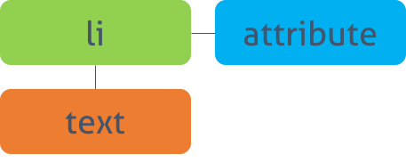
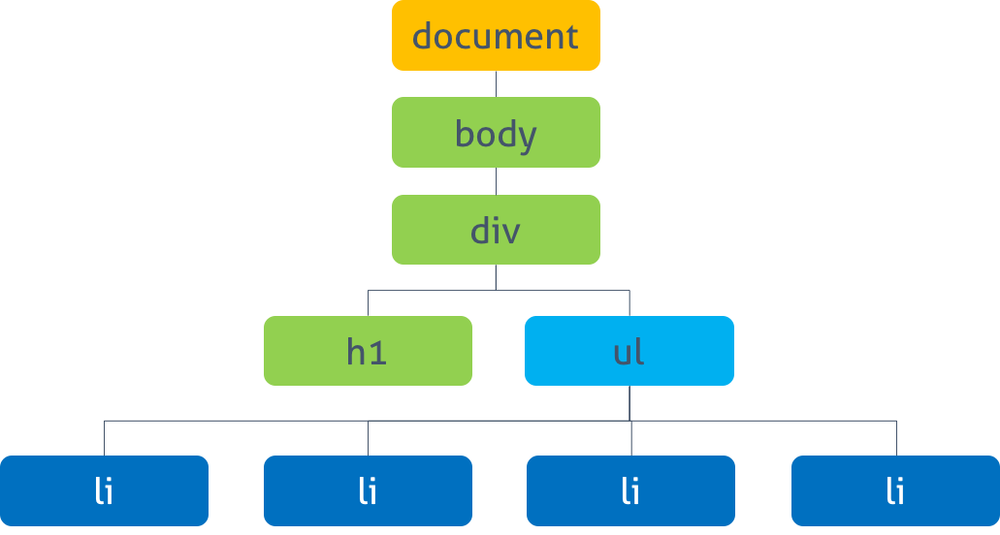

# 문서 객체 모델 (Document Object Model)

## 1. DOM (Document Object Model)

텍스트 파일로 만들어져 있는 웹 문서(HTML, XML, SVG)를 브라우저에 렌더링 하려면 웹 문서를 브라우저가 이해할 수 있는 구조로 메모리에 올려야 한다. 브라우저의 렌더링 엔진은 아래의 순서로 동작한다.

1. 웹 문서 로드
2. 파싱
3. 브라우저가 이해할 수 있는 구조로 구성 (DOM tree)
4. 메모리에 적재 (DOM)

**DOM**이란 브라우저의 렌더링 엔진이 웹 문서의 모든 **요소**와 요소의 **어트리뷰트**, **텍스트**를 각각의 **객체로 만들고,** 객체들의 부자 관계를 표현할 수 있는 **트리 구조를 구성하는 것**이다. DOM은 자바스크립트를 통해 동적으로 변경할 수 있으며 변경된 DOM은 렌더링에 반영된다.


이러한 웹 문서의 동적 변경을 위해 **DOM은** 프로그래밍 언어가 자신에 접근하고 수정할 수 있는 방법을 제공하는데, **일반적으로 프로퍼티와 메소드를 갖는 자바스크립트 객체로 제공된다.** 이를 **DOM API**(Application Programming Interface)라고 부른다. 정적인 웹 페이지에 접근하여 **동적으로 웹 페이지를 변경하기 위한 유일한 방법은 메모리 상에 존재하는 DOM을 변경하는 것**이고, 이때 필요한 것이 **DOM에 접근하고 변경하는 프로퍼티와 메소드의 집합인 DOM API**이다.

DOM은 W3C의 공식 표준이며 플랫폼/프로그래밍 언어 중립적이다. **DOM은 다음 두 가지 기능을 담당한다.**

1. **HTML 문서에 대한 모델 구성**

   브라우저는 HTML 문서를 로드한 후 해당 **문서에 대한 모델을 메모리에 생성한다**. 이때 모델은 객체의 트리로 구성되는데 이것을 **DOM tree**라 한다.

2. **HTML 문서 내의 각 요소에 접근/수정**

   DOM은 모델 내의 각 객체에 접근하고 수정할 수 있는 프로퍼티와 메소드를 제공한다**(DOM API)**.


## 2. DOM tree

**브라우저가 HTML 문서를 로드한 후 파싱하여 생성하는 모델**을 의미한다. **객체의 트리**로 구조화되어 있기 때문에 **DOM tree**라 부른다.

```html
<!DOCTYPE html>
<html lang="en">
<head>
  <style>
      .red  { color: #ff0000; }  
      .blue { color: #000ff; }
  </style>
</head>
<body>
  <div>
    <h1>Cities</h1>
    <ul>
      <li id="one" class="red">Seoul</li>
      <li id="two" class="red">London</li>
      <li id="three" class="red">New York</li>
      <li id="four">Tokyo</li>
    </ul>
  </div>
</body>
</html>
```

위의 HTML 문서를 DOM tree로 표현하면 아래와 같다.


**DOM에서 모든 요소, 어트리뷰트, 텍스트는 하나의 객체이며 Document 객체의 자식이다.** 요소의 중첩관계는 객체의 트리로 구조화하여 부자관계를 표현한다. DOM tree의 **진입점(Entry point)는 Document 객체**이며 **최종점은 요소의 텍스트**를 나타내는 객체이다.


**DOM tree는 네 종류의 노드로 구성된다.**

1. **문서 노드(Document Node)**
   * 트리의 최상위에 존재한다.
   * 각 요소, 어트리뷰트, 텍스트 노드에 접근하려면 문서 노드를 통해야 한다.
   * DOM tree에 접근하기 위한 시작점(entry point)이다.
2. **요소 노드(Element Node)**
   * HTML 요소(Tag)를 표현한다.
   * 중첩에 의한 부자 관계를 가진다 (문서의 구조를 서술한다).
   * 어트리뷰트, 텍스트 노드에 접근하려면 요소 노드를 찾아 접근해야한다.
   * 요소별 특성을 표현하기 위해 HTMLElement 객체를 상속한 객체로 구성된다.
3. **어트리뷰트 노드(Attribute Node)**
   * HTML 요소의 어트리뷰트를 표현한다.
   * 해당 어트리뷰트가 지정된 **요소의 자식이 아니라 해당 요소의 일부로 표현된다.** 
   * 따라서 해당 요소 노드를 찾아 접근하면 어트리뷰트를 참조, 수정할 수 있다.
4. **텍스트 노드(Text Node)**
   * HTML 요소의 텍스트를 표현
   * 요소 노드의 자식
   * DOM tree 최종단이다 (자식 노드를 가질 수 없다).


DOM을 통해 웹 페이지를 조작하기 위해서는 다음과 같은 수순이 필요하다.

* 조작하고자하는 요소를 선택 또는 탐색한다.
* 선택된 요소의 컨텐츠 또는 어트리뷰트를 조작한다.

자바스크립트는 이것에 필요한 수단(API)을 제공한다.


## 3. DOM Query / Traversing (요소에의 접근)

```html
<!DOCTYPE html>
<html lang="en">
<head>
  <style>
      .red  { color: #ff0000; }  
      .blue { color: #000ff; }
  </style>
</head>
<body>
  <div>
    <h1>Cities</h1>
    <ul>
      <li id="one" class="red">Seoul</li>
      <li id="two" class="red">London</li>
      <li id="three" class="red">New York</li>
      <li id="four">Tokyo</li>
    </ul>
  </div>
</body>
</html>
```


### 3.1 하나의 요소 노드 선택(DOM Query)

#### `document.getElementByID(id)`

* id 어트리뷰트 값으로 요소 노드를 1개 선택한다. 2개 이상이 선택된 경우, 첫번째 요소만 반환한다.
* Return: HTMLElement를 상속 받은 객체
* 모든 브라우저에서 동작

```javascript
// id로 하나의 요소를 선택한다.
const elem = document.getElementById('one');

// 요소의 클래스 어트리뷰트 값을 변경한다.
elem.className = 'blue';

// DOM tree의 객체 구성
console.log(elem); // <li id="one" class="blue">Seoul</li>
console.log(elem.__proto__);           // HTMLLIElement
console.log(elem.__proto__.__proto__); // HTMLElement
console.log(elem.__proto__.__proto__.__proto__);           // Element
console.log(elem.__proto__.__proto__.__proto__.__proto__); // Node
```


#### `document.querySelector(cssSelector)`

* CSS 셀렉터를 사용하요 요소 노드를 한 개 선택한다. 2개 이상 선택된 경우, 첫번째 요소만 반환한다.
* Return: HTMLElement를 상속받은 객체
* IE8 이상의 브라우저에서 동작

```javascript
// CSS 셀렉터를 이용해 요소를 선택한다.
const elem2 = document.querySelector('li.red');
// 요소의 클래스 어트리뷰트의 값을 변경한다.
elem2.className = 'blue';
```


### 3.2 여러 개의 요소 노드 선택(DOM Query)

#### `document.getElementsByClassName(class)`

* class 어트리뷰트 값으로 요소 노드를 모두 선택한다. 공백으로 구분하여 여러 개의 class를 지정할 수 있다.
* Return: HTMLCollection (live)
* IE9 이상의 브라우저에서 동작

```javascript
// HTMLCollection을 반환한다. HTMLCollection은 live하다.
const elems = document.getElementsByClassName('red');

for (let i = 0; i < elems.length; i++) {
    // 요소의 클래스 어트리뷰트의 값을 변경한다.
    elems[i].className = 'blue';
}
```

위 예제를 실행해 보면 예상대로 동작하지 않는다. (두번째 요소만 클래스 변경이 되지 않는다.)

`getElementsByClassName` 메소드의 반환값은 **HTMLCollection**이다. 이것은 반환값이 여러 개인 경우, HTMLElement의 **리스트를 담아 반환한다. 따라서 실시간으로 Node의 상태 변경을 반영한다.**

**HTMLCollection을 사용할 경우, 배열로 변경하여 사용하는 것이 안전하다.**

```javascript
const elems = document.getElementsByClassName('red');

// 유사 배열 객체인 HTMLCollection을 배열로 변환한다.
// 배열로 변환된 HTMLCollection은 더 이상 live하지 않다.
console.log([...elems]); // [li#one.red, li#two.red, li#three.red]

[...elems].forEach(elem => elem.className = 'blue');
```


#### `document.getElementsByTagName(tagName)`

* 태그명으로 요소 노드를 모두 선택한다.
* Return: HTMLCollection (live)
* 모든 브라우저에서 동작

```javascript
// HTMLCollection을 반환한다.
const elems = document.getElementsByTagName('li');

[...elems].forEach(elem => elem.className = 'blue');
```


#### `document.querySelectorAll(selector)`

* 지정된 CSS 선택자를 사용하여 요소 노드를 모두 선택한다.
* Return: NodeList (non-live)
* IE8 이상의 브라우저에서 동작

```javascript
// NodeList를 반환한다.
const elems = document.querySelectorAll('li.red');

[...elems].forEach(elem => elem.className = 'blue');
```


### 3.3 DOM Traversing (탐색)

#### `parentNode`

* 부모 노드를 탐색한다.
* Return: HTMLElement를 상속받은 객체
* 모든 브라우저에서 동작

```javascript
const elem = document.querySelector('#two');

elem.parentNode.classname = 'blue';

// 질문. HTML 문서의 style이 override 하는지?
```


#### `firstChild`, `lastChild`

* 자식 노드를 탐색한다.
* Return: HTMLElement를 상속받은 객체
* IE9 이상의 브라우저에서 동작

```javascript
const elem = document.querySelector('ul');

// first child
elem.firstChild.className = 'blue';
// last child
elem.lastChild.className = 'blue';
```

위 예제를 실행하면 예상대로 동작하지 않는다. 그 이유는 **IE를 제외한 대부분의 브라우저는 요소 사이의 공백 또는 줄바꿈 문자를 텍스트 노드로 취급**하기 때문이다. 위 예제 `elem`은 `<ul>` 태그를 가리키며, `<ul>` 태그의 `firstChild` 프로퍼티와 `lastChild` 프로퍼티는 `text`로 설정되어있다.

| firstChild                                              | lastChild                                              |
| ------------------------------------------------------- | ------------------------------------------------------ |
|  |  |

이러한 문제를 회피하기 위해서는 아래와 같이 HTML의 공백을 제거하거나 jQuery: `.prev()`와 jQuery: `.next()`를 사용한다.

```html
<ul><li
  id='one' class='red'>Seoul</li><li
  id='two' class='red'>London</li><li
  id='three' class='red'>Newyork</li><li
  id='four'>Tokyo</li></ul>
```

또는 `firstElementchild`, `lastElementChild`를 사용할 수도 있다.

```javascript
const elem = document.querySelector('ul');

// first child
elem.firstElementChild.className = 'blue';
// last Child
elem.lastElementChild.className = 'blue';
```


#### `hasChildNodes()`

* 자식 노드가 있는지 확인하고 Boolean 값을 반환한다.
* Return: Boolean
* 모든 브라우저에서 동작


#### `childNode`

* 자식 노드의 컬렉션을 반환한다. **텍스트 요소를 포함한 모든 자식 요소를 반환한다.**
* Return: NodeList (non-live)
* 모든 브라우저에서 동작

```javascript
const elem = document.querySelector('ul');

console.log(elem.childNodes);
// [text, li#one.red, text, li#two.red, text, li#three.red, text, li#four, text]
```


#### `children`

* 자식 노드의 컬렉션을 반환한다. **자식 요소 중에서 Element type 요소만을 반환한다.**
* Return: HTMLCollection (live)
* IE9 이상의 브라우저에서 동작

```javascript
const elem = document.querySelector('ul');

console.log([...elem.children]);
// [li#one.red, li#two.red, li#three.red, li#four]
```


#### `previousSibling`, `nextSibling`

* 형제 노드를 탐색한다. **text node를 포함한 모든 형제 노드를 탐색한다.**
* Return: HTMLElement를 상속받은 객체
* 모든 브라우저에서 동작

```javascript
const elem = document.querySelector('#one');
console.log(elem.nextSibling); // #text
console.log(elem.nextSibling.nextSibling);
// <li id="two" class="red">London</li>
```


#### `previousElementSibling`, `nextElementSibling`

* 형제 노드를 탐색한다. **형제 노드 중에서 Element type 요소만을 탐색한다.**
* Return: HTMLElement를 상속받은 객체
* IE9 이상의 브라우저에서 동작

```javascript
const elem = document.querySelector('#one');
console.log(elem.nextElementSibling);
// <li id="two" class="red">London</li>
console.log(elem.nextElementSibling.nextElementSibling);
// <li id="three" class="red">New York</li>
```


## 4. DOM Manipulation (조작)

```html
<!DOCTYPE html>
<html lang="en">
<head>
  <style>
      .red  { color: #ff0000; }  
      .blue { color: #000ff; }
  </style>
</head>
<body>
  <div>
    <h1>Cities</h1>
    <ul>
      <li id="one" class="red">Seoul</li>
      <li id="two" class="red">London</li>
      <li id="three" class="red">New York</li>
      <li id="four">Tokyo</li>
    </ul>
  </div>
</body>
</html>
```


### 4.1 텍스트 노드에의 접근/수정



요소의 텍스트는 텍스트 노드에 저장되어 있다. 텍스트 노드에 접근하려면 아래와 같은 수순이 필요하다.

1. 해당 텍스트 노드의 부모 노드를 선택한다. **텍스트 노드는 요소 노드의 자식이다.**
2. `firstChild` 프로퍼티를 사용하여 텍스트 노드를 탐색한다.
3. 텍스트 노드의 유일한 프로퍼티(`nodeValue`)를 이용하여 텍스트를 취득한다.
4. `nodeValue`를 이용하여 텍스트를 수정한다.


#### `nodeValue`

* 노드의 값을 반환한다.
* Return: 문자열 (텍스트 노드), null (요소 노드)
* IE6 이상의 브라우저에서 동작한다.

`nodeName`, `nodeType`을 통해 노드의 정보를 취득할 수 있다.

```javascript
// 해당 텍스트 노드의 부모 요소 노드를 선택한다.
const one = document.getElementById('one');
console.dir(one); // HTMLLIElement: li#one.red

// nodeName, nodeType을 통해 노드의 정보를 취득할 수 있다.
console.log(one.nodeName); // LI
console.log(one.nodeType); // 1: Element node

// firstChild 프로퍼티를 사용하여 텍스트 노드를 탐색한다.
const textNode = one.firstChild;

// nodeName, nodeType을 통해 노드의 정보를 취득할 수 있다.
console.log(textNode.nodeName); // #text
console.log(textNode.nodeType); // 3: Text node

// nodeValue 프로퍼티를 사용하여 노드의 값을 취득한다.
console.log(textNode.nodeValue); // Seoul

// nodeValue 프로퍼티를 이용하여 텍스트를 수정한다.
textNode.nodeValue = 'Pusan';
```


### 4.2 어트리뷰트 노드에의 접근/수정


#### `className`

* class 어트리뷰트의 값을 취득 또는 변경한다.
* className 프로퍼티에 값을 할당하는 경우, class 어트리뷰트가 존재하지 않으면 class 어트리뷰트를 생성하고 지정된 값을 설정한다.
* class 어트리뷰트의 값이 여러 개일 경우, 공백으로 구분된 문자열이 반환되므로 String 메소드 `split(' ')`를 사용해 배열로 변경하여 사용한다.
* 모든 브라우저에서 동작한다.


#### `classList`

* add, remove, item, toggle, contains, replace 메소드를 제공한다.
* IE10 이상의 브라우저에서 동작한다.

```javascript
const elems = document.querySelectorAll('li');

// className
[...elems].forEach(elem => {
  // class 어트리뷰트 값을 취득하여 확인
  if (elem.className === 'red') 
    // class 어트리뷰트 값을 변경한다.
      elem.className = 'blue';
  }
});

// classList
[...elems].forEach(elem => {
  // class 어트리뷰트 값 확인
  if (elem.classList.contains('blue')) {
    // class 어트리뷰트 값을 변경한다.
      elem.classList.replace('blue', 'red');
  }
});
```


#### `id`

* id 어트리뷰트의 값을 취득 또는 변경한다. id 프로퍼티에 값을 할당하는 경우, id 어트리뷰트가 존재하지 않으면 id 어트리뷰트를 생성하고 지정된 값을 설정한다.
* 모든 브라우저에서 동작한다.

```javascript
// h1 태그 요소 중 첫번째 요소를 취득
const heading = document.querySelector('h1');

console.dir(heading); // HTMLHeadingElement: h1
console.log(heading.id); // ''

heading.id = 'heading';
console.log(heading.id); // 'heading'
```

| previous                                                  | after                                                    |
| --------------------------------------------------------- | -------------------------------------------------------- |
|  |  |


#### `hasAttribute(attribute)`

* 지정한 어트리뷰트를 가지고 있는지 검사한다.
* Return: Boolean
* IE8 이상의 브라우저에서 동작한다.

#### `getAttribute(attribute)`

* 어트리뷰트의 값을 취득한다.
* Return: 문자열
* 모든 브라우저에서 동작한다.

### `setAttribute(attribute, value)`

* 어트리뷰트와 어트리뷰트 값을 설정한다.
* Return: undefined
* 모든 브라우저에서 동작한다.

#### `removeAttribute(attribute)`

* 지정한 어트리뷰트를 제거한다.
* Return: undefined
* 모든 브라우저에서 동작한다.

```html
...
<body>
    <input type="text">
</body>

<script>
const input = document.querySelector('input[type=text]');

// value 어트리뷰트가 존재하지 않으면
if (!input.hasAttribute('value')) {
    // value 어트리뷰트를 추가하고 값으로 'hello!'를 설정
    input.setAttribute('value', 'hello!');
    
    // 질문. 아래 두 개의 차이가 뭔지?
    // input.attributes[1].value, (attribute 노드의 프로퍼티?)
    // input.value (element 노드의 프로퍼티?)
}

// value 어트리뷰트 값을 취득
console.log(input.getAttribtue('value')); // hello!

// value 어트리뷰터 제거
input.removeAttrivtue('value');
    
// value 어트리뷰트의 존재를 확인
console.log(input.hasAttrivtue('value')); // false
</script>
...
```


### 4.3 HTML 콘텐츠 조작(Manipulation)



HTML 컨텐츠를 조작(Manipulation)하기 위해 아래의 프로퍼티 또는 메소드를 사용할 수 있다. 마크업이 포함된 컨텐츠를 추가하는 행위는 **크로스 스크립팅 공격(XSS: Cross-Site Scripting Attacks)에 취약하므로 주의가 필요하다.**


#### `textContent`

* 요소의 텍스트 컨텐츠를 취득 또는 변경한다. 이때 마크업은 무시된다. textContent를 통해 요소에 새로운 텍스트를 할당하면 텍스트를 변경할 수 있다. 이때 순수한 텍스트만 지정해야 하며 마크업을 포함시키면 문자열로 인식되어 그대로 출력된다.
* IE9 이상의 브라우저에서 동작한다.

```javascript
const ul = document.querySelector('ul');

// 요소의 텍스트 취득
console.log(ul.textContent);
// Seoul
// London
// New York
// Tokyo

const one = document.getElementById('one');

// 요소의 텍스트 취득
console.log(one.textContent); // Seoul

// 요소의 텍스트 변경
one.textContent += ', Korea';

console.log(one.textContent); // Seoul, Korea

// 요소의 마크업이 포함된 컨텐츠 변경
one.textContent = '<h1>Heading</h1>';

// 마크업이 문자열로 표시된다.
console.log(one.textContent); // <h1>Heading</h1>
```


#### `innerText`

* innerText 프로퍼티를 사용하여도 요소의 텍스트 컨텐츠에만 접근할 수 있다. 하지만 아래의 이유로 사용하지 않는 것이 좋다.
  * 비표준이다.
  * CSS에 순종적이다. 예를 들어 CSS에 의해 `visibility: hidden` 처리되어 있으면 텍스트가 반환되지 않는다.
  * CSS를 고려해야 하므로 textContent 프로퍼티보다 느리다.


#### `innerHTML`

* 해당 요소의 모든 **자식 요소를 포함하는 모든 컨텐츠를 하나의 문자열로 취득**할 수 있다. 이 문자열은 **마크업을 포함한다.**

```javascript
const ul = document.querySelector('ul');
console.log(ul.innerHTML);
/*
<li id="one" class="red">Seoul</li>
<li id="two" class="red">London</li>
<li id="three" class="red">New York</li>
<li id="four">Tokyo</li>
*/
```

innerHTML 프로퍼티를 사용하여 마크업이 포함된 새로운 컨텐츠를 지정하면, 새로운 요소를 DOM에 추가할 수 있다 (크로스 스크립팅 공격에 취약하다).

```javascript
const one = document.getElementById('one');

// 마크업이 포함된 컨텐츠 취득
console.log(one.innerHTML); // Seoul

// 마크업이 포함된 컨텐츠 변경
one.innerHTML += '<em class="blue">, Korea</em>';

// 마크업이 포함된 컨텐츠 취득
console.log(one.innerHTML); // Seoul<em class="blue">, Korea</em>
```


### 4.4 DOM 조작 방식

innerHTML 프로퍼티를 사용하지 않고 새로운 컨텐츠를 추가할 수 있는 방법은 **DOM을 직접 조작하는 것이다. 한 개의 요소를 추가하는 경우 사용한다.** 이 방법은 아래의 순서로 진행한다.

1. 요소 노드 생성 `createElement()` 메소드를 사용하여 새로운 요소 노드를 생성한다. `createElement()` 메소드의 인자로 태그 이름을 전달한다.
2. 텍스트 노드 생성 `createTextNode()` 메소드를 사용하여 새로운 텍스트 노드를 생성한다. 경우에 따라 생략될 수 있으며 생략하는 경우, 컨텐츠가 비어 있는 요소가 된다.
3. 생성된 요소를 DOM에 추가 `appendChild()` 메소드를 사용하여 생성된 노드를 DOM tree에 추가한다. 또는 `removeChild()` 메소드를 사용하여 DOM tree에서 노드를 삭제할 수도 있다.


#### `createElement(tagName)`

* 태그 이름을 인자로 전달하여 요소를 생성한다.
* Return: HTMLElement를 상속받는 객체
* 모든 브라우저에서 동작한다.

#### `createTextNode(text)`

* 텍스트를 인자로 전달하여 텍스트 노드를 생성한다.
* Return: Text 객체
* 모든 브라우저에서 동작한다.

#### `appendChild(Node)`

* 인자로 전달한 노드를 마지막 자식 요소로 DOM 트리에 추가한다.
* Return: 추가한 노드
* 모든 브라우저에서 작동한다.

#### `removeChild(Node)`

* 인자로 전달한 노드를 DOM 트리에서 제거한다.
* Return: 추가한 노드
* 모든 브라우저에서 동작한다.

```javascript
// 태그 이름을 인자로 전달하여 요소 생성
const newElem = document.createElement('li'); // <li></li>

// 텍스트 노드 생성
const newText = document.createTextNode('Beijing');

// 텍스트 노드를 newElem 자식으로 DOM 트리에 추가
newElem.appendChild(newText); // <li>Beijing</li>

const container = document.querySelector('ul');

// newElem을 container의 자식으로 DOM 트리에 추가. 마지막 요소로 추가된다.
container.appendChild(newElem);
// <ul>
//   ...
//   <li>Beijing</li>
// </ul>

const removeElem = document.getElementById('one');

// container의 자식인 removeElem 요소를 DOM 트리에서 제거
container.removeChild(removeElem);
```


### 4.5 `insertAdjacentHTML(position, string)`

* 인자로 전달한 텍스트를 HTML로 파싱하고 그 결과로 생성된 노드를 DOM 트리의 지정된 위치에 삽입한다. 첫번째 인자는 삽입 위치, 두번째 인자는 삽입할 요소를 표현한 문자열이다. 첫번째 인자로 올 수 있는 값은 아래와 같다.
  * `'beforebegin'`
  * `'afterbegin'`
  * `'beforeend'`
  * `'afterend'`
* 모든 브라우저에서 동작한다.


```javascript
const one = document.getElementById('one');

// // 마크업이 포함된 요소 추가
one.insertAdjacentHTML('beforeend', '<em class="blue">, Korea</em>');
```


### 4.6 innerHTML vs. DOM 조작 방식 vs. insertAdjacentHTML()

#### `innerHTML`

| 장점                                                       | 단점                                                         |
| ---------------------------------------------------------- | ------------------------------------------------------------ |
| DOM 조작 방식에 비해 빠르고 간편하다.                      | XSS 공격에 취약점이 있기 때문에 사용자로 부터 입력받은 컨텐츠(untrusted data: 댓글, 사용자 이름 등)를 추가할 때 주의하여야 한다. |
| 간편하게 문자열로 정의한 여러 요소를 DOM에 추가할 수 있다. | 해당 요소의 내용을 덮어 쓴다. 따라서 HTML을 다시 파싱한다. 비효율적이다. |
| 컨텐츠를 취득할 수 있다.                                   |                                                              |


#### DOM 조작 방식

| 장점                                                         | 단점                                          |
| ------------------------------------------------------------ | --------------------------------------------- |
| 특정 노드 한 개(노드, 텍스트, 데이터 등)를 DOM에 추가할 때 적합하다. | innerHTML보다 느리고 더 많은 코드가 필요하다. |


#### `insertAdjacentHTML()`

| 장점                                                       | 단점                                                         |
| ---------------------------------------------------------- | ------------------------------------------------------------ |
| 간편하게 문자열로 정의된 여러 요소를 DOM에 추가할 수 있다. | XSS공격에 취약점이 있기 때문에 사용자로 부터 입력받은 콘텐츠(untrusted data: 댓글, 사용자 이름 등)를 추가할 때 주의하여야 한다. |
| 삽입되는 위치를 선정할 수 있다.                            |                                                              |


#### 결론

* `innerHTML`과 `insertAdjacentHTML()`은 크로스 스크립팅 공격에 취약하기 때문에 사용시 주의해야한다.
* 텍스트를 추가 또는 변경시에는 `textContent`를 사용한다.
* 새로운 요소의 추가 또는 삭제시 DOM 조작 방식을 사용한다.


## 5. sytle

style 프로퍼티를 사용하면 **inline 스타일 선언을 생성한다.** 특정 요소에 inline 스타일을 지정하는 경우 사용한다.

```javascript
const one = document.getElementById('one');

// inline 스타일 선언
one.style.color = 'blue';

// font-size와 같이 '-'로 구분되는 프로퍼티는 카멜케이스로 변환하여 사용한다.
one.style.fontSize = '2em';
```


style 프로퍼티의 값을 취득하려면 `window.getComputedStyle`을 사용한다. 인자로 주어진 요소의 모든 CSS 프로퍼티 값을 반환한다.

```html
<!DOCTYPE html>
<html>
<head>
  <meta charset="UTF-8">
  <title>style 프로퍼티 값 취득</title>
  <style>
    .box {
      width: 100px;
      height: 50px;
      background-color: red;
      border: 1px solid black;
    }
  </style>
</head>
<body>
  <div class="box"></div>
  <script>
    const box = document.querySelector('.box');

    const width = getStyle(box, 'width');
    const height = getStyle(box, 'height');
    const backgroundColor = getStyle(box, 'background-color');
    const border = getStyle(box, 'border');

    console.log('width: ' + width);
    console.log('height: ' + height);
    console.log('backgroundColor: ' + backgroundColor);
    console.log('border: ' + border);

    /**
     * 요소에 적용된 CSS 프로퍼티를 반환한다.
     * @param {HTTPElement} elem - 대상 요소 노드.
     * @param {string} prop - 대상 CSS 프로퍼티.
     * @returns {string} CSS 프로퍼티의 값.
     */
    function getStyle(elem, prop) {
      return window.getComputedStyle(elem, null).getPropertyValue(prop);
    }
  </script>
</body>
</html>
```

