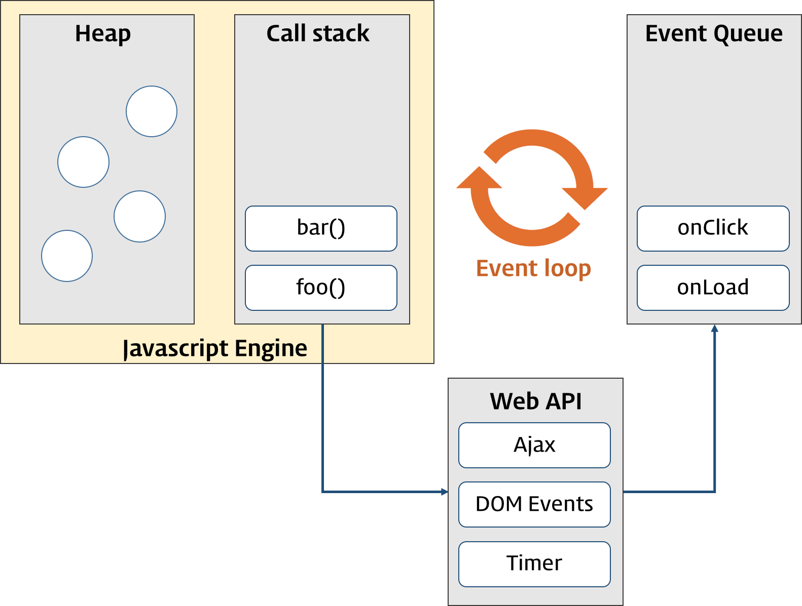
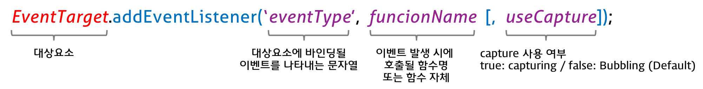

# Event (이벤트)

## 1. Introduction

이벤트(event)는 어떤 사건을 의미한다. 브라우저에서의 이벤트란, 예를 들어 사용자가 버튼을 클릭했을 때, 웹 페이지가 로드되었을 때와 같은 것인데 이것은 DOM 요소와 관련이 있다.

이벤트가 발생하는 시점이나 순서를 사전에 인지할 수 없으므로 일반적인 제어 흐름과는 다른 접근 방식이 필요하다. 즉, 이벤트가 발생하면 누군가 이를 감지할 수 있어야 하며 그에 대응하는 처리를 호출해 주어야 한다.

**브라우저는 이벤트를 감지할 수 있으며 이벤트 발생 시에는 통지해 준다.**  이 과정을 통해 사용자와 웹페이지는 상호작용(Interaction)이 가능하게 된다.

```html
...
<body>
    <button class="myButton">Click me!</button>
    <script>
        const $myBtn = document.querySelector('.myButton');
 		$myBtn.addEventListener('click', function () {
            alert('Clicked!');
        });
    </script>
</body>
```

이벤트가 발생하면 그에 맞는 반응을 하여야 한다. 이를 위해 **이벤트는 일반적으로 함수에 연결되며** 그 함수는 이벤트가 발생하기 전에는 실행되지 않다가, **이벤트가 발생되면 실행한다.** 이 함수를 **이벤트 핸들러**라 하며 이벤트에 대응하는 처리를 기술한다.


## 2. 이벤트 루프(Event Loop)와 동시성(Concurrency)

브라우저는 단일 스레드(single-thread)에서 이벤트 드리븐(event-driven) 방식으로 동작한다.

단일 스레드는 스레드가 하나뿐이라는 의미이며 이말은 곧 하나의 작업(task)만을 처리할 수 있다는 것을 의미한다. 하지만 실제로 동작하는 웹 애플리케이션은 많은 task가 동시에 처리되는 것처럼 느껴진다. 이처럼 **자바스크립트의 동시성(Concurrency)을 지원하는 것이 이벤트 루프(Event Loop)**이다.

브라우저의 환경을 그림으로 표현하면 아래와 같다.




구글 V8을 비롯한 대부분의 자바스크립트 엔진은 크게 2개의 영역으로 나뉜다.

1. **Call Stack(호출 스택)**
   * 작업이 요청되면(함수가 호출되면) 요청된 작업은 순차적으로 Call Stack에 쌓이게 되고 순차적으로 실행된다.
   * 자바스크립트는 단 하나의 Call Stack을 사용하기 때문에 해당 task가 종료하기 전까지는 다른 어떤 task도 수행될 수 없다.
2. **Heap**
   * 동적으로 생성된 객체 인스턴스가 할당되는 영역이다.


앞에서 언급한 동시성(Concurrency)을 지원하기 위해 필요한 비동기 요청 및 이벤트 처리는 자바스크립트 엔진을 구동하는 환경인 브라우저(또는 Node.js) 담당한다.

1. **Event Queue(Task Queue)**
   * 비동기 처리 함수의 **콜백함수**, 비동기식 **이벤트 핸들러**, Timer 함수(`setTimeout()`, `setInterval()`)의 콜백 함수가 **보관되는 영역**
   * **이벤트 루프(Event Loop)에 의해 특정시점(Call Stack이 비어졌을 때)에 순차적으로 Call Stack으로 이동되어 실행된다.**

2. **Event Loop(이벤트 루프)**
   * Call Stack 내에서 현재 실행 중인 task가 있는지, Event Queue에 task가 있는지 반복하여 확인한다.
   * Call Stack이 비어있다면 Event Queue 내의 task가 Call Stack으로 이동하고 실행된다.

```javascript
function func1() {
  console.log('func1');
  func2();
}

function func2() {
  setTimeout(function () {
    console.log('func2');
  }, 0);
  func3();
}

function func3() {
  console.log('func3');
}

func1();
```

위의 예제가 동작하는 순서를 살펴보자.

1. `func1`이 호출되면 함수 `func1`은 Call Stack에 쌓인다.
2. `func1`은 함수 `func2`를 호출하므로 `func2`가 Call Stack에 쌓이고 `setTimeout`이 호출된다.
3. **`setTimeout`의 콜백함수는 즉시 실행되지 않고 지정 대기 시간만큼 기다리다가 "tick" 이벤트가 발생하면 태스크 큐로 이동한 후 Call Stack이 비어졌을 때 Call Stack으로 이동되어 실행된다.**


DOM 이벤트 핸들러도 이와 같이 동작한다.

```javascript
function func1() {
  console.log('func1');
  func2();
}

function func2() {
  // <button class="foo">foo</button>
  const elem = document.querySelector('.foo');
    
  elem.addEventListener('click', function () {
    this.style.backgroundColor = 'indigo';
    console.log('func2');
  });
    
  func3();
}

function func3() {
  console.log('func3');
}

func1();
```

1. `func1`이 호출되면 함수 `func1`은 Call Stack에 쌓인다.
2. `func1`은 함수 `func2`를 호출하므로 `func2`가 Call Stack에 쌓이고 `addEventListener`가 호출된다.
3. **`addEventListener`의 콜백함수는 `foo` 버튼이 클릭되어 "click" 이벤트가 발생하면 태스크 큐로 이동한 후 Call Stack이 비어졌을 때 Call Stack으로 이동되어 실행된다.**


## 3. 이벤트의 종류

아래는 자주 사용되는 이벤트 목록이다.

### 3.1 UI Event

| Event    | Description                                                  |
| -------- | ------------------------------------------------------------ |
| **load** | 웹 페이지의 로드가 완료되었을 때                             |
| unload   | 웹 페이지가 언로드될 때(주로 새로운 페이지를 요청한 경우)    |
| error    | 브라우저가 자바스크립트 오류를 만났거나 요청한 자원이 존재하지 않는 경우 |
| resize   | 브라우저 창의 크기를 조절했을 때                             |
| scroll   | 사용자가 페이지를 위아래로 스크롤할 때                       |
| select   | 텍스트를 선택했을 때                                         |


### 3.2 Keyboard Event

| Event     | Description            |
| --------- | ---------------------- |
| keydown   | 키를 누르고 있을 때    |
| **keyup** | 누르고 있던 키를 뗄 때 |
| keypress  | 키를 누르고 뗏을 때    |


### 3.3 Mouse Event

| Event     | Description                                                  |
| --------- | ------------------------------------------------------------ |
| click     | 마우스 버튼을 클릭했을 때                                    |
| dbclick   | 마우스 버튼을 더블 클릭했을 때                               |
| mousedown | 마우스 버튼을 누르고 있을 때                                 |
| mouseup   | 누르고 있던 마우스 버튼을 뗄 때                              |
| mousemove | 마우스를 움직일 때 (터치스크린에서 동작하지 않는다)          |
| mouseover | 마우스를 요소 위로 움직였을 때 (터치스크린에서 동작하지 않는다) |
| mouseout  | 마우스를 요소 밖으로 움직였을 때(터치스크린에서 동작하지 않는다) |


### 3.4 Focuse Event

| Event             | Description               |
| ----------------- | ------------------------- |
| **focus**/focusin | 요소가 포커스를 얻었을 때 |
| **blur**/focusout | 요소가 포커스를 잃었을 때 |


### 3.5 Form Event

| Event      | Description                                                  |
| ---------- | ------------------------------------------------------------ |
| **input**  | input 또는 textarea 요소의 값이 변경되었을 때                |
|            | contenteditable 어트리뷰트를 가진 요소의 값이 변경 되었을 때 |
| **change** | select box, checkbox, radio button의 상태가 변경되었을 때    |
| submit     | form을 submit할 때 (버튼 또는 키)                            |
| reset      | reset 버튼을 클릭할 때 (최근에는 사용 안함)                  |


### 3.6 Clipboard Event

| Event | Description            |
| ----- | ---------------------- |
| cut   | 컨텐츠를 잘라내기할 때 |
| copy  | 컨텐츠를 복사할 때     |
| paste | 컨텐츠를 붙여넣기할 때 |


## 4. 이벤트 핸들러 등록

이벤트가 발생했을 때 동작할 이벤트 핸들러를 이벤트에 등록하는 방법은 세 가지가 있다.


### 4.1 인라인 이벤트 핸들러

**HTML 요소의** 이벤트 핸들러 **어트리뷰트에** 이벤트 핸들러를 **등록하는 방법**이다.

```html
...
<body>
    <button onclick="myHandler()">Click me</button>
    <script>
    	function myHandler() {
          alert('Button clicked!');
        }
    </script>
</body>
```

HTML과 JavaScript는 관심사가 다르므로 분리하는 것이 좋으나, 최근 CBD 기반 프레임워크(ex. React)에서 사용되고 있다.


### 4.2 이벤트 핸들러 프로퍼티

인라인 이벤트 핸들러를 사용했을 때 HTML과 JavaScript가 뒤섞이는 문제를 해결할 수 있는 방법이다. 하지만 **이벤트 핸들러 프로퍼티에 하나의 이벤트 핸들러만을 바인딩할 수 있다는 단점이 있다.**

```html
...
<body>
    <button class="btn">Click me</button>
    <script>
    	const btn = document.querySelector('.btn');
        // 이벤트 핸들러 프로퍼티는 이벤트에 하나의 이벤트 핸들러만 바인딩할 수 있다.
        // 첫번째 바인딩된 이벤트 핸들러는 실행되지 않는다.
        btn.onclick = function () {
          alert('Button clicked 1');
        };
        
        // 두번째 바인딩된 이벤트 핸들러
        btn.onclick = function () {
          alert('Button clicked 2');
        };
        
        // addEventListener 메소드 방식
        // 첫번째 바인딩된 이벤트 핸들러
        btn.addEventListener('click', function () {
          alert('Button clicked 1 - eventListner');
        });
        
        // 두번째 바인딩된 이벤트 핸들러
        btn.addEventListener('click', function() {
          alert('Button clicked 2 - eventListener');
        });
    </script>
</body>
```


### 4.3 addEventListener 메소드

`addEventListener` 메소드를 이용하여 대상 **DOM 요소에 이벤트를 바인딩**하고 해당 이벤트가 발생했을때 **실행될 콜백 함수(이벤트 핸들러)를 지정**한다.




`addEventListener` 메소드는 이전 방법과 비교해 아래와 같은 장점을 갖는다.

* 하나의 이벤트에 대해 하나 이상의 이벤트 핸들러를 추가할 수 있다.
* 캡처링과 버블링을 지원한다.
* HTML 요소뿐만 아니라, 모든 DOM 요소(HTML, XML, SVG)에 대해 동작한다.

단, IE9 이상에서 동작한다. IE 8이하에서는 `attachEvent` 메소드를 사용한다.

```javascript
if (elem.addEventListener) { // IE 9 ~
  elem.addEventListener('click', func);
} else if (elem.attachEvent) { // ~ IE 8
  elem.attachEvent('onclick', func);
}
```


#### `addEventListener` 예제

* DOM 요소를 지정하지 않으면 전역 객체(DOM 문서를 포함한 브라우저의 윈도우)에서 발생하는 click 이벤트에 이벤트 핸들러를 바인딩한다. 따라서 브라우저 윈도우 어디를 클릭하여도 이벤트 핸들러가 동작한다.

```html
...
<body>
    <script>
    	addEventListener('click', function () {
          alert('Clicked!');
        });
    </script>
</body>
```


* 사용자 이름이 최소 2자 이상인지 확인하는 코드를 작성 (ver.1)

```html
...
<body>
  <label>User name <input type="text"></label>
  <em class="message"></em>
  <script>
    const input = document.querySelector('input[type=text]');
    const msg = document.querySelector('.message');
      
    input.addEventListener('blur', function () {
      if (input.value.length < 2) {
        msg.innerHTML = '이름을 2자 이상 입력해 주세요';
      } else {
        msg.innerHTML = '';
      }
    });
  </script>
</body>
```

위 예제의 문제점은 2자 이상이라는 규칙이 바뀌면 모든 코드를 수정해야 한다는 것이다. 2자 이상이라는 규칙을 상수화하고, 클로저를 사용하는 방법으로 수정해보자.


* 사용자 이름이 최소 2자 이상인지 확인하는 코드를 작성 (ver.2)

```html
...
<body>
  <label>User name <input type="text"></label>
  <em class="message"></em>
  <script>
    const MIN_LENGTH = 2;
    const input = document.querySelector('input[type=text]');
    const msg = document.querySelector('.message');
    
    // 클로저
    function checkName() {
      if (input.value.length < MIN_LENGTH) {
        msg.innerHTML = '이름은 ' + MIN_LENGTH + '자 이상이어야 합니다.';
      } else {
        msg.innerHTML = '';
      }
    }
      
    input.addEventListener('blur', checkName);
  </script>
</body>
```

ver1의 코드와 달리 2자 이상이라는 규칙이 바뀌면 `MIN_LENGTH`만 변경하면된다. 하지만 `addEventListener` 메소드의 두번째 매개변수는 이벤트가 발생했을 때 호출될 이벤트 핸들러이며, 두번째 매개변수에는 **함수 호출이 아니라 함수 자체를 지정해야 한다.** 따라서 위 예제의 경우, `addEventListener`의 두번째 매개변수에는 단 하나의 함수만(`checkName`) 전달할 수 있다.


* 사용자 이름이 최소 2자 이상인지 확인하는 코드를 작성 (ver.3)

```html
...
<body>
  <label>User name <input type="text"></label>
  <em class="message"></em>
  <script>
    const MIN_LENGTH = 2;
    const input = document.querySelector('input[type=text]');
    const msg = document.querySelector('.message');
    
    // 클로저
    function checkName() {
      if (input.value.length < MIN_LENGTH) {
        msg.innerHTML = '이름은 ' + MIN_LENGTH + '자 이상이어야 합니다.';
      } else {
        msg.innerHTML = '';
      }
    }
      
    input.addEventListener('blur', function () {
      checkName();
      // do something...
    });
      
    // 이벤트 핸들러 프로퍼티에도 동일한 방법을 사용할 수 있다.
    // input.onblur = function () {
    //   checkName();
    //   // do something...
    //  };
  </script>
</body>
```


## 5. 이벤트 핸들러 함수 내부의 this

### 5.1 인라인 이벤트 핸들러의 this

인라인 이벤트 핸들러는 **일반 함수로서 호출되므로** 이벤트 핸들러 내부의 this는 **전역 객체 window**를 가리킨다.

```html
...
<body>
  <button onclick="foo()">Button</button>
  <script>
    function foo() {
      console.log(this); // window
    }  
  </script>
</body>
```


### 5.2 이벤트 핸들러 프로퍼티의 this

이벤트 핸들러 프로퍼티의 이벤트 핸들러는 메소드이므로 이벤트 핸들러 내부의 this는 **이벤트에 바인딩된 요소**를 가리킨다. 이것은 **이벤트 객체인 currentTarget 프로퍼티와 같다.**

이벤트 핸들러 프로퍼티에 함수 표현식으로 함수를 할당하는 것은 사실 일반 함수(kind: normal)를 할당하는 것이므로 ECMAScript Spec에서는 해당 이벤트 핸들러 프로퍼티를 메소드로 인정하지 않는다. 따라서 새로운 변수에 `btn.onclick`을 할당하는 것도 가능하며 호출 방식에 따라 `this`가 동적으로 변경된다. **하지만, 브라우저 환경에서 이벤트 핸들러 프로퍼티 내부의 `this`는 언제나 이벤트 핸들러 프로퍼티 앞의 객체를 가리킨다.**

```html
...
<body>
  <button class="btn">Button</button>
  <script>
    const btn = document.querySelector('.btn');
      
    btn.onclick = function (e) {
      console.log(this); // <button class="btn">Button</button>
      console.log(e.currentTarget); // <button class="btn">Button</button>
      console.log(this === e.currentTarget); // true
    };
  </script>
</body>
```


### 5.3 addEventListener 메소드의 this

`addEventListener` 메소드에서 지정한 **이벤트 핸들러는** 콜백 함수이지만(**일반 함수로 호출되지만**) 이벤트 핸들러 내부의 **this는 이벤트 리스너에 바인딩된 요소(currentTarget)를 가리킨다.**

```html
...
<body>
  <button class="btn">Button</button>
  <script>
    const btn = document.querySelector('.btn');
      
    btn.addEventListener('click', function (e) {
      console.log(this); // <button class="btn">Button</button>
      console.log(e.currentTarget); // <button class="btn">Button</button>
      console.log(this === e.currentTarget); // true
    });
  </script>
</body>
```


## 6. 이벤트의 흐름

계층적 구조에 포함되어 있는 HTML 요소에 이벤트가 발생할 경우 연쇄적 반응이 일어난다. 즉, **이벤트가 전파(Event Propagation)되는데 전파 방향에 따라 버블링(Event Bubbling)과 캡처링(Event Capturing)으로 구분할 수 있다.**

**버블링** : 자식 요소에서 발생한 이벤트가 부모 요소로 전파되는 것

**캡처링** : 자식 요소에서 발생한 이벤트가 부모 요소부터 시작하여 이벤트를 발생시킨 자식 요소까지 도달하는 것

**주의할 것은 버블링과 캡처링은 둘 중에 하나만 발생하는 것이 아니라, 캡처링부터 시작하여 버블링으로 종료한다는 것이다.** 즉, 이벤트가 발생했을 때 캡처링과 버블링은 순차적으로 발생한다 (캡처링은 IE8 이하에서 지원되지 않는다).


**`addEventListener` 메소드의 세번째 매개변수에 `true`를 설정하면 캡처링으로 전파되는 이벤트를 캐치하고, `false` 또는 미설정하면 버블링으로 전파되는 이벤트를 캐치한다.**


#### 버블링 예제

```html
...
<body>
    <p>버블링 이벤트 <button>버튼</button></p>
    <script>
    	const body = document.querySelector('body');
        const para = document.querySelector('p');
        const btn = document.querySelector('button');
        
        // 버블링
        body.addEventListener('click', function () {
          console.log('Handler for body.');
        });
        
        // 버블링
        para.addEventListener('click', function () {
          console.log('Handler for paragraph.');
        });
        
        // 버블링
        button.addEventListener('click', function () {
          console.log('Handler for button.');
        });
    </script>
</body>
```

위 코드는 모든 이벤트 핸들러가 이벤트 흐름을 버블링만 캐치한다.

* `btn`에서 이벤트가 발생하는 경우

  ```css
  Handler for button. // 1
  Handler for paragraph. // 2
  Handler for body. // 3
  ```

* `para`에서 이벤트가 발생하는 경우

  ```css
  Handler for paragraph. // 1
  Handler for body. // 2
  ```

* `body`에서 이벤트가 발생하는 경우

  ```css
  Handler for body. // 1
  ```


#### 캡처링 예제

```html
...
<body>
    <p>캡처링 이벤트 <button>버튼</button></p>
    <script>
    	const body = document.querySelector('body');
        const para = document.querySelector('p');
        const btn = document.querySelector('button');
        
        // 캡처링
        body.addEventListener('click', function () {
          console.log('Handler for body.');
        }, true);
        
        // 캡처링
        para.addEventListener('click', function () {
          console.log('Handler for paragraph.');
        }, true);
        
        // 캡처링
        button.addEventListener('click', function () {
          console.log('Handler for button.');
        }, true);
    </script>
</body>
```

위 코드는 모든 이벤트 핸들러가 이벤트 흐름을 캡처링만 캐치한다.

* `btn`에서 이벤트가 발생하는 경우

  ```css
  Handler for body. // 1
  Handler for paragraph. // 2
  Handler for button. // 3
  ```

* `para`에서 이벤트가 발생하는 경우

  ```css
  Handler for body. // 1
  Handler for paragraph. // 2
  ```

* `body`에서 이벤트가 발생하는 경우

  ```css
  Handler for body. // 1
  ```


#### 버블링 & 캡처링 혼용 예제

```html
...
<body>
    <p>버블링 캡처링 이벤트 <button>버튼</button></p>
    <script>
    	const body = document.querySelector('body');
        const para = document.querySelector('p');
        const btn = document.querySelector('button');
        
        // 버블링
        body.addEventListener('click', function () {
          console.log('Handler for body.');
        });
        
        // 캡처링
        para.addEventListener('click', function () {
          console.log('Handler for paragraph.');
        }, true);
        
        // 버블링
        button.addEventListener('click', function () {
          console.log('Handler for button.');
        });
    </script>
</body>
```

* `btn`에서 이벤트가 발생하는 경우

  ```css
  Handler for paragraph. // 1 - 캡처링
  Handler for button. // 2 - 버블링
  Handler for body. // 3 - 버블링
  ```

* `para`에서 이벤트가 발생하는 경우

  ```css
  Handler for paragraph. // 1 - 캡처링
  Handler for body. // 2 - 버블링
  ```

* `body`에서 이벤트가 발생하는 경우

  ```css
  Handler for paragraph. // 1 - 캡처링
  Handler for body. // 2 - 버블링
  ```


## 7. Event 객체

event 객체는 이벤트를 발생시킨 요소와 발생한 이벤트에 대한 유용한 정보를 제공한다. **이벤트가 발생하면 event 객체는 동적으로 생성되며 이벤트를 처리할 수 있는 이벤트 핸들러에 인자로 전달된다.** 

```html
<script>
    function showCoords(e) {
        const mst = document.querySelector('.message');
        msg.innerHTML = `
			clientX value: ${e.clientX} <br>
			clientY value: ${e.clientY}`;
    }
    addEventListener('click', showCoords);
</script>
```

위와 같이 event 객체는 이벤트 핸들러에 **암묵적으로 전달된다.** 그러나 이벤트 핸들러를 선언할 때, event 객체를 전달받을 **첫번째 매개변수를 명시적으로 선언하여야 한다.**

### 7.1.1 Event.target

**실제로 이벤트를 발생시킨 요소를 가리킨다.**

```html
...
<body>
    <div class="container">
        <button id="btn1">Hide me 1</button>
        <button id="btn2">Hide me 2</button>
    </div>
</body>

<script>
	function hide(e) {
        e.target.style.visibility = 'hidden';
        // 동일하게 동작한다.
        // this.style.visibility = 'hidden';
    }
    
    document.querySelector('#btn1').addEventListener('click', hide);
    document.querySelector('#btn2').addEventListener('click', hide);
</script>
...
```

`hide` 함수를 특정 노드에 한정하여 사용하지 않고, 범용적으로 사용하기 위해 evenet 객체의 `target` 프로퍼티를 사용하였다. 위 예제의 경우, `hide` 함수 내부의 `e.target`은 언제나 이벤트가 바인딩된 요소를 가리키는 `this`와 일치한다. 하지만 버튼별로 이벤트를 바인딩하고 있기 때문에 버튼이 많은 경우 위 방법은 바람직하지 않아 보인다.

**이벤트 위임**을 사용하여 위 예제를 수정하여 보자.

```html
...
<body>
    <div class="container">
        <button id="btn1">Hide me 1</button>
        <button id="btn2">Hide me 2</button>
    </div>
</body>

<script>
	function hide(e) {
        e.target.style.visibility = 'hidden';
        // this는 이벤트에 바인딩된 DOM 요소(.container)를 가리킨다. 따라서 .containier 요소를 감춘다.
        // this.style.visibility = 'hidden';
    }
    
    document.querySelector('.container').addEventListener('click', hide);
</script>
...
```

위 예제의 경우, Event.target은 this와 반드시 일치하지는 않는다 (div 영역이 아닌 button 영역을 클릭했을 경우 버블링을 통해 div.container가 반응한다).


### 7.1.2. Event.currentTarget

이벤트에 바인딩된 DOM 요소를 가리킨다. 즉, `addEventListener` 앞에 기술된 객체를 가리킨다.

`addEventListener` 메소드에서 지정한 이벤트 핸들러 내부의 `this`는 이벤트에 바인딩된 DOM 요소를 가리키며 이것은 이벤트 객체의 `currentTarget` 프로퍼티와 같다. 따라서 이벤트 핸들러 함수 내에서 `currentTarget`과 `this`는 언제나 일치한다.

```html
<body>
    <div>
        <button>Click Me</button>
    </div>
</body>
<script>
	function example(e) {
        // this: 이벤트에 바인딩된 DOM 요소 (div 요소)
        console.log('this: ', this);
        
        // target: 실제로 이벤트를 발생시킨 요소 (button 혹은 div)
        console.log('e.target: ', e.target);
        
        // currentTarget: 이벤트에 바인딩된 DOM 요소(div 요소)
        console.log('e.currentTarget: ', e.currentTarget);
        
        // 언제나 true
        console.log(this === e.currentTarget); // true
        
        // currentTarget과 target이 같은 객체일 때 true
        console.log(this === e.target);
        
        // click 이벤트가 발생하면 이벤트를 발생시킨 요소(target)와는 상관없이
        // this (이벤트에 바인딩된 div 요소)의 배경색이 변경된다.
        this.style.backgroundColor = 'lime';
    }
    
    document.querySelector('div').addEventListener('click', example);
</script>
```


### 7.1.3. Event.type

발생한 이벤트의 종류를 나타내는 문자열을 반환한다.


### 7.1.4. Event.cancelable

요소의 기본 동작을 취소시킬 수 있는지 여부(true/false)를 나타낸다.

```html
...
<body>
  <a href="poiemaweb.com">Go to poiemaweb.com</a>
  <script>
  const elem = document.querySelector('a');

  elem.addEventListener('click', function (e) {
    console.log(e.cancelable); // true

    // 기본 동작을 중단시킨다.
    e.preventDefault();
  });
  </script>
</body>
```


### 7.1.5. Event.eventPhase

이벤트 흐름(event flow) 상에서 어느 단계(event phase)에 있는지를 반환한다.

| 반환값 | 의미        |
| ------ | ----------- |
| 0      | 이벤트 없음 |
| 1      | 캡처링 단계 |
| 2      | 타깃        |
| 3      | 버블링 단계 |


## 8. Event Delegation (이벤트 위임)

```html
<ul id="post-list">
  <li id="post-1">Item 1</li>
  <li id="post-2">Item 2</li>
  <li id="post-3">Item 3</li>
  <li id="post-4">Item 4</li>
  <li id="post-5">Item 5</li>
  <li id="post-6">Item 6</li>
</ul>
```

위 예제에서 모든 `<li>` 요소의 클릭 이벤트에 반응하는 처리를 구현하고 싶은 경우, `<li>` 요소에 이벤트 핸들러를 각각 바인딩하면 총 6개의 이벤트 핸들러를 바인딩하여야 한다.

만일 `<li>` 요소가 100개라면 100개의 이벤틑 핸들러를 바인딩하여야 한다. 또한, **동적으로 HTML 요소가 추가되는 경우, 아직 추가되지 않은 요소는 DOM에 존재하지 않으므로 이벤트 핸들러를 바인딩할 수 없다.** 이러한 경우 이벤트 위임을 사용한다.

**이벤트 위임 (Event Delegation)은 다수의 자식 요소에 각각 이벤트 핸들러를 바인딩하는 대신 하나의 부모 요소에 이벤트 핸들러를 바인딩하는 방법이다.** 위 예제의 경우, `<li>` 요소의 부모 요소인 `<ul>` 요소에 이벤트 핸들러를 바인딩하여 이벤트를 관리한다.

또한 DOM 트리에 새로운 `<li>` 요소를 추가하더라도 이벤트 처리는 부모 요소인 `<ul>` 요소에 위임되었기 때문에 새로운 요소에 이벤트 핸들러를 바인딩할 필요가 없다.

이는 이벤트가 **이벤트 흐름**에 의해 이벤트를 발생시킨 요소의 부모 요소에도 영향(버블링)을 미치기 때문에 가능한 것이다.

```html
<body>
    <ul class="post-list">
        <li id="post-1">Item 1</li>
        <li id="post-2">Item 2</li>
        <li id="post-3">Item 3</li>
        <li id="post-4">Item 4</li>
        <li id="post-5">Item 5</li>
        <li id="post-6">Item 6</li>
    </ul>
    <div class="msg"></div>
    
    <script>
    	const msg = document.querySelector('.msg');
        const list = document.querySelector('.post-list');
        
        list.addEventListener('click', function (e) {
        	// 이벤트를 발생시킨 요소
            console.log('[target]: ' + e.target.nodeName);
            
            // 이벤트를 발생시킨 요소의 nodeName
            console.log('[target.nodeName]: ' e.target.nodeName);
            
            // li 요소 이외의 요소에서 발생한 이벤트는 대응하지 않는다.
            if (e.target && e.target.nodeNmae === 'LI') {
                msg.innerHTML = 'li#' + e.target.id + ' was clicked!';
            }
        });
    </script>
</body>
```


## 9. 기본 동작의 변경

**이벤트 객체는** 요소의 기본 동작과 요소의 부모 요소들이 이벤트에 대응하는 방법을 변경하기 위한 메소드를 가지고 있다.

### 9.1. Event.preventDefault()

폼을 submit 하거나 링크를 클릭하면 다른 페이지로 이동하게 된다. 이와 같이 요소가 가지고 있는 기본 동작을 중단시키기 위한 메소드가 `preventDefault()`이다.

```html
<body>
  <a href="http://www.google.com">go</a>
  <script>
  	document.querySelector('a').addEventListener('click', function (e) {
        console.log(e.target, e.target.nodeName);

        // a 요소의 기본 동작을 중단한다.
        e.preventDefault();
  });
  </script>
</body>
```


### 9.2. Event.stopPropagation()

어느 한 요소를 이용하여 이벤트를 처리한 후 이벤트가 부모 요소로 전파되는 것을 중단시키기 위한 메소드이다. **부모 요소에 동일한 이벤트에 대한 다른 핸들러가 지정되어 있을 경우 사용된다.**

아래 예제에서 부모 요소와 자식 요소에 모두 `mousedown` 이벤트에 대한 핸들러가 지정되어 있다. 하지만 부모 요소와 자식 요소의 이벤트를 별도로 처리하기 위해 button 요소의 **이벤트 전파(버블링)를 중단시키기 위해** `stopPropagation` 메소드를 사용한다.

```html
<body>
  <p>버튼을 클릭하면 이벤트 전파를 중단한다. <button>버튼</button></p>
  <script>
    const body = document.querySelector('body');
    const para = document.querySelector('p');
    const button = document.querySelector('button');

    // 버블링
    body.addEventListener('click', function () {
      console.log('Handler for body.');
    });

    // 버블링
    para.addEventListener('click', function () {
      console.log('Handler for paragraph.');
    });

    // 버블링
    button.addEventListener('click', function (event) {
      console.log('Handler for button.');

      // 이벤트 전파를 중단한다.
      event.stopPropagation();
    });
  </script>
</body>
```


### 9.3. preventDefault & stopPropagation

**기본 동작의 중단과 버블링 또는 캡처링의 중단**을 동시에 실시하는 방법은 아래와 같다.

```javascript
return false;
```

