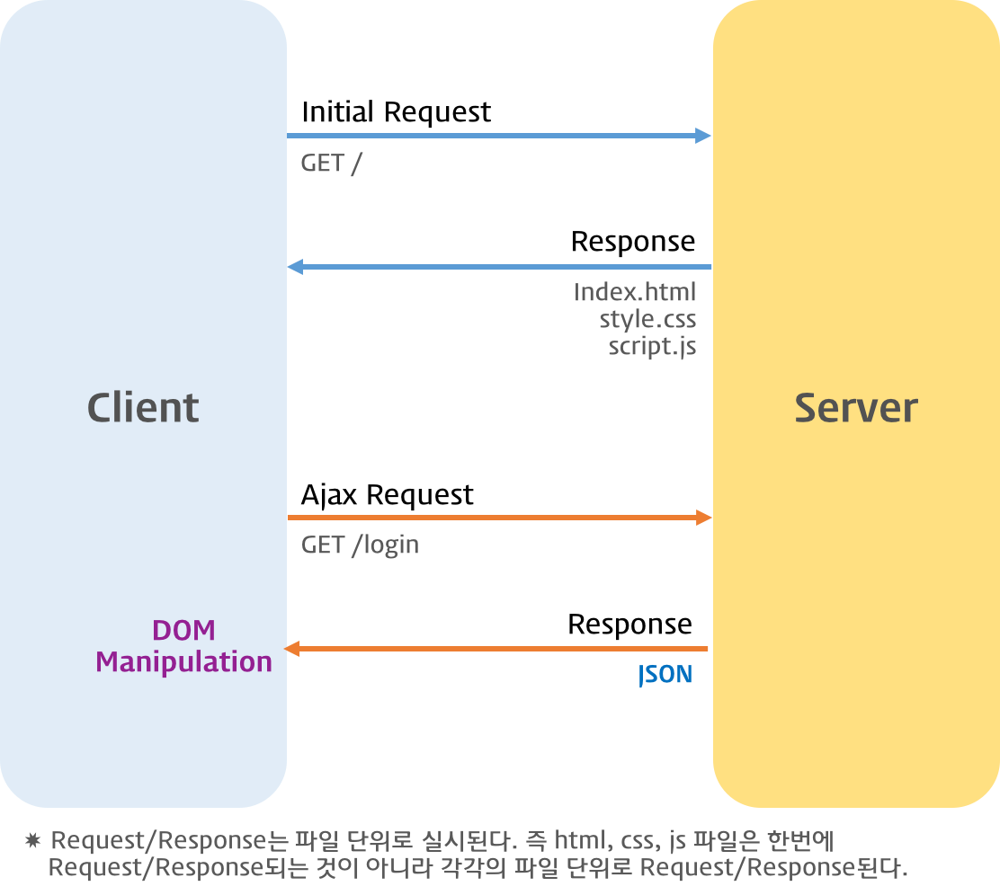
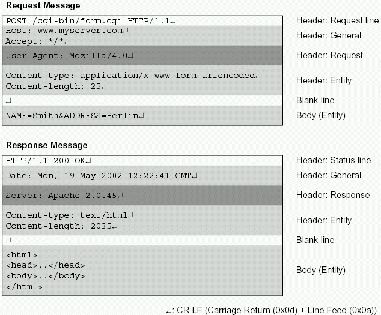
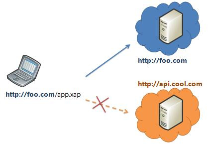

# 비동기식 처리 모델과 Ajax

## 1. Ajax (Asynchronous JavaScript and XML)

Ajax는 자바스크립트를 이용해서 **비동기적(Asynchronous)**으로 서버와 브라우저가 데이터를 교환할 수 있는 통신 방식을 의미한다.

서버로부터 웹페이지가 반환되면 화면 전체를 갱신해야 하는데 페이지 일부만을 갱신하고도 동일한 효과를 볼 수 있도록 하는 것이 Ajax이다.

IP - 전 세계 유니크한 통신 주소

도메인과 IP는 맵핑된다 (DNS에서 관리한다)

브라우저의 역할

* 서버와의 통신 (주소창에서)
* 통신 받은 결과를 브라우저에 렌더링

서버 하드에 있는 실제 파일을 읽어들여 메모리에 적재 후 랜선에 **아스키 코드**를 패킷단위로 전송

그걸 브라우저 메모리에 그대로 받아서 파싱하여 렌더링한다.




## 2. JSON (JavaScirpt Object Notation)

**JSON** (JavaScript Object Notation)은 클라이언트와 서버 간 데이터 교환을 위한 **데이터 포맷**을 말한다.

자바스크립트의 객체 리터럴과 매우 흡사하다. 하지만 **JSON은 순수한 텍스트로 구성된 규칙이 있는 데이터 구조이다.**

```javascript
{
    "name": "Kim",
    "gender": "male",
    "age": 20,
    "alive": true
}
```

**키는 반드시 큰따옴표로 둘러싸야한다.**


### 2.1. JSON.stringify

객체를 JSON 형식의 문자열로 변환한다.

```javascript
const obj = { name: 'Kim', gender: 'male', age: 20 };

// 객체 -> JSON 형식의 문자열
const strObj = JSON.stringify(obj);
console.log(typeof strObj, strObj);
// string {"name":"Kim","gender":"male","age":20}

// 객체 -> JSON 형식의 문자열 + prettify
const strPrettyObj = JSON.strignify(obj, null, 2);
console.log(typeof strPrettyObj, strPrettyObj);
/*
string {
  "name": "Kim",
  "gender": "male",
  "age": 20
}
*/

// replacer
// 값의 타입이 Number이면 필터링되어 반환되지 않는다.
function filter(key, value) {
    // undefined: 반환하지 않음
    return typeof value === 'number' ? undefined : value;
}

// 객체 -> JSON 형식의 문자열 + replacer + prettify
const strFilteredObj = JSON.stringify(obj, filter, 2);
console.log(typeof strFilteredObj, strFilteredObj);
/*
string {
  "name": "Lee",
  "gender": "male"
}
*/
```


### 2.2. JSON.parse

JSON.parse 메소드는 **JSON 데이터를** 가진 문자열을 **객체로** 변환한다.

>  서버로부터 브라우저로 전송된 JSON 데이터는 문자열이다. 이 문자열을 객체로서 사용하려면 객체화하여야 하는데 이를 역직렬화(**Deserializing**)이라 한다. 역직렬화를 위해 내장 객체 JSON의 static 메소드인 `JSON.parse`를 사용한다.

```javascript
const obj = { name: 'Kim', gender: 'male', age: 20 };

// 객체 -> JSON 형식의 문자열
const strObj = JSON.stringify(obj);
console.log(typeof strObj, strObj);
// string {"name":"Kim","gender":"male","age":20}

// JSON 형식의 문자열 -> 객체
const parseObj = JSON.parse(strObj);
console.log(typeof parseObj, parseObj); // object { name: 'Kim', gender: 'male' }


const arr = [1, 5, 'false'];

// 배열 객체 -> 문자열
const strArray = JSON.stringify(arr);
console.log(typeof strArray, strArray); // string [1,5,"false"]

// 문자열 -> 배열 객체
const parseArray = JSON.parse(strArray);
console.log(typeof parseArray, parseArray); // object [ 1, 5, 'false' ]

```

배열이 JSON 형식의 문자열로 변환되어 있는 경우 `JSON.parse`는 문자열을 배열 객체로 변환한다. **배열의 요소가 객체인 경우 배열의 요소까지 객체로 변환한다.**

```javascript
const todos = [
  { id: 1, content: 'HTML', completed: true },
  { id: 2, content: 'CSS', completed: true },
  { id: 3, content: 'JavaScript', completed: false }
];

// 배열 -> JSON 형식의 문자열
const str = JSON.stringify(todos);
console.log(typeof str, str);

// JSON 형식의 문자열 -> 배열
const parsed = JSON.parse(str);
console.log(typeof parsed, parsed);

```


## 3. XMLHttpRequest

브라우저는 `XMLHttpRequest` **객체**를 이용하여 Ajax 요청을 **생성하고 전송한다**. 서버가 브라우저의 요청에 대해 응답을 반환하면 **같은** `XMLHttpRequest` 객체가 그 결과를 처리한다.

마이크로소프트사에서 개발했다.

### 3.1. Ajax request

다음은 Ajax 요청 처리의 예이다.

```javascript
// XMLHttpRequest 객체의 생성
const xhr = new XMLHttpRequest();

// 비동기 방식으로 Request를 오픈한다
// xhr.open(Method, url, async?);
xhr.open('GET', '/users');

// Request를 전송한다
xhr.send();
```


#### 3.1.1. `XMLHttpRequest.open`

`XMLHttpRequest` 객체의 인스턴스를 생성하고 `XMLHttpRequest.open` 메소드를 사용하여 **서버로의 요청을 준비**한다. `XMLHttpRequest.open`의 사용법은 아래와 같다.

```javascript
XMLHttpRequest.open(method, url[, async]);
```

| 매개변수 | 설명                                                         |
| -------- | ------------------------------------------------------------ |
| method   | HTTP method ("GET", "POST", "PUT", "DELETE" 등)              |
| url      | 요청을 보낼 URL                                              |
| async    | 비동기 조작 여부. 옵션으로 **default는 true이며 비동기 방식으로 동작**한다. |


#### 3.1.2. `XMLHttpRequest.send`

`XMLHttpRequest.send` 메소드로 **준비된 요청을 서버에 전달**한다.

기본적으로 서버로 전송하는 데이터는 GET, POST 메소드에 따라 그 전송 방식에 차이가 있다.

* GET 메소드의 경우, URL의 일부분인 **쿼리문자열**(query string)로 데이터를 서버로 전송한다.
* POST 메소드의 경우, 데이터(**페이로드**)를 **Request Body에 담아** 전송한다.



`XMLHttpRequest.send` 메소드에는 **request body**에 담아 전송할 인수를 전달할 수 있다. 

```javascript
xhr.send(null);
// xhr.send('string');
// xhr.send(new Blob()); // 파일 업로드와 같이 바이너리 컨텐츠를 보내는 방법
// xhr.send({ form: 'data' });
// xhr.send(document);
```

만약 **요청 메소드가 GET인 경우, send 메소드의 인수는 무시되고 request body는 `null`로 설정된다.**


#### 3.1.3 `XMLHttpRequest.setRequestHeader`

`XMLHttpRequest.setRequestHeader` 메소드는 **HTTP Request Header**의 값을 설정한다. `setRequestHeader` 메소드는 **반드시 `XMLHttpRequest.open` 메소드 호출 이후에 호출한다.**

아래는 자주 사용하는 Request Header인 Content-type, Accept에 관한 설명이다.

**Content-type**

Content-type은 request body에 담아 **전송할 데이터의 MIME-type**(미디어 타입)의 정보를 표현한다. 자주 사용되는 MIME-type은 아래와 같다.

| 타입                        | 서브타입                                           |
| --------------------------- | -------------------------------------------------- |
| text 타입                   | text/plain, text/html, text/css, text/javascript   |
| Application 타입            | application/json, application/x-www-form-urlencode |
| File을 업로드하기 위한 타입 | multipart/formed-data                              |

다음은 request body에 담아 서버로 전송할 데이터의 MIME-type을 지정하는 예이다.

```javascript
// json으로 전송하는 경우
xhr.open('POST', '/users');

// 클라이언트가 서버로 전송할 데이터의 MIME-type 지정: json
xhr.setRequestHeader('Content-type', 'application/json');

const data = { id: 3, title: 'JavaScript', author: 'Kim', price: 5000  };

xhr.send(JSON.stringify(data));
```

```javascript
// x-www-form-urlencoded로 전송하는 경우
xhr.open('POST', '/users');

// 클라이언트가 서버로 전송할 데이터의 MIME-type 지정: x-www-form-urlencoded
// application/x-www-form-urlencoded는 key=value&key=value... 의 형태로 전송
xhr.setRequestHeader('Content-Type', 'application/x-www-form-urlencoded');

const data = { title: 'JavaScript', author: 'Kim', price: 5000 };

xhr.send(Object.keys(data).map(key => `${key}=${data[key]}`).join('&'));
```


**Accept**

HTTP 클라이언트가 서버에 요청할 때 **서버가 반환할 데이터의 MIME-type을 Accept로 지정**할 수 있다.

```javascript
// 서버가 반환할 데이터의 MIME-type 지정: json
xhr.setRequestHeader('Accept', 'application/json');
```

만약 Accept 헤더를 설정하지 않으면, send 메소드가 호출될 때 Accept 헤더가 `*/*`로 전송된다.


### 3.2. Ajax response

```javascript
// XMLHttpRequest 객체의 생성
const xhr = new XMLHttpRequest();

// XMLHttpRequest.readyState 프로퍼티가 변경(이벤트 발생)될 때마다
// onreadystatechange 이벤트 핸들러가 호출된다.
xhr.onreadystatechange = function (e) {
  // readyStates는 XMLHttpRequest의 상태(state)를 반환
  // readyState: 4 (Done, 서버 응답 완료)
  if (xhr.readyState !== XMLHttpRequest.DONE) return;

  // status는 response 상태 코드를 반환 : 200 (정상 응답)
  if (xhr.status === 200) console.log(xhr.responseText);
  else console.log('Error!');
};

```

`XMLHttpRequest.send` 메소드를 통해 서버에 Request를 전송하면 서버는 Response를 반환한다. 하지만 언제 Response가 클라이언트에 도달할 지는 알 수 없다. `XMLHttpRequest.onreadystatechange`는 Response가 클라이언트에 도달하여 발생된 이벤트를 감지하고 콜백 함수를 실행한다. 이때 이벤트는 Request에 어떠한 변화가 발생한 경우 (`XMLHttpRequest.readyState` 프로퍼티가 변경된 경우) 발생한다.

```javascript
// XMLHttpRequest 객체의 생성
const xhr = new XMLHttpRequest();

// 비동기 방식으로 Request를 오픈한다.
xhr.open('GET', 'data/test.json');

// Request를 전송한다.
xhr.send();

// XMLHttpRequest.readyState 프로퍼티가 변경(이벤트 발생)될 때마다 콜백함수(이벤트 핸들러)를 호출한다.
xhr.onreadystatechange = function (e) {
    // 이 함수는 Response가 클라이언트에 도달하면 호출된다.
};
```

XMLHttpRequest **객체는 Response가 클라이언트에 도달했는지를 추적할 수 있는 프로퍼티**인 `XMLHttpRequest.readyState`를 제공한다. 만일 `XMLHttpRequest.readyState`의 값이 4인 경우, 정상적으로 Response가 돌아온 경우이다.

| Value | State            | Description                                           |
| ----- | ---------------- | ----------------------------------------------------- |
| 0     | UNSENT           | XMLHttpRequest.open() 메소드 호출 이전                |
| 1     | OPENED           | XMLHttpRequest.open() 메소드 호출 완료                |
| 2     | HEADERS_RECEIVED | XMLHttpReqeust.send() 메소드 호출 완료                |
| 3     | LOADING          | 서버 응답 중(XMLHttpRequest.responseText 미완성 상태) |
| 4     | DONE             | 서버 응답 완료                                        |

```javascript
// XMLHttpRequest 객체의 생성
const xhr = new XMLHttpRequest();

// 비동기 방식으로 Request를 오픈한다.
xhr.open('GET', 'data/test.json');

// Request를 전송한다.
xhr.send();

// XMLHttpRequest.readyState 프로퍼티가 변경(이벤트 발생)될 때마다 콜백함수 (이벤트 핸들러)를 호출한다.
xhr.onreadystatechange = function (e) {
  // 이 함수는 Response가 클라이언트에 도달하면 호출된다.

  // readyState는 XMLHttpReqeust의 상태(state)를 반환
  // readyState: 4 -> DONE (서버 응답 완료)
  if (xhr.readyState !== XMLHttpRequest.DONE) return;

  // status는 response 상태 코드를 반환 : 200 -> 정상 응답
  if (xhr.status === 200) console.log(xhr.responseText);
  else console.log('Error!');
};

```

XMLHttpRequest의 readyState가 4인 경우, 서버 응답이 완료된 상태이므로 이후 XMLHttpRequest.status가 200(정상 응답)임을 확인하고 정상인 경우, **XMLHttpRequest.responseText**를 취득한다. XMLHttpReqeust.responseText에는 **서버가 전송한 데이터**가 담겨 있다.


## 4. Web Server

웹 서버는 브라우저와 같은 클라이언트로부터 HTTP 요청을 받아들이고 HTML 문서와 같은 웹 페이지를 반환하는 컴퓨터 프로그램이다.

Ajax는 웹 서버와의 통신이 필요하므로 예제를 실행하기 위해서는 웹서버가 필요하다. Node.js가 설치되어 있다면 Express로 간단한 웹서버를 생성한다.

```bash
$ cd ~/Desktop
$ mkdir server && cd server
$ npm init -y

## install express & nodemon
$ npm install express
$ nmp install -g nodemon

## controller
$ touch app.js

## creat public folder (root directory)
$ mkdir public

## start webserver
$ npm start
```


## 5. Ajax 예제

### 5.1. Load HTML

Ajax를 이용하여 웹페이지에 추가하기 가장 손쉬운 데이터 형식은 HTML이다. 별도의 작업 없이 전송받은 데이터를 DOM에 추가하면된다.

```html
<!-- 루트 폴더(webserver-express/public)/loadhtml.html -->
<!DOCTYPE html>
<html>
  <head>
    <meta charset="UTF-8">
    <link rel="stylesheet" href="https://poiemaweb.com/assets/css/ajax.css">
  </head>
  <body>
    <div id="content"></div>

    <script>
      // XMLHttpRequest 객체의 생성
      const xhr = new XMLHttpRequest();
      // 비동기 방식으로 Request를 오픈한다
      xhr.open('GET', 'data/data.html');
      // Request를 전송한다
      xhr.send();

      // Event Handler
      xhr.onreadystatechange = function () {
        // 서버 응답 완료 && 정상 응답
        if (xhr.readyState !== XMLHttpRequest.DONE) return;

        if (xhr.status === 200) {
          console.log(xhr.responseText);

          document.getElementById('content').innerHTML = xhr.responseText;
        } else {
          console.log(`[${xhr.status}] : ${xhr.statusText}`);
        }
      };
    </script>
  </body>
</html>
```

```html
<!-- 루트 폴더(webserver-express/public)/data/data.html -->
<div id="tours">
  <h1>Guided Tours</h1>
  <ul>
    <li class="usa tour">
      <h2>New York, USA</h2>
      <span class="details">$1,899 for 7 nights</span>
      <button class="book">Book Now</button>
    </li>
    <li class="europe tour">
      <h2>Paris, France</h2>
      <span class="details">$2,299 for 7 nights</span>
      <button class="book">Book Now</button>
    </li>
    <li class="asia tour">
      <h2>Tokyo, Japan</h2>
      <span class="details">$3,799 for 7 nights</span>
      <button class="book">Book Now</button>
    </li>
  </ul>
</div>
```


### 5.2 Load JSON

서버로부터 브라우저로 전송된 JSON 데이터는 문자열이다. 이 **문자열을 객체화**해야 하는데 이를 역직렬화(**Deserializing**)이라 한다. 역직렬화를 위해서 내장 객체 JSON의 static 메소드인 `JSON.parse()`를 사용한다.

```html
<!-- 루트 폴더(webserver-express/public)/loadjson.html -->
<!DOCTYPE html>
<html>
  <head>
    <meta charset="UTF-8">
    <link rel="stylesheet" href="https://poiemaweb.com/assets/css/ajax.css">
  </head>
  <body>
    <div id="content"></div>

    <script>
      // XMLHttpRequest 객체의 생성
      const xhr = new XMLHttpRequest();

      // 비동기 방식으로 Request를 오픈한다
      xhr.open('GET', 'data/data.json');
      // Request를 전송한다
      xhr.send();

      xhr.onreadystatechange = function () {
        // 서버 응답 완료 && 정상 응답
        if (xhr.readyState !== XMLHttpRequest.DONE) return;

        if (xhr.status === 200) {
          console.log(xhr.responseText);

          // Deserializing (String → Object)
          responseObject = JSON.parse(xhr.responseText);

          // JSON → HTML String
          let newContent = '<div id="tours"><h1>Guided Tours</h1><ul>';

          responseObject.tours.forEach(tour => {
            newContent += `<li class="${tour.region} tour">
                <h2>${tour.location}</h2>
                <span class="details">${tour.details}</span>
                <button class="book">Book Now</button>
              </li>`;
          });

          newContent += '</ul></div>';

          document.getElementById('content').innerHTML = newContent;
        } else {
          console.log(`[${xhr.status}] : ${xhr.statusText}`);
        }
      };
    </script>
  </body>
</html>
```


 경로: 루트 폴더(webserver-express/public)/data/data.json 

```json
{
  "tours": [
    {
      "region": "usa",
      "location": "New York, USA",
      "details": "$1,899 for 7 nights"
    },
    {
      "region": "europe",
      "location": "Paris, France",
      "details": "$2,299 for 7 nights"
    },
    {
      "region": "asia",
      "location": "Tokyo, Japan",
      "details": "$3,799 for 7 nights"
    }
  ]
}
```

http://localhost:3000/loadjson.html


### 5.3 Load JSONP

요청에 의해 웹페이지가 전달된 서버와 동일한 도메인의 서버로 부터 전달된 데이터는 문제없이 처리할 수 있다 (??). 하지만 보안상의 이유로 다른 도메인(http와 https, 포트가 다르면 다른 도메인으로 간주한다)으로의 요청(크로스 도메인 요청)은 제한된다. 이것을 동일출저원칙(Same-origin policy)이라 한다.



**동일출저원칙을 우회**하는 방법은 세 가지가 있다.

#### 1. 웹서버의 프록시 파일

서버에 원격 서버로부터(??) 데이터를 수집하는 별도의 기능을 추가하는 것이다. 이를 프록시(Proxy)라 한다.

#### 2. JSONP

script 태그의 원본 주소에 대한 제약은 존재하지 않는데, 이것을 이용하여 다른 도메인의 서버에서 데이터를 수집하는 방법이다. 자신의 서버에 함수를 정의하고 다른 도메인의 서버에 얻고자 하는 데이터를 인수로 전달하는 함수 호출문을 로드하는 것이다.

```html
<!DOCTYPE html>
<html lang="en">
<head>
  <meta charset="UTF-8">
  <meta name="viewport" content="width=device-width, initial-scale=1.0">
  <link rel="stylesheet" href="https://poiemaweb.com/assets/css/ajax.css">
  <title>Ajax Practice 3</title>
</head>
<body>
  <div id="content"></div>
  <script>
    function showTours(data) {
      console.log(data);

      // JSON -> HTML String
      let newContent = `<div id="tours">
          <h1>Guided Tours</h1>
        <ul>`;
    
      data.tours.forEach(tour => {
        newContent += `<li class="${tour.region} tour">
            <h2>${tour.location}</h2>
            <span class="details">${tour.details}</span>
            <button class="book">Book Now</button>
          </li>`;
      });

      newContent += '</ul></div>';

      document.querySelector('#content').innerHTML = newContent;
    }
  </script>
  <script src="https://poiemaweb.com/assets/data/data-jsonp.js"></script>
  <!-- 
    <script>
      showTours({
        "tours": [
          {
            "region": "usa",
            "location": "New York, USA",
            "details": "$1,899 for 7 nights"
          },
          {
            "region": "europe",
            "location": "Paris, France",
            "details": "$2,299 for 7 nights"
          },
          {
            "region": "asia",
            "location": "Tokyo, Japan",
            "details": "$3,799 for 7 nights"
          }
        ]
      });
    </script>
   -->
</body>
</html>
```


#### 3. Cross-Origin Resource Sharing

HTTP 헤더에 추가적으로 정보를 추가하여 브라우저와 서버가 서로 통신해야 한다는 사실을 알게하는 방법이다. W3C 명세에 포함되어 있지만, 최신 브라우저에서만 동작하며 서버에 HTTP 헤더를 설정해 주어야 한다.

Node.js로 구현한 서버의 경우, CORS Package를 사용하면 간단하게 Cross-Origin Resource Sharing을 구현할 수 있다.

```javascript
const express = require('express');
const cors = require('cors');
const app = express();

app.use(cors());

app.get('/products/:id', function (req, res, next) {
  res.json({msg: 'This is CORS-enabled for all origins!'})        
});

app.listen(80, function () {
  console.log('CORS-enabled web server listening on port 80') 
});
```

