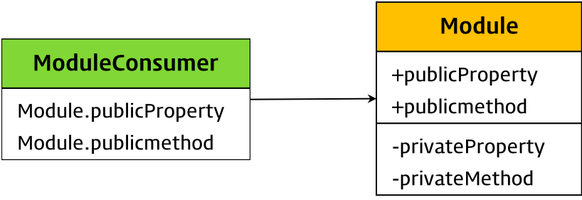

# 모듈 (Module)

모듈이란 애플리케이션을 구성하는 개별적 요소로서, **재사용 가능한 코드 조각**을 말한다. 모듈은 세부 사항을 캡슐화하고 공개가 필요한 API만을 외부에 노출한다.



* 일반적으로 **모듈은 파일 단위로 분리**되어 있다.
* 애플리케이션은 필요에 따라 **명시적으로 모듈을 로드하여 재사용**한다.
* 모듈은 기능별로 분리되어 작성되므로 코드의 단위를 명확히 분리할 수 있다.
* 재사용성이 좋아서 개발 효율성과 유지보수성을 높일 수 있다.

자바스크립트는 웹페이지의 보조적인 기능을 수행하기 위해 만들어진 태생적 한계로 다른 언어에 비해 부족한 부분이 있는 것은 사실이다. 그 대표적인 것이 모듈 기능이 없는 것이다. 자바스크립트를 클라이언트 사이드에 국한하지 않고 범용적으로 사용하고자 하는 움직임이 생기며, 모듈 기능은 반드시 해결해야 하는 핵심 과제가 되었고 이런 상황에서 제안된 것이 **CommonJS**와 **AMD(Asynchronous Module Definition)**이다.

ES6에서는 클라이언트 사이드 자바스크립트에서도 동작하는 모듈 기능을 추가하였다. 2019년 5월 기준, 모던 브라우저(Chrome 61, FF 60, SF 10.1, Edge 16 이상)에서 ES6 모듈을 사용할 수 있다.

`<script>` 태그에 `type="module"` 어트리뷰트를 추가하면 로드된 자바스크립트 파일은 **모듈로서 동작한다.** 모듈의 파일 확장자는 `mjs`를 권장한다.

```html
<script type="module" src="lib.mjs"></script>
<script type="module" src="app.mjs"></script>
```

**단, 아래와 같은 이유로** 아직까지는 Webpack 등의 모듈 번들러를 사용하는 것이 일반적이다.

* IE를 포함한 구형 브라우저는 ES6 모듈을 지원하지 않는다.
* 브라우저의 ES6 모듈 기능을 사용하더라도 트랜스파일링이나 번들링이 필요하다.
* 아직 지원하지 않는 기능(Bare import)이 있다.


## 1. 파일 스코프

모듈은 **파일 스코프**를 갖는다. 즉, 모듈 내에서 `var` 키워드로 선언한 변수는 더이상 전역 변수가 아니며 `window` 객체의 프로퍼티도 아니다.

```javascript
// foo.js
var x = 'foo';

console.log(x);
```

```javascript
// bar.js
// 중복 선언이 아니다. 스코프가 다른 변수이다.
var x = 'bar';

console.log(x);
```

```html
<!DOCTYPE html>
<html>
    <body>
        <script type="module" src="foo.js"></script>
        <script type="module" src="bar.js"></script>
    </body>
</html>
```

모듈 내에서 선언한 변수는 모듈 외부에서 참조할 수 없다. 스코프가 다르기 때문이다.


## 2. export 키워드

모듈은 독립적은 파일 스코프를 갖기 때문에 모듈 안에 선언한 모든 것들은 기본적으로 해당 모듈 내부에서만 참조할 수 있다. 만약 모듈 안에 선언한 항목을 외부에 공개하여 다른 모듈들이 사용할 수 있게 하고 싶다면 `export` 해야한다. 선언된 변수, 함수, 클래스 모두 `export` 할 수 있다.

모듈을 공개하려면 선언문 앞에 `export` 키워드를 사용한다.

```javascript
// lib.js
// 변수 export
export const pi = Math.PI;

// 함수 export
export function square(x) {
  return x * x;
}

// 클래스의 공개
export class Person {
  constructor(name) {
    this.name = name;
  }
}
```


export 대상을 모아 하나의 객체로 구성하여 한번에 export할 수도 있다.

```javascript
// lib.js
const pi = Math.PI;

function square(x) {
  return x * x;
}

class Person {
  constructor(name) {
    this.name = name;
  }
}

// 변수, 함수 클래스를 하나의 객체로 구성하여 공개
export { pi, square, Person };
```


## 3. import 키워드

export한 모듈을 로드하려면 export한 이름으로 `import`한다.

```javascript
// app.js
// 같은 폴더 내의 lib.js 모듈을 로드, 확장자 js는 생략 가능.
// 단, 브라우저 환경에서는 모듈의 파일 확장자를 생략할 수 없다.
import { pi, square, Person } from './lib';

console.log(pi);
console.log(square(10));
console.log(new Person('Lee'));

```

각각의 이름을 지정하지 않고 하나의 이름으로 한꺼번에 import 할 수도 있다. 이때 import되는 항목은 as 뒤에 지정한 이름의 변수에 할당된다.

```javascript
// app.js
import * as lib from './lib';

console.log(lib.pi);
console.log(lib.square(10));
console.log(new lib.Person('Lee'));
```

