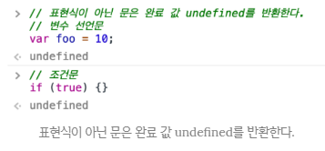
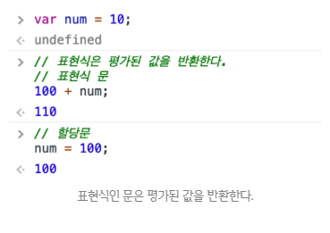

# 연산자

## 1. 문과 표현식

**문(statement)은 하나 이상의 표현식과 키워드의 조합으로 구성된 자바스크립트 엔진에게 내리는 명령**이다. 문의 집합으로 이루진 것이 바로 프로그램이며 문을 작성하고 순서에 맞게 나열하는 것이 프로그래밍이다.

* 선언문
* 표현식 (문) - 할당문
* 조건문
* 반복문


문은 구성되며 세미콜론(`;`)으로 끝나야하지만, 코드 블록 뒤에는 세미콜론을 붙이지 않는다.


## 2. 표현식인 문과 표현식이 아닌 문

표현식인 문은 **값으로 평가될 수 있는 문**이며, 표현식이 아닌 문은 **값으로 평가될 수 없는 문**을 말한다. 이 둘을 구별하기 위한 가장 간단한 방법은 각각을 **변수에 할당해 보는 것이다**.

```javascript
// 변수 선언문은 표현식이 아닌 문이다.
var x;

// 할당문은 그 자체가 표현식이지만 완전한 문이기도 하다. 즉, 할당문은 표현식인 문이다.
x = 100;
```


**완료 값 (Completion value)** - 표현식이 아닌 문은 언제나 `undefined`를 출력한다. 이를 **완료 값**이라 한다. 완료 값은 다른 값과 같이 변수에 할당할 수 없다.





## 3. 연산자란?

**연산자(Operator)**는 하나 이상의 표현식을 대상으로 산술, 할당, 비교, 논리, 타입, 지수 **연산(operation) 등을 수행해 하나의 값을 만든다.** 이때 연산의 대상을 **피연산자 (Operand)라 한다.** 


## 4. 산술 연산자

### 4.1. 이항 산술 연산자

2개의 피연산자를 산술 연산하여 숫자 타입의 값을 만든다. 모든 이항 산술 연산자는 피연산자의 값을 변경하는 부수 효과 (Side effect)가 없다.

| 이항 산술 연산자 |  의미  | 부수 효과 |
| :--------------: | :----: | :-------: |
|        +         |  덧셈  |     X     |
|        -         |  뺄셈  |     X     |
|        *         |  곱셈  |     X     |
|        /         | 나눗셈 |     X     |
|        %         | 나머지 |     X     |


### 4.2. 단항 산술 연산자

1개의 피연산자를 산술 연산하여 숫자 타입의 값을 만든다. 주의할 것은 이항 산술 연산자와는 달리 **증가/감소(++/--) 연산자는 피연산자의 값을 변경하는 부수 효과가 있다.** 다시 말해 증가/감소 연산을 하면 피연산자의 값이 바뀐다.

| 단항 산술 연산자 | 의미                                                 | 부수 효과 |
| :--------------: | ---------------------------------------------------- | :-------: |
|        ++        | 증가                                                 |     O     |
|        --        | 감소                                                 |     O     |
|        +         | 어떠한 효과도 없다. 음수를 양수로 반전하지도 않는다. |     X     |
|        -         | 양수를 음수로, 음수를 양수로 반전한 값을 반환한다    |     X     |


증가/감소(++/--) 연산자는 위치에 의미가 있다.

- **피연산자 앞에** 위치한 **전위 증가/감소** 연산자(**Prefix increment/decrement operator**)는 먼저 피연산자의 값을 증가/감소시킨 후, 다른 연산을 수행한다.

- **피연산자 뒤에** 위치한 **후위 증가/감소** 연산자(**Postfix increment/decrement operator**)는 먼저 다른 연산을 수행한 후, 피연산자의 값을 증가/감소시킨다.

  ``` javascript
  var x = 5, result;
  
  // 선할당 후증가 (Postfix increment operator)
  result = x++; // result에 x의 값을 할당한 후, x를 1 증가
  console.log(result, x); // 5 6
  
  // 선증가 후할당 (Prefix increment operator)
  result = ++x; // x의 값을 1 증가시킨 후, result에 할당
  console.log(result, x); // 7 7
  
  // 선할당 후감소 (Postfix decrement operator)
  result = x--; // result에 x의 값을 할당한 후, x를 1 감소
  console.log(result, x); // 7 6
  
  // 선감소 후할당 (Prefix decrement operator)
  result = --x; // x의 값을 1 감소시킨 후, result에 할당
  console.log(result, x); // 5 5
  ```


**(+)** 단항 연산자는 피연산자에 어떠한 효과도 없다. 음수를 양수로 반전하지도 않는다. 그런데 **숫자 타입이 아닌 피연산자에 사용하면 피연산자를 숫자 타입으로 변환하여 반환한다.** **이때 피연산자를 변경하는 것은 아니고,** 숫자 타입으로 변환한 값을 생성해서 반환한다. 따라서 부수 효과는 없다.

``` javascript
// 아무런 효과가 없다.
+10;    // -> 10
+(-10); // -> -10

// 문자열을 숫자로 타입 변환한다.
+'10'; // -> 10

// 불리언 값을 숫자로 타입 변환한다.
+true; // -> 1

// 불리언 값을 숫자로 타입 변환한다.
+false; // -> 0

// 문자열을 숫자로 타입 변환할 수 없으므로 NaN을 반환한다.
+'Hello'; // -> NaN

// 애초에 위와 같은 문법으로 코딩을 하지말자.
```


**(–)** 단항 연산자는 피연산자의 부호를 반전한 값을 반환한다. (+) 단항 연산자와 마찬가지로 **숫자 타입이 아닌 피연산자에 사용하면 피연산자를 숫자 타입으로 변환하여 반환한다.** **이때 피연산자를 변경하는 것은 아니고,** 부호를 반전한 값을 생성해서 반환한다. 따라서 부수 효과는 없다.

```javascript
// 부호를 반전한다.
-(-10); // -> 10

// 문자열을 숫자로 타입 변환한다.
-'10'; // -> -10

// 불리언 값을 숫자로 타입 변환한다.
-true; // -> -1

// 문자열을 숫자로 타입 변환할 수 없으므로 NaN을 반환한다.
-'Hello'; // -> NaN
```


### 4.3. 문자열 연결 연산자

**(+)** **연산자는 피연산자 중 하나 이상이 문자열인 경우 문자열 연결 연산자로 동작한다.**

```javascript
// 문자열 연결 연산자
'1' + 2; // -> '12'
1 + '2'; // -> '12'
```


##### 암묵적 타입 변환 (Implicit coercion) - 강제 타입 변환 (Type coercion)

``` javascript
// true는 1로 타입 변환된다.
1 + true; // -> 2

// false는 0으로 타입 변환된다.
1 + false; // -> 1

// null는 0으로 타입 변환된다.
1 + null; // -> 1

// undefined는 숫자로 타입 변환되지 않는다.
+undefined;    // -> NaN
1 + undefined; // -> NaN
```

**(주의)** 개발자의 의도와는 상관없이 자바스크립트 엔진에 의해 **암묵적으로 타입이 자동 변환되기도 한다.**


## 5. 할당 연산자

**할당 연산자**는 우항에 있는 피연산자의 평가 결과를 좌항에 있는 변수에 할당.

| 할당 연산자 | 사례   | 동일 표현 | 부수 효과 |
| :---------: | ------ | --------- | :-------: |
|      =      | x = 5  | x = 5     |     O     |
|     +=      | x += 5 | x = x + 5 |     O     |
|     -=      | x -= 5 | x = x - 5 |     O     |
|     *=      | x *= 5 | x = x * 5 |     O     |
|     /=      | x /= 5 | x = x / 5 |     O     |
|     %=      | x %= 5 | x = x % 5 |     O     |


## 6. 비교 연산자

### 6.1. 동등 / 일치 비교 연산자

| 비교 연산자 | 의미        | 사례    | 설명                     | 부수 효과 |
| :---------: | ----------- | ------- | ------------------------ | :-------: |
|     ==      | 동등 비교   | x == y  | x와 y의 값이 같음        |     X     |
|     ===     | 일치 비교   | x === y | x와 y의 값과 타입이 같음 |     X     |
|     !=      | 부동등 비교 | x != y  | x와 y의 값이 다름        |     X     |
|     !==     | 불일치 비교 | x !== y | x와 y의 값과 타입이 다름 |     X     |

**(주의)** 동등 비교 연산자는 **타입**에 관계없이 **값**이 같으면 `true`를 반환함. **일치 비교 연산자**를 사용하도록 하자. 단, 일치 비교 연사자에서는 `NaN`을 주의하자.

``` javascript
// NaN은 자신과 일치하지 않는 유일한 값이다.
NaN === NaN; // false

// 빌트인 함수 isNan()은 주어진 값이 NaN인지 체크하고 결과를 반환한다.
isNaN(NaN); // true
isNaN(10);  // false
isNaN(1 + undefined); // true
```


## 6.2. 대소 관계 비교 연산자

피연산자의 크기를 비교하여 불리언 값을 반환한다.

| 대소 관계 비교 연산자 | 예제   | 설명                  | 부수효과 |
| :-------------------: | :----- | :-------------------- | :------: |
|           >           | x > y  | x가 y보다 크다        |    X     |
|           <           | x < y  | x가 y보다 작다        |    X     |
|          >=           | x >= y | x가 y보다 같거나 크다 |    X     |
|          <=           | x <= y | x가 y보다 같거나 크다 |    X     |


## 7. 삼항 조건 연산자

조건식의 평가 결과에 따라 반환할 값을 결정한다. 자바스크립트의  **유일한** 삼항 연산자이며, 부수 효과는 없다.

``` javascript
조건식 ? (조건식이 true일때 반환할 값) : (조건식이 false일때 반환할 값)
```


만약 조건식의 평가 결과가 boolean 값이 아니면 **boolean 값으로 암묵적 타입 변환된다.**

``` javascript
// example 1
var x = 2;
var result = x % 2 ? '홀수' : '짝수'; // 2 % 2는 0이고 0은 false로 암묵적 타입 변환된다.
console.log(result); // 짝수

// example 2
var age = 26;
var beverage = (age >= 21) ? "Beer" : "Juice"; // (age >= 21)는 true
console.log(beverage); // "Beer"

// example 3 - handling a value that may be null
function greeting(person) {
    var name = person ? person.name : "stranger";
    return "Howdy, " + name;
}

console.log(greeting({name: 'Alice'}));  // "Howdy, Alice"
console.log(greeting(null));             // "Howdy, stranger"
```

**삼항 조건 연산자 표현식은 값으로 평가할 수 있는 표현식인 문이다.** 따라서 삼항 조건 연산자식은 다른 표현식의 일부가 될 수 있어 매우 유용하다.


## 8. 논리 연산자

| 논리 연산자 | 의미 | 부수 효과 |
| :---------: | :--: | :-------: |
|    \|\|     |  OR  |     X     |
|     &&      | AND  |     X     |
|      !      | NOT  |     X     |


논리 부정(!) 연산자는 언제나 불리언 값을 반환한다. **단, 피연산자는 반드시 불리언 값일 필요는 없다. 만약 피연산자가 불리언 값이 아니면 불리언 타입으로 암묵적 타입 변환된다.**

``` javascript
// 암묵적 타입 변환
!0;       // -> true
!'Hello'; // -> false, 1개 이상의 문자를 포함한 문자열은 true로 인식된다
```


**드 모르간의 법칙**

복잡한 표현식을 좀 더 가독성 좋은 표현식으로 변환할 수 있다.

```javascript
!(x || y) === (!x && !y)
!(x && y) === (!x || !y)
```


## 9. 쉼표 연산자

쉼표(,) 연산자는 왼쪽 피연산자부터 차례대로 피연산자를 평가하고 마지막 피연산자의 평가가 끝나면 **마지막 피연산자의 평가 결과를 반환한다.**

``` javascript
var x, y, z;

x = 1, y = 2, z = 3; // 3
```


## 10. `typeof` 연산자

`typeof()` 연산자는 자신의 뒤에 위치한 피연산자의 데이터 타입을 문자열로 반환한다. `typeof()` 연산자는 7가지 문자열 (string, number, boolean, undefined, symbol, object, function) 중 하나를 반환한다. **null을 반환하는 경우는 없으며, 함수의 경우 function을 반환한다.**

``` javascript
typeof ''              // -> "string"
typeof 1               // -> "number"
typeof NaN             // -> "number"
typeof true            // -> "boolean"
typeof undefined       // -> "undefined"
typeof Symbol()        // -> "symbol"
typeof null            // -> "object" ????????????????? JS 첫 번째 버전의 버그
typeof []              // -> "object"
typeof {}              // -> "object"
typeof new Date()      // -> "object"
typeof /test/gi        // -> "object"
typeof function () {}  // -> "function"
```

따라서, null 타입을 확인할 때는 일치 연산자 (===)를 사용

``` javascript
var foo = null;

typeof foo === null; // -> false
foo === null;        // -> true
```


## 10. 지수 연산자 (Math.pow(n, e))

``` javascript
// ES 7
5 ** 2;   // -> 25
5 ** 2.5; // -> 55.90169943749474
5 ** 0;   // -> 1
5 ** -2;  // -> 0.04
(-5) ** 2; // 음수를 밑으로 계산하려면 괄호로 묶어야 한다.

// Before ES 7
Math.pow(5, 2);   // -> 25
Math.pow(5, 2.5); // -> 55.90169943749474
Math.pow(5, 0);   // -> 1
Math.pow(5, -2);  // -> 0.04
```

지수 연산자는 **모든 이항 연산자보다 우선 순위가 높다.**