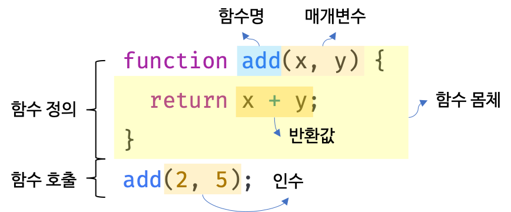
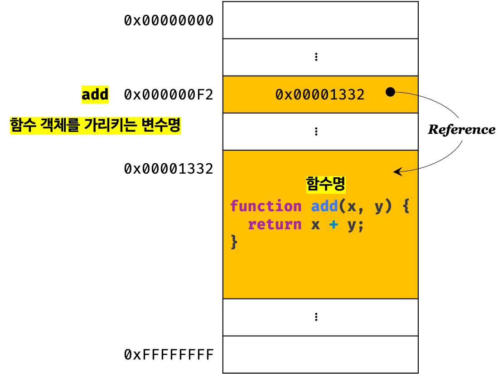
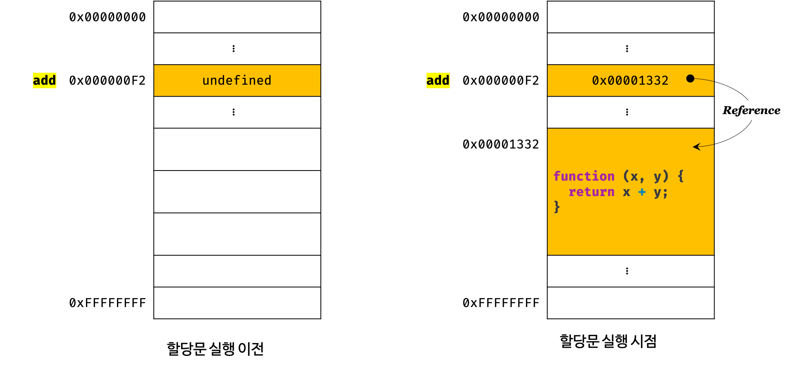

# Function (함수)

### 함수란?

자바스크립트에서 **함수**는 스코프, 실행 컨텍스트, 클로저, 생성자 함수에 의한 객체 생성, 메소드, `this`, 프로토타입, 모듈화 등 많은 개념과 얽혀있는 굉장히 중요한 개념이다.

자바스크립트에서는 함수 자체가 값이다.

함수는 일급 객체이므로 일반 객체의 특징 (프로퍼티)를 포함하며, 함수의 특징 또한 가지고 있다 (tba).

프로그래밍 언어의 함수는 일련의 과정을 문 (statement)들로 구현하고 코드 블록으로 감싸서 하나의 **실행 단위**로 정의한 것이다. 또한, 함수의 입력을 전달받는 변수를 **매개변수(인자, parameter)**, 입력을 **인수 (argument),** 출력을 **반환값 (return value)**라 한다. 또한 함수는 여러 개 존재할 수 있으므로 특정 함수를 구별하기 위해 **식별자인 함수 이름**을 사용할 수 있다.

**일반 객체는 호출할 수 없지만 함수는 호출할 수 있다 (둘 다 객체인데 무슨 차이인가).**




함수는 **함수 정의 (Function Definition)**를 통해 생성하고, 인수 (argument)를 매개변수를 통해 함수에게 전달하여 **함수 호출**한다.

```javascript
// 함수 정의 (함수 선언문)
function add(x, y) {
    return x + y;
}

// 함수 호출
var result = add(2, 5); // 2, 5 as argument
console.log(result); // 7
```

함수 내부에 선언된 변수는 함수 내부의 문들 중에서 가장 먼저 실행된다 (변수 호이스팅 in 함수 statements). 즉, 변수 호이스팅도 스코프를 탄다.

---

### 함수의 사용 이유

동일한 작업을 반복적으로 수행해야 한다면 코드를 중복해서 작성하는 것 보다 미리 정의된 함수를 재사용하는 것이 효율적이다. 함수는 몇 번이든 호출할 수 있으므로 **코드의 재사용**이라는 측면에서 매우 유용하다. 코드의 중복을 억제하고 재사용성을 높이는 함수는 **유지보수의 편의성을 높이고 실수를 줄여 코드의 신뢰성을 높이는 효과가 있다.**

---

### 함수 리터럴

함수 리터럴은 `function` 키워드, 함수 이름, 매개변수 목록, 그리고 함수 몸체로 구성된다.

```javascript
// 변수에 함수 리터럴을 할당
var add = function add(x, y) {
    return x + y;
};
```

* 함수 이름
  * 함수 이름은 **식별자**이다. 따라서 식별자 네이밍 규칙을 준수해야 한다.
  * 함수 이름은 **함수 몸체 내에서만 참조할 수 있는 식별자다 (??).**
  * 함수 이름은 생략할 수 있다. 이름이 있는 함수를 기명 함수 (named function), 함수 이름이 없는 함수를 익명 함수 (anonymous function)라 한다.
* 매개변수 목록
  * **0개 이상의** 매개변수를 괄호로 감싸고 쉼표로 구분한다.
  * 매개변수에는 인수가 할당된다.
  * 매개변수는 **함수 몸체 내에서 변수와 동일하게 취급된다.** 따라서 매개변수도 변수와 마찬가지로 식별자 네이밍 규칙을 준수해야 한다.
* 함수 몸체
  * 함수 호출시 일괄적으로 실행될 문들을 하나의 실행 단위로 정의한 **코드 블럭**


함수 리터럴도 평가되어 값을 생성하며 이 값은 **객체이다.** 함수는 객체라는 사실은 다른 프로그래밍 언어와 구별되는 자바스크립트의 중요한 특징이다. 

---

### 함수 정의

함수는 저의하는 방법은 4가지가 있다.

* 함수 선언문 (Function Declaration, Function Statement)

  ``` javascript
  function add(x, y) {
      return x + y;
  }
  ```

* 함수 표현식 (Function Expression)

  ``` javascript
  var add = function (x, y) {
      return x + y;
  };
  ```

* Function 생성자 함수 (Function Constructor)

  ```javascript
  var add = new Function('x', 'y', 'return x + y');
  ```

* 화살표 함수 (Arrow Functin): ES6

  ```javascript
  var add = (x, y) => x + y;
  ```


> 변수는 선언(Declare)한다고 했지만 함수는 정의(Define)한다고 표현했다. 함수 선언문이 평가되면, 식별자가 **암묵적으로 생성되고 함수 객체가 할당된다 (undefined가 아니다).** 따라서 ECMAScript 사양에서도 변수에는 선언 (variable declaration), 함수에는 정의(function definition)라고 표현하고 있다.


#### 1. 함수 선언문

함수 선언문은 함수 리터럴 표기법과 형태가 동일하다. 단, **함수 선언문은 함수 이름을 생략할 수 없다.**

``` javascript
// 함수 선언문
function add(x, y) {
    return x + y;
}

// 함수 참조
// console.dir은 console.log와는 달리 함수 객체의 프로퍼티까지 출력한다.
// 단, Node.js 환경에서는 console.log와 같은 결과가 출력된다.
console.dir(add); // f add(x, y)

// 함수 호출
console.log(add(2, 5)); // 7
```

함수 리터럴을 설명하는 부분에서 "함수 이름은 함수 몸체 내에서만 참조할 수 있는 식별자다"라고 했다. 이 말은 함수 이름 `add`를 함숫 몸체 외부에서는 **참조할 수 없다는 의미이다.** 그렇다면 함수를 참조하고 호출할 때 사용한 `add`는 도대체 무엇인가? **함수 이름은 함수 몸체 외부에서 참조할 수 없는 식별자임에도 불구하고 함수 몸체 외부에서 참조하고 있다.**

함수 선언문을 함수 문(Function Statement)이라고도 부른다. 함수 리터럴과 형식은 동일하지만 **함수 선언문은 함수를 정희하는 표현식이 아닌 문으로 해석된다.**

함수 선언문은 실행되어 함수 객체를 생성한다. 이때 생성된 함수 객체를 할당할 **변수가 필요하다.** 함수 객체를 변수에 할당하지 않으면 생성된 함수 객체를 사용할 수 없고 아무도 참조하고 있지 않는 함수 객체는 가비지 컬렉터에 의해 메모리에서 해제된다. 따라서, **자바스크립트 엔진은 함수 이름과 동일한 이름의 식별자를 암묵적으로 선언하고 생성된 함수 객체를 할당한다.** 이를 의사 코드 (pseudo code)로 표현하면 아래와 같다.

```javascript
var add = function add(x, y) {
    return x + y;
}

console.log(add(2,5)); // 7
```



**함수는 함수 이름으로 호출하는 것이 아니라 함수 객체를 가리키는 변수로 호출한다.** 즉, 함수 선언문 방식으로 생성된 함수를 호출한 것은 함수 이름 `add`가 아닌, **자바스크립트 엔진이 암묵적으로 생성한 변수 `add`인 것이다.** 함수 이름과 변수 이름이 일치하므로 함수 이름으로 호출되는 듯 보이지만 사실은 변수로 호출된 것이다.

**결론적으로 자바스크립트 엔진은 함수 선언문을 함수 표현식으로 변환하여 함수 객체를 생성한다고 생각할 수 있다.**

**자바스크립트 엔진은 함수 리터럴이 표현식 자리에 오면 값으로 해석하고 그 외는 선언문으로 해석한다.**

``` javascript
// 함수 선언문
function add(x, y) {
    return x + y;
}
// 함수 리터럴 (값)을 변수에 할당
var add = function add(x, y) {
    return x + y;
}
// 함수 리터럴 - 그룹 연산자로 함수 리터럴을 묶어 값으로 평가됨
(function add(x, y) {
    return x + y;
})
```


#### 2. 함수 표현식

자바스크립트의 함수는 객체이다. 자바스크립트의 **객체는 값처럼 변수에 할당 할 수 있고, 객체의 프로퍼티 값이 될 수도 있으며, 배열의 요소가 될 수도 있다.** 이러한 객체를 **일급 객체(first-class object)**라한다.

자바스크립트의 함수는 일급 객체이므로 **함수 리터럴로 생상한 함수 객체를 변수에 할당할 수 있다.** 이러한 함수 정의 방식을 **함수 표현식 (Function Expression)**이라 한다.

```javascript
var add = function(x, y) {
    return x + y;
};

console.log(add(2,5));
```

함수 리터럴의 함수 이름은 생략할 수 있다. 이러한 함수를 **익명 함수 (anonymous function)**이라 한다. 함수 표현식의 함수 리터럴은 함수 이름을 생략하는 것이 일반적이다. 

함수 선언문에서 언급했듯이, 함수를 호출할 때는 함수 이름이 아니라 함수 객체를 카리키는 변수를 사용하여야 한다. 함수 이름은 함수 몸체 내부에서만 유효한 식별자이므로 함수 이름으로 함수를 호출할 수 없다.

```javascript
// 가명 함수 표현식
var add = function foo(x, y) {
    return x + y;
};

// 함수 객체를 가리키는 변수로 호출
console.log(add(2, 5)); // 7

// 함수 이름으로 호출하면 ReferenceError가 발생한다.
// 함수 이름은 함수 몸체 내부에서만 유효한 식별자이다.
console.log(foo(2, 5)); // ReferenceError: foo is not defined
```

자바스크립트 엔진은 함수 선언문의 함수 이름으로 변수를 **암묵적으로 선언하고 생성된 객체를 할당하므로** 함수 표현식과 유사하게 동작하는 것처럼 보인다. 하지만 함수 선언문과 함수 표현식이 정확히 동일하게 동작하지는 않는다.

함수 선언문은 **표현식이 아닌 문이고** 함수 표현식은 **표현식인 문이다.**


#### 3. 함수 생성 시점과 함수 호이스팅

```javascript
// 함수 참조
console.dir(add); // f add(x, y)
console.dir(sub); // undefined

// 함수 호출
console.log(add(2,5)); // 7
console.log(sub(2,5)); // TypeError: sub is not a function

// 함수 선언문
function add(x, y) {
    return x + y;
}

// 함수 표현식
var sub = function (x, y) {
    return x - y;
};
```

함수 선언문으로 정의한 함수는 **함수 선언문 이전에 호출할 수 있다.** 하지만, 함수 표현식으로 정의한 함수는 **함수 표현식 이전에 호출할 수 없다.** 이는 함수 선언문으로 정의한 함수와 함수 표현식으로 정의한 **함수의 생성 시점이 다르기 때문이다.**

자바스크립트 엔진은 모든 선언문을 런타임 이전에 먼저 평가하고 실행한다. 따라서, 함수 선언문으로 함수를 정의하면 자바스크립트 엔진에 의해 다른 코드가 실행되기 이전에 **함수 이름과 동일한 이름의 변수를 암묵적으로 1. 선언하고, 2. 함수 객체를 생성하여 3. 할당한다.** 이처럼 함수 선언문이 코드의 선두로 끌어 올려진 것처럼 동작하는 자바스크립트 고유의 특징을 **함수 호이스팅 (Function Hoisting)이라 한다.** 변수 호이스팅은 함수 호이스팅과 달리 **선언 단계와 초기화 단계 (as `undefined`)**가 런타임 이전에 실행되며 **할당**은 런타임 중에 실행된다.

**반면 함수 표현식은 변수 할당문의 값이 함수 리터럴인 문이다.** 따라서 함수 표현식은 변수 선언문과 변수 할당문을 한번에 기술한 축약 표현과 동일하게 동작한다. 따라서, 함수 표현식을 변수에 할당하면 런타임 이전 `undefined`로 설정되고, 런타임 중 함수 표현식이 평가되어 함수 객체를 할당 받는다.



따라서, 위 예제와 같이 **함수 표현식 이전에 함수를 참조하면 `undefined`가 반환된다.** 이때 함수를 호출하면 `undefined`를 호출하는 것이므로 타입 에러(`TypeError: ~is not a function`)가 발생한다. **함수 표현식으로 정의한 함수는 반드시 함수 표현식 이후에 참조 또는 호출하여야 한다.**


#### 4. Function 생성자 함수

(...)


#### 5. 화살표 함수 (Arrow Function)

ES6에서 새롭게 도입된 화살표 함수는 `function` 키워드 대신 화살표 `=>`를 사용하여 보다 간략한 방법으로 함수를 선언할 수 있다. 화살표 함수는 항상 익명 함수로 정의한다 **(콜백 함수 사용 시)**

``` javascript
// 화살표 함수
const add = (x, y) => x + y;

console.log(add(2, 5)); // 7
```

화살표 함수는 기존의 함수 선언문 또는 함수 표현식을 완전히 대체하기 위해 디자인된 것은 아니다. 따라서 모든 상황에서 화살표 함수를 사용할 수 있는 것은 아니다.

---

### 함수 호출

함수는 **함수를 참조하는 변수와 한 쌍의 소괄호인 함수 호출 연산자로 호출한다.** 함수 호출 연산자 내에는 0개 이상의 인수 (argument)를 쉼표로 구분하여 나열한다.

---

### 매개변수와 인수

함수 외부에서 함수 내부로 값을 전달할 필요가 있는 경우, **매개변수 (parameter, 인자)**를 통해 **인수 (argument)**를 전달한다. 인수는 **함수를 호출할 때 지정하며 개수와 타입에 제한이 없다.**

```javascript
function add(x, y) {
    return x + y;
}

var result = add(2, 5);

console.log(result); // 7
```


* 매개변수는 함수를 정의할 때 선언하며 **함수 몸체 내부에서 변수와 동일하게 취급된다.**
* 함수가 호출되면 함수 몸체 내에서 암묵적으로 매개변수가 생성되고 변수와 마찬가지로 `undefined`로 초기화된 이후 인수가 할당된다.
* 매개변수는 함수 몸체 내부에서만 참조할 수 있고 함수 몸체 외부에서는 참조할 수 없다 (different scope).


함수를 호출할 때 매개변수의 개수만큼 인수를 전달하는 것이 일반적이지만, 그렇지 않은 경우에도 **에러가 발생하지 않는다.** 함수는 매개변수의 개수와 인수의 개수를 체크하지 않으며, 인수가 부족한 경우 매개변수의 값은 `undefined`이다.

```javascript
function add(x, y) {
    return x + y;
}

console.log(add(2)); // NaN = 2 + undefined
```


인수가 매개변수보다 더 많은 경우, 초과되는 인수는 무시된다.

```javascript
function add(x, y) {
    return x + y;
}

console.log(add(2, 5, 10)); // 7
```

---

### 인수 확인

* 자바스크립트 함수는 매개변수와 인수의 개수가 일치하는지 확인하지 않는다.
* 자바스크립트는 동적 타입 언어이다. 따라서 자바스크립트 함수는 매개변수의 타입을 사전에 지정하지 않는다.

따라서 자바스크립트 함수는 적절한 인수가 전달되었는지 확인이 필요하다.

```javascript
function add(x, y) {
    if (typeof x !== 'number' || typeof y !== 'number') {
        throw new TypeError('매개변수에 숫자 타입이 아닌 값이 할당되었습니다.');
    }
    return x + y;
}

console.log(add(2));        // TypeError: 매개변수에 숫자 타입이 아닌 값이 할당되었습니다.
console.log(add('a', 'b')); // TypeError: 매개변수에 숫자 타입이 아닌 값이 할당되었습니다.
```

---

### 매개변수의 개수

* 3개 이하
* 인자 값이 많으면 객체를 인수로 전달 (단, 함수 내에서 객체의 상태가 변경되면 외부에도 적용된다 - Call by reference)
* 객체를 인수로 전달할 경우 객체 내의 프로퍼티의 순서는 상관없다

---

### 외부 상태의 변경과 함수형 프로그래밍

상위 스코프에 존재하는 객체를 함수의 인수로 받은 후, 함수 내에서 해당 객체를 변경하면 외부에도 영향을 미친다 (call by reference). 이렇게 외부 상태를 변경하는, 부수 효과가 있는 함수를 비순수 함수 (impure function)이라한다. 반대로 외부 상태를 변경하지 않는 함수를 순수 함수 (pure function)이라 한다.

---

### 반환문

`return` 값이 명시되어 있지 않은 없는 함수는 암묵적으로 `undefined`를 반환한다. `return`문이 아예 존재하지 않으면 `return`문만 있다고 생각

```javascript
function foo(x, y) {
    return; // return undefined
}

function print() {
    console.log('Hello');
    // return;
}
```

* 값을 반환한다
* 함수를 종료한다

---

### 다양한 함수의 형태

#### 1. 즉시실행 함수 (IIFE, Immediately Invoke Function Expression)

* 한번만 호출되며 다시 호출할 수는 없다.
* closure와 함께 쓰인다 (?)

``` javascript
// 익명 즉시 실행 함수
(function () {
  var a = 3;
  var b = 5;
  return a * b;
}());

// 가장 겉의 괄호 안에 함수 리터럴은 해석되어 값을 생성하고, 이어지는 ()는 호출을 의미한다. 호출하는 ()안에 인수를 넣을 수도 있다.
```


#### 2. 재귀 함수


#### 3. 중첩 함수 (nested function)

상위 / 하위 함수

```javascript
function outer() {
  var x = 1;

  // 중첩 함수
  function inner() {
    var y = 2;
    // 외부 함수의 변수를 참조할 수 있다.
    console.log(x + y); // 3
  }

  inner();
  // 중첩 함수의 변수를 참조할 수 없다.
  console.log(x + y); // ReferenceError: y is not defined
}

outer();

// 3
// ReferenceError: y is not defined
```


#### 4. 콜백 함수

중첩 함수 vs. 콜백 함수

중첩 함수의 inner 함수는 outer 함수가 정의되는 순간 behavior가 고정된다.

콜백 함수는 동적으로 코드를 추가/삭제할 수 있다 (behavior가 동적으로 변화할 수 있다).

나중에 호출되는 함수 (누구한테? 나를 인자로 받은 고차함수에게)