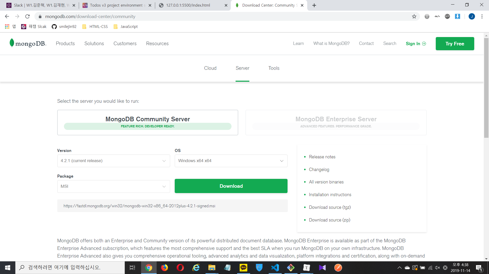

# 바벨이란?

트렌스 파일링

 https://poiemaweb.com/es6-babel-webpack-1 


```bash
npm install --save-dev @babel/core @babel/cli

```

package.json에서 필요 없는 태그를 삭제한다

.babelrc 파일 생성 후 설정 

```bash
--save-dev @babel/preset-env
```

...


웹팩 설치

```bash
--save-dev
```

devDependencies는 개발에 필요한 것만 포함한다


Angular CLI 설치

```bash
npm install -g @angular/cli

cd ~/Desktop

ng new angular-todos

cd angular-todos

ng serve
```

 https://cli.angular.io/ 

----------------------------

TODO LIST FINAL

 https://poiemaweb.com/fastcampus/todos-setting 



1. install MongoDB with default settings

2. launch MongoDB Compass Community and connect to localhost (simplyt click connect with default setting)

3. create database named 'mydb' and 'todos' as collection name

4. create db

5.  `npm install nodemon -g ` (if not installed already)

6. create working directory (on Desktop)

7. `npm init -y`

8. ` npm install express dotenv mongoose cors `

9. check package.json file

10. create `.env` file in root (of working directory)

11. edit "scripts" of package.json as below

    * ```json
      "scripts": {
          "start": "nodemon server.js",
          "build": "webpack -w"
        },
      ```

      