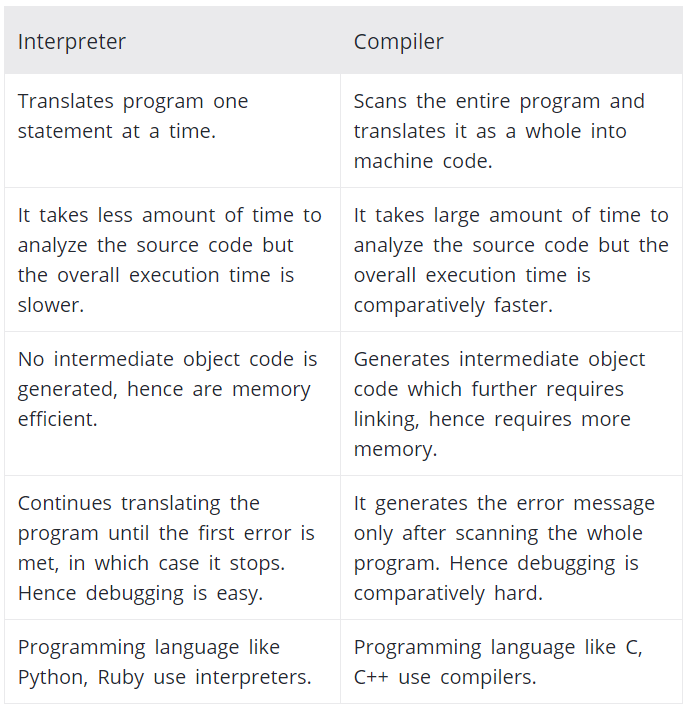

# Introduction to JavaScript

[Lecture materials](https://poiemaweb.com/fastcampus.html)


### 프론트엔드 개발자가 하는 일

애플리케이션을 사용하는 사람 (user)이 애플리케이션과 소통하기 위한 창구 (UI)를 사용하기 좋게 구현한다. UI는 상태 정보를 서버로 전송하기도 하고 서버의 데이터를 가져와서 UI에 표시하기도 한다. 

* HTML : tags, attributes, semantic web
* CSS: Layout, preprocessor
* 크로스 브라우징
* Javascript: ES5, ES6, ES Next, DOM/Event, Ajax, node.js
* HTTP
* tools: git, webpack, babel, ESLint, npm...
* Library / Framework: SPA (Angular, React, Vue.js), TypeScript, jQuery, Lodash, Axios...
* TDD (test driven development): karma / jasmine, mocha, chai
* 알고리즘 / 자료구조


---

### 용어 및 개념 정리

- **websites** vs. **web application**

  웹사이트는 정적인 (static) 정보를 제공하고 (ex. blog), 웹 앱은 엔드 유저와의 상호작용 (interaction)을 위해 사용됨 (ex. google maps)

  ([Difference between Website and Web App](https://www.guru99.com/difference-web-application-website.html#2))

- **standalone application** - 운영 체제로부터 독립하여 그것만으로 실행 가능한 프로그램
- **platform** - 응용 프로그램이 실행될 수 있는 기초를 이루는 컴퓨터 시스템을 의미 (pc, mobile 등)
- **browser** - 인터넷에서 웹서버의 모든 정보를 볼 수 있게 해주며, 하이퍼텍스트 문서 검색을 도와주는 응용 프로그램
- **state** - 시스템이나 프로그램에 어떤 작업을 수행시키기 위해 설정되는 조건이나 방법 (ex. checked radio button)

* **ASCII** vs. **UNI CODE**

  ASCII (American Standard Code for Information Interchange)는 각 문자를 (알파벳, 숫자, 특수문자) 7비트로 표현하므로 총 128 (2^7)개의 문자를 표현할 수 있다. ASCII로 표현할 수 있는 문자들 외에 추가적인 문자를 지원해야 할 필요성이 있어 기존 7비트에 1비트를 푸가하여 8비트 (1byte)를 사용한 코드가 정의되었다. 이에 따라 256 (2^8)개의 문자를 표현할 수 있다.

  각 나라별 언어를 모두 표현하기 위해 나온 코드 체계가 유니코드 (unicode)이다. 운영체제, 프로그램, 언어에 관계없이 문자마다 고유한 코드 값을 제공하며, 언어와 상관없이 모든 문자를 16비트 (2byte)로 표현하므로 최대 65,536자 (2^16)를 표현할 수 있다.

* **compiler** vs. **interpreter**

  

  컴파일러는 소스 코드 전체를 기계어로 번역하므로, 번역하는 데 시간이 비교적 오래 걸리는 편이다. 하지만, 번역 후 프로그램을 실행하는 속도는 빠르다. 또한, 소스 코드 전체를 번역한 후에 에러 메시지를 생성하므로, 디버깅하기 비교적 까다롭다 (complie & execute).

  인터프리터는 소스 코드를 한 줄씩 번역하며, 소스 코드 전체를 번역하는 데 비교적 빠른 편이다. 하지만, 프로그램 실행 속도는 비교적 느린 편이다. 소스코드는 첫 에러가 발생하기 직전까지만 번역되며, 에러 발생 시 번역이 즉시 중단되므로, 디버깅하기 비교적 수월하다 (scan line by line). -> 비교적 수월한게 아니고 실행(execute) 전까지 에러가 생성되는지 모른다

  **컴파일러 특**

  * ready to run
  * not cross-platform
  * often faster
  * inflexible
  * source code is private
  * exttra step

  **인터프리터 특**

  * cross-platform
  * interpreter required
  * simpler to test
  * often slower
  * easier to debug
  * source code is public

  ([see more](https://www.programiz.com/article/difference-compiler-interpreter))

* **ECMA** - European Computer Manufacturers Association

* **Ajax** - Asynchronous JavaScript and XML. 웹 페이지가 로드된 후에 웹 서버로부터 데이터를 읽어들이는 방법. 웹 페이지를 리로드 하지 않고 페이지를 업데이트할 수 있다. 1999년, 자바스크립트를 이용해서 서버와 브라우저가 **비동기적 (Asynchronous)**으로 데이터를 교환할 수 있는 통신 기능.

* **CBD** - Component Based Development. 시스템을 하나의 일체형으로 구축하지 않고 마치 레고 블록처럼 하나씩 요소별로 부품화하여 구축하는 것으로, 소프트웨어 산업의 새로운 패러다임을 제시하고 있다.

* **SPA** - Single Page Application. 일반적인 웹 앱에서는 사용자가 요청할 때마다 페이지를 새로고침하여, 페이지를 로딩할 때 서버에서 리소스를 전달받아 해석한 후 브라우저에 렌더링하지만, SPA는 하나의 페이지를 dynamically rewrite. CBD 방법론을 기반으로 하며 다양한 SPA 프레임워크 (ex. React, Angular)가 탄생.

* **JavaScript** vs. **ECMAScript**

  ECMAScript (맞춤법, 규칙, specification)는 ECMA International (국립국어원)에 의해 제정된 ECMA-262 (표준어) 기술 규격에 의해 정의된 범용 스크립트 언어이다. 동의어로는 ECMAScript specification이 있다. ECMAScript는 스크립트 언어가 준수해야 하는 규칙, 세부 사항 및 지침을 제공한다.

  JavaScript는 ECMAScript specification을 준수하는 범용 스크립팅 언어이다. ECMAScript 문서를 읽으면 **어떻게 스크립트 언어를 만들 수 있는지** 알 수 있고, JavaScript 문서를 읽으면 **어떻게 스크립트 언어를 쓸 수 있는지**를 알 수 있다. ([see more](https://wormwlrm.github.io/2018/10/03/What-is-the-difference-between-javascript-and-ecmascript.html))

* **Algorithm** - 문제 해결을 위한 절차

* **API** - Application Programming Interface. 응용 프로그램 개발자들이 애플리케이션을 만들 때 운영체제에서 동작하는 프로그램을 쉽게 만들 수 있도록 화면 구성이나 프로그램 동작에 필요한 각종 함수를 모아놓은 것을 말한다. 

* **DOM** - Document Object Model. 프로그램이나 스크립트가 웹 페이지 내의 구성 요소들에 접근하여 내용이나 스타일 등을 변경할 수 있게 해주는 인터페이스. 브라우저에서 HTML, XML 등의 웹 페이지가 로딩되면 문서 객체 모델 (DOM)은 브라우저 내 트리 형태로 문서 내 요소 (node)들을 구성한다. 이후 자바스크립트, 파이썬 등 언어로 해당 트리 구조 내의 노드에 접근하여 노드의 속성 값을 변경하거나 추가, 삭제 등을 실행할 수 있다.


---

### ch. 1 기본 개념과 동작 원리 이해의 중요성

#### 프로그래밍이란?

* 기계가 실행할 수 있는 정확하고 상세한 요구사항을 설명하는 작업

* 이를 위해 무엇을 실행하기 원하는지에 대한 정의가 필요 (문제 해결 능력)

* 컴퓨터와 사람은 사고, 인지의 방식이 다름으로 프로그래밍에 앞서 해결 과제를 컴퓨터의 관점으로 사고 **(computational thinking)**해야한다

  

#### 프로그래밍 언어

* 기계어 (machine language)만을 이해하는 컴퓨터와 자연어 (natural language)를 구사하는 인간 사이의 **의사소통 수단**
* **Syntax (문법)**와 **Semantics (의미)**의 조합으로 표현됨
* 작성한 프로그래밍 언어 (high-level programming language - ex. Java)를 컴퓨터 혹은 기계가 이해할 수 있는 기계어 (low-level code ex. Assembly)로 변환하여 (**compile**) 주는 것을 **컴파일러 (compiler) 혹은 인터프리터 (interpreter)**라고 한다.


---

### ch. 2 자바스크립트란?

#### 자바스크립트의 탄생

* 1995년 **브렌던 아이크 (Brendan Eich)**가 개발. 웹 페이지의 보조적인 기능을 수행하기 위해 탄생.
* 1996년 Netscape Navigator 2에 탑재되었고, "Mocha"로 명명, 같은 해 9월에 "LiveScript"로 이름이 변경되었고, 12월 "JavaScript"로 최종 명명되었다.
* 현재 모든 브라우저의 표준 프로그래밍 언어


#### 자바스크립트 성장의 역사

* AJAX (see above)
* jQuery - JavaScript의 라이브러리 중 하나. HTML DOM 트리 순회, 요소 조작, 이벤트 핸들링을 간소화하게끔 디자인 됨
* V8 자바스크립트 엔진 - 자바스크립트로 웹 앱을 구축하려는 시도가 늘어가면서 보다 빠르게 동작하는 자바스크립트 엔진이 요구되었고, 구글에서 V8 자바스크립트 엔진을 개발함. 이를 통해 과거 웹 서버에서 수행되던 역할들이 대거 클라이언트로 이동함.

* Node.js - 브라우저 이외의 환경에서 동작시킬 수 있는 자바스크립트 실행 환경 (2009). 
* 크로스 플랫폼을 위한 언어로 성장. 웹, 모바일, 데스크톱, 머신러닝, 로보틱스 프로그래밍 언어로 범용적으로 사용됨.
* SPA 프레임워크 (see above)


#### 자바스크립트의 특징

* HTML, CSS와 함께 웹을 구성하는 요소 중 하나로, 웹 브라우저에서 동작하는 **유일한** 프로그래밍 언어

* 기본 문법은 C, Java와 유사함 (class = prototype? oob programming이랑 비슷함)

* JS의 함수는 값, 주고 받을 수 있음 (함수형 프로그래밍)

* C (procedural programming), Java (OOB programming), JS (multi-paradiagm programming)

* 인터프리터 언어이지만, 대부분의 모던 자바스크립트 엔진은 인터프리터와 컴파일러의 장점을 결합하여 프로그램 실행 속도를 향상시킴 (중복 사용되는 코드는 미리 컴파일)

* 명령형 (imperative), 함수형 (functional), **프로토타입** 기반 (prototype-based) 객체지향 프로그래밍을 지원하는 **멀티 패러다임 프로그래밍 언어**

* IE를 제외한 모던 브라우저에서는 최대 99%까지 ES6를 지원한다.

  

---

### ch.3 자바스크립트 개발 환경과 실행 방법

#### 자바스크립트 실행 환경

* 모든 브라우저 및 Node.js 환경에서 실행 가능
* 단, 브라우저와 Node.js는 용도가 다름 (Client-side API vs. Host API)


#### 웹 브라우저는 어떻게 동작하는가? (MUST KNOW)

* 사용자 (client)가 참조하고자 하는 웹 페이지를 서버 (server)에 요청 (request)하고 서버의 응답 (response)을 받아 (download files like html, css, js - **loading)** 브라우저에 표시함 (through HTTP)

  * HTTP/1.1 - 파일을 하나씩 로드
  * HTTP/2.0 - 파일을 한꺼번에 로드

* HTML, CSS 파일은 **렌더링 엔진**의 HTML 파서와 CSS 파서에 의해 파싱 (parsing)되어 DOM, CSSOM 트리로 변환되고 렌더 트리로 결합됨

  

* 자바스크립트는 렌더링 엔진이 아닌 **자바스크립트 엔진**이 처리함. 위의 DOM 트리 생성 과정에서, HTML 파서는 script 태그를 만나면 자바스크립트 코드를 실행하기 위해 DOM 생성 프로세스를 중지하고 자바스크립트 엔진으로 제어 권한을 넘김

* 이후 자바스크립트 엔진은 소스 코드를 해석하여 문법적 의미와 구조를 갖는 AST (Abstract Syntax Tree - Syntax Analysis)를 생성.
  * Tokenizing (코드를 최소 단위로 쪼갬 - const, foo, = , 10)
  * Parsing
  * execute

* 다시 HTML 파서로 권한을 넘긴 후 남은 DOM 생성을 재개

* 따라서, 스크립트를 head 영역에 추가하면 DOM 트리 생성이 완료되기전에 실행되기 때문에 body 가장 밑에 추가하는 경우가 바람직하다. 하지만, html 5에서 script 태그에 async / defer 속성을 추가하여 스크립트 실행 시기를 조정할 수 있다.


#### 개발자 도구 (크롬)

* 패널

  * Elements - 로딩된 웹 페이지의 DOM과 CSS를 편집하여 렌더링된 뷰를 확일할 수 있음.
  * Console - 로딩된 웹 페이지의 에러를 확인하거나 자바스크립트 소스코드에 포함시킨 console.log 메소드의 결과를 확인해 볼 수 있음.
  * **Sources** - 로딩된 웹 페이지의 자바스크립트 코드를 디버깅할 수 있음
  * Network - 로딩된 웹 페이지에 관련한 네트워크 요청 (request) 정보와 퍼포먼스를 확인할 수 있다.
  * Application - 웹 스토리지, 세션, 쿠키를 확인하고 관리할 수 있다.

  

#### Node.js

* 프로젝트 규모가 커짐에 따라 외부 라이브러리 (ex. React, jQuery)를 도입하거나 여러 가지 도구 (Babel, Webpack, ESLint)를 사용해야할 필요가 있다. 이때 Node.js와 npm이 필요하다.
* 2009년 **라이언 달 (Ryan Dahl)**이 크롬 V8 자바스크립트 엔진으로 빌드한 런타임 환경 (Runtime Environmnet)
* 브라우저 이외의 환경에서 자바스크립트를 동작시킬 수 있음
* 주로 서버 사이드 애플리케이션 개발에 사용되며, 이에 필요한 모듈, 파일 시스템, HTTP 등 빌트인 API를 제공
* SPA에 적합


#### npm

* node package manager. 자비스크립트 패키지 매니저

* Node.js에서 사용할 수 있는 모듈을 패키지화하여 모아둔 저장소

* 패키지 설치 및 관리를 위한 CLI 제공

  

---

### ch.4 변수

#### 변수란 무엇인가?

* 하나의 값을 저장할 수 있는 메모리 공간에 붙인 이름, 또는 메모리 공간 자체
* **할당** - 변수에 값을 저장하는 것
* **참조** - 변수에 저장된 값을 읽어 들이는 것
* 좋은 이름(식별자)의 변수는 가독성을 높여준다
* **식별자는 어떤 값을 구별하여 식별해낼 수 있는 고유한 이름**을 말한다 (주소를 가진다). 사람을 이름으로 구별하여 식별하듯이 값도 식별자에 의해 구별하여 식별할 수 있다.


#### 변수 선언 (Variable Declaration)

* 변수를 생성하는 것
* 변수값을 저장하기 위한 메모리 영역의 확보를 명령
* `var`, `let`, `const`
  * why let, const? 

``` javascript
// initialization - 값을 저장하기 위한 메모리 공간을 확보, 암묵적으로 undefined를 할당
// assignment - 값을 할당
var score; // initialization, undefined
score = 30; // assignment

// initialization + assignment
var result = 30;
```

* undefined (메모리는 할당되어 있지만 아직 무슨 값이 들어올지 모르겠다, not assigned) 
* null (empty value, assigned)
* 선언한 변수 이름 (식별자)은 실행 컨텍스트 (execution context)에 등록됨. **실행 컨텍스트**는 자바스크립트 엔진이 실행 가능한 코드를 평가 (evaluation)하고 실행하기 위해 필요한 환경을 제공하고 코드의 실행 결과를 실제로 관리하는 영역.


#### 변수 선언의 실행 시점과 변수 호이스팅 (hoisting)

``` javascript
console.log(score); // score가 선언되지도 않았는데 먼저 부름
var score; // 변수 선언
```

위의 코드에서 선언되지 않은 변수를 console.log 하려했으니 당연히 에러가 발생할 줄 알았으나, undefined가 제대로 출력됨.

위의 코드가 실행될 수 있는 이유는, 모든 (변수, 함수 등) 선언이 소스 코드가 실행되는 런타임이 아니라 **그 이전 단계인 Syntax analysis 단계 (평가)**에서 먼저 실행됨. 이미 소스 코드 전체를 평가하여 모든 식별자를 등록하고 (**암묵적으로 undefined 값을 할당해놓음**) 초기화 해놓고 (**variable hoisting**) 소스 코드를 한 줄씩 실행함. 모든 선언문이 코드의 선두로 끌어 올려진 것처럼 동작함.


#### 값의 할당

* 자바스크립트 엔진은 **변수 선언과 값의 할당을 구분하여 실행한다.** 
* 변수 (및 함수) 선언은 런타임 이전에 먼저 실행되지만, 할당은 런타임에서 순차적으로 진행됨

그럼 모든 함수와 변수가 Syntax 분석 단계에서 선언될때 undefined값을 할당 받고, runtime에서 새로운 값을 할당 받는지??

``` javascript
var score = 30; // 이렇게 적으면 score = undefined라고 syntax 분석 단계에서 정해지고 내려오는건지
function function_name() {
    // undefined??
}
```

즉, 변수의 선언과 값의 할당을 하나의 문장으로 단축 표현해도 자바스크립트 엔진은 변수의 선언과 값의 할당을 분리해서 각각 실행한다는 의미이다. 따라서 변수에 `undefined`가 할당되어 초기화되는 것은 변함이 없다.

**재할당** 시 이전 메모리 공간을 overwrite하는게 아니고 새로운 메모리에 값을 할당 (그럼 저 쓰레기 값은? 가비지 컬렉터에 의해 메모리에서 자동 해제되지만, 언제 해제될 지는 예측할 수 없음)

primitive type - immutable (할당된 메모리 셀의 데이터를 지우지/수정하지 않고 다른 공간에 재할당. 지우고 다시 쓸 수 없음)


#### 값의 재할당

* var 키워드로 선언한 변수는 사실 선언과 동시에 `undefined`로 초기화되기 때문에 처음 값을 할당하는 것도 굳이 따지면 재할당이다.
* 재할당 할 수 없는 값을 **상수 (const)**라 부른다 (ES6). 따라서, 절대적으로 바뀌지 않는 값이 있으면 const로 선언


#### 식별자 네이밍 규칙

* 식별자 - 어떤 값을 구별하여 식별해낼 수 있는 이름

* 식별자는 특수문자를 제외한 문자, 숫자, underscore(_), 달러 기호 ($)를 포함할 수 있다.

  ``` javascript
  var person, $elem, _name, first_name, val1;
  ```

* 단, 식별자는 특수문자를 제외한 문자, underscore, 달러 기호로 시작해야한다. (숫자 X)

* 예약어는 식별자로 사용할 수 없다 (ex. this, await, break, case, catch, class, const, continue...)

  ``` javascript
  var first-name, 1st, this;
  ```

* 변수의 존재 목적을 쉽게 이해할 수 있도록 의미를 명확히 표현

* 자주 사용되는 네이밍 컨벤션을 따른다

  ``` javascript
  // camelCase
  var firstName;
  
  // snake_case
  var first_name;
  
  // PascalCase
  var FirstName;
  
  // typeHungarianCase
  var strFirstName;
  ```

---

### [Installing ESLint](https://poiemaweb.com/eslint)

**LF** vs. **CRLF**

### Installing Code Runner

ctrl + alt + n