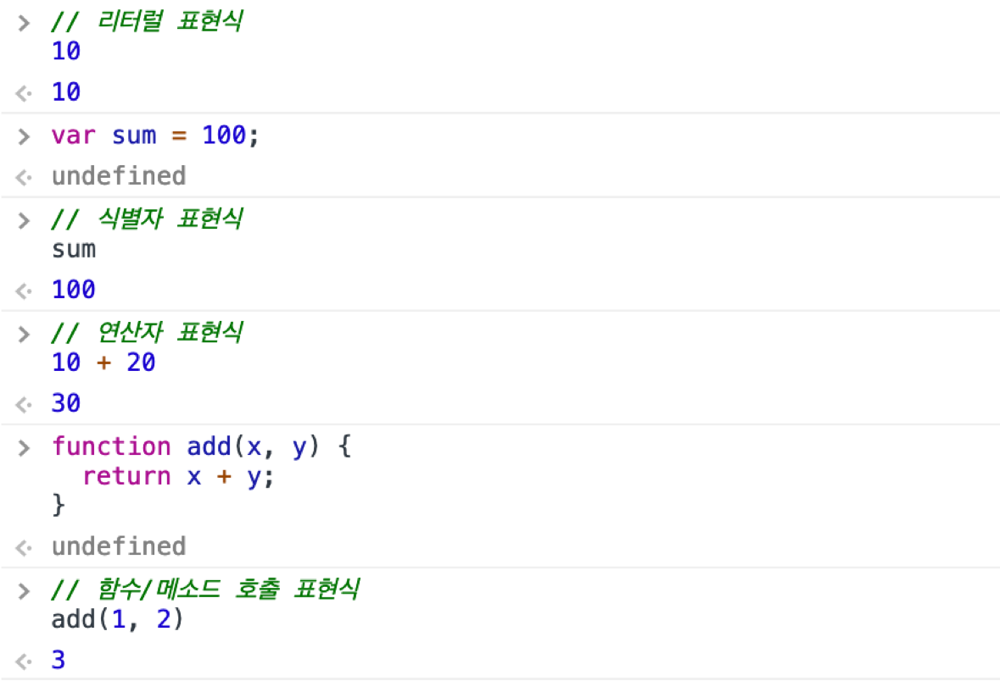
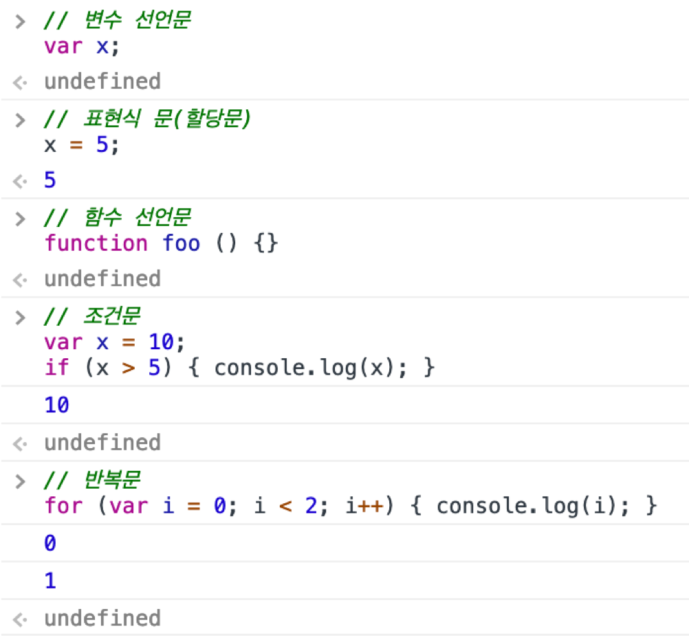

# JavaScript Data Type & Operator

### ch.5 데이터 타입


#### 데이터 타입에 의한 메모리 공간의 확보 / 값의 해석

데이터 타입(Data Type)은 값의 종류를 말한다. 자바스크립트의 모든 값은 데이터 타입을 갖는다. 데이터 타입이 필요한 이유는 아래와 같다.

- 값을 저장할 때 확보해야 하는 **메모리 공간의 크기**를 결정하기 위해
- 값을 참조할 때 한번에 읽어 들여야 할 **메모리 공간의 크기**를 결정하기 위해
- 메모리에서 읽어 들인 **2진수를 어떻게 해석**할 지를 결정하기 위해


표현식 -> (평가) -> 값

문 (statement)


#### 값 (value)

* **더이상 평가할 수 없는 하나의 표현식**

* 값 - 메모리에 들어가는 대상

* 표현식 - 값을 생선하는 statement, 평가되어 값을 생성

* 타입을 가지고 있다

  ``` javascript
  // 10 + 20은 표현식이다. 이 표현식은 평가되어 30이라는 값을 만든다.
  10 + 20
  // 10, 20의 값과 +의 연산자로 구성된 표현식, 이후 JS 엔진에 평가되어 30이라는 값을 생성
  // 생성된 값 30은 더 이상 평가할 수 없음
  ```

* 변수(Variable)는 **하나 값**을 저장할 수 있는 메모리 공간에 붙인 이름 또는 메모리 공간 자체를 말한다. 따라서 값은 변수에 할당할 수 있다.

  ``` javascript
  // 변수에는 표현식 10 + 20의 평가되어 생성한 값 30이 할당된다.
  var sum = 10 + 20;
  ```


#### 값의 생성

* Literal

  * 소스 코드 안에서 직접 만들어 낸 고정된 값 자체

  * **리터럴 표기법은 사람이 이해할 수 있는 표기법으로 값의 생성을 자바스크립트 엔진에게 명령하는 것이다.**

    ``` javascript
    // 리터럴 표기법으로 숫자 리터럴 3을 기술하였다.
    // 자바스크립트 엔진은 런타임에 숫자 리터럴 3을 해석하여 숫자 타입의 값 3을 생성한다.
    3
    ```

  * 리터럴 표기법을 사용하면 아래와 같이 자바스크립트에서 사용할 수 있는 다양한 타입의 값(숫자, 문자열, 불리언, null, undefined, 객체, 배열, 함수, 정규 표현식 등)을 생성할 수 있다.

    ``` javascript
    // 정수 리터럴
    100
    // 부동 소숫점 리터럴
    10.5
    // 2진수 리터럴(0b로 시작)
    0b01000001
    // 8진수 리터럴(ES6에서 도입. 0o로 시작)
    0o101
    // 16진수 리터럴(ES6에서 도입. 0x로 시작)
    0x41
    
    // 문자열 리터럴
    'Hello'
    "World"
    
    // 불리언 리터럴
    true
    false
    
    // null 리터럴
    null
    
    // undefined 리터럴
    undefined
    
    // 객체 리터럴
    { name: 'Lee', gender: 'male' }
    
    // 배열 리터럴
    [ 1, 2, 3 ]
    
    // 함수 리터럴
    function() {}
    
    // 정규표현식 리터럴
    /ab+c/
    ```

  * 리터럴은 그 자체로 값이 될 수 있지만 값이 리터럴인 것은 아니다. 리터럴 100은 자바스크립트 엔진에 의해 평가되어 숫자값 100이 되지만 숫자값 100이 리터럴은 아니다.


#### 표현식

표현식(expression)은 리터럴, 식별자(변수나 함수 등의 이름), 연산자, 함수 호출 등의 조합을 말한다. 표현식은 평가(evaluation. 표현식을 해석하여 하나의 값을 만드는 과정)되어 하나의 값을 만든다.

즉, **표현식은 하나의 값으로 평가될 수 있는 문(statement)이다.**



리터럴 <= 표현식

#### 데이터 타입의 분류

- 원시 타입(primitive type)

  - **숫자(number) 타입: 숫자 (정수, 실수)** - (그냥 모든 숫자를 Java로 따지면 float으로 저장하는 상황)

    - Infinity : 양의 무한대
    - -Infinity : 음의 무한대
    - NaN : 산술 연산 불가(not-a-number)

    ``` javascript
    // 숫자 타입의 3가지 특별한 값
    console.log(10 / 0);       // Infinity
    console.log(10 / -0);      // -Infinity
    console.log(1 * 'String'); // NaN
    ```

  - **문자열(string) 타입: 문자열**

    ``` javascript
    // 문자열 타입
    var string;
    string = "문자열"; // 큰 따옴표
    string = '문자열'; // 작은 따옴표
    string = `문자열`; // 백틱 (ES6)
    
    string = "큰 따옴표로 감싼 문자열 내의 '작은 따옴표'는 문자열로 인식된다.";
    string = '작은 따옴표로 감싼 문자열 내의 "큰 따옴표"는 문자열로 인식된다.';
    ```

    

    * 템플릿 리터럴

    ``` javascript
    const template = `템플릿 리터럴은 '작은따옴표(single quotes)'와 "큰따옴표(double quotes)"를 혼용할 수 있다.`;
    
    console.log(template);
    // 템플릿 리터럴은 '작은따옴표(single quotes)'과 "큰따옴표(double quotes)"를 혼용할 수 있다.
    ```

    ES6 템플릿 리터럴은 일반적인 문자열과 달리 여러 줄에 걸쳐 문자열을 작성할 수 있으며 템플릿 리터럴 내의 모든 공백은 있는 그대로 적용된다.

    

    * 문자열은 + 문자열 연산자를 사용해 연결할 수 있다.

    ``` javascript
    var first = 'Jinhyun';
    var last = 'Kim';
    
    // ES5: 문자열 연결
    console.log('My name is ' + first + ' ' + last + '.');
    // My name is Jinhyun Kim.
    ```

    

    * **문자열 인터폴레이션(String Interpolation)** - 백틱 안에서만

    ``` javascript
    var first = 'Jinhyun';
    var last = 'Kim';
    
    // ES6: String Interpolation
    console.log(`My name is ${first} ${last}.`);
    // My name is Jinhyun Kim.
    ```

    문자열 인터폴레이션은 `${ expression }`으로 표현식을 감싼다. 이때 표현식의 평가 결과는 문자열로 **강제 타입 변환**된다.

    ``` javascript
    console.log(`1 + 1 = ${1 + 1}`); // 1 + 1 = 2
    ```

    

    - Escape Sequence

    

  

  

  - **불리언(boolean) 타입**: 논리적 참(true)과 거짓(false)

    

  - **undefined 타입**: 선언은 되었지만 값을 할당하지 않은 변수에 암묵적으로 할당되는 값

    변수를 참조했을 때 undefined가 반환된다면 참조한 변수가 선언 이후 값이 할당된 적인 없는 변수라는 것을 간파할 수 있다.

    

  - **null 타입**: **값이 없다는 것을 의도적으로 명시할 때 사용하는 값**

  

  - **Symbol 타입**: ES6에서 새롭게 추가된 7번째 타입
    * 변경 불가능한 원시 타입의 값
    * 이름의 충돌 위험이 없는 object의 유일한 property key를 만들기 위해 사용

- 객체 타입 (object/reference type): 객체, 함수, 배열 등


#### 동적 타이핑 (dynamic typing)

**정적 타입 언어는 변수의 타입을 변경할 수 없으며 변수에 선언한 타입에 맞는 값만을 할당할 수 있다.** 정적 타입 언어는 컴파일 시점에 타입 체크(선언한 데이터 타입에 맞는 값을 할당했는지 검사하는 처리)를 수행한다 (C, Java).

자바스크립트는 정적 타입 언어와는 다르게 변수를 선언할 때 타입을 선언하지 않는다. 다만 var, let, const 키워드를 사용해 변수를 선언할 뿐이다. **자바스크립트의 변수는 정적 타입 언어와 같이 미리 선언한 데이터 타입의 값만을 할당할 수 있는 것이 아니다. 어떠한 데이터 타입의 값이라도 자유롭게 할당할 수 있다.**

``` javascript
var foo;
console.log(typeof foo);  // undefined

foo = 3;
console.log(typeof foo);  // number

foo = 'Hello';
console.log(typeof foo);  // string

foo = true;
console.log(typeof foo);  // boolean

foo = null;
console.log(typeof foo);  // object

foo = Symbol(); // 심볼
console.log(typeof foo);  // symbol

foo = {}; // 객체
console.log(typeof foo);  // object

foo = []; // 배열
console.log(typeof foo);  // object

foo = function () {}; // 함수
console.log(typeof foo);  // function
```

**자바스크립트 변수는 선언이 아닌 할당에 의해 타입이 결정된다. 그리고 재할당에 의해 변수의 타입은 언제든지 동적으로 변할 수 있다.**


#### 동적 타이핑의 취약점

* 데이터 타입을 추적하기 어려울 수 있다.
* 변수의 값은 언제든지 의도치 않게 변경될 수 있다.
*  변수가 저장하고 있는 값을 확인하기 전에는 값의 타입을 확신할 수 없다.
* 신뢰성(reliability)은 떨어진다.

#### 극복 방법

- 변수의 사용을 적극적으로 줄인다. 변수의 개수가 많으면 많을수록 오류가 발생할 확률은 높아진다.
- 전역 변수는 사용하지 않는다. 변수의 생명주기를 최대한 짧게 만든다.
- 변수보다는 상수를 사용해 값의 변경을 억제한다.
- 변수 이름은 변수의 존재 이유를 파악할 수 있도록 명명한다.


### ch. 6  연산자

**문(statement)은 하나 이상의 표현식과 키워드의 조합으로 구성된 자바스크립트 엔진에게 내리는 명령**

변수에 할당할 수 있는 문은 표현식

반대는 x

undefined = 완료 값



**표현식의 역할은 값을 생성하는 것이다. 문의 역할은 표현식으로 생성한 값을 사용해 자바스크립트 엔진에게 명령을 내리는 것이다.**


#### 연산자

연산자(Operator)는 하나 이상의 표현식을 대상으로 산술, 할당, 비교, 논리, 타입, 지수 연산(operation) 등을 수행해 하나의 값을 만든다. 


**이항 산술 연산자**는 2개의 피연산자를 산술 연산하여 숫자 타입의 값을 만든다.


**단항(Unary) 산술 연산자**는 1개의 피연산자를 산술 연산하여 숫자 타입의 값을 만든다. 주의할 것은 이항 산술 연산자와는 달리 **증가/감소(++/–) 연산자는 피연산자의 값을 변경하는 부수 효과가 있다.** 다시 말해 증가/감소 연산을 하면 피연산자의 값이 바뀐다.


증가/감소(++/--) 연산자는 위치에 의미가 있다.

- 피연산자 앞에 위치한 전위 증가/감소 연산자(Prefix increment/decrement operator)는 먼저 피연산자의 값을 증가/감소시킨 후, 다른 연산을 수행한다.

- 피연산자 뒤에 위치한 후위 증가/감소 연산자(Postfix increment/decrement operator)는 먼저 다른 연산을 수행한 후, 피연산자의 값을 증가/감소시킨다.

  ``` javascript
  var x = 5, result;
  
  // 선할당 후증가 (Postfix increment operator)
  result = x++;
  console.log(result, x); // 5 6
  
  // 선증가 후할당 (Prefix increment operator)
  result = ++x;
  console.log(result, x); // 7 7
  
  // 선할당 후감소 (Postfix decrement operator)
  result = x--;
  console.log(result, x); // 7 6
  
  // 선감소 후할당 (Prefix decrement operator)
  result = --x;
  console.log(result, x); // 5 5
  ```


(+) 단항 연산자는 피연산자에 어떠한 효과도 없다. 음수를 양수로 반전하지도 않는다. 그런데 숫자 타입이 아닌 피연산자에 사용하면 피연산자를 숫자 타입으로 변환하여 반환한다. 이때 피연산자를 변경하는 것은 아니고 숫자 타입으로 변환한 값을 생성해서 반환한다. 따라서 부수 효과는 없다.

``` javascript
// 아무런 효과가 없다.
+10;    // -> 10
+(-10); // -> -10

// 문자열을 숫자로 타입 변환한다.
+'10'; // -> 10

// 불리언 값을 숫자로 타입 변환한다.
+true; // -> 1

// 불리언 값을 숫자로 타입 변환한다.
+false; // -> 0

// 문자열을 숫자로 타입 변환할 수 없으므로 NaN을 반환한다.
+'Hello'; // -> NaN
```


(– )단항 연산자는 피연산자의 부호를 반전한 값을 반환한다. + 단항 연산자와 마찬가지로 숫자 타입이 아닌 피연산자에 사용하면 피연산자를 숫자 타입으로 변환하여 반환한다. 이때 피연산자를 변경하는 것은 아니고 부호를 반전한 값을 생성해서 반환한다. 따라서 부수 효과는 없다.

```javascript
// 부호를 반전한다.
-(-10); // -> 10

// 문자열을 숫자로 타입 변환한다.
-'10'; // -> -10

// 불리언 값을 숫자로 타입 변환한다.
-true; // -> -1

// 문자열을 숫자로 타입 변환할 수 없으므로 NaN을 반환한다.
-'Hello'; // -> NaN
```


**할당 연산자**는 우항에 있는 피연산자의 평가 결과를 좌항에 있는 변수에 할당.

ex) x += y;


([prev - Introduction to JavaScript, Variable](./intro-js-variable.md))

([Back to List](../../README.md))

