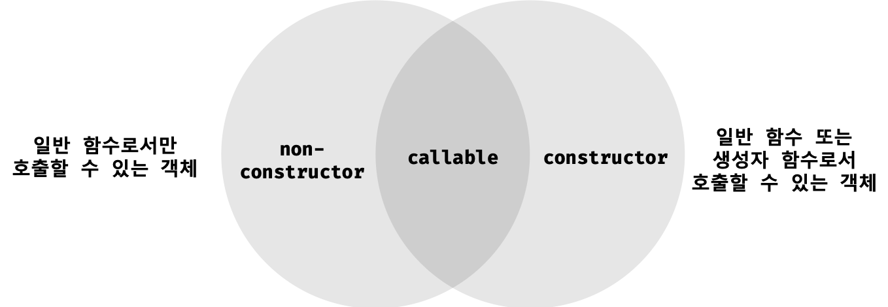

# 생성자 함수에 의한 객체 생성

```javascript
const obj = {
  firstName: 'Jinhyun',
  lastName: 'Kim'
};
```

객체 리터럴 표기법을 사용한 객체 생성은 객체 생성 방법 중에서 가장 일반적이고 간단한 방법이다. 객체는 객체 리터럴 표기법 이외에도 다양한 방법으로 생성할 수 있다.


## 1. Object 생성자 함수

`new` 연산자와 함께 Object 생성자 함수를 호출하면 빈 객체를 생성하여 반환한다. 빈 객체를 생성한 이후 프로퍼티 또는 메소드를 추가하여 객체를 완성할 수 있다.

```javascript
// 빈 객체의 생성
const person = new Object(); // {}

// 프로퍼티 추가
person.name = 'Kim';
person.sayHello = function() {
  console.log('Hi! My name is ' + this.name);
};

console.log(person); // {name: "Kim", sayHello: f}
person.sayHello(); // Hi! My name is Kim
```

생성자(constructor) 함수란 `new` 연산자와 함께 호출하여 객체(인스턴스)를 생성하는 함수를 말한다. 생성자 함수에 의해 생성된 객체를 **인스턴스(instance)**라 한다.

> 인스턴스는 객체가 메모리에 저장되어 실제로 존재하는 것에 초점을 맞춘 용어이다. 생성자 함수도 객체이기 때문에 생성자 함수나 클래스가 생성한 객체를 다른 객체와 구분하기 위해 인스턴스라고 부른다.

자바스크립트는 Object 생성자 함수 이외에도 다양한 빌트인 생성자 함수를 제공한다.

```javascript
// String 생성자 함수에 의한 String 객체 생성
const strObj = new String('Lee');
console.log(typeof strObj); // object
console.log(strObj);        // String {"Lee"}

// Number 생성자 함수에 의한 Number 객체 생성
const numObj = new Number(123);
console.log(typeof numObj); // object
console.log(numObj);        // Number {123}

// Boolean 생성자 함수에 의한 Boolean 객체 생성
const boolObj= new Boolean(true);
console.log(typeof boolObj); // object
console.log(boolObj);        // Boolean {true}

// Function 생성자 함수에 의한 Function 객체(함수) 생성
const func = new Function('x', 'return x * x');
console.log(typeof func); // function
console.dir(func);        // ƒ anonymous(x )

// Array 생성자 함수에 의한 Array 객체(배열) 생성
const arr = new Array(1, 2, 3);
console.log(typeof arr); // object
console.log(arr);        // (3) [1, 2, 3]

// RegExp 생성자 함수에 의한 RegExp 객체(정규 표현식) 생성
const regExp = new RegExp(/ab+c/i);
console.log(typeof regExp); // object
console.log(regExp);        // /ab+c/i

// Date 생성자 함수에 의한 Date 객체 생성
const date = new Date();
console.log(typeof date); // object
console.log(date);        // Tue Mar 19 2019 02:38:26 GMT+0900 (한국 표준시)
```

Array 생성자 함수를 제외하고는 그다지 유용해보이지 않는다.


## 2. 생성자 함수

### 2.1 객체 리터럴에 의한 객체 생성 방식의 문제점

객체 리터럴에 의한 객체 생성 방식은 **단 하나의 객체만을 생성**한다. 따라서 동일한 프로퍼티를 갖는 객체를 여러 개 생성해야하는 경우, 매번 같은 프로퍼티를 기술해야 하기 때문에 비효율적이다.

```javascript
const circle1 = {
  radius: 5,
  getDiameter() {
    return 2 * this.radius;
  }
};

console.log(circle1.getDiameter()); // 10

const circle2 = {
  radius: 10,
  getDiameter() {
    return 2 * this.radius;
  }
};

console.log(circle2.getDiameter()); // 20
```

원을 표현한 객체인 `circle1` 객체와 `circle2` 객체는 프로퍼티 구조가 동일하다. 객체 고유의 상태 데이터인 `radius` 프로퍼티의 값은 객체마다 다를 수 있지만 `getDiameter` 메소드는 완전히 동일하다.  객체 리터럴을 사용하여 수십개의 circle 객체를 생성해야 한다면 문제가 크다.


### 2.2 생성자 함수에 의한 객체 생성 방식의 장점

생성자 함수에 의한 객체 생성 방식은 마치 객체(인스턴스)를 생성하기 위한 **템플릿(클래스)**처럼 생성자 함수를 사용하여 **프로퍼티 구조가 동일한 객체 여러 개를 간편하게 생성**할 수 있다.

```javascript
// 생성자 함수 (함수 이름은 파스칼 케이스로 기술)
function Circle(radius) {
  // 생성자 함수 내부의 this는 생성자 함수가 생성할 인스턴스를 가리킨다.
  this.radius = radius;
  this.getDiameter = function() {
    return 2 * this.radius;
  };
}

// new 연산자를 사용하여 인스턴스 생성
const circle1 = new Circle(5); // 반지름이 5인 Circle 객체 생성
const circle2 = new Circle(10); // 반지름이 10인 Circle 객체 생성

console.log(circle1.getDiameter()); // 10
console.log(circle2.getDiameter()); // 20
```

위 예제에서 나온 `this` 키워드는 객체 자신의 프로퍼티나 메소드를 참조하기 위한 **자기 참조 변수(Self-referencing variable)이다.** `this`가 가리키는 값은 **함수 호출 방식에 따라 동적으로 결정된다.**

| 함수 호출 방식       | this가 가리키는 값                        |
| -------------------- | ----------------------------------------- |
| 일반 함수로서 호출   | 전역 객체 (window, global)                |
| 메소드로서 호출      | 메소드를 호출한 객체 (**person**.sayHi()) |
| 생성자 함수로서 호출 | 생성자 함수가 생성할 인스턴스             |
| 객체 리터럴????      | 자신????                                  |

(more in ch. 21)

자바스크립트에서 생성자 함수는 **일반 함수와 동일한 방법으로 정의하고 `new` 연산자와 함께 호출하면 해당 함수는 생성자 함수로 동작한다.**

```javascript
// new 연산자와 함께 호출하지 않으면 생성자 함수로 동작하지 않는다.
// 즉, 일반적인 함수의 호출이다.
const circle3 = Circle(15);

// 일반 함수 Circle은 반환문이 없으므로 암묵적으로 undefined를 반환한다.
console.log(circle3); // undefined

// 일반 함수 Circle 내의 this는 전역 객체를 가리킨다.
// 다시 말해, 일반 함수 내 this는 window를 뜻하며,
// 인수로 넘긴 radius를 window의 프로퍼티로 (window.raidus)로 등록한다.
// 따라서 전역에서 radius를 참조하면 window.radius가 반환된다.
console.log(radius); // 15;
```


아래는 `new` 연산자로 함수를 호출할 시 생기는 과정이다.

```javascript
const person1 = new Person('Jinhyun');

function Person(name) {
  // 1. 빈 객체 Person {} 생성
  // 2. this에 빈 객체 {} 할당
  // 3. 프로퍼티 동적 추가
  this.name = name;
  this.sayHi = function () {
    console.log(`Hi, my name is ${this.name}.`);
  };
  // 4. return this (암묵적으로 인스턴스를 반환)
}
```


### 2.3 내부 메소드 [[Call]]과 [[Construct]]

함수는 객체이므로 일반 객체(Ordinary object)와 동일하게 동작할 수 있다. 따라서 함수는 일반 객체의 내부 슬롯과 내부 메소드를 모두 가지고 있다.

```javascript
// 함수 정의
function foo() {}

// 함수는 객체이므로 프로퍼티를 소유할 수 있다.
foo.prop = 10;

// 함수는 객체이므로 메소드를 소유할 수 있다.
foo.method = function() {
    console.log(this.prop);
};

foo.method(); // 10
```

또한, 함수 객체는 함수로서 동작하기 위해 (호출, 생성) 추가적인 내부 슬롯과 내부 메소드를 가지고 있다.


(Internal Slots of ECMAScript Function Objects)


(Additional Essential Internal Methods of Function Objects)


내부 메소드 [[Call]]을 갖는 함수 객체를 **callalble**이라 하며, 내부 메소드인 [[Construct]]를 갖는 함수 객체를 **constructor**, [[Construct]]를 갖지 않는 함수 객체를 **non-constructor**라고 부른다. 다시 말해, 모든 함수는 callable이지만 생성자 함수로서 호출할 수 있는 constructor 함수와 생성자 함수로서 호출할 수 없는 non-constructor로 함수로 나뉜다.





### 2.4 constructor와 non-constructor의 구분

아래의 코드를 살펴보자.

```javascript
function foo() {}

// 일반적인 함수로서 호출: [[Call]]이 호출된다.
// 모든 함수 객체는 [[Call]]이 구현되어 있다.
foo();

// 생성자 함수로서 호출: [[Construct]가 호출된다.
// 이때 [[Construct]]를 갖지 않는다면 에러가 발생한다.
new foo();
```

함수가 힐반적은 함수로서 호출되면 함수 객체의 내부 메소드 [[Call]]이 호출되고, `new` 연산자와 함께 생성자 함수로서 호출되면 내부 메소드 [[Construct]]가 호출된다. 그렇다면 [[Construct]]를 갖지 않는 함수 객체 non-constructor는 어떻게 구분하는가?

자바스크립트 엔진은 함수를 생성할 때, `FunctionCreate`이라는 추상 연산(abstract operation)을 사용한다. 추상 연산 `FunctionCreate`은 함수 정의가 평가될 때 호출된다. 이때 함수 정의 방식에 따라 `FunctionCreate`의 첫 번째 매개변수 `kind`에 함수의 종류를 나타내는 문자열이 전달된다.

| 구분                                 | 함수의 종류를 나타내는 문자열 |
| ------------------------------------ | ----------------------------- |
| 일반 함수 (함수 선언문, 함수 표현식) | 'Normal'                      |
| 화살표 함수 정의를 평가할 때         | 'Arrow'                       |
| 메소드 정의를 평가할 때              | 'Method'                      |

**이때 일반 함수(Normal)로 구분된 함수 객체만이 생성자 함수로서 호출될 수 있다.** Arrow, Method로 구분된 함수 객체는 생성자 함수로서 호출될 수 없다. 아래 코드를 살펴보자.

```javascript
// 일반 함수 정의: kind = 'Normal'
function foo() {}
const bar = function () {};
// 프로퍼티 x에 할당된 것은 일반 함수 정의이다. 메소드 정의로 인정하지 않는다.
const baz = {
  x: function() {}
};

new foo(); // OK
new bar(); // OK
new baz.x(); // OK

// 화살표 함수 정의: kind = 'Arrow'
const arrow = () => {};

new arrow(); // TypeError: arrow is not a constructor

// 메소드 정의: kind = 'Method'
// ES6의 메소드 축약 표현만을 메소드 정의로 인정한다.
const obj = {
  x() {}
};

new obj.x(); // TypeError: obj.x is not a constructor
```

일반적으로 프로퍼티의 값인 함수는 모두 메소드로 통칭한다. 하지만 ECMAScript 사양에서 **"메소드 정의"란 ES6의 메소드 축약 표현만을 의마한다.** 함수가 어디에 할당되어 있는지에 따라 메소드 정의인지를 판단하는 것이 아니라, 함수 정의 방식에 따라 함수의 종류를 구분한다.


### 2.5 생성자 함수의 인스턴스 생성 과정

생성자 함수의 역할은 **인스턴스를 생성**하는 것과 인**스턴스를 초기화(인스턴스 프로퍼티 추가 및 초기값 할당)**하는 것이다. 인스턴스 생성은 필수이며, 생성된 인스턴스를 초기화하는 것은 옵션이다.

```javascript
// 생성자 함수
function Circle(radius) {
  // 인스턴스 초기화
  this.radius = radius;
  this.getDiameter = function () {
    return 2 * this.radius;
  };
}

// 인스턴스 생성
const circle1 = new Circle(5); // 반지름이 5인 Circle 객체를 생성
```

위의 생성자 함수 예제에서 인스턴스를 생성하고 반환하는 코드는 보이지 않는다. 이는 자바스크립트 엔진이 암묵적인 처리를 통해 인스턴스를 생성하고 반환하기 때문이다. `new` 연산자와 함께 생성자 함수가 호출되면 자바스크립트 엔진은 **아래의 과정**을 거쳐 인스턴스를 생성하고 인스턴스를 초기화한 후, 인스턴스를 반환한다.


**1. 인스턴스 생성과 `this` 바인딩**

암묵적으로 빈 객체(인스턴스)가 생성된다. 이 인스턴스의 프로토타입으로 생성자 함수의 `prototype` 프로퍼티가 가리키는 객체가 설정된다. 이 인스턴스는 `this`에 바인딩된다. 생성자 함수 내부의 `this`가 생성자 함수가 생성할 인스턴스를 카리키는 이유가 바로 이것이다.

> 바인딩(binding)이란 식별자와 값을 연결하는 과정을 의미한다.

```javascript
function Circle(radius) {
  // 1. 암묵적으로 빈 객체가 생성되고 this에 바인딩된다.
  console.log(this); // Circle {}
  console.log(Object.getPrototypeOf(this) === Circle.prototype); // true
}
```

**2. 인스턴스 초기화**

```javascript
function Circle(radius) {
  // 1. 암묵적으로 빈 객체가 생성되고 this에 바인딩된다.
  // 2. this에 바인딩되어 있는 인스턴스에 프로퍼티나 메소드를 추가하고
  //    생성자 함수가 인수로 전달받은 초기값을 인스턴스 프로퍼티에 할당하여
  //    초기화하거나 고정값을 할당한다.
  this.radius = radius;
  this.getDiameter = function () {
    return 2 * this.radius;
  };
}
```

**3. 인스턴스 반환**

생성자 함수 내부의 모든 처리가 끝나면 완성된 인스턴스가 바인딩된 `this`가 암묵적으로 반환된다.

```javascript
function Circle(radius) {
  // 1. 암묵적으로 인스턴스가 생성되고 this에 바인딩된다.

  // 2. this에 바인딩되어 있는 인스턴스를 초기화한다.
  this.radius = radius;
  this.getDiameter = function () {
    return 2 * this.radius;
  };

  // 3. 완성된 인스턴스가 바인딩된 this가 암묵적으로 반환된다
  // return this;
}

// 인스턴스 생성. Circle 생성자 함수는 암묵적으로 this를 반환한다.
const circle = new Circle(1);
console.log(circle); // Circle {radius: 1, getDiameter: f}
```


만약 `this`가 아닌 다른 객체를 **명시적**으로 반환하면 `this`가 반환되지 못하고 `return` 문에 명시한 객체가 반환된다.

```javascript
function Circle(radius) {
  // 1. 암묵적으로 인스턴스가 생성되고 this에 바인딩된다.

  // 2. this에 바인딩되어 있는 인스턴스를 초기화한다.
  this.radius = radius;
  this.getDiameter = function () {
    return 2 * this.radius;
  };

  // 3. 완성된 인스턴스가 바인딩된 this가 암묵적으로 반환된다
  // 명시적으로 객체를 반환하면 암묵적인 this 반환이 무시된다.
  return {};
}

// 인스턴스 생성. Circle 생성자 함수는 명시적으로 반환한 객체를 반환한다.
const circle = new Circle(1);
console.log(circle); // {}
```

하지만 명시적으로 **원시 값**을 반환하면 원시 값 반환은 무시되고 암묵적으로 `this`가 반환된다. 어찌되었든 **생성자 함수 내부에서는 `return`문을 반드시 생략해야 한다.**


### 2.6 new.target

`new` 연산자 없이 생성자 함수를 호출하는 것을 방지하기 위해 사용한다. `new.target`은 `this`와 유사하게 모든 함수 내부에서 암묵적인 지역 변수와 같이 사용되며 메타 프로퍼티(meta property)라고 부른다. 단, IE에서는 `new.target`을 지원하지 않는다.

**함수 내부에서 `new.target`을 사용하면 `new` 연산자와 함께 함수가 호출되었는지 확인할 수 있다.** `new` 연산자와 함께 호출되면 함수 내부의 `new.target`은 함수 자신을 가리킨다. `new` 연산자 없이 호출된 함수 내부의 `new.target`은 `undefined`이다.

```javascript
// 생성자 함수
function Circle(radius) {
  // 이 함수가 new 연산자와 함께 호출되지 않았다면 new.target은 undefined이다.
  if (!new.target) {
    // new 연산자와 함께 호출하여 생성된 인스턴스를 반환한다.
    return new Circle(radius);
  }

  this.radius = radius;
  this.getDiameter = function () {
    return 2 * this.radius;
  };
}

// new 연산자 없이 생성자 함수를 호출하여도 생성자 함수로서 호출된다.
const circle = Circle(5);
console.log(circle.getDiameter()); // 10
```


> **스코프 세이프 생성자(Scope-safe Constructor) 패턴**
>
> `new.target`은 ES6에서 도입된 최신 문법으로 IE에서는 지원하지 않는다. `new.target`을 사용할 수 없는 상황이라면 스코프 세이프 생성자 패턴을 사용할 수 있다.

```javascript
// Scope-Safe Constructor Pattern
function Circle(radius) {
  // 이 함수가 new 연산자와 함께 호출되지 않았다면 이 시점의 this는 전역 객체 window를 가리킨다.
  // this (window)가 Circle의 인스턴스인가?
  if (!(this instanceof Circle)) {
    // new 연산자와 함께 호출하여 생성된 인스턴스를 반환한다.
    return new Circle(radius);
  }

  this.radius = radius;
  this.getDiameter = function () {
    return 2 * this.radius;
  };
}

// new 연산자 없이 생성자 함수를 호출하여도 생성자 함수로서 호출된다.
const circle = Circle(5);
```


대부분의 빌트인 생성자 함수(`Object`, `String`, `Number`...)는 `new` 연산자와 함께 호출되었는지를 확인한 후 적절한 값을 반환한다. 예를 들어 `Object` 또는 `Function` 생성자 함수는 `new` 연산자 없이 호출해도 `new` 연산자와 함께 호출했을 때와 동일하게 동작한다.

하지만 `String` 생성자 함수는 `new` 연산자와 함께 호출했을 때 `String` 객체를 생성하여 반환하지만, `new` 연산자 없이 호출하면 문자열 리터럴을 반환한다. 즉 문자열로 타입을 변환한다.

```javascript
let s = new String('abc');
console.log(s); // String {"abc"}

s = String('abc');
console.log(s); // abc
```