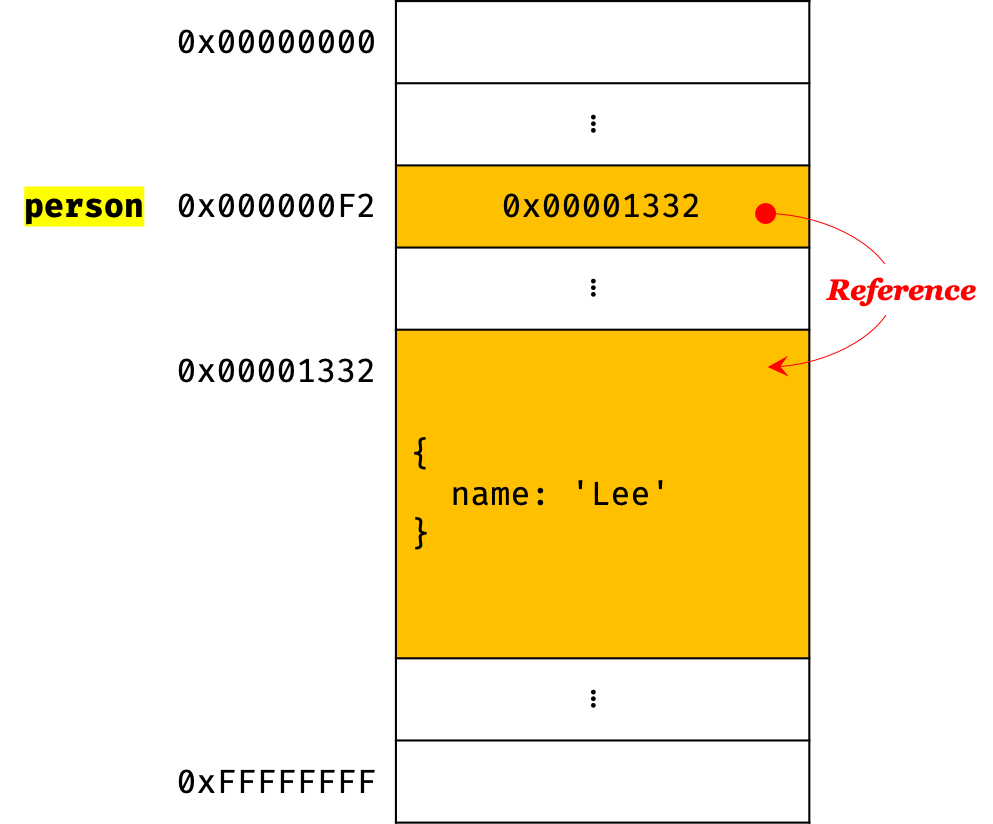
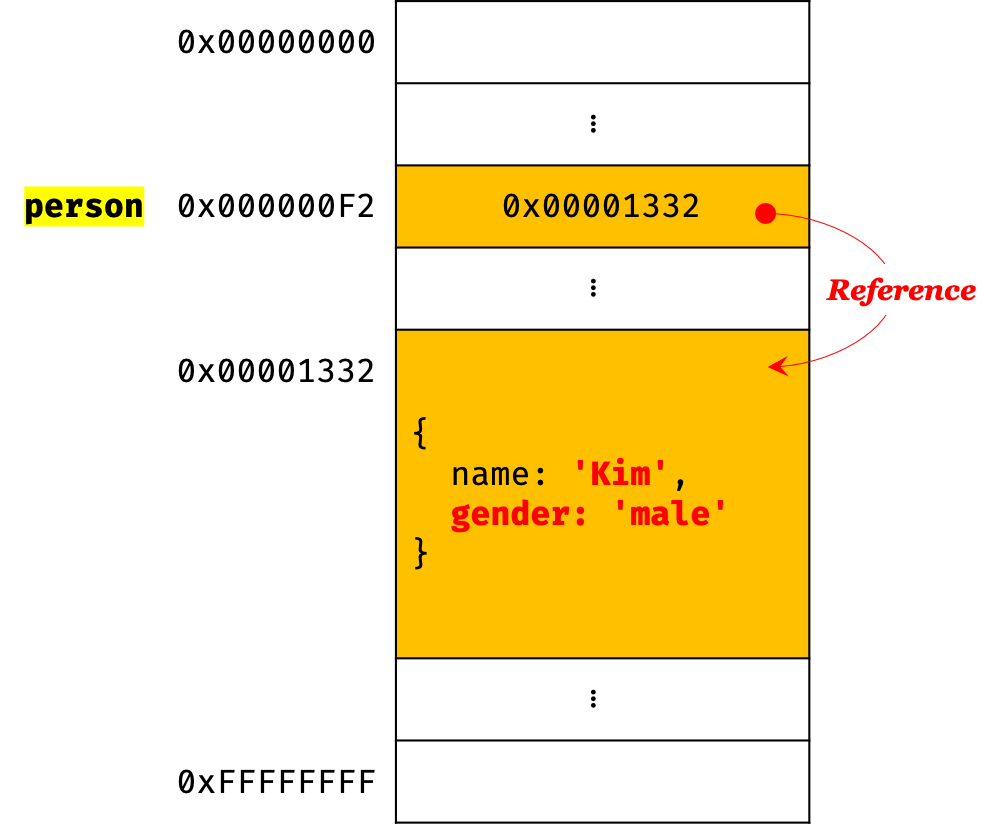

# Primitive Type vs. Object Type

| 원시 타입의 값                                               | 객체 타입의 값                                               |
| ------------------------------------------------------------ | ------------------------------------------------------------ |
| 변경 불가능 (immutable)                                      | 변경 가능 (mutable)                                          |
| 원시 값을 변수에 할당하면 변수에는 실제 값이 저장된다        | 객체를 변수에 할당하면 변수에는 참조 값이 저장된다           |
| 원시 값을 갖는 변수를 다른 변수에 할당하면 원본의 원시 값이 복사되어 전달된다 (Pass by value) | 객체를 가리키는 변수를 다른 변수에 할당하면 원본의 참조 값이 복사되어 전달된다 (pass by reference, reference semantic) |


### 원시 값

#### 1. 변경 불가능한 값

**원시 타입 (primitive type)의 값은 변경 불가능한 값이다.** 한번 생성된 원시 값은 **read-only**한 값이므로 변경할 수 없다. 하지만 변경 불가능하다는 것은 변수가 아니라 값에 대한 얘기이다. 따라서, 변수와 값을 구분하여 생각할 필요가 있다.

값을 변경할 수 없다는 것은 재할당을 할 수 없다는 의미와는 다르다. 변수는 새로운 값을 재할당하는 것으로 변수 값을 변경할 수 있다. 변수의 상대 개념인 상수는 재할당이 금지된 변수를 말한다. 상수도 값을 저장하기 위한 메모리 공간이 필요하므로 변수이다. 단, **변수는 언제든지 재할당을 통해 변수값을 변경할 수 있지만 상수는 단 한번만 할당이 허용된다. 따라서 상수와 변경 불가능한 값을 동일시할 수 없다 (객체를 할당할 경우).**

```javascript
// const 키워드를 사용해 선언한 상수는 재할당이 금지된다.
const o = {};

// 하지만 상수에 할당된 객체는 변경할 수 있다.
o.a = 1;
console.log(o); // {a: 1};
```


변수가 참조하던 메모리 공간의 주소를 변경한 이유는, **변수에 할당된 원시 값이 변경 불가능한 값이기 때문이다.** 따라서 변수의 값을 변경하기 위해 원시 값을 재할당하면 새로운 메모리 공간을 확보하고 재할당한 값을 저장한 후, 변수가 참조하던 메모리 공간의 주소를 변경한다. 이러한 원시 값의 특성은 데이터의 신뢰성을 보장한다. 

**scope = 생명주기**


#### 2. 문자열과 불변성

원시 값인 문자열은 다른 원시 값과 비교할 때 독특한 특징이 있다. 문자열은 **0개 이상인 문자 (character)**의 집합을 말하며, 1개의 문자는 2byte의 메모리 공간에 저장된다. 따라서 문자열 타입의 값은 몇개의 문자로 이루어졌는지에 따라 필요한 메모리 공간의 크기가 결정된다.


```javascript
var str = 'string';
// 문자열은 유사 배열이므로 배열과 유사하게 인덱스를 사용하여 각 문자에 접근할 수 있다.
// 하지만 문자열은 원시 타입인 값이므로 변경할 수 없다. 이때 에러는 발생하지 않는다.
str[0] = 'S';

console.log(str); // string
```

자바스크립트의 문자열은 원시 타입이며 변경 불가능하다. 문자열이 생성되면, 그 문자열을 변경할 수 없다는 뜻이다.


```javascript
var str = 'Hello';
str = 'world';
```

위의 코드에서 첫번째 문이 실행되면 메모리에 문자열 'Hello'가 생성되고 식별자 str은 문자열 'Hello'가 저장된 메모리 공간의 첫번째 셀의 주소를 가리킨다. 이후 두번째 문이 실행되면 이전에 생성된 문자열 'Hello'를 수정하는 것이 아니라 새로운 문자열 'world'를 메모리에 생성하고 식별자 str은 이것을 가리킨다 (재할당).


#### 3. 값에 의한 전달

```javascript
var score = 80;

// 변수 copy에는 변수 score의 원시값 80이 복사되어 할당된다.
var copy = score;

console.log(score, copy); // 80  80
```

변수(copy)에 변수(score)를 할당하는 경우, 할당되는 변수(score)가 원시값을 갖는 변수라면, 할당받는 변수(copy)에는 원시 값이 복사되어 전달된다 (**pass by value**).


**변수 score와 copy의 값 80은 다른 메모리 공간에 저장된 별개의 값이다.** 따라서, 둘 중 어느 하나의 값을 변경하여도 다른 하나의 값에는 **어떠한 영향도 주지 않는다**.


---

### 객체

객체는 프로퍼티의 개수가 정해져 있지 않고 동적으로 추가되고 삭제될 수 있다. 따라서 객체는 원시 값과 같이 **확보해야 할 메모리 공간의 크기를 사전에 정해 둘 수 없다.** 또한, 객체는 경우에 따라 크기가 매우 클 수도 있으므로 원시 값과는 다른 방식으로 동작하도록 디자인되어 있다.

#### 1. 변경 가능한 값

```javascript
var person = {
    name: 'Lee'
};
```

객체를 할당한 변수는 **참조 값(Reference value)**을 값으로 갖는다. **참조 값은 생성된 객체가 저장된 메모리 공간의 주소 그 자체이다.**



객체를 할당한 변수가 확보한 메모리 공간에는 생성된 객체가 실제로 저장된 메모리 공간의 주소(참조 값)가 저장되어 있다. 변수는 이 참조 값을 통해 객체에 접근할 수 있다.


``` javascript
var person = {
    name: 'Lee'
};

// 프로퍼티 값 갱신
person.name = 'Kim';

// 프로퍼티 동적 추가
person.gender = 'male';

console.log(person); // {name: "Kim", address: "Seoul"}
```



변수가 가리키는 객체는 생성된 이후에도 프로퍼티를 동적으로 추가할 수도 있고 프로퍼티 값을 갱신할 수도 있으며 프로퍼티 자체를 삭제할 수도 있다. 따라서 객체는 변경할 수 있는 값이다 (**참조 값은 변경되지 않는다**).


#### 2. 참조에 의한 전달

객체를 변경할 때 마다 원시 값처럼 이전 값을 복사하여 새롭게 생성한다면 메모리의 효율적 소비가 어렵고 퍼포먼스가 떨어진다 (객체의 크기가 클 경우). 따라서 메모리를 효율적으로 사용하기 위해 객체는 변경 가능한 값으로 디자인되었지만,  **여러 개의 식별자가 하나의 객체를 공유할 수 있다**는 부작용이 생긴다.

```javascript
var person = {
    name: 'Lee'
};
// 참조 값을 복사
var copy = person;
```

객체를 가리키는 변수 (person)를 다른 변수 (copy)에 할당하면 person의 **참조 값**이 복사되어 전달된다. 이를 **참조에 의한 전달(Pass by reference)라 한다.**


person을 copy에 할당하면 원본 person의 참조 값을 복사하여 copy에 저장한다. 이때 person과 copy는 같은 참조 값을 갖는다 (동일한 객체를 가리키고 있다). 이것은 두개의 식별자가 하나의 객체를 공유한다는 것을 의미한다. 따라서 person 또는 copy 어떤 한쪽에서 객체를 변경(변수에 새로운 객체를 재할당하는 것이 아니라 객체의 프로퍼티 값 변경 또는 추가, 삭제)이 하면 서로 영향을 주고 받는다.

```javascript
var person = {
  name: 'Lee'
};

// 참조 값을 복사. copy와 person은 동일한 객체를 참조한다.
var copy = person;

// copy와 person은 같은 참조 값을 갖는다.
console.log(copy === person); // true

// copy를 통해 객체를 변경한다.
copy.name = 'Kim';

// person을 통해 객체를 변경한다.
person.address = 'Seoul';

// copy와 person은 같은 동일한 가리키고 있다.
// 따라서 어느 한쪽에서 객체를 변경하면 서로 영향을 주고 받는다.
console.log(person); // {name: "Kim", address: "Seoul"}
console.log(copy);   // {name: "Kim", address: "Seoul"}
```

[underscore.js](https://underscorejs.org/)

