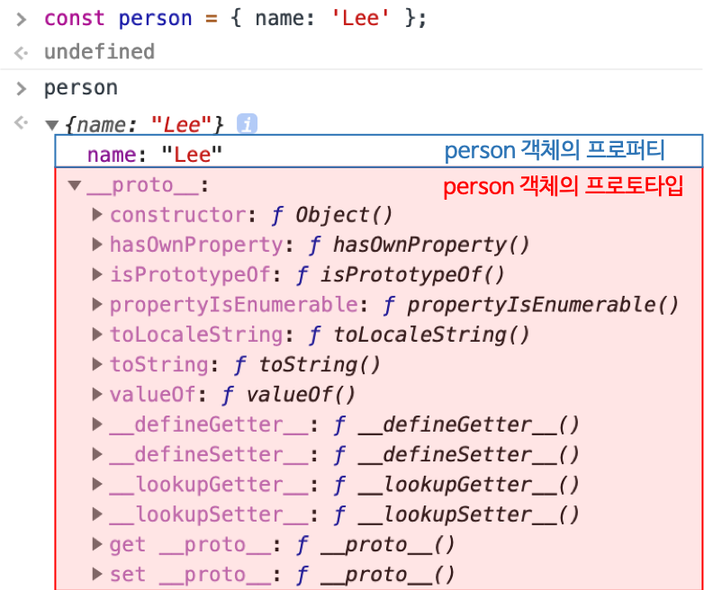

# 프로토타입

자바스크립트는 명령형(Imperative), 함수형(Functional), 프로토타입 기반(Prototype-based) 객체지향 프로그래밍을 지원하는 **멀티 패러다임 프로그래밍 언어다.**

자바스크립트는 객체 기반의 프로그래밍 언어이며 자바스크립트를 이루고 있는 **"거의" 모든 것이 객체이다 (원시 타입 제외).**


## 1. 객체지향 프로그래밍

객체들의 집합으로 표현하려는 프로그래밍 패러다임

구현하려는 객체에 필요한 속성만을 간추려 내어 표현하는 것을 **추상화(abstraction)**라 한다.

```javascript
// 이름과 주소라는 속성을 갖는 객체
const person = {
  name: 'Lee',
  address: 'Seoul',
  sayHi() {
    console.log("hello");
  }
};

```

객체지향 프로그래밍은 객체의 **상태(state)**를 나타내는 데이터와 상태 데이터를 조작할 수 있는 **동작(behavior)**을 하나의 논리적인 단위(객체)로 묶어 생각한다. 객체의 상태 데이터를 프로퍼티(Property), 동작을 메소드(Method)라 부른다.


## 2. 상속과 프로토타입

**상속(Inheritance)**은 객체지향 프로그래밍의 핵심 개념으로 어떤 객체의 프로퍼티 또는 메소드를 다른 객체가 상속 받아 그대로 사용할 수 있는 것을 말한다. 이를 통해 기존의 코드를 적극적으로 재사용하여 불필요한 중복을 제거한다. **자바스크립트는 프로토타입을 기반으로 상속을 구현한다.**

```javascript
// 객체 리터럴로 - 여러 객체를 만들 때 불편하다
const circle = {
  radius = 5,
  getArea() {
    return radius * radius * 3.14;
  }
};

// 생성자 함수 - 여러 객체를 만들 때 효율적이나,
// 생성되는 모든 인스턴스가 getArea()를 가지고 있음 (중복)
function Circle(radius) {
  this.radius = radius;
  this.getArea = function () {
    return Math.PI * Math.pow(this.radius, 2);
  };
}

// 생성자 함수 + 프로토타입으로부터 상속

// 생성자 함수
function Circle(radius) {
  this.radius = radius;
}
// 모든 인스턴스가 공유할 수 있도록 getArea() 메소드를 프로토타입에 추가
Circle.prototype.getArea = function () {
  return Math.PI * Math.pow(this.radius, 2);
};
// 상속 받은 프로퍼티를 그대로 사용할 수 있다.
const circle1 = new Circle(1);

console.log(circle1.getArea());

```


`Circle` 생성자 함수가 생성한 모든 인스턴스는 자신의 **프로토타입 객체** 열학을 하는 `Circle.prototype`의 모든 프로퍼티와 메소드를 상속 받는다. 각 인스턴스의 프로퍼티(상태)는 해당 인스턴스가 가지고 있는 것이 논리적이나, 중복되는 메소드는 프로토타입에 추가하여 모든 인스턴스에게 공유하는 것이 효율적이다.


## 3. 프로토타입 객체

프로토타입 객체(프로토타입)은 **객체간 상속을 구현하기 위해 사용된다.** 프로토타입은 어떤 객체의 상위(**부모**) 객체의 역할을 하며 하위 객체(**자식**)에 공유 프로퍼티(메소드 포함)를 제공한다.

모든 객체는 `[[Prototype]]`([[부모]])라는 내부 슬롯을 가지며, 자신이 생성될 때 `[[Prototype]]` 내부 슬롯의 값으로 **프로토타입의 참조**(부모의 주소)를 저장한다. 모든 객체는 **하나의 프로토타입(부모)을 가지며**, 프로토타입(부모)은 객체의 **생성 방식에 의해 결정된다.**

프로토타입(부모)은 `null`이거나 객체이다. 그리고 모든 프로토타입(부모)은 **생성자 함수**와 연결되어 있다. 또한, 모든 객체는 프로토타입을 가지고 있다.


* 모든 객체는 `__proto__` 접근자 프로퍼티를 통해 자신의 `[[Prototype]]` 내부 슬롯이 가리키는 객체에 접근할 수 있다 (자식은 어머님이 누구냐는 질문을 통해 어머니의 위치를 가리키는 객체에 접근할 수 있다).
* 프로토타입은 `constructor` 프로퍼티를 통해 생성자 함수에 접근할 수 있다.
* 생성자 함수는 `prototype` 프로퍼티를 통해 프로토타입에 접근할 수 있다.
* 생성자 함수는 본인이 생성한 인스턴스를 찾아갈 수 없다(참조할 수 없다).


### 3.1 `__proto__` 접근자 프로퍼티

모든 객체는 `__proto__` **접근자 프로퍼티**를 통해 자신의 `[[Prototype]]` 내부 슬롯이 가리키는 객체에 접근할 수 있다. `__proto__` 접근자 프로퍼티도 객체가 직접 소유하는 프로퍼티가 아니며, 상속을 통해 사용할 수 있다.


#### **모든 객체는 `Object.prototype`의 프로퍼티인 `__proto__` 접근자 프로퍼티를 상속 받을 수 있다.** 




분홍색 영역이 `person` 객체의 프로토타입(부모)인 `Object.prototype`의 정보이다. 

```javascript
// 상속 받은 __proto__ 접근자 프로퍼티는 부모 객체의 참조 값을 반환한다.
console.log({}.__proto__ === Obejct.prototype); // true
```


#### **`__proto__`** 접근자 프로퍼티를 통해 프로토타입에 접근하는 이유는 **상호 참조에 의해 프로토타입 체인이 생성되는 것을 방지하기 위함이다.**


```javascript
const parent = {};
const child = {};

// child의 부모를 parent로 지정
child.__proto__ = parent;

// parent의 부모를 child로 설정
parent.__proto__ = child; // TypeError: Cyclic __proto__ value (순환 참조)
```

프로토타입 체인은 **단방향**링크드 리스트로 구현되어야 한다.

> **프로토타입 체인**
>
> 모든 객체는 프로토타입의 계층 구조인 프로토타입 체인에 묶여 있다. 자바스크립트 엔진은 객체의 프러퍼티에 접근하려고 할 때 해당 객체에 접근하려는 프로퍼티가 없다면 `__proto__` 접근자 프로퍼티가 가리키는 링크를 따라 상위 객체를 순차적으로 검색한다.


#### `__proto__` 접근자 프로퍼티를 코드 내에서 직접 사용하는 것은 비추천이다.

모든 객체가 `__proto__` 접근자 프로퍼티를 사용할 수 있는 것은 아니기 때문이다. **직접 상속**을 통해 `Object.prototype`을 상속 받지 않는 객체를 생성할 수도 있다.

```javascript
// obj는 Object.prototype의 프로퍼티를 상속 받지 않는다.
const obj = Object.create(null);

// 따라서 obj에는 __proto__ 프로퍼티가 상속되지 않는다.
console.log(obj.__proto__); // undefined

// 부모가 Object.prototype이 아닌 객체가 있을 수 있기 때문에
// Object.getPrototypeOf 메소드를 사용하는 편이 좋다.
console.log(Object.getPrototypeOf(obj)); // null

// 부모를 바꾸고 싶을 경우 Obejct.setPrototypeOf 메소드를 사용한다.
// 단 IE11 이상부터 사용할 수 있다.
Object.setPrototypeOf(obj, Object.prototype);

console.log(obj.__proto__); // Obejct.prototype {}
```


### 3.2 함수 객체의 `prototype` 프로퍼티

**일반 함수 객체는 `__proto__` 접근자 프로퍼티 이외에 `prototype` 프로퍼티도 소유한다.** 함수 객체의 prototype 프로퍼티는 **생성자 함수가 생성할 인스턴스의 프로토타입을 가리킨다.** 따라서 Arrow, Method인 non-constructor는 `prototype` 프로퍼티를 가지지 않는다. 또한, 생성자 함수가 아닌 일반 함수의 `prototype` 프로퍼티는 아무런 의미가 없다.

모든 객체가 가지고 있는 `__proto__` 접근자 프로퍼티와 일반 함수 객체만이 가지고 있는 `prototype` 프로퍼티는 결국 **동일한 프로토타입을 가리킨다.** 하지만 각 프로퍼티를 사용하는 주체가 다르다.

```javascript
function Person(name) {
  this.name = name;
}

const person1 = new Person('Jin');

console.log(person1.__proto__ === Person.prototype); // true

```


| 구분                        | 소유      | 값                                                           | 사용 주체   | 사용 목적                                                    |
| --------------------------- | --------- | ------------------------------------------------------------ | ----------- | ------------------------------------------------------------ |
| _ _proto_ _ 접근자 프로퍼티 | 모든 객체 | 프로토타입의 참조 (해당 객체의 부모 주소)                    | 모든 객체   | 모든 객체가 생속을 위해 자신의 프로토타입에 접근하기 위해 사용 |
| prototype 프로퍼티          | 함수 객체 | 프로토타입의 참조 (생성자 함수가 생성하는 인스턴스의 부모 주소) | 생성자 함수 | 생성자 함수가 자신이 생성할 인스턴스의 부모를 할당하기 위해 사용 |


### 3.3 프로토타입의 constructor 프로퍼티와 생성자 함수

모든 부모(프로토타입)는 `constructor` 프로퍼티를 갖는다. 

```javascript
console.log(Object.prototype.hasOwnProperty('constructor')); // true
```


이 `constructor` 프로퍼티는 `prototype` 프로퍼티로 자신을 참조하고 있는 **생성자 함수를 가리킨다.** 이 연결은 함수 객체 (생성자 함수)가 생성될 때 이루어진다. **프로토타입과 생성자 함수는 언제나 쌍(pair)으로 존재한다.**

```javascript
// 생성자 함수
function Person(name) {
  this.name = name;
}

const me = new Person('Kim');

// me 객체의 생성자 함수는 Person이다.
console.log(me.constructor === Person); // true
```


```javascript
// 생성자 함수 Person
function Person(name) {
  this.name = name;
}
// 생성자 함수 Person이 생성한 인스턴스 me
const me = new Person('Jin');

// me의 실질적 부모는 Person 생성자 함수지만,
// 생성자 함수(실질적 부모)는 인스턴스(자식)를 생성하는 동시에
// 양육권을 Person 생성자 함수의 프로퍼티인 Person.prototype 객체에게 양도한다.
// Person.prototype 객체는 constructor라는 프로퍼티만 가지고 있으며,
// 그 안에 실질적 부모인 Person 생성자 함수의 참조(주소) 값을 갖고 있다.
// Person.prototype 객체에 constructor 프로퍼티 밖에 없는 이유는
// 개발자가 직접 필요한 프로퍼티를 추가할 수 있도록 디자인한 것이다.
// 따라서, me 객체는 생성됨과 동시에 부모가 Person.prototype으로 정의되며
// Person.prototype의 상위 객체인 Object.prototype를 조상으로 가진다.
// 따라서 me 객체는 Object.prototype의 프로퍼티를 모두 상속 받는다.
console.log(me.__proto__);

// me 객체를 생성한 함수는 Person
console.log(me.constructor === Person); // true

// 생성자 함수 Person은 생성할 인스턴스의 부모를 Person {}로 설정
console.log(Person.prototype === me.__proto__); // true

// Person 생성자 함수도 객체인데 부모가 있지 않을까?
console.log(Person.__proto__); // 종점

// me를 생성한 생성자 함수 Person은, me의 부모인 Person {}의 constructor 프로퍼티 (상속받아 쓸 수 있다)
console.log(me.__proto__.constructor === me.constructor);

```


## 4. 리터럴 표기법에 의해 생성된 객체의 생성자 함수와 프로토타입

```javascript
// 객체 리터럴
const obj = {};

// 함수 리터럴
const add = function (a, b) {
  return a + b;
};

// 배열 리터럴
const arr = [1, 2, 3];

// 정규표현식 리터럴
const regexr = /is/ig;
```

객체 리터럴에 의해 생성된 객체와 Object 생성자 함수에 의해 생성된 객체는 생성되는 과정에서 차이가 있지만, **객체로서 동일한 특성을 갖는다.**  리터럴 표기법 혹은 생성자 함수로 생성된 객체는 결국 모두 생성자 함수와 연결되어 있다.

| 리터럴 표기법      | 생성자 함수 | 프로토타입         |
| ------------------ | ----------- | ------------------ |
| 객체 리터럴        | Object      | Object.prototype   |
| 함수 리터럴        | Function    | Function.prototype |
| 배열 리터럴        | Array       | Array.prototype    |
| 정규 표현식 리터럴 | RegExp      | RegExp.prototype   |

Object 함수는 `new` 키워드를 만나면 **반드시 빈 객체를 생성하지만**, 객체 리터럴로 생성한 인스턴스는 Object가 `createObject`라는 추상 연산을 통해 생성한다. 하지만 Object 생성자 함수도 `createObject` 추상 연산을 하지 않는 것은 아니다.

객체 리터럴로 생성한 객체는 Object 생성자 함수가 생성한 것이라 생각할 수 있다.


## 5. 프로토타입의 생성 시점

생성자 함수는 크게 두 가지로 나뉜다.

* User-Defined Constructor (사용자 정의 생성자 함수)
* Built-in Constructor (빌트인 생성자 함수)

**프로토타입은 생성자 함수가 생성되는 시점에 더불어 생성된다.**


### 5.1 사용자 정의 생성자 함수와 프로토타입 생성 시점

일반 함수(함수 선언문, 함수 표현식)로 정의한 함수 객체는 `new` 연산자와 함께 생성자 함수(constructor)로서 호출할 수 있다. **프로토타입은 함수 정의가 평가되어 함수 객체를 생성하는 시점에 함께 생성된다.**

```javascript
// 함수 정의(constructor)가 평가되어 함수 객체를 생성하는 시점에 프로토타입도 더불어 생성된다.
console.log(Person.prototype); // {constructor: ƒ}

// 질문. 함수 객체는 prototype이라는 프로퍼티를 가지며, 이 프로퍼티는 함수가 생성자 함수로서 생성할 인스턴스의 프로토타입이다 라고 돼있는데 왜 저기서 Person.prototype을 찍으면 컨스트럭터로 나오는지 이해가 안된다.

// 생성자 함수
function Person(name) {
  this.name = name;
}
```


### 5.2 빌트인 생성자 함수와 프로토타입 생성 시점

Object, String, Number, Function, Array, RegExp, Date, Promise 등과 같은 빌트인 생성자 함수도 일반 함수와 마찬가지로 빌트인 생성자 함수가 생성되는 시점에 프로토타입이 생성된다. 모든 빌트인 생성자 함수는 **전역 객체가 생성되는 시점에 생성된다.**


## 6. 객체 생성 방식과 프로토타입의 결정

### 6.1 객체 리터럴에 의해 생성된 객체의 프로토타입

### 6.2 Object 생성자 함수에 의해 생성된 객체의 프로토타입

### 6.3 생성자 함수에 의해 생성된 객체의 프로토타입


## 7. 프로토타입 체인

객체의 프로퍼티를 탐색하는 메커니즘

## 8. 캡슐화

ex. 중첩함수

자바스크립트는 클로저를 통해 정보를 은닉한다.

생성자 함수 내에서 `this`에 묶지 않는다. 변수를 활용한다.

렉시컬 스코프 (클로저) - 상위 스코프를 기억하고 죽는다 (in **[[Environment]]**)


## 9. 오버라이딩과 프로퍼티 쉐도잉

프로토타입 메소드와 이름이 똑같은 인스턴스 메소드를 정의하면 오바라이드된다.


## 10. 프로토타입의 교체

두 방법 다 권장하지 않는다. construcotr 프로퍼티와 생성자 함수 간의 연결을 파괴한다.

### 10.1 생성자 함수에 의한 프로토타입의 교체

생성자 함수 안에서 프로토타입을 동적으로 교체. 인스턴스의 프로토타입의 프로퍼티인 constructor를 사용자가 정의한다. 생성자 함수의 prototype 프로퍼티에 다은 임의의 객체를 바인딩하는 것은 미래에 생성할 인스턴스의 프로토타입을 교체하는 것이다.

```javascript
function Person(name) {
  this.name = name;
  
  Person.prototype = {
    constructor: Person,
    sayHello() {
      console.log(`hi`);
    }
  }
}
```


### 10.2 인스턴스에 의한 프로토타입의 교체

인스턴스의 프로퍼티인 `__proto__` 로 프로토타입을 교체, 이미 생성된 객체의 프로토타입을 교체하는 것이다.


## 11. `instanceof` 연산자

`객체 instanceof 생성자 함수`

좌변의 객체가 우변의 생성자 함수와 연결된 인스턴스라면 `true` 아니면 `false`이다. `instanceof` 연산자는 상속 관계를 고려한다. 

```javascript
function Person(name) {
  this.name = name;
}

const me = new Person('Kim');

console.log(me instanceof Person); // true
console.log(me instanceof Object); // true
```

생성자 함수의 prototype 프로퍼티에 바인딩된 객체가 존재하는 지 검색한다. constructor 프로퍼티가 가리키는 생성자 함수를 찾는 것이 아니라 프로토타입 체인 상에 존재하는 프로토타입에 영향을 받는다. constructor와 링크가 끊어져도 프로토타입 체인에 영향을 주지 않는다. 따라서 `instanceof` 연산자도 영향을 받지 않는다.

## 12. 직접 상속

### 12.1 Object.create에 의한 직접 상속

첫번째 매개변수에는 생성할 객체의 프로토타입(필수)을 전잘하고 두번째 매개변수에는 생성할 객체의 프로퍼티를 갖는 객체(옵션)를 전달.

장점

* new 연산자 없이 객체를 생성할 수 있다
* 프로토타입을 지정하면서 객체를 생성할 수 있다. 생성자 함수와 프로토타입 간의 링크가 파괴되지 않는다.
* 객체 리터럴에 의해 생성된 객체도 특정 객체를 상속받을 수 있다.

### 12.2 객체 리터럴 내부에서 `__proto__`에 의한 직접 상속

```javascript
const obj = {
  y: 20,
  __proto__: myProto
};
```


## 13. 정적 프로퍼티/메소드


## 14. 프로퍼티 존재 확인

`prop in object`

## 15. 프로퍼티 열거

