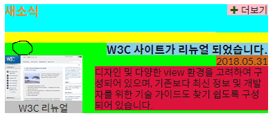

# HTML/CSS - Markup News, Events

### Markup News - version 1

1. 새소식 (div)
2. 뉴스 컨텐츠 (section) - clickable
   - 뉴스 타이틀
   - 날짜 (time)
   - 이미지/내용 (figure/figcaption)
   - 내용/이미지
   - 더보기

```html
<div class="news">
    <h2 class="new-post">새소식</h2>
    <a href="#" class="post-wrap">
        <section class="post-info">
            <h3 class="post-title">W3C 사이트가 리뉴얼 되었습니다.</h3>
            <time datetime="2018-05-31T13:53:45">2018.05.31</time>
            <figure class="thumbnail-info">
                
                <figcaption>W3C 리뉴얼</figcaption>
            </figure>
            <p>디자인 및 다양한 view 환경을 고려하여 구성되어 있으며...</p>
        </section>
    </a>
    <a a href="#" class="icon-plus news-more more" title="새소식">더보기</a>
</div>
```

```css
/* 새소식 (using float) */
.news {
  background: yellow;
  /* 더보기 메뉴를 오른쪽 상단으로 올리기 위해 relative 지정 */
  position: relative;
}
.new-post {
  background: cyan;
  color: #ed8625;
  font-size: 1.2em;
}
/* "새소식" 이후 가상 요소를 이용하여 밑 줄 추가 */
.new-post::after {
  display: block;
  margin-top: 20px;
  content: "";
  height: 1px;
  width: 80%;
  background: linear-gradient(#ccc, #eee);
}
.post-info {
  background: lime;
}
/* 뉴스 section의 가상 요소에 clearfix 설정 -> float overflow 방지 */
.post-info::after {
  content:"";
  clear: both;
  display: table;
}
.post-title {
  background: skyblue;
  float: right;
  margin: 0;
  width: 250px;
}
.post-info time {
  background: chocolate;
  float: right;
  margin: 0;
  width: 250px;
}
/* 사진, 캡션 포함 */
.thumbnail-info {
  background: silver;
  text-align: center;
  margin: 0;
  float: left;
}
.thumbnail-info img {
  box-shadow: 5px 5px 5px grey;
}
.thumbnail-info figcaption {
  margin: 15px 0 0 0;
}
.post-info p {
  background: crimson;
  float: right;
  width: 250px;
  margin: 18px 0 0 0;
}
/* 부모 클래스인 .news의 위치에 대하여 우측 상단에 배치 */
.news-more {
  background: pink;
  position: absolute;
  top: 0;
  right: 0;
}
```


### 결과 1



* 현재 라임색 배경 안의 모든 요소들은 float: left/right 돼있는 상태
* 하지만 예상과는 달리 `figure` 요소 위에 의문의 공백이 생김

### Float - LineBox

float된 요소들은 배치된 방향에 따라 좌/우 여백 (linebox)를 생성한다. 이후 바로 이어서 float된 요소가 이전 요소가 만든 여백의 공간안에 들어갈 수 있는 사이즈면 들어가고 아니면 이전 요소의 라인 박스 높이만큼 공백이 추가돼어 밑어로 떨어진다.


---

### Markup News - version 2

1. 새소식 (section)
2. 뉴스 컨텐츠 (article) - clickable
   - 뉴스 타이틀
   - 날짜 (time)
   - 이미지/내용 (figure/figcaption)
   - 내용/이미지
   - 더보기

```html
<section class="news">
    <h2 class="news-heading">새소식</h2>
    <a href="#" class="news-link">
        <article class="news-article">
            <h3 class="news-article-subject">W3C 사이트가 리뉴얼 되었습니다.</h3>
            <time class="news-article-date" date="2019-09-16T12:06:30">2019.09.16</time>
            <p class="news-article-brief">
                자인 및 다양한 view 환경을 고려하여 구성되어 있으며...
            </p>
            <figure class="news-article-thumbnail">
                
                <figcaption>W3C 리뉴얼</figcaption>
            </figure>
        </article>
    </a>
    <a href="#" class="icon-plus news-more more" title="새소식">더보기</a>
</section>
```


```css
/* 새소식 */
.news{
  margin-top: 20px;
  position: relative;
}
.news::before{
  content: "";
  background: linear-gradient(to right, #aaa, #fff);
  position: absolute;
  top: 30px;
  left: 0;
  width: 80%;
  height: 1px;
}
.news-heading{
  margin: 0;
  font-size: 1.5rem;
  color: #ed8625;
}
/* a 태그인 news-link 클래스를 블록 처리 */
.news-link{
  display: block;
}
/* 이미지 영역 확보를 위한 좌패딩 130px 추가 */
.news-article{
  padding-left: 130px;
  position: relative;
  min-height: 105px;
}
.news-article-subject{
  margin: 30px 0 0 0; 
  font-size: 1.4rem;
  font-weight: 450;
}
/* time 태그도 block처리 */
.news-article-date{
  display: block;
  margin: 5px 0 10px;
}
.news-article-brief{
  margin: 0;
  line-height: 1.5;
}
.news-article-thumbnail{
  margin: 0;
  position: absolute;
  top: 3px;
  left: 0;
}
.news-article-thumbnail img{
  box-shadow: 0 15px 15px 0 #aaa;
}
.news-article-thumbnail figcaption{
  text-align: center;
  margin-top: 15px;
}
.news-more{
  position: absolute;
  top: 0;
  right: 0;
}
```


------

### Markup 신규 이벤트

#### Place Background Image using background-position

* ????


---

### Markup 관련 사이트

transition, hover, focus


---

### Markup 인기 사이트

::before, content: counter(number), background-position