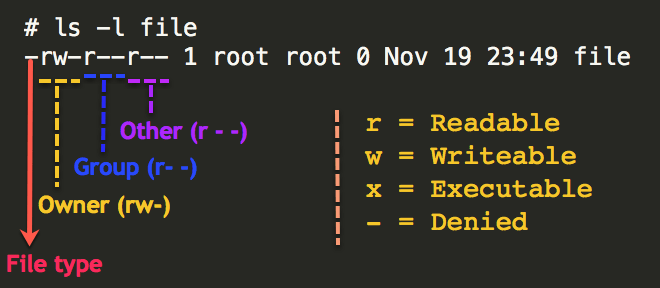

# [Intro to Linux](https://www.inflearn.com/course/%EC%83%9D%ED%99%9C%EC%BD%94%EB%94%A9-%EB%A6%AC%EB%88%85%EC%8A%A4-%EA%B0%95%EC%A2%8C)

### 가상머신

- 하드웨어를 소프트웨어적으로 구현해서 그 위에서 OS가 작동하도록 하는 기술


### 가상 머신을 사용하는 이유

- 다른 운영체제를 사용해야 하는 경우 (Windows on Mac)
- 독립된 작업공간이 필요한 경우 (바이러스 회피, 백업)
- 하나의 머신에서 여러명에게 운영체제 환경을 제공


### Virtual Box 

- 오라클에서 만든 가상머신 솔루션


------

### Command on Linux shell

```shell
rm --help (rm 관련 parameter 약식 도움말)
man ls (ls 관련 매뉴얼 출력 새창)
   /sort (find "sort"), n (next), q (exit)
mkdir -p dir1/dir2/dir3 (중첩, 부모 디렉토리까지 같이 생성)
sudo (super user do) ~command
wget [parameters] url (파일 다운로드 - 리눅스)
head -n1 linux.txt (txt 파일의 첫 줄을 출력하라, default 10줄)
```

([see more](https://www.howtogeek.com/412055/37-important-linux-commands-you-should-know/))


### 패키지 매니저

* a collection of software tools that automates the process of installing, upgrading, configuring, and removing computer programs for a computer's operating system in a consistent manner.
* Example - **apt**, **yum** (on Ubuntu)


#### Installing apt package management

```shell
sudo apt-get update; (목록 다운로드)

sudo apt-cache search htop; (htop 관련 목록 출력)

top (현재 컴퓨터에서 실행되고 있는 프로그램 목록 출력)

sudo apt-get install htop (htop 패키지 설치)

sudo apt-get upgrade htop (htop 패키지 업데이트)

sudo apt-get remove htop (htop 패키지 삭제)

sudo htop (관리자 권한으로 top 실행)

sudo apt-get install git (git 설치)
```


------

### IO Redirection - output ,input, append


#### standard output

``` shell
// ls-l의 결과를 result.txt에 저장하라 (redirection `1>`, 콘솔에 안찍히고 파일로 출력 후 저장)
ls -l 1> result.txt

// result.txt를 출력하라 (using standard input)
cat result.txt

// result.txt를 출력하라 (using result.txt as parameter)
cat > result.txt
```


#### standard error

``` shell
// rm 명령에서 생긴 오류를 error.log에 저장
rm rename2.txt 2> error.log
```


#### append

``` shell
// ls - al의 결과를 덮어쓰지말고 result.txt 본문 뒤에 더해서 저장
ls -al >> result.txt
```


------

### shell vs. kernel

* **kernel** - **운영체제의 코어**

* **shell** - **명령어를 kernel에게 전달 / kernel의 결과를 수신&출력** (키보드 입력을 shell이 받아서 커널에게 전달)


### shell script

반복되는 필요한 커맨드를 스크립트에 저장 후 스크립트를 실행

```shell
vim backup 				// vim 에디터로 backup 파일을 생성 및 실행

#!/bin/bash				// 이 파일은 bash (shell)로 처리하겠다
if ! [-d bak]; then 	// 만약 'bak'이라는 디렉토리가 현재 디렉토리에 존재하지 않다면,
	mkdir bak // `bak`  // 'bak' 디렉토리를 생성하라
fi						// end if statement

cp  *.log bak           // 이 스크립트를 실행하는 디렉토리 내 .log로 끝나는 모든 파일을 bak에 저장

chmod +x backup 		// 실행 기능 추가
./backup 				// 실행
```


------

### 디렉토리 구조 (UNIX)


- `root` - 최상위 디렉토리
- `bin` - binary (or programs) 디렉토리 (ex. rm, bash)
- `sbin` - 시스템 관리자들이 사용하는 binary (programs)가 위치함 for system maintenance purpose
- `etc` - Configuration files

([see more](https://www.geeksforgeeks.org/unix-file-system/))


------

### 파일 찾는 법 - locate & find

```shell
// mlocate DB를 query하여 이 PC에 .log로 끝나는 모든 파일의 디렉토리를 출력
locate *.log

// mlocate DB 업데이트
sudo updatedb

// 이 PC에 .log로 끝나는 모든 파일의 디렉토리를 root에서 부터 탐색, 출력
find / -name *.log

// locate the binary, source and manual files for specified command names
whereis ls
whereis rm
```

- $PATH라는 환경 변수를 통해 어느 디렉토리 내에서도 whereis라는 프로그램 (binary)를 사용할 수 있다


------

### 프로세스와 실행

#### 컴퓨터의 구조

- CPU - Processor
- RAM - Memory
- SSD, HDD - Storage


#### 프로세스 모니터링

- **process**  - **Storage**에 설치된 프로그램을 **Memory**에 적재 후 **CPU**가 읽고 데이터를 처리
- **PID** - process ID

```shell
// 실행 중인 프로세스를 출력, top, htop과 비슷함
ps

// 백그라운드에서 실행 중인 모든 프로세스 중, apache라는 이름을 가진 프로세스를 출력
ps aux | grep apache

// 22142 PID를 강제 종료
sudo kill 22142
```


#### 백그라운드 실행

```shell
vim readme.md (readme.md 파일을 vim으로 실행)

(do something with readme.md)

ctrl + z (vim 에디터를 종료하지 않고 CLI로 돌아옴)

ls (뒤에 vim 에디터가 실행되는 상태에서 새로운 프로그램 실행)
jobs (현재 실행 중인 프로세스 출력 in background)
kill %4 (4번 프로세스 종료)
```


#### 항상 실행 - 데몬 (Daemon)의 개념

- Client vs. Server (Daemon, 항상 켜져있음)

  (installing apache server)

  ```shell
  sudo apt-get install apache2
  cd /etc/init.d (Daemon 프로그램들이 위치하는 디렉토리)
  sudo service apache2 start (apache 서버 실행)
  sudo service apache2 stop (apache 서버 중지)
  (Daemon 프로그램은 service 키워드를 통해 실행, 중지)
  etc/rc3.d/Daemon_link (부팅될 때마다 실행하려는 데몬 프로그램 링크 추가)
  ```


#### 정기적 실행 (cron)

- 정기적으로 명령을 실행시켜주는 도구

  ```shell
  crontab -e (하고자하는 일을 정의, 에디터 실행)
  ```

  

#### Shell을 시작할 때 실행

- 스타트업 설정, 스타트업 스크립트 (Shell에 접속했을 때 자동으로 실행되는 프로그램 설정)

  ```shell
  alias l = 'ls-al' (alias 뒤 입력어를 = 뒤의 명령으로 저장)
  alias ..='cd ..'
  
  cd ~
  vim .bashrc (shell에 접속할 때 자동으로 실행되는 스크립트)
  (add something in .bashrc)
  ```


------

### 다중사용자

#### id, who

```shell
id (현재 사용자 정보를 출력)
who (이 pc에 누가 접속해 있는지 출력)
exit (로그아웃)
```


#### 관리자와 일반 사용자

- **superuser#** (sudo) vs. **user$**

``` shell
su (change user ID or become superuser)
sudo passwd -u root (unlock root user password)
su - root (become superuser)
```


#### 사용자의 추가

```shell
sudo useradd -m duru (duru라는 유저 생성)
sudo passwd duru (duru 유저 비밀번호 설정)
su - duru (duru로 접속)
(exit, 다른 유저로 접속하여 duru에게 sudo 권한 부여)
sudo usermod -a -G sudo duru
```


------

### Permission (권한)

- 파일/디렉토리에 대하여 어떠한 일을 할 수 있게/없게 권한을 지정 (read, write, execute)



- 권한 부여 방법 `chmod`

  ```shell
  chmod o-r perm.txt (other의 perm.txt에 대한 read 권한을 -, 해제)
  chmod o+r perm.txt (other의 perm.txt에 대한 read 권한을 +, 부여)
  chmod u-r perm.txt (user - 소유자의 perm.txt에 대한 read 권한을 -)
  ```


#### 실행의 개념과 권한 설정 - execute

```shell
chmod u+x shellscript.sh (소유자의 shellscript.sh에 대한 execute 권한을 +)
```


#### 디렉토리의 권한

```shell
chmod -R o+w perm (other의 perm 디렉토리 및 모든 하위 디렉토리에 대한 write 권한을 recursively 해제한다)
```


#### `chmod` - class & operation


```shell
chmod u+r perm.txt (user에 perm.txt에 대한 read 권한을 부여) user
chmod g+r perm.txt (group에 perm.txt에 대한 read 권한을 부여) group
chmod o+r perm.txt (other에 perm.txt에 대한 read 권한을 부여) other
chmod a+r perm.txt (user, group, other에 perm.txt에 대한 read 권한을 부여) all
chmod a=r perm.txt (user, group, other에 perm.txt에 대한 read 권한`만` 부여)

chmod 444 perm.txt (user, group, other에 perm.txt에 대한 read 권한을 부여)
```


#### 그룹


- 파일/디렉토리 생성자 (user)가 아닌 제 3자 (1인 이상) 그룹에게 권한 부여 가능


------

### 인터넷


- Client (request) <--> Server (response)
- google.com (domain name), 172.21.25.7 (IP address)
- DNS server (각 도메인이 어떤 IP 주소를 가지고 있는지 알고 있는 서버)

```shell
ip addr (해당 pc의 IP 주소 출력)
curl  ~ (해당 url로 접속한 pc의 IP 출력 - router를 통한 IP)
```


#### apache 웹 서버 on Linux

- Client - web browser (chrome, IE, firefox)
- Server - web server (apache, nginx, tomcat)

```shell
sudo apach-get install elinks (CLI 환경에서 IP 접속)
```

- document root - 웹 페이지를 찾는 최상위 디렉토리*
- log 파일을 통해 접속 기록을 확인 가능 (`tail` - 마지막 로그만 출력)

